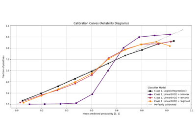

# Calibration[#](#calibration "Link to this heading")

Examples related to the [`metrics`](../../apis/scikitplot.api.html#module-scikitplot.api.metrics "scikitplot.api.metrics") submodule with e.g. [`LogisticRegression`](https://scikit-learn.org/dev/modules/generated/sklearn.linear_model.LogisticRegression.html#sklearn.linear_model.LogisticRegression "(in scikit-learn v1.9)") instance.

[plot\_calibration with examples](plot_calibration_script.html)

plot\_calibration with examples