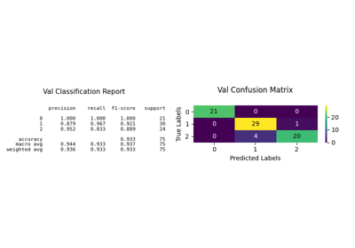
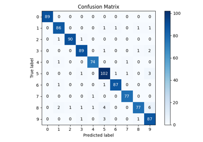
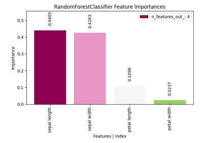
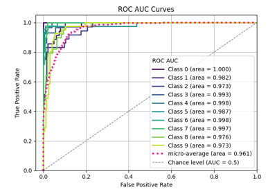

# Classification[#](#classification "Link to this heading")

Examples related to the [`estimators`](../../apis/scikitplot.api.html#module-scikitplot.api.estimators "scikitplot.api.estimators") submodule with e.g. [`LogisticRegression`](https://scikit-learn.org/dev/modules/generated/sklearn.linear_model.LogisticRegression.html#sklearn.linear_model.LogisticRegression "(in scikit-learn v1.9)") instance.

[plot\_classifier\_eval with examples](plot_classifier_eval_script.html)

plot\_classifier\_eval with examples

[plot\_confusion\_matrix with examples](plot_confusion_matrix_script.html)

plot\_confusion\_matrix with examples

[plot\_feature\_importances with examples](plot_feature_importances_script.html)

plot\_feature\_importances with examples

[plot\_learning\_curve with examples](plot_learning_curve_script.html)

plot\_learning\_curve with examples

[plot\_precision\_recall with examples](plot_precision_recall_script.html)

plot\_precision\_recall with examples

[plot\_roc\_curve with examples](plot_roc_script.html)

plot\_roc\_curve with examples