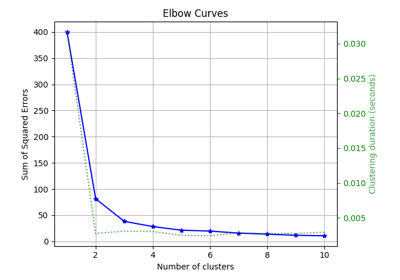
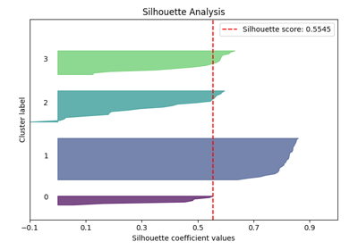

# Clustering[#](#clustering "Link to this heading")

Examples related to the [`estimators`](../../apis/scikitplot.api.html#module-scikitplot.api.estimators "scikitplot.api.estimators") submodule with e.g. [`LogisticRegression`](https://scikit-learn.org/dev/modules/generated/sklearn.linear_model.LogisticRegression.html#sklearn.linear_model.LogisticRegression "(in scikit-learn v1.9)") instance.

[plot\_elbow with examples](plot_elbow_script.html)

plot\_elbow with examples

[plot\_silhouette with examples](plot_silhouette_script.html)

plot\_silhouette with examples