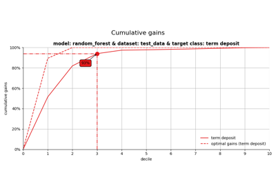
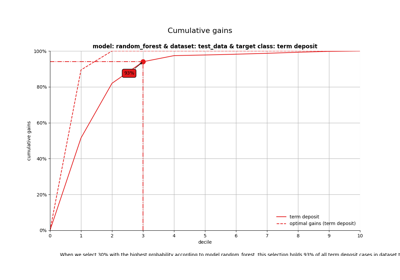

# Decile[#](#decile "Link to this heading")

Examples related to the [`decile`](../../apis/scikitplot.decile.html#module-scikitplot.decile "scikitplot.decile") submodule with e.g. [`LogisticRegression`](https://scikit-learn.org/dev/modules/generated/sklearn.linear_model.LogisticRegression.html#sklearn.linear_model.LogisticRegression "(in scikit-learn v1.9)") instance.

> **See also**
> * Seaborn-style decile analysis (Lift / Gain / KS) [`decileplot`](../../modules/generated/scikitplot.seaborn.decileplot.html#scikitplot.seaborn.decileplot "scikitplot.seaborn.decileplot")

[plot\_cumulative\_gain with examples](plot_cumulative_gain_script.html)

plot\_cumulative\_gain with examples

[plot\_ks\_statistic with examples](plot_ks_statistic_script.html)

plot\_ks\_statistic with examples

[plot\_lift with examples](plot_lift_script.html)

plot\_lift with examples

[Introduction to modelplotpy (legacy)](plot_modelplotpy_legacy_script.html)

Introduction to modelplotpy (legacy)

[Introduction to modelplotpy](plot_modelplotpy_script.html)

Introduction to modelplotpy

[plot\_report with examples](plot_report_script.html)

plot\_report with examples