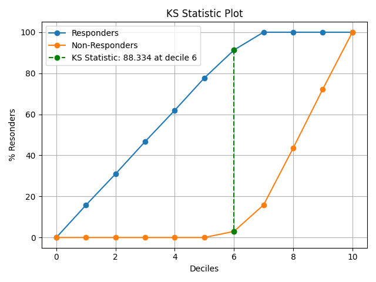
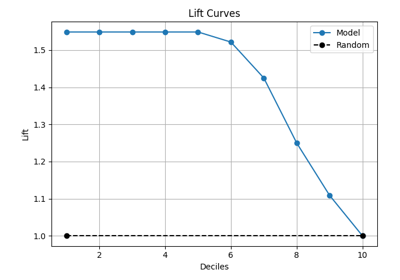
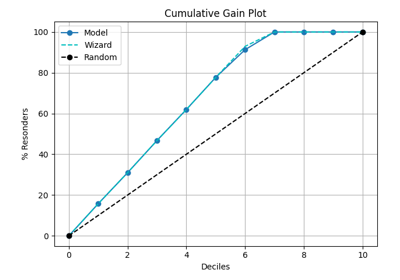
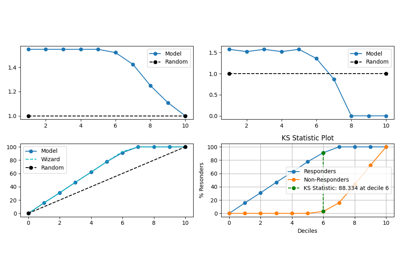
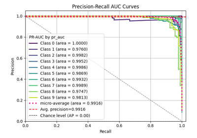

> **Note**
> [Go to the end](#sphx-glr-download-auto-examples-decile-plot-ks-statistic-script-py)
to download the full example code or to run this example in your browser via JupyterLite or Binder.

# plot\_ks\_statistic with examples[#](#plot-ks-statistic-with-examples "Link to this heading")

An example showing the [`plot_ks_statistic`](../../modules/generated/scikitplot.decile.kds.plot_ks_statistic.html#scikitplot.decile.kds.plot_ks_statistic "scikitplot.decile.kds.plot_ks_statistic") function
with a scikit-learn classifier (e.g., [`LogisticRegression`](https://scikit-learn.org/dev/modules/generated/sklearn.linear_model.LogisticRegression.html#sklearn.linear_model.LogisticRegression "(in scikit-learn v1.9)")) instance.

```
# Authors: The scikit-plots developers
# SPDX-License-Identifier: BSD-3-Clause

```
```
from sklearn.datasets import (
    load_breast_cancer as data_2_classes,
    # load_iris as data_3_classes,
)
from sklearn.linear_model import LogisticRegression
from sklearn.model_selection import train_test_split

import numpy as np

np.random.seed(0)  # reproducibility
# importing pylab or pyplot
import matplotlib.pyplot as plt

# Import scikit-plot
import scikitplot.decile as sp

# Load the data
X, y = data_2_classes(return_X_y=True, as_frame=False)
X_train, X_val, y_train, y_val = train_test_split(X, y, test_size=0.5, random_state=0)

# Create an instance of the LogisticRegression
model = LogisticRegression(max_iter=int(1e5), random_state=0).fit(X_train, y_train)

# Perform predictions
y_val_prob = model.predict_proba(X_val)

# Plot!
ax = sp.kds.plot_ks_statistic(
    y_val,
    y_val_prob,
    save_fig=True,
    save_fig_filename="",
    # overwrite=True,
    add_timestamp=True,
    # verbose=True,
)

```


Tags: [model-type: classification](../../_tags/model-type-classification.html) [model-workflow: model evaluation](../../_tags/model-workflow-model-evaluation.html) [plot-type: line](../../_tags/plot-type-line.html) [plot-type: decile](../../_tags/plot-type-decile.html) [domain: statistics](../../_tags/domain-statistics.html) [level: beginner](../../_tags/level-beginner.html) [purpose: showcase](../../_tags/purpose-showcase.html)

****Total running time of the script:**** (0 minutes 0.707 seconds)

[](https://mybinder.org/v2/gh/scikit-plots/scikit-plots/maintenance/0.4.X?urlpath=lab/tree/notebooks/auto_examples/decile/plot_ks_statistic_script.ipynb)[](../../lite/lab/index.html?path=auto_examples/decile/plot_ks_statistic_script.ipynb)

[`Download Jupyter notebook: plot_ks_statistic_script.ipynb`](../../_downloads/e1b3d8dc8f511a5c53eb31ff2dd8891b/plot_ks_statistic_script.ipynb)

[`Download Python source code: plot_ks_statistic_script.py`](../../_downloads/0f8a0ce1dd57afd47a36efa86e0a6e59/plot_ks_statistic_script.py)

[`Download zipped: plot_ks_statistic_script.zip`](../../_downloads/803d5d4a980db7f718cc7e610529c0c6/plot_ks_statistic_script.zip)

Related examples



[plot\_lift with examples](plot_lift_script.html)

plot\_lift with examples

[plot\_cumulative\_gain with examples](plot_cumulative_gain_script.html)

plot\_cumulative\_gain with examples

[plot\_report with examples](plot_report_script.html)

plot\_report with examples

[plot\_precision\_recall with examples](../classification/plot_precision_recall_script.html)

plot\_precision\_recall with examples

[Gallery generated by Sphinx-Gallery](https://sphinx-gallery.github.io)