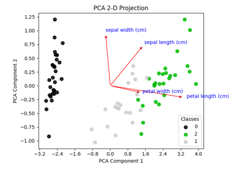
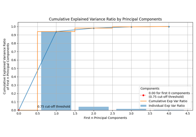

# Decomposition[#](#decomposition "Link to this heading")

Examples related to the [`decomposition`](../../apis/scikitplot.api.html#module-scikitplot.api.decomposition "scikitplot.api.decomposition") submodule with e.g. [`PCA`](https://scikit-learn.org/dev/modules/generated/sklearn.decomposition.PCA.html#sklearn.decomposition.PCA "(in scikit-learn v1.9)") instance.

[plot\_pca\_2d\_projection with examples](plot_pca_2d_projection_script.html)

plot\_pca\_2d\_projection with examples

[plot\_pca\_component\_variance with examples](plot_pca_component_variance_script.html)

plot\_pca\_component\_variance with examples