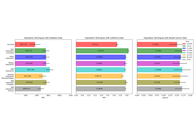

# Impute[#](#impute "Link to this heading")

Examples related to the [`impute`](../../apis/scikitplot.impute.html#module-scikitplot.impute "scikitplot.impute") submodule
with a scikit-learn regressor (e.g., [`LinearRegression`](https://scikit-learn.org/dev/modules/generated/sklearn.linear_model.LinearRegression.html#sklearn.linear_model.LinearRegression "(in scikit-learn v1.9)")) instance.

> **See also**
> * [Houses Prices Tree Based Models (pickling ANNImputer)](https://www.kaggle.com/code/clkmuhammed/houses-prices-tree-based-models)
```
# 💡impute may need voyager
pip install scikitplot[core]

# (Optionally)
# !pip install voyager

```


[annoy impute with examples](plot_impute_script.html)

annoy impute with examples