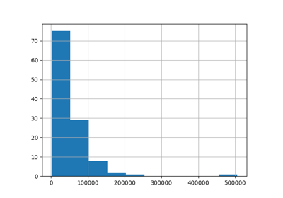

# Preprocessing[#](#preprocessing "Link to this heading")

Examples related to the [`preprocessing`](../../apis/scikitplot.preprocessing.html#module-scikitplot.preprocessing "scikitplot.preprocessing") submodule with
e.g., [`DummyCodeEncoder`](../../modules/generated/scikitplot.preprocessing.DummyCodeEncoder.html#scikitplot.preprocessing.DummyCodeEncoder "scikitplot.preprocessing.DummyCodeEncoder"),
[`GetDummies`](../../modules/generated/scikitplot.preprocessing.GetDummies.html#scikitplot.preprocessing.GetDummies "scikitplot.preprocessing.GetDummies") instance.

> **See also**
> * [DummyCodeEncoder vs GetDummies](https://www.kaggle.com/code/clkmuhammed/expand-equipment-x-features)

[Comparing DummyCode Encoder with Other Encoders](plot_dummy_code_encoder.html)

Comparing DummyCode Encoder with Other Encoders