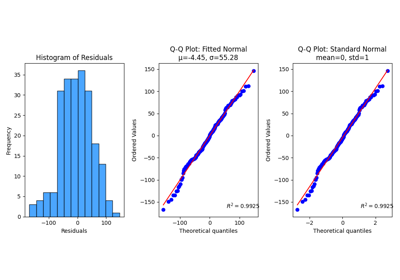

# Regression[#](#regression "Link to this heading")

Examples related to the [`metrics`](../../apis/scikitplot.api.html#module-scikitplot.api.metrics "scikitplot.api.metrics") submodule with e.g., [`LinearRegression`](https://scikit-learn.org/dev/modules/generated/sklearn.linear_model.LinearRegression.html#sklearn.linear_model.LinearRegression "(in scikit-learn v1.9)") instance.

[plot\_residuals\_distribution with examples](plot_residuals_distribution_script.html)

plot\_residuals\_distribution with examples