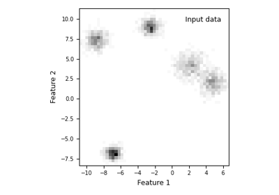
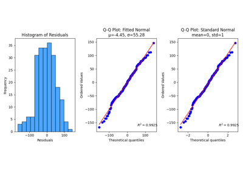

# Stats[#](#stats "Link to this heading")

Examples related to the [`stats`](../../apis/scikitplot.stats.html#module-scikitplot.stats "scikitplot.stats") submodule with e.g. [`LinearRegression`](https://scikit-learn.org/dev/modules/generated/sklearn.linear_model.LinearRegression.html#sklearn.linear_model.LinearRegression "(in scikit-learn v1.9)") instance.

[Gaussian Mixture Models — AIC, AICc, and BIC Model Selection](plot_gaussian_mixture_models.html)

Gaussian Mixture Models — AIC, AICc, and BIC Model Selection

[plot\_residuals\_distribution with examples](plot_residuals_distribution_script.html)

plot\_residuals\_distribution with examples