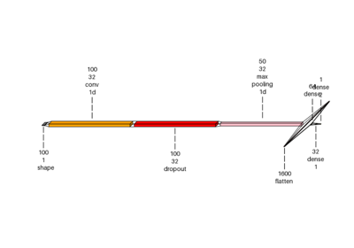
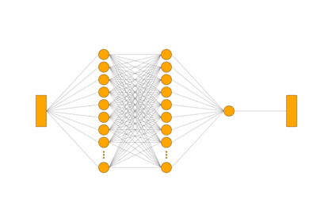
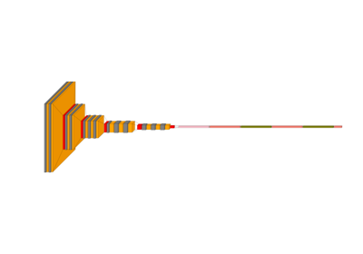
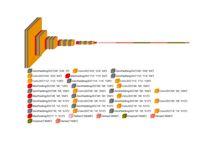
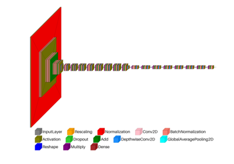
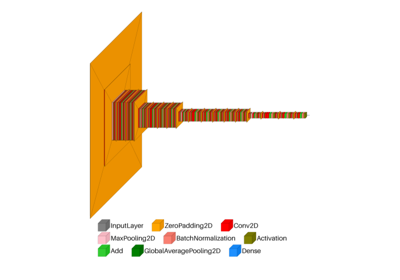
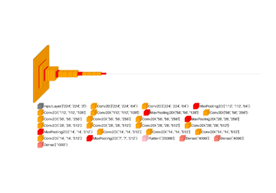

# Visualkeras[#](#visualkeras "Link to this heading")

Examples related to the [`visualkeras`](../../apis/scikitplot.visualkeras.html#module-scikitplot.visualkeras "scikitplot.visualkeras") submodule with
e.g. a DL (ANN, CNN, NLP) [`tf.keras.Model`](https://www.tensorflow.org/api_docs/python/tf/keras/Model "(in TensorFlow v2.8)") model instance.

> **Important**
> * ⚠️ Hugging Face Deprecated Transformers models are not supported in TensorFlow — use KerasNLP or KerasHub instead.
* [🚫 transformers deprecated models](https://www.linkedin.com/feed/update/urn:li:activity:7338966863403528192/).
```
# 💡visualkeras Need aggdraw tensorflow or tensorflow-cpu
pip install scikitplot[core, cpu]

# (Recommended)
# !pip install aggdraw
# !pip install tensorflow

python -c "import tensorflow as tf, google.protobuf as pb; print('tf', tf.__version__); print('protobuf', pb.__version__)"
python -m pip check

# If Needed
# pip install -U "protobuf<6"
# pip install protobuf==5.29.4
import tensorflow as tf

```


[Visualkeras: Spam Classification Conv1D Dense Example](plot_dl_ann_conv_dense.html)

Visualkeras: Spam Classification Conv1D Dense Example

[visualkeras: Spam Dense example](plot_dl_ann_dense.html)

visualkeras: Spam Dense example

[visualkeras: autoencoder example](plot_dl_cnn_autoencoder.html)

visualkeras: autoencoder example

[visualkeras: custom vgg16 example](plot_dl_cnn_custom_vgg16.html)

visualkeras: custom vgg16 example

[visualkeras: custom vgg16 show dimension example](plot_dl_cnn_custom_vgg16_show_dimension.html)

visualkeras: custom vgg16 show dimension example

[visualkeras: EfficientNetV2 example](plot_dl_cnn_efficientnetv2.html)

visualkeras: EfficientNetV2 example

[visualkeras: ResNetV2 example](plot_dl_cnn_resnetv2.html)

visualkeras: ResNetV2 example

[visualkeras: custom VGG example](plot_dl_cnn_vgg.html)

visualkeras: custom VGG example

[visualkeras: Vector Index DB](plot_dl_nlp_vector_index_db.html)

visualkeras: Vector Index DB