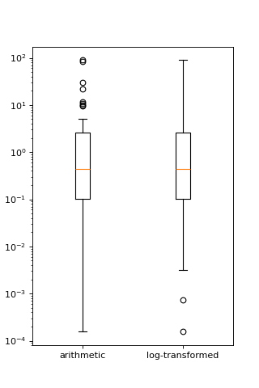

# SEP28: Remove Complexity from Axes.boxplot[#](#sep28-remove-complexity-from-axes-boxplot "Link to this heading")

> **Template**
> Template for further usage, template belong to matplotlib MEPs.

## [Status](#id1)[#](#status "Link to this heading")

****Discussion****

## [Branches and Pull requests](#id2)[#](#branches-and-pull-requests "Link to this heading")

The following lists any open PRs or branches related to this MEP:

1. Deprecate redundant statistical kwargs in `Axes.boxplot`: <https://github.com/phobson/matplotlib/tree/MEP28-initial-deprecations>
2. Deprecate redundant style options in `Axes.boxplot`: <https://github.com/phobson/matplotlib/tree/MEP28-initial-deprecations>
3. Deprecate passings 2D NumPy arrays as input: None
4. Add pre- & post-processing options to `cbook.boxplot_stats`: <https://github.com/phobson/matplotlib/tree/boxplot-stat-transforms>
5. Exposing `cbook.boxplot_stats` through `Axes.boxplot` kwargs: None
6. Remove redundant statistical kwargs in `Axes.boxplot`: None
7. Remove redundant style options in `Axes.boxplot`: None
8. Remaining items that arise through discussion: None

## [Abstract](#id3)[#](#abstract "Link to this heading")

Over the past few releases, the `Axes.boxplot` method has grown in
complexity to support fully customizable artist styling and statistical
computation. This lead to `Axes.boxplot` being split off into multiple
parts. The statistics needed to draw a boxplot are computed in
`cbook.boxplot_stats`, while the actual artists are drawn by `Axes.bxp`.
The original method, `Axes.boxplot` remains as the most public API that
handles passing the user-supplied data to `cbook.boxplot_stats`, feeding
the results to `Axes.bxp`, and pre-processing style information for
each facet of the boxplot plots.

This MEP will outline a path forward to rollback the added complexity
and simplify the API while maintaining reasonable backwards
compatibility.

## [Detailed description](#id4)[#](#detailed-description "Link to this heading")

Currently, the `Axes.boxplot` method accepts parameters that allow the
users to specify medians and confidence intervals for each box that
will be drawn in the plot. These were provided so that advanced users
could provide statistics computed in a different fashion that the simple
method provided by matplotlib. However, handling this input requires
complex logic to make sure that the forms of the data structure match what
needs to be drawn. At the moment, that logic contains 9 separate if/else
statements nested up to 5 levels deep with a for loop, and may raise up to 2 errors.
These parameters were added prior to the creation of the `Axes.bxp` method,
which draws boxplots from a list of dictionaries containing the relevant
statistics. Matplotlib also provides a function that computes these
statistics via `cbook.boxplot_stats`. Note that advanced users can now
either a) write their own function to compute the stats required by
`Axes.bxp`, or b) modify the output returned by `cbook.boxplots_stats`
to fully customize the position of the artists of the plots. With this
flexibility, the parameters to manually specify only the medians and their
confidences intervals remain for backwards compatibility.

Around the same time that the two roles of `Axes.boxplot` were split into
`cbook.boxplot_stats` for computation and `Axes.bxp` for drawing, both
`Axes.boxplot` and `Axes.bxp` were written to accept parameters that
individually toggle the drawing of all components of the boxplots, and
parameters that individually configure the style of those artists. However,
to maintain backwards compatibility, the `sym` parameter (previously used
to specify the symbol of the fliers) was retained. This parameter itself
requires fairly complex logic to reconcile the `sym` parameters with the
newer `flierprops` parameter at the default style specified by `matplotlibrc`.

This MEP seeks to dramatically simplify the creation of boxplots for
novice and advanced users alike. Importantly, the changes proposed here
will also be available to downstream packages like seaborn, as seaborn
smartly allows users to pass arbitrary dictionaries of parameters through
the seaborn API to the underlying matplotlib functions.

This will be achieved in the following way:

1. `cbook.boxplot_stats` will be modified to allow pre- and post-
   computation transformation functions to be passed in (e.g., `np.log`
   and `np.exp` for lognormally distributed data)
2. `Axes.boxplot` will be modified to also accept and naïvely pass them
   to `cbook.boxplots_stats` (Alt: pass the stat function and a dict
   of its optional parameters).
3. Outdated parameters from `Axes.boxplot` will be deprecated and
   later removed.

### [Importance](#id5)[#](#importance "Link to this heading")

Since the limits of the whiskers are computed arithmetically, there
is an implicit assumption of normality in box and whisker plots.
This primarily affects which data points are classified as outliers.

Allowing transformations to the data and the results used to draw
boxplots will allow users to opt-out of that assumption if the
data are known to not fit a normal distribution.

Below is an example of how `Axes.boxplot` classifies outliers of lognormal
data differently depending one these types of transforms.

```
import numpy as np
np.random.seed(0)

import matplotlib.pyplot as plt
from matplotlib import cbook

fig, ax = plt.subplots(figsize=(4, 6))
ax.set_yscale('log')
data = np.random.lognormal(-1.75, 2.75, size=37)

stats = cbook.boxplot_stats(data, labels=['arithmetic'])
logstats = cbook.boxplot_stats(np.log(data), labels=['log-transformed'])

for lsdict in logstats:
    for key, value in lsdict.items():
        if key != 'label':
            lsdict[key] = np.exp(value)

stats.extend(logstats)
ax.bxp(stats)
fig.show()

```

([`Source code`](../../../_downloads/b3ddff218a5529be0f3bbba86cf79982/SPEP28-1.py), [`png`](../../../_downloads/8e250b634004714137183fa3f0612ad1/SPEP28-1.png))



## [Implementation](#id6)[#](#implementation "Link to this heading")

### [Passing transform functions to `cbook.boxplots_stats`](#id7)[#](#passing-transform-functions-to-cbook-boxplots-stats "Link to this heading")

This MEP proposes that two parameters (e.g., `transform_in` and
`transform_out` be added to the cookbook function that computes the
statistics for the boxplot function. These will be optional keyword-only
arguments and can easily be set to `lambda x: x` as a no-op when omitted
by the user. The `transform_in` function will be applied to the data
as the `boxplot_stats` function loops through each subset of the data
passed to it. After the list of statistics dictionaries are computed the
`transform_out` function is applied to each value in the dictionaries.

These transformations can then be added to the call signature of
`Axes.boxplot` with little impact to that method’s complexity. This is
because they can be directly passed to `cbook.boxplot_stats`.
Alternatively, `Axes.boxplot` could be modified to accept an optional
statistical function kwarg and a dictionary of parameters to be directly
passed to it.

At this point in the implementation users and external libraries like
seaborn would have complete control via the `Axes.boxplot` method. More
importantly, at the very least, seaborn would require no changes to its
API to allow users to take advantage of these new options.

### [Simplifications to the `Axes.boxplot` API and other functions](#id8)[#](#simplifications-to-the-axes-boxplot-api-and-other-functions "Link to this heading")

Simplifying the boxplot method consists primarily of deprecating and then
removing the redundant parameters. Optionally, a next step would include
rectifying minor terminological inconsistencies between `Axes.boxplot`
and `Axes.bxp`.

The parameters to be deprecated and removed include:

1. `usermedians` - processed by 10 SLOC, 3 `if` blocks, a `for` loop
2. `conf_intervals` - handled by 15 SLOC, 6 `if` blocks, a `for` loop
3. `sym` - processed by 12 SLOC, 4 `if` blocks

Removing the `sym` option allows all code in handling the remaining
styling parameters to be moved to `Axes.bxp`. This doesn’t remove
any complexity, but does reinforce the single responsibility principle
among `Axes.bxp`, `cbook.boxplot_stats`, and `Axes.boxplot`.

Additionally, the `notch` parameter could be renamed `shownotches`
to be consistent with `Axes.bxp`. This kind of cleanup could be taken
a step further and the `whis`, `bootstrap`, `autorange` could
be rolled into the kwargs passed to the new `statfxn` parameter.

## [Backward compatibility](#id9)[#](#backward-compatibility "Link to this heading")

Implementation of this MEP would eventually result in the backwards
incompatible deprecation and then removal of the keyword parameters
`usermedians`, `conf_intervals`, and `sym`. Cursory searches on
GitHub indicated that `usermedians`, `conf_intervals` are used by
few users, who all seem to have a very strong knowledge of matplotlib.
A robust deprecation cycle should provide sufficient time for these
users to migrate to a new API.

Deprecation of `sym` however, may have a much broader reach into
the matplotlib userbase.

### [Schedule](#id10)[#](#schedule "Link to this heading")

An accelerated timeline could look like the following:

1. v2.0.1 add transforms to `cbook.boxplots_stats`, expose in `Axes.boxplot`
2. v2.1.0 Initial Deprecations , and using 2D NumPy arrays as input

   1. Using 2D NumPy arrays as input. The semantics around 2D arrays are generally confusing.
   2. `usermedians`, `conf_intervals`, `sym` parameters
3. v2.2.0

   1. remove `usermedians`, `conf_intervals`, `sym` parameters
   2. deprecate `notch` in favor of `shownotches` to be consistent with
      other parameters and `Axes.bxp`
4. v2.3.0

   1. remove `notch` parameter
   2. move all style and artist toggling logic to `Axes.bxp` such `Axes.boxplot`
      is little more than a broker between `Axes.bxp` and `cbook.boxplots_stats`

### [Anticipated Impacts to Users](#id11)[#](#anticipated-impacts-to-users "Link to this heading")

As described above deprecating `usermedians` and `conf_intervals`
will likely impact few users. Those who will be impacted are almost
certainly advanced users who will be able to adapt to the change.

Deprecating the `sym` option may import more users and effort should
be taken to collect community feedback on this.

### [Anticipated Impacts to Downstream Libraries](#id12)[#](#anticipated-impacts-to-downstream-libraries "Link to this heading")

The source code (GitHub master as of 2016-10-17) was inspected for
seaborn and python-ggplot to see if these changes would impact their
use. None of the parameters nominated for removal in this MEP are used by
seaborn. The seaborn APIs that use matplotlib’s boxplot function allow
user’s to pass arbitrary `**kwargs` through to matplotlib’s API. Thus
seaborn users with modern matplotlib installations will be able to take
full advantage of any new features added as a result of this MEP.

Python-ggplot has implemented its own function to draw boxplots. Therefore,
no impact can come to it as a result of implementing this MEP.

## [Alternatives](#id13)[#](#alternatives "Link to this heading")

### [Variations on the theme](#id14)[#](#variations-on-the-theme "Link to this heading")

This MEP can be divided into a few loosely coupled components:

1. Allowing pre- and post-computation transformation function in `cbook.boxplot_stats`
2. Exposing that transformation in the `Axes.boxplot` API
3. Removing redundant statistical options in `Axes.boxplot`
4. Shifting all styling parameter processing from `Axes.boxplot` to `Axes.bxp`.

With this approach, #2 depends and #1, and #4 depends on #3.

There are two possible approaches to #2. The first and most direct would
be to mirror the new `transform_in` and `transform_out` parameters of
`cbook.boxplot_stats` in `Axes.boxplot` and pass them directly.

The second approach would be to add `statfxn` and `statfxn_args`
parameters to `Axes.boxplot`. Under this implementation, the default
value of `statfxn` would be `cbook.boxplot_stats`, but users could
pass their own function. Then `transform_in` and `transform_out` would
then be passed as elements of the `statfxn_args` parameter.

```
def boxplot_stats(data, ..., transform_in=None, transform_out=None):
    if transform_in is None:
        transform_in = lambda x: x

    if transform_out is None:
        transform_out = lambda x: x

    output = []
    for _d in data:
        d = transform_in(_d)
        stat_dict = do_stats(d)
        for key, value in stat_dict.item():
            if key != 'label':
                stat_dict[key] = transform_out(value)
        output.append(d)
    return output


 class Axes(...):
     def boxplot_option1(data, ..., transform_in=None, transform_out=None):
         stats = cbook.boxplot_stats(data, ...,
                                     transform_in=transform_in,
                                     transform_out=transform_out)
         return self.bxp(stats, ...)

     def boxplot_option2(data, ..., statfxn=None, **statopts):
         if statfxn is None:
             statfxn = boxplot_stats
         stats = statfxn(data, **statopts)
         return self.bxp(stats, ...)

```

Both cases would allow users to do the following:

```
fig, ax1 = plt.subplots()
artists1 = ax1.boxplot_optionX(data, transform_in=np.log,
                               transform_out=np.exp)

```

But Option Two lets a user write a completely custom stat function
(e.g., `my_box_stats`) with fancy BCA confidence intervals and the
whiskers set differently depending on some attribute of the data.

This is available under the current API:

```
fig, ax1 = plt.subplots()
my_stats = my_box_stats(data, bootstrap_method='BCA',
                        whisker_method='dynamic')
ax1.bxp(my_stats)

```

And would be more concise with Option Two

```
fig, ax = plt.subplots()
statopts = dict(transform_in=np.log, transform_out=np.exp)
ax.boxplot(data, ..., **statopts)

```

Users could also pass their own function to compute the stats:

```
fig, ax1 = plt.subplots()
ax1.boxplot(data, statfxn=my_box_stats, bootstrap_method='BCA',
            whisker_method='dynamic')

```

From the examples above, Option Two seems to have only marginal benefit,
but in the context of downstream libraries like seaborn, its advantage
is more apparent as the following would be possible without any patches
to seaborn:

```
import seaborn
tips = seaborn.load_data('tips')
g = seaborn.factorplot(x="day", y="total_bill", hue="sex", data=tips,
                       kind='box', palette="PRGn", shownotches=True,
                       statfxn=my_box_stats, bootstrap_method='BCA',
                       whisker_method='dynamic')

```

This type of flexibility was the intention behind splitting the overall
boxplot API in the current three functions. In practice however, downstream
libraries like seaborn support versions of matplotlib dating back well
before the split. Thus, adding just a bit more flexibility to the
`Axes.boxplot` could expose all the functionality to users of the
downstream libraries with modern matplotlib installation without intervention
from the downstream library maintainers.

### [Doing less](#id15)[#](#doing-less "Link to this heading")

Another obvious alternative would be to omit the added pre- and post-
computation transform functionality in `cbook.boxplot_stats` and
`Axes.boxplot`, and simply remove the redundant statistical and style
parameters as described above.

### [Doing nothing](#id16)[#](#doing-nothing "Link to this heading")

As with many things in life, doing nothing is an option here. This means
we simply advocate for users and downstream libraries to take advantage
of the split between `cbook.boxplot_stats` and `Axes.bxp` and let
them decide how to provide an interface to that.