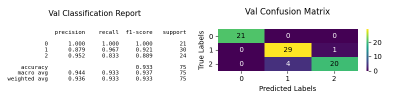
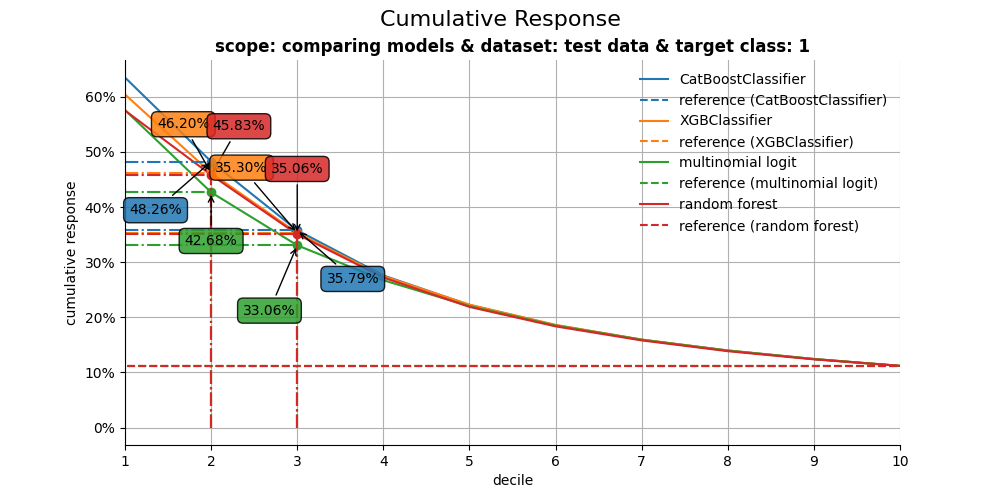
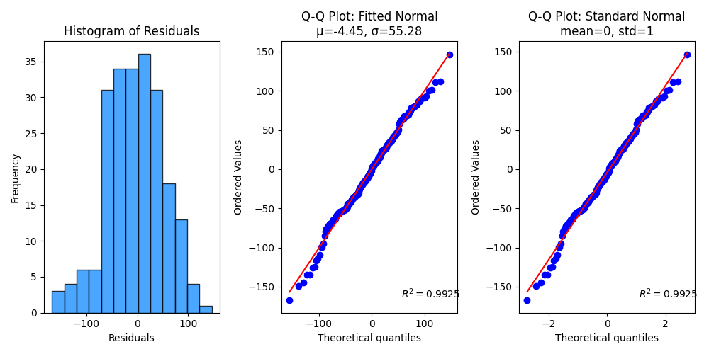
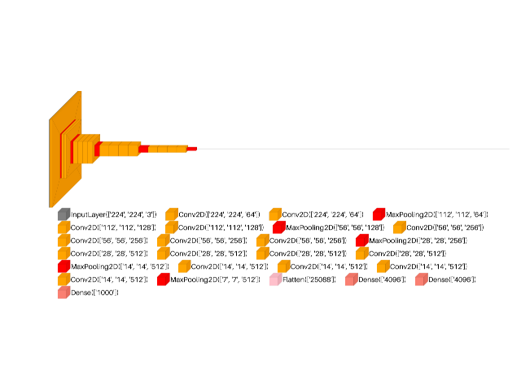

#### [Dimensionality Reduction](user_guide/api/decomposition.html)

Plotting the reducing the number of random variables to consider.

****Applications:**** Visualization, increased efficiency.
****Algorithms:****
[Plots the 2-dimensional projection of PCA](user_guide/api/decomposition.html#plot-pca-2d-projection),
[Plots PCA components’ explained variance ratios](user_guide/api/decomposition.html#plot-pca-component-variance),
and [more...](user_guide/api/decomposition.html)

[Tutorials](auto_examples/index.html#decomposition)

#### [Metric Analysis](user_guide/api/index.html)

Model Evaluation: Metrics Performance Analysis.

****Applications:**** Spam detection, image recognition.
****Metrics:****
[Feature Importances](user_guide/api/estimators.html#plot-feature-importances),
[ROC AUC Curves](user_guide/api/metrics.html#plot-roc),
[Precision-Recall Curves](user_guide/api/metrics.html#plot-precision-recall),
and [more...](user_guide/api/index.html)

[Tutorials](auto_examples/index.html#classification)

#### [Decile-Wise Analysis](user_guide/decile/index.html)

Model Evaluation: Decile-Based Performance Analysis.

****Applications:**** Spam detection, image recognition.
****Algorithms:****
[Generates the KS Statistic plot](user_guide/decile/kds.html#plot-ks-statistic),
[Generates the Cumulative Gains plot](user_guide/decile/kds.html#plot-cumulative-gain),
[Generates the Cumulative Gains plot](user_guide/decile/modelplotpy.html#plot-cumgains),
and [more...](user_guide/decile/index.html)

[Tutorials](auto_examples/index.html#decile)

#### [Statistical Analysis](user_guide/stats/index.html)

Elegant quantitative analysis tools for clear, intuitive, and insightful data visualization and interpretation.

****Applications:**** Selecting the bin width of histograms, Model Selection, Time Series Analysis...
****Algorithms:****
[Astrostatistics Tools](user_guide/stats/index.html#astrostatistics-tools),
[Tweedie Family](user_guide/stats/index.html#tweedie-distribution),
and [more...](user_guide/stats/index.html)

[Tutorials](auto_examples/index.html#stats)

#### [Array API Support (experimental)](user_guide/_lib/index.html)

The array API standard and specific compatibility functions for Numpy, CuPy and PyTorch is provided through `array-api-compat`.

****Applications:**** Using the Array API standard to accelerate ML and DL model visualization.
****Algorithms:****

and [more...](user_guide/_lib/index.html)

[Tutorials](auto_examples/index.html#array-api-support-experimental)

#### [Visualkeras](user_guide/visualkeras/index.html)

Visualize Keras (either standalone or included in tensorflow) neural network architectures.

****Applications:**** ANN, CNN, NLP Tasks...
****Algorithms:****
[Graphical Visualization plot](user_guide/visualkeras/index.html#graphical-visualization),
[Layered Visualization plot](user_guide/visualkeras/index.html#layered-visualization),
and [more...](user_guide/visualkeras/index.html)

[Tutorials](auto_examples/index.html#visualkeras)