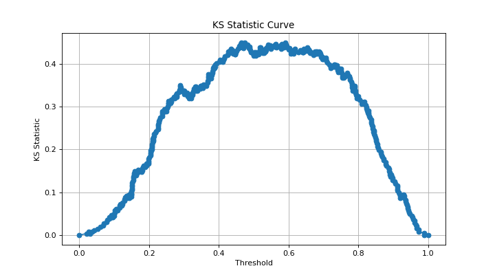

# binary\_ks\_curve[#](#binary-ks-curve "Link to this heading")

scikitplot.api.\_utils.binary\_ks\_curve(**y\_true**, **y\_probas**)[[source]](https://github.com/scikit-plots/scikit-plots/blob/64b40d9/scikitplot/api/_utils/_helpers.py#L251)[#](#scikitplot.api._utils.binary_ks_curve "Link to this definition")
:   Generate the data points necessary to plot the Kolmogorov-Smirnov (KS)
    curve for binary classification tasks.

    The KS Statistic measures the maximum vertical distance between
    the cumulative distribution functions (CDFs) of the predicted
    probabilities for the positive and negative classes.
    It is used to evaluate the discriminatory power of a binary classifier.

    Parameters:
    :   ****y\_true****array-like of shape (n\_samples,)
        :   True binary labels of the data. This array should contain exactly
            two unique classes representing a binary classification problem.
            If more than two classes are present, the function will raise a
            `ValueError`.

        ****y\_probas****array-like of shape (n\_samples,)
        :   Probability predictions for the positive class.
            This array should contain continuous values representing
            the predicted probability of the positive class.

    Returns:
    :   ****thresholds****numpy.ndarray of shape (n\_thresholds,)
        :   An array containing the threshold (X-axis) values
            used for plotting the KS curve. These thresholds
            range from the minimum to the maximum predicted probabilities.

        ****pct1****numpy.ndarray of shape (n\_thresholds,)
        :   An array containing the cumulative (Y-axis) percentage of samples
            for the positive class up to each threshold value.

        ****pct2****numpy.ndarray of shape (n\_thresholds,)
        :   An array containing the cumulative (Y-axis) percentage of samples
            for the negative class up to each threshold value.

        ****ks\_statistic****float
        :   The KS Statistic, which is the maximum vertical distance
            between the cumulative distribution functions
            of the positive and negative classes.

        ****max\_distance\_at****float
        :   The threshold (X-axis) value at which the maximum vertical distance
            between the two cumulative distribution functions
            (and hence the KS Statistic) is observed.

        ****classes****numpy.ndarray of shape (2,)
        :   An array containing the labels of the two classes present in `y_true`.

    Raises:
    :   ValueError
        :   * If `y_true` does not contain exactly two distinct classes,
              indicating that the problem is not binary.
            * If `y_probas` contains binary values instead of continuous probabilities.

    Notes

    * ****Binary Classification Only:**** This implementation is strictly for binary classification.
      Multi-class problems are not supported and will result in a `ValueError`.
    * ****Probability Scores:**** The `y_probas` array must contain continuous values representing probabilities.
      Binary scores (0/1) are not appropriate for KS curve calculations.
    * ****Performance:**** The function sorts the predicted probabilities for both classes, leading to a time
      complexity of O(n log n) where `n` is the number of samples. Sorting could be a performance bottleneck
      for very large datasets.
    * ****Handling Edge Cases:**** The function inserts thresholds of 0 and 1 if they are not already present to ensure
      that the KS curve starts and ends at the boundaries of the predicted probability range.

    Examples

    ```
    >>> from sklearn.datasets import make_classification
    >>> from sklearn.linear_model import LogisticRegression
    >>> from sklearn.model_selection import train_test_split
    >>> import matplotlib.pyplot as plt
    >>> # Generate a binary classification dataset
    >>> X, y = make_classification(
    ...     n_samples=1000,
    ...     n_classes=2,
    ...     n_informative=3,
    ...     random_state=0,
    ... )
    >>> # Split into training and test sets
    >>> X_train, X_test, y_train, y_test = train_test_split(
    ...     X, y, test_size=0.5, random_state=0
    ... )
    >>> # Train a logistic regression model
    >>> model = LogisticRegression()
    >>> model.fit(X_train, y_train)
    >>> # Predict probabilities for the test set
    >>> y_probas = model.predict_proba(X_test)[:, 1]
    >>> # Calculate the KS Statistic curve
    >>> import scikitplot as sp
    >>> (
    ...     thresholds,
    ...     pct1,
    ...     pct2,
    ...     ks_statistic,
    ...     max_distance_at,
    ...     classes,
    ... ) = sp.api._utils.binary_ks_curve(y_test, y_probas)
    >>> # Plot the KS Statistic curve
    >>> plt.plot(thresholds, pct1 - pct2, marker='o')
    >>> plt.xlabel('Threshold')
    >>> plt.ylabel('KS Statistic')
    >>> plt.title('KS Statistic Curve')
    >>> plt.grid()
    >>> plt.show()

    ```

    ([`Source code`](../../_downloads/118af971a574ac4de1e71983a741f1ff/scikitplot-api-_utils-binary_ks_curve-1.py), [`png`](../../_downloads/3121fd519249a83e139112165fa1fabe/scikitplot-api-_utils-binary_ks_curve-1.png))

    