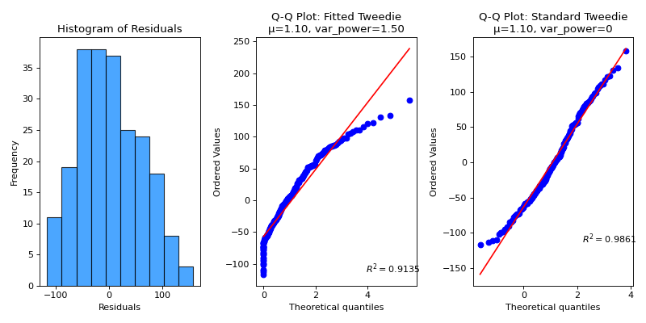

# plot\_residuals\_distribution[#](#plot-residuals-distribution "Link to this heading")

scikitplot.api.metrics.plot\_residuals\_distribution(**y\_true**, **y\_pred**, **\***, **dist\_type='normal'**, **var\_power=1.5**, **title='Precision-Recall AUC Curves'**, **title\_fontsize='large'**, **text\_fontsize='medium'**, **cmap=None**, **show\_labels=True**, **digits=4**, **figsize=(10, 5)**, **nrows=1**, **ncols=3**, **index=3**, **\*\*kwargs**)[[source]](https://github.com/scikit-plots/scikit-plots/blob/64b40d9/scikitplot/api/metrics/_regression/_residuals.py#L55)[#](#scikitplot.api.metrics.plot_residuals_distribution "Link to this definition")
:   Plot residuals and fit various distributions to assess their goodness of fit.

    Parameters:
    :   ****y\_true****array-like, shape (n\_samples,)
        :   Ground truth (correct) target values.

        ****y\_pred****array-like, shape (n\_samples,)
        :   Estimated targets as returned by a classifier.

        ****dist\_type****str, optional, default=’normal’
        :   Type of distribution to fit to the residuals. Options are:

            * ‘normal’: For symmetrically distributed residuals (mean μ, std σ).
            * ‘poisson’: For count-based residuals or rare events (mean λ).
            * ‘gamma’: For positive, skewed residuals with a heavy tail (shape k or α, scale θ or β).
            * ‘inverse\_gaussian’: For residuals with a distribution similar to the inverse Gaussian
              :   (mean μ, scale λ).
            * ‘exponential’: For non-negative residuals with a long tail (scale λ).
            * ‘lognormal’: For positively skewed residuals with a multiplicative effect
              :   (shape σ, scale exp(μ)).
            * ‘tweedie’: For complex data including counts and continuous components.

            The Tweedie distribution can model different types of data based on
            the variance power (`var_power`):

            * var\_power = 0: Normal distribution (mean μ, std σ)
            * var\_power = 1: Poisson distribution (mean λ)
            * 1 < var\_power < 2: Compound Poisson-Gamma distribution
            * var\_power = 2: Gamma distribution (shape k, scale θ)
            * var\_power = 3: Inverse Gaussian distribution (mean μ, scale λ)

        ****var\_power****float or None
        :   The variance power for the Tweedie distribution, applicable if `dist_type='tweedie'`.
            :   * Default is 1.5, which means Tweedie-specific plotting.
                * Example values: 1.5 for Compound Poisson-Gamma distribution, 2 for Gamma distribution.

        ****title****str, optional, default=’Precision-Recall AUC Curves’
        :   Title of the generated plot.

        ****title\_fontsize****str or int, optional, default=’large’
        :   Font size for the plot title.

        ****text\_fontsize****str or int, optional, default=’medium’
        :   Font size for the text in the plot.

        ****cmap****None, str or matplotlib.colors.Colormap, optional, default=None
        :   Colormap used for plotting.
            Options include ‘viridis’, ‘PiYG’, ‘plasma’, ‘inferno’, ‘nipy\_spectral’, etc.
            See Matplotlib Colormap documentation for available choices.

            * <https://matplotlib.org/stable/users/explain/colors/index.html>
            * plt.colormaps()
            * plt.get\_cmap() # None == ‘viridis’

        ****show\_labels****bool, optional, default=True
        :   Whether to display the legend labels.

        ****digits****int, optional, default=3
        :   Number of digits for formatting PR AUC values in the plot.

            Added in version 0.3.9.

        ****\*\*kwargs: dict****
        :   Generic keyword arguments.

    Returns:
    :   ****ax****matplotlib.axes.Axes
        :   The axes on which the plot was drawn.

    Other Parameters:
    :   ****ax****matplotlib.axes.Axes, optional, default=None
        :   The axis to plot the figure on. If None is passed in the current axes
            will be used (or generated if required).

            Added in version 0.4.0.

        ****fig****matplotlib.pyplot.figure, optional, default: None
        :   The figure to plot the Visualizer on. If None is passed in the current
            plot will be used (or generated if required).

            Added in version 0.4.0.

        ****figsize****tuple, optional, default=None
        :   Width, height in inches.
            Tuple denoting figure size of the plot e.g. (12, 5)

            Added in version 0.4.0.

        ****nrows****int, optional, default=1
        :   Number of rows in the subplot grid.

            Added in version 0.4.0.

        ****ncols****int, optional, default=1
        :   Number of columns in the subplot grid.

            Added in version 0.4.0.

        ****plot\_style****str, optional, default=None
        :   Check available styles with “plt.style.available”. Examples include:
            [‘ggplot’, ‘seaborn’, ‘bmh’, ‘classic’, ‘dark\_background’, ‘fivethirtyeight’,
            ‘grayscale’, ‘seaborn-bright’, ‘seaborn-colorblind’, ‘seaborn-dark’,
            ‘seaborn-dark-palette’, ‘tableau-colorblind10’, ‘fast’].

            Added in version 0.4.0.

        ****show\_fig****bool, default=True
        :   Show the plot.

            Added in version 0.4.0.

        ****save\_fig****bool, default=False
        :   Save the plot.
            Used by `save_plot_decorator`.

            Added in version 0.4.0.

        ****save\_fig\_filename****str, optional, default=’’
        :   Specify the path and filetype to save the plot.
            If nothing specified, the plot will be saved as png
            inside `result_images` under to the current working directory.
            Defaults to plot image named to used `func.__name__`.
            Used by `save_plot_decorator`.

            Added in version 0.4.0.

        ****overwrite****bool, optional, default=True
        :   If False and a file exists, auto-increments the filename to avoid overwriting.

            Added in version 0.4.0.

        ****add\_timestamp****bool, optional, default=False
        :   Whether to append a timestamp to the filename.
            Default is False.

            Added in version 0.4.0.

        ****verbose****bool, optional
        :   If True, enables verbose output with informative messages during execution.
            Useful for debugging or understanding internal operations such as backend selection,
            font loading, and file saving status. If False, runs silently unless errors occur.

            Default is False.

            Added in version 0.4.0: The `verbose` parameter was added to control logging and user feedback verbosity.

    Raises:
    :   ValueError: If an unsupported distribution type is provided or if `var_power` is invalid.

    Examples

    ```
    >>> import numpy as np
    ...
    ... np.random.seed(0)
    >>> from sklearn.datasets import (
    ...     load_diabetes as data_regression,
    ... )
    >>> from sklearn.model_selection import train_test_split
    >>> from sklearn.linear_model import Ridge
    >>> import scikitplot as skplt
    >>>
    >>> X, y = data_regression(return_X_y=True, as_frame=False)
    >>> X_train, X_val, y_train, y_val = train_test_split(
    ...     X, y, test_size=0.5, random_state=0
    ... )
    >>> model = Ridge(alpha=1.0).fit(X_train, y_train)
    >>> y_val_pred = model.predict(X_val)
    >>> skplt.metrics.plot_residuals_distribution(
    >>>     y_val, y_val_pred, dist_type='tweedie',
    >>> );

    ```

    ([`Source code`](../../_downloads/101ce8038012a37ee49a373ab7be5635/scikitplot-api-metrics-plot_residuals_distribution-1.py), [`png`](../../_downloads/19182d6929a39bd8d2a18ef785f3408e/scikitplot-api-metrics-plot_residuals_distribution-1.png))

    