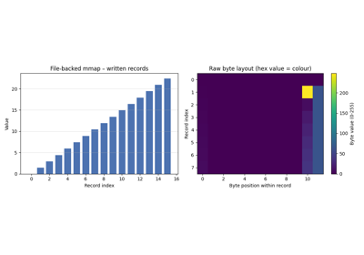

# MemoryMap[#](#memorymap "Link to this heading")

class scikitplot.memmap.MemoryMap[#](#scikitplot.memmap.MemoryMap "Link to this definition")
:   Memory-mapped region with automatic resource management.

    This class wraps a memory-mapped region and provides a Pythonic interface
    with context manager support for automatic cleanup.

    Parameters:
    :   ****addr****int
        :   Memory address returned from mmap()

        ****size****int
        :   Size of the mapping in bytes

    Attributes:
    :   [`addr`](#scikitplot.memmap.MemoryMap.addr "scikitplot.memmap.MemoryMap.addr")int (property, read-only)
        :   MemoryMap.addr: int

        [`size`](#scikitplot.memmap.MemoryMap.size "scikitplot.memmap.MemoryMap.size")int (property, read-only)
        :   MemoryMap.size: int

        [`is_valid`](#scikitplot.memmap.MemoryMap.is_valid "scikitplot.memmap.MemoryMap.is_valid")bool (property, read-only)
        :   MemoryMap.is\_valid: bool

    Notes

    * Always use factory methods (create\_\*) to create instances
    * Use as context manager for automatic cleanup
    * Accessing closed mapping raises ValueError

    Examples

    ```
    >>> with MemoryMap.create_anonymous(4096, PROT_READ | PROT_WRITE) as m:
    ...     m.write(b"test")
    ...     data = m.read(4)

    ```

    addr[#](#scikitplot.memmap.MemoryMap.addr "Link to this definition")
    :   int

        Get memory address of mapped region.

        Returns:
        :   int
            :   Memory address as integer

        Raises:
        :   ValueError
            :   If mapping is closed

        Type:
        :   [MemoryMap.addr](#scikitplot.memmap.MemoryMap.addr "scikitplot.memmap.MemoryMap.addr")

    as\_numpy\_array(**self**, **dtype=None**)[#](#scikitplot.memmap.MemoryMap.as_numpy_array "Link to this definition")
    :   Return a NumPy array that shares memory with this mapping.

        No data is copied. The returned array’s lifetime is tied to
        this `MemoryMap` instance: using the array after the mapping
        is closed is undefined behaviour.

        Parameters:
        :   ****dtype****numpy.dtype or None, optional
            :   Desired element type of the output array. When **None**
                (default) the raw view is returned as `numpy.uint8`.
                Any dtype whose `itemsize` evenly divides `self.size`
                is accepted.

        Returns:
        :   numpy.ndarray
            :   A 1-D array viewing the mapped memory. The `WRITEABLE`
                flag is set only when the mapping was created with
                `PROT_WRITE`.

        Raises:
        :   ValueError
            :   If the mapping is closed, or if `dtype.itemsize` does
                not evenly divide the mapping size.

            ImportError
            :   If NumPy is not installed.

        Notes

        Lifetime management follows the same pattern used by
        `numpy.memmap`: a ctypes buffer object is created from the
        raw pointer via `from_address` (zero-copy), then passed as
        the `buffer=` argument to `numpy.ndarray`. NumPy sets
        `arr.base` to that buffer object, which in turn holds a
        `_mmap_ref` back-reference to this `MemoryMap`. The chain
        `arr  →  arr.base (ctypes buf)  →  buf._mmap_ref (MemoryMap)`
        keeps everything alive as long as the array exists.

        Plain `numpy.ndarray` is a C-extension type with ****no****
        `__dict__`; you cannot attach arbitrary attributes to it.
        The ctypes array **does** have a `__dict__`, which is why the
        back-reference is stored there and not on the ndarray itself.

        Examples

        ```
        >>> import numpy as np
        >>> with MemoryMap.create_anonymous(4096) as m:
        ...     arr = m.as_numpy_array()          # uint8 view
        ...     arr[:5] = [72, 101, 108, 108, 111]
        ...     print(m.read(5))
        b'Hello'

        ```

        Reinterpret as 32-bit floats:

        ```
        >>> with MemoryMap.create_anonymous(4096) as m:
        ...     arr = m.as_numpy_array(dtype=np.float32)
        ...     arr[0] = 3.14

        ```

    close(**self**) → [None](https://docs.python.org/3/library/constants.html#None "(in Python v3.14)")[#](#scikitplot.memmap.MemoryMap.close "Link to this definition")
    :   Close the memory mapping.

        Unmaps the region and releases resources.

        Raises:
        :   ValueError
            :   If mapping is already closed

            MMapError
            :   If munmap() fails

        Return type:
        :   None

        Notes

        * After closing, the mapping cannot be used
        * Called automatically by \_\_dealloc\_\_ or context manager
        * Safe to call multiple times (idempotent)

        Examples

        ```
        >>> m = MemoryMap.create_anonymous(4096)
        >>> m.close()
        >>> m.is_valid
        False

        ```

    static create\_anonymous(**int size: [int](https://docs.python.org/3/library/functions.html#int "(in Python v3.14)")**, **int prot: [int](https://docs.python.org/3/library/functions.html#int "(in Python v3.14)") = 0x3**, **int flags: [int](https://docs.python.org/3/library/functions.html#int "(in Python v3.14)") = 2**) → [MemoryMap](#scikitplot.memmap.MemoryMap "scikitplot.memmap.MemoryMap")[#](#scikitplot.memmap.MemoryMap.create_anonymous "Link to this definition")
    :   Create anonymous memory mapping (not backed by file).

        Parameters:
        :   ****size****int
            :   Size of the mapping in bytes. Must be > 0.

            ****prot****int, optional
            :   Memory protection flags (PROT\_READ, PROT\_WRITE, etc.).
                Default: PROT\_READ | PROT\_WRITE

            ****flags****int, optional
            :   Mapping flags (should include MAP\_PRIVATE or MAP\_SHARED).
                Default: MAP\_PRIVATE

        Returns:
        :   MemoryMap
            :   New memory-mapped region

        Raises:
        :   ValueError
            :   If size <= 0 or invalid flags

            MMapAllocationError
            :   If mapping allocation fails

        Parameters:
        :   * ****size**** ([**int**](https://docs.python.org/3/library/functions.html#int "(in Python v3.14)"))
            * ****prot**** ([**int**](https://docs.python.org/3/library/functions.html#int "(in Python v3.14)"))
            * ****flags**** ([**int**](https://docs.python.org/3/library/functions.html#int "(in Python v3.14)"))

        Return type:
        :   [**MemoryMap**](#scikitplot.memmap.MemoryMap "scikitplot.memmap._memmap.mem_map.MemoryMap")

        Notes

        * Memory is initially zero-filled
        * Anonymous mappings are not backed by any file
        * Useful for inter-process communication with MAP\_SHARED

        Examples

        ```
        >>> m = MemoryMap.create_anonymous(4096, PROT_READ | PROT_WRITE)
        >>> m.write(b"Hello")
        >>> m.close()

        ```

        Using context manager (recommended):

        ```
        >>> with MemoryMap.create_anonymous(4096) as m:
        ...     m.write(b"Hello, World!")

        ```

    static create\_file\_mapping(**int fd: [int](https://docs.python.org/3/library/functions.html#int "(in Python v3.14)")**, **int offset: [int](https://docs.python.org/3/library/functions.html#int "(in Python v3.14)")**, **int size: [int](https://docs.python.org/3/library/functions.html#int "(in Python v3.14)")**, **int prot: [int](https://docs.python.org/3/library/functions.html#int "(in Python v3.14)") = 1**, **int flags: [int](https://docs.python.org/3/library/functions.html#int "(in Python v3.14)") = 2**) → [MemoryMap](#scikitplot.memmap.MemoryMap "scikitplot.memmap.MemoryMap")[#](#scikitplot.memmap.MemoryMap.create_file_mapping "Link to this definition")
    :   Create file-backed memory mapping.

        Parameters:
        :   ****fd****int
            :   File descriptor of open file

            ****offset****int
            :   Offset in file to start mapping (must be page-aligned)

            ****size****int
            :   Size of the mapping in bytes. Must be > 0.

            ****prot****int, optional
            :   Memory protection flags.
                Default: PROT\_READ

            ****flags****int, optional
            :   Mapping flags.
                Default: MAP\_PRIVATE

        Returns:
        :   MemoryMap
            :   New memory-mapped region

        Raises:
        :   ValueError
            :   If fd < 0, size <= 0, or invalid flags

            MMapAllocationError
            :   If mapping allocation fails

        Parameters:
        :   * ****fd**** ([**int**](https://docs.python.org/3/library/functions.html#int "(in Python v3.14)"))
            * ****offset**** ([**int**](https://docs.python.org/3/library/functions.html#int "(in Python v3.14)"))
            * ****size**** ([**int**](https://docs.python.org/3/library/functions.html#int "(in Python v3.14)"))
            * ****prot**** ([**int**](https://docs.python.org/3/library/functions.html#int "(in Python v3.14)"))
            * ****flags**** ([**int**](https://docs.python.org/3/library/functions.html#int "(in Python v3.14)"))

        Return type:
        :   [**MemoryMap**](#scikitplot.memmap.MemoryMap "scikitplot.memmap._memmap.mem_map.MemoryMap")

        Notes

        * File must be opened with appropriate permissions
        * offset must be page-aligned (typically 4096 bytes)
        * MAP\_SHARED changes are written back to file
        * MAP\_PRIVATE creates copy-on-write mapping

        Examples

        ```
        >>> with open("data.bin", "r+b") as f:
        ...     m = MemoryMap.create_file_mapping(f.fileno(), 0, 4096, PROT_READ)
        ...     data = m.read(100)
        ...     m.close()

        ```

    is\_valid[#](#scikitplot.memmap.MemoryMap.is_valid "Link to this definition")
    :   bool

        Check if mapping is still valid.

        Returns:
        :   bool
            :   True if valid, False if closed

        Type:
        :   [MemoryMap.is\_valid](#scikitplot.memmap.MemoryMap.is_valid "scikitplot.memmap.MemoryMap.is_valid")

    mlock(**self**) → [None](https://docs.python.org/3/library/constants.html#None "(in Python v3.14)")[#](#scikitplot.memmap.MemoryMap.mlock "Link to this definition")
    :   Lock mapped pages in physical memory (prevent swapping).

        Raises:
        :   ValueError
            :   If the mapping is already closed.

            MMapError
            :   If the underlying `mlock()` system call fails. On Linux
                this commonly means the process has exceeded its
                `RLIMIT_MEMLOCK` soft limit; on Windows it may require
                `SE_LOCK_MEMORY_NAME` privilege.

        Return type:
        :   None

        Notes

        Locking pages is useful for latency-sensitive code (e.g.
        real-time signal processing) that cannot tolerate page faults.
        Remember to call [`munlock`](#scikitplot.memmap.MemoryMap.munlock "scikitplot.memmap.MemoryMap.munlock") when the guarantee is no
        longer needed; otherwise the locked pages count against the
        process resource limit for the lifetime of the mapping.

        Examples

        ```
        >>> with MemoryMap.create_anonymous(4096) as m:
        ...     m.mlock()       # pages will not be swapped out
        ...     m.write(b"latency-critical data")
        ...     m.munlock()     # release the lock

        ```

    mprotect(**self**, **int prot: [int](https://docs.python.org/3/library/functions.html#int "(in Python v3.14)")**) → [None](https://docs.python.org/3/library/constants.html#None "(in Python v3.14)")[#](#scikitplot.memmap.MemoryMap.mprotect "Link to this definition")
    :   Change memory protection of mapped region.

        Parameters:
        :   ****prot****int
            :   New protection flags

        Raises:
        :   ValueError
            :   If mapping is closed or flags invalid

            MMapError
            :   If mprotect() fails

        Parameters:
        :   ****prot**** ([**int**](https://docs.python.org/3/library/functions.html#int "(in Python v3.14)"))

        Return type:
        :   None

        Examples

        ```
        >>> with MemoryMap.create_anonymous(4096, PROT_READ) as m:
        ...     m.mprotect(PROT_READ | PROT_WRITE)
        ...     m.write(b"Now writable!")

        ```

    msync(**self**, **int flags: [int](https://docs.python.org/3/library/functions.html#int "(in Python v3.14)") = 2**) → [None](https://docs.python.org/3/library/constants.html#None "(in Python v3.14)")[#](#scikitplot.memmap.MemoryMap.msync "Link to this definition")
    :   Synchronize mapped region with backing storage.

        Parameters:
        :   ****flags****int, optional
            :   Sync flags (MS\_ASYNC, MS\_SYNC, MS\_INVALIDATE).
                Default: MS\_SYNC

        Raises:
        :   ValueError
            :   If mapping is closed

            MMapError
            :   If msync() fails

        Parameters:
        :   ****flags**** ([**int**](https://docs.python.org/3/library/functions.html#int "(in Python v3.14)"))

        Return type:
        :   None

        Notes

        * Only meaningful for file-backed mappings
        * MS\_SYNC blocks until sync complete
        * MS\_ASYNC returns immediately

        Examples

        ```
        >>> with MemoryMap.create_file_mapping(fd, 0, 4096, PROT_WRITE, MAP_SHARED) as m:
        ...     m.write(b"Data")
        ...     m.msync(MS_SYNC)  # Ensure written to disk

        ```

    munlock(**self**) → [None](https://docs.python.org/3/library/constants.html#None "(in Python v3.14)")[#](#scikitplot.memmap.MemoryMap.munlock "Link to this definition")
    :   Unlock mapped pages (allow the kernel to swap them out again).

        Raises:
        :   ValueError
            :   If the mapping is already closed.

            MMapError
            :   If the underlying `munlock()` system call fails.

        Return type:
        :   None

        Notes

        This is the inverse of [`mlock`](#scikitplot.memmap.MemoryMap.mlock "scikitplot.memmap.MemoryMap.mlock"). Calling `munlock`
        on pages that were never locked is a no-op on most platforms
        but the behaviour is technically undefined by POSIX; avoid it.

        Examples

        ```
        >>> with MemoryMap.create_anonymous(4096) as m:
        ...     m.mlock()
        ...     # … do latency-critical work …
        ...     m.munlock()

        ```

    page\_size[#](#scikitplot.memmap.MemoryMap.page_size "Link to this definition")
    :   int

        System page size in bytes.

        Returns:
        :   int
            :   Page size as reported by the kernel (e.g. 4096 or 16384).

        Notes

        File-mapping offsets passed to `create_file_mapping` must be
        multiples of this value. Use it for manual alignment:

        ```
        aligned = (raw_offset // m.page_size) * m.page_size

        ```

        Type:
        :   [MemoryMap.page\_size](#scikitplot.memmap.MemoryMap.page_size "scikitplot.memmap.MemoryMap.page_size")

    read(**self**, **int size: [int](https://docs.python.org/3/library/functions.html#int "(in Python v3.14)")**, **int offset: [int](https://docs.python.org/3/library/functions.html#int "(in Python v3.14)") = 0**) → [bytes](https://docs.python.org/3/library/stdtypes.html#bytes "(in Python v3.14)")[#](#scikitplot.memmap.MemoryMap.read "Link to this definition")
    :   Read bytes from mapped region.

        Parameters:
        :   ****size****int
            :   Number of bytes to read

            ****offset****int, optional
            :   Offset from start of mapping. Default: 0

        Returns:
        :   bytes
            :   Data read from mapping

        Raises:
        :   ValueError
            :   If mapping is closed or parameters are invalid

        Parameters:
        :   * ****size**** ([**int**](https://docs.python.org/3/library/functions.html#int "(in Python v3.14)"))
            * ****offset**** ([**int**](https://docs.python.org/3/library/functions.html#int "(in Python v3.14)"))

        Return type:
        :   [bytes](https://docs.python.org/3/library/stdtypes.html#bytes "(in Python v3.14)")

        Examples

        ```
        >>> with MemoryMap.create_anonymous(4096) as m:
        ...     m.write(b"Hello")
        ...     data = m.read(5)
        ...     print(data)
        b'Hello'

        ```

    size[#](#scikitplot.memmap.MemoryMap.size "Link to this definition")
    :   int

        Get size of mapped region.

        Returns:
        :   int
            :   Size in bytes

        Raises:
        :   ValueError
            :   If mapping is closed

        Type:
        :   [MemoryMap.size](#scikitplot.memmap.MemoryMap.size "scikitplot.memmap.MemoryMap.size")

    write(**self**, **bytes data: [bytes](https://docs.python.org/3/library/stdtypes.html#bytes "(in Python v3.14)")**, **int offset: [int](https://docs.python.org/3/library/functions.html#int "(in Python v3.14)") = 0**) → [int](https://docs.python.org/3/library/functions.html#int "(in Python v3.14)")[#](#scikitplot.memmap.MemoryMap.write "Link to this definition")
    :   Write bytes to mapped region.

        Parameters:
        :   ****data****bytes
            :   Data to write

            ****offset****int, optional
            :   Offset from start of mapping. Default: 0

        Returns:
        :   int
            :   Number of bytes written

        Raises:
        :   ValueError
            :   If mapping is closed, not writable, or parameters invalid

        Parameters:
        :   * ****data**** ([**bytes**](https://docs.python.org/3/library/stdtypes.html#bytes "(in Python v3.14)"))
            * ****offset**** ([**int**](https://docs.python.org/3/library/functions.html#int "(in Python v3.14)"))

        Return type:
        :   [int](https://docs.python.org/3/library/functions.html#int "(in Python v3.14)")

        Examples

        ```
        >>> with MemoryMap.create_anonymous(4096, PROT_WRITE) as m:
        ...     n = m.write(b"Hello, World!")
        ...     print(n)
        13

        ```

## Gallery examples[#](#gallery-examples "Link to this heading")



[Memory-Mapping Showcase – Basic / Medium / Advanced](../../auto_examples/memmap/plot_mman.html)

Memory-Mapping Showcase – Basic / Medium / Advanced