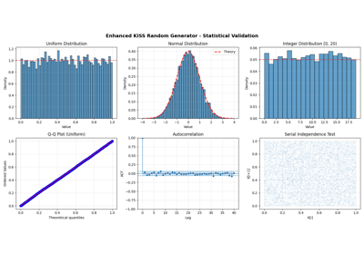

# default\_rng[#](#default-rng "Link to this heading")

scikitplot.random.default\_rng(**seed=None**, **bit\_width=None**)[#](#scikitplot.random.default_rng "Link to this definition")
:   Create default KISS random number generator.

    This is the recommended way to create an RNG, matching
    numpy.random.default\_rng() signature.

    Parameters:
    :   ****seed****{None, int, KissSeedSequence, KissBitGenerator, KissGenerator, KissRandomState}, optional
        :   Random seed or generator

    Returns:
    :   KissGenerator
        :   Initialized bit generator ready for use

        ****bit\_width****int, default=64
        :   Generator bit width

    Raises:
    :   ValueError
        :   If bit\_width not in {32, 64}

    > **See also**
    > [`Kiss32Random`](scikitplot.random.Kiss32Random.html#scikitplot.random.Kiss32Random "scikitplot.random.Kiss32Random")
    :   32-bit version for smaller datasets

    [`Kiss64Random`](scikitplot.random.Kiss64Random.html#scikitplot.random.Kiss64Random "scikitplot.random.Kiss64Random")
    :   64-bit version for larger datasets

    [`KissRandom`](scikitplot.random.KissRandom.html#scikitplot.random.KissRandom "scikitplot.random.KissRandom")
    :   Factory function for auto-detecting

    [`KissSeedSequence`](scikitplot.random.KissSeedSequence.html#scikitplot.random.KissSeedSequence "scikitplot.random.KissSeedSequence")
    :   Seed sequence for initialization

    [`KissBitGenerator`](scikitplot.random.KissBitGenerator.html#scikitplot.random.KissBitGenerator "scikitplot.random.KissBitGenerator")
    :   NumPy-compatible bit generator

    [`KissGenerator`](scikitplot.random.KissGenerator.html#scikitplot.random.KissGenerator "scikitplot.random.KissGenerator")
    :   High-level generator using this BitGenerator

    [`KissRandomState`](scikitplot.random.KissRandomState.html#scikitplot.random.KissRandomState "scikitplot.random.KissRandomState")
    :   Inherites from KissGenerator

    Notes

    This is the recommended entry point for most users.
    Compatible with numpy.random.default\_rng() interface.

    Examples

    ```
    >>> from scikitplot.random import default_rng
    >>>
    >>> rng = default_rng(42)
    >>> rng.random(5)
    >>> rng.integers(0, 100, 10)
    >>> rng.normal(0, 1, 1000)
    >>>
    >>> # Context manager
    >>> with default_rng(42) as rng:
    ...     data = rng.random(1000)
    >>>
    >>> # Serialization
    >>> import pickle
    >>> restored = pickle.loads(pickle.dumps(rng))

    ```

## Gallery examples[#](#gallery-examples "Link to this heading")



[Enhanced KISS Random Generator - Complete Usage Examples](../../auto_examples/random/plot_kiss_random.html)

Enhanced KISS Random Generator - Complete Usage Examples