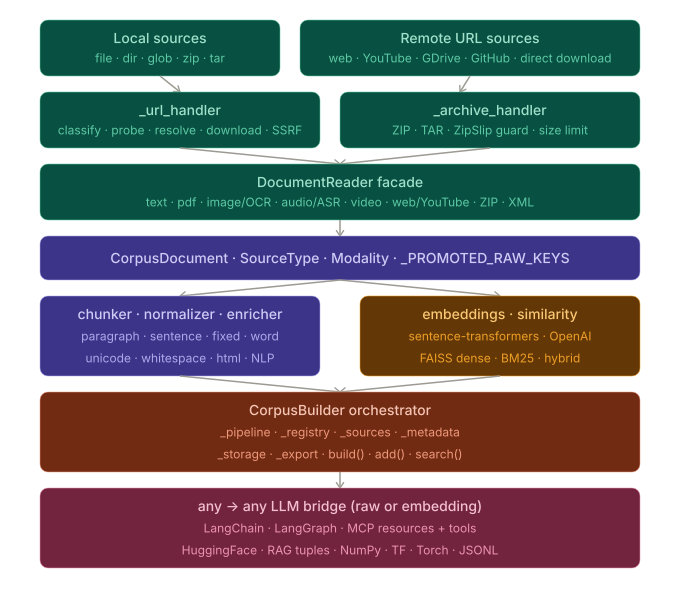

# Corpus Generation[#](#corpus-generation "Link to this heading")



## Quick start[#](#quick-start "Link to this heading")

Examples

```
# First we download the media preproccess libraries (text, image, audio or video).
# pip install nltk gensim langdetect faster-whisper openai-whisper pytesseract youtube-transcript-api
# sudo apt-get install tesseract-ocr
# pip install scikit-plots[corpus]
from scikitplot import corpus

print(corpus.__doc__)

```

Examples

* [corpus WHO European Region local or url per file with examples](../../auto_examples/corpus/plot_corpus_who_per_file_script.html#sphx-glr-auto-examples-corpus-plot-corpus-who-per-file-script-py): Example notebook.