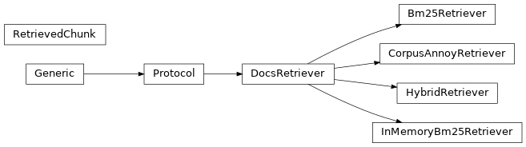

# scikitplot.mcp[#](#module-scikitplot.mcp "Link to this heading")

Composable documentation retrieval for Model Context Protocol servers.

The default import surface remains independent of the MCP SDK and optional
corpus/vector dependencies. Call `create_server` only when the stable `mcp>=2,<3`
server dependency is installed. No models, indexes, files, or network connections are
opened at import time.

****User guide.**** See the [Model Context Protocol (MCP)](../user_guide/mcp/index.html#mcp-index) section for further details.

## MCP: Model Context Protocol[#](#mcp-model-context-protocol "Link to this heading")

****User guide.**** See the [Model Context Protocol (MCP)](../user_guide/mcp/index.html#mcp-index) section for further details.

Class inheritance

|  |  |
| --- | --- |
| `DocsRetriever` | Structural contract every retrieval backend must satisfy. |
| `RetrievedChunk` | One retrieved passage with the metadata needed to cite it. |
| `InMemoryBm25Retriever` | A compact BM25 implementation suitable for demos and small corpora. |
| `Bm25Retriever` | Lexical retriever (FTS/BM25) leg backed by a full-text search seam. |
| `CorpusAnnoyRetriever` | Docs dense retriever backed by an embedder + a vector index + a document lookup. |
| `HybridRetriever` | Fuse several retrievers into one via Reciprocal Rank Fusion. |
| `build_search_docs_result` | Format retrieval results as an MCP `tools/call` response with citations. |
| `builtin_demo_retriever` | Return a tiny corpus that explains the sample's own mechanism. |
| `create_server` | Lazily import and create the MCP SDK v2 server. |
| `reciprocal_rank_fusion` | Fuse weighted ranked lists into a single `key -> score` map. |