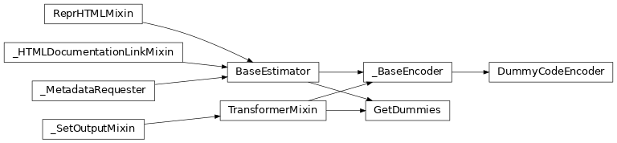

# scikitplot.preprocessing[#](#module-scikitplot.preprocessing "Link to this heading")

Methods for scaling, centering, normalization, binarization, and more.

****User guide.**** See the [Preprocessing](../user_guide/preprocessing/index.html#preprocessing-index) section for further details.

## Extended sklearn feature preprocessing.[#](#extended-sklearn-feature-preprocessing "Link to this heading")

Class inheritance

|  |  |
| --- | --- |
| [`DummyCodeEncoder`](../modules/generated/scikitplot.preprocessing.DummyCodeEncoder.html#scikitplot.preprocessing.DummyCodeEncoder "scikitplot.preprocessing.DummyCodeEncoder") | Encode categorical features into dummy/indicator 0/1 variables. |
| [`GetDummies`](../modules/generated/scikitplot.preprocessing.GetDummies.html#scikitplot.preprocessing.GetDummies "scikitplot.preprocessing.GetDummies") | Multi-column multi-label string column one-hot encoder [[Rbcee2ffc57f9-1]](../modules/generated/scikitplot.preprocessing.GetDummies.html#rbcee2ffc57f9-1). |