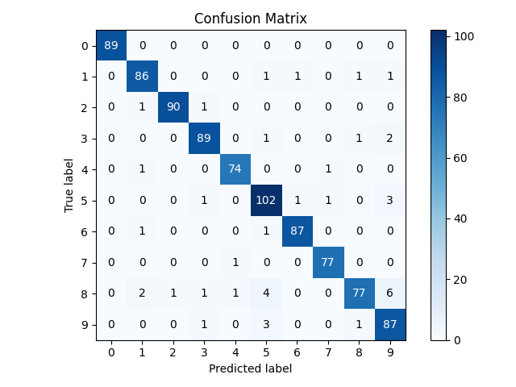

> **Note**
> [Go to the end](#sphx-glr-download-auto-examples-classification-plot-confusion-matrix-script-py)
to download the full example code or to run this example in your browser via JupyterLite or Binder.

# plot\_confusion\_matrix with examples[#](#plot-confusion-matrix-with-examples "Link to this heading")

An example showing the [`plot_confusion_matrix`](../../modules/generated/scikitplot.api.metrics.plot_confusion_matrix.html#scikitplot.api.metrics.plot_confusion_matrix "scikitplot.api.metrics.plot_confusion_matrix") function
used by a scikit-learn classifier.

```
# Authors: The scikit-plots developers
# SPDX-License-Identifier: BSD-3-Clause

```

## Import scikit-plots[#](#import-scikit-plots "Link to this heading")

```
from sklearn.datasets import (
    load_digits as data_10_classes,
)
from sklearn.linear_model import LogisticRegression
from sklearn.model_selection import train_test_split

import numpy as np

np.random.seed(0)  # reproducibility
# importing pylab or pyplot
import matplotlib.pyplot as plt

# Import scikit-plot
import scikitplot as sp

```

## Loading the dataset[#](#loading-the-dataset "Link to this heading")

```
# Load the data
X, y = data_10_classes(return_X_y=True, as_frame=False)
X_train, X_val, y_train, y_val = train_test_split(X, y, test_size=0.5, random_state=0)

```

## Model Training[#](#model-training "Link to this heading")

```
# Create an instance of the LogisticRegression
model = LogisticRegression(max_iter=int(1e5), random_state=0).fit(X_train, y_train)

# Perform predictions
y_val_pred = model.predict(X_val)

```

## Plot

```
# Plot!
ax = sp.metrics.plot_confusion_matrix(
    y_val,
    y_val_pred,
    normalize=False,
    save_fig=True,
    save_fig_filename="",
    # overwrite=True,
    add_timestamp=True,
    # verbose=True,
)

```


Tags: [model-type: classification](../../_tags/model-type-classification.html) [model-workflow: model evaluation](../../_tags/model-workflow-model-evaluation.html) [plot-type: heatmap](../../_tags/plot-type-heatmap.html) [plot-type: eval](../../_tags/plot-type-eval.html) [level: beginner](../../_tags/level-beginner.html) [purpose: showcase](../../_tags/purpose-showcase.html)

****Total running time of the script:**** (0 minutes 0.906 seconds)

[](https://mybinder.org/v2/gh/scikit-plots/scikit-plots/main?urlpath=lab/tree/notebooks/auto_examples/classification/plot_confusion_matrix_script.ipynb)[](../../lite/lab/index.html?path=auto_examples/classification/plot_confusion_matrix_script.ipynb)

[`Download Jupyter notebook: plot_confusion_matrix_script.ipynb`](../../_downloads/ddf76ad7cb19c9ab988ea9e57962d320/plot_confusion_matrix_script.ipynb)

[`Download Python source code: plot_confusion_matrix_script.py`](../../_downloads/4bf985cab2376d049790e05975c49b1c/plot_confusion_matrix_script.py)

[`Download zipped: plot_confusion_matrix_script.zip`](../../_downloads/e24f3b6e3619965ce108a489fa587851/plot_confusion_matrix_script.zip)

Related examples


[plot\_precision\_recall with examples](plot_precision_recall_script.html)

plot\_precision\_recall with examples

[plot\_roc\_curve with examples](plot_roc_script.html)

plot\_roc\_curve with examples

[plot\_residuals\_distribution with examples](../stats/plot_residuals_distribution_script.html)

plot\_residuals\_distribution with examples

[plot\_residuals\_distribution with examples](../regression/plot_residuals_distribution_script.html)

plot\_residuals\_distribution with examples

[Gallery generated by Sphinx-Gallery](https://sphinx-gallery.github.io)