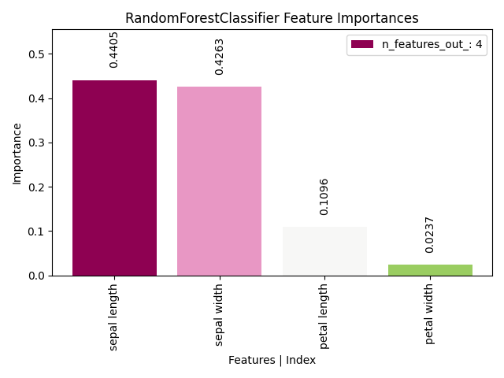

> **Note**
> [Go to the end](#sphx-glr-download-auto-examples-classification-plot-feature-importances-script-py)
to download the full example code or to run this example in your browser via JupyterLite or Binder.

# plot\_feature\_importances with examples[#](#plot-feature-importances-with-examples "Link to this heading")

An example showing the [`plot_feature_importances`](../../modules/generated/scikitplot.api.estimators.plot_feature_importances.html#scikitplot.api.estimators.plot_feature_importances "scikitplot.api.estimators.plot_feature_importances") function
used by a scikit-learn classifier.

```
# Authors: The scikit-plots developers
# SPDX-License-Identifier: BSD-3-Clause

```

## Import scikit-plots[#](#import-scikit-plots "Link to this heading")

```
from sklearn.datasets import (
    load_iris as data_3_classes,
)
from sklearn.ensemble import RandomForestClassifier
from sklearn.model_selection import train_test_split

import numpy as np

np.random.seed(0)  # reproducibility
# importing pylab or pyplot
import matplotlib.pyplot as plt

# Import scikit-plot
import scikitplot as sp

```

## Loading the dataset[#](#loading-the-dataset "Link to this heading")

```
# Load the data
X, y = data_3_classes(return_X_y=True, as_frame=False)
X_train, X_val, y_train, y_val = train_test_split(X, y, test_size=0.5, random_state=0)

```

## Model Training[#](#model-training "Link to this heading")

```
# Create an instance of the LogisticRegression
model = RandomForestClassifier(random_state=0).fit(X_train, y_train)

```

## Plot

```
# Plot!
ax, features = sp.estimators.plot_feature_importances(
    model,
    feature_names=["petal length", "petal width", "sepal length", "sepal width"],
    save_fig=True,
    save_fig_filename="",
    # overwrite=True,
    add_timestamp=True,
    # verbose=True,
)

```

> **References**
> The use of the following functions, methods, classes and modules is shown
in this example:

* <https://scikit-learn.org/stable/auto_examples/ensemble/plot_forest_importances.html>

Tags: [model-type: classification](../../_tags/model-type-classification.html) [model-workflow: model evaluation](../../_tags/model-workflow-model-evaluation.html) [plot-type: bar](../../_tags/plot-type-bar.html) [plot-type: eval](../../_tags/plot-type-eval.html) [level: beginner](../../_tags/level-beginner.html) [purpose: showcase](../../_tags/purpose-showcase.html)

****Total running time of the script:**** (0 minutes 0.500 seconds)

[](https://mybinder.org/v2/gh/scikit-plots/scikit-plots/main?urlpath=lab/tree/notebooks/auto_examples/classification/plot_feature_importances_script.ipynb)[](../../lite/lab/index.html?path=auto_examples/classification/plot_feature_importances_script.ipynb)

[`Download Jupyter notebook: plot_feature_importances_script.ipynb`](../../_downloads/b56b45f81a91a842c2fccce74a0ffaf6/plot_feature_importances_script.ipynb)

[`Download Python source code: plot_feature_importances_script.py`](../../_downloads/c76065fab30e0a14f76b7dc00191519b/plot_feature_importances_script.py)

[`Download zipped: plot_feature_importances_script.zip`](../../_downloads/a95d7143f8c619ed005b5a91e15b7140/plot_feature_importances_script.zip)

Related examples


[plot\_silhouette with examples](../clustering/plot_silhouette_script.html)

plot\_silhouette with examples

[plot\_residuals\_distribution with examples](../stats/plot_residuals_distribution_script.html)

plot\_residuals\_distribution with examples

[plot\_elbow with examples](../clustering/plot_elbow_script.html)

plot\_elbow with examples

[plot\_residuals\_distribution with examples](../regression/plot_residuals_distribution_script.html)

plot\_residuals\_distribution with examples

[Gallery generated by Sphinx-Gallery](https://sphinx-gallery.github.io)