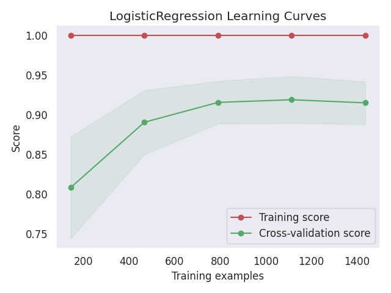

> **Note**
> [Go to the end](#sphx-glr-download-auto-examples-classification-plot-learning-curve-script-py)
to download the full example code or to run this example in your browser via JupyterLite or Binder.

# plot\_learning\_curve with examples[#](#plot-learning-curve-with-examples "Link to this heading")

An example showing the [`plot_learning_curve`](../../modules/generated/scikitplot.api.estimators.plot_learning_curve.html#scikitplot.api.estimators.plot_learning_curve "scikitplot.api.estimators.plot_learning_curve") function
used by a scikit-learn classifier.

```
# Authors: The scikit-plots developers
# SPDX-License-Identifier: BSD-3-Clause

```

## Import scikit-plots[#](#import-scikit-plots "Link to this heading")

```
from sklearn.datasets import (
    load_digits as data_10_classes,
)
from sklearn.linear_model import LogisticRegression

import numpy as np

np.random.seed(0)  # reproducibility
# importing pylab or pyplot
import matplotlib.pyplot as plt

# Import scikit-plot
import scikitplot as sp

```

## Loading the dataset[#](#loading-the-dataset "Link to this heading")

```
# Load the data
X, y = data_10_classes(return_X_y=True, as_frame=False)

```

## Model Training[#](#model-training "Link to this heading")

```
# Create an instance of the LogisticRegression
model = LogisticRegression(max_iter=int(1e5), random_state=0)

```

## Plot

```
# Plot!
ax = sp.estimators.plot_learning_curve(
    model,
    X,
    y,
    save_fig=True,
    save_fig_filename="",
    # overwrite=True,
    add_timestamp=True,
    # verbose=True,
)

```


Tags: [model-type: classification](../../_tags/model-type-classification.html) [model-workflow: model evaluation](../../_tags/model-workflow-model-evaluation.html) [plot-type: line](../../_tags/plot-type-line.html) [plot-type: auc](../../_tags/plot-type-auc.html) [level: beginner](../../_tags/level-beginner.html) [purpose: showcase](../../_tags/purpose-showcase.html)

****Total running time of the script:**** (0 minutes 1.440 seconds)

[](https://mybinder.org/v2/gh/scikit-plots/scikit-plots/main?urlpath=lab/tree/notebooks/auto_examples/classification/plot_learning_curve_script.ipynb)[](../../lite/lab/index.html?path=auto_examples/classification/plot_learning_curve_script.ipynb)

[`Download Jupyter notebook: plot_learning_curve_script.ipynb`](../../_downloads/f223d93eafa558cbb2985afc3e45148f/plot_learning_curve_script.ipynb)

[`Download Python source code: plot_learning_curve_script.py`](../../_downloads/c87727e7a99dc08c767a7aec044949e1/plot_learning_curve_script.py)

[`Download zipped: plot_learning_curve_script.zip`](../../_downloads/9420d9d3a53dfc3ebc670050d1daa112/plot_learning_curve_script.zip)

Related examples


[plot\_precision\_recall with examples](plot_precision_recall_script.html)

plot\_precision\_recall with examples

[plot\_roc\_curve with examples](plot_roc_script.html)

plot\_roc\_curve with examples

[plot\_confusion\_matrix with examples](plot_confusion_matrix_script.html)

plot\_confusion\_matrix with examples

[plot\_cumulative\_gain with examples](../decile/plot_cumulative_gain_script.html)

plot\_cumulative\_gain with examples

[Gallery generated by Sphinx-Gallery](https://sphinx-gallery.github.io)