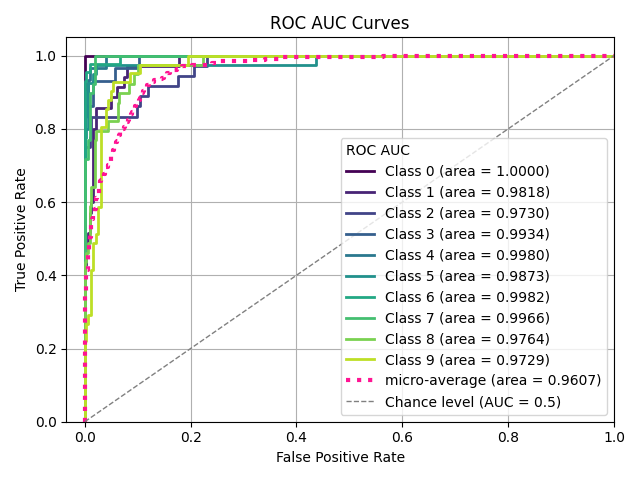

> **Note**
> [Go to the end](#sphx-glr-download-auto-examples-classification-plot-roc-script-py)
to download the full example code or to run this example in your browser via JupyterLite or Binder.

# plot\_roc\_curve with examples[#](#plot-roc-curve-with-examples "Link to this heading")

An example showing the [`plot_roc_curve`](../../modules/generated/scikitplot.api.metrics.plot_roc_curve.html#scikitplot.api.metrics.plot_roc_curve "scikitplot.api.metrics.plot_roc_curve") function
used by a scikit-learn classifier.

```
# Authors: The scikit-plots developers
# SPDX-License-Identifier: BSD-3-Clause

```

## Import scikit-plots[#](#import-scikit-plots "Link to this heading")

```
from sklearn.datasets import (
    load_digits as data_10_classes,
)
from sklearn.linear_model import LogisticRegression
from sklearn.model_selection import train_test_split

import numpy as np

np.random.seed(0)  # reproducibility
# importing pylab or pyplot
import matplotlib.pyplot as plt

# Import scikit-plot
import scikitplot as sp

```

## Loading the dataset[#](#loading-the-dataset "Link to this heading")

```
# Load the data
X, y = data_10_classes(return_X_y=True, as_frame=False)
X_train, X_val, y_train, y_val = train_test_split(X, y, test_size=0.2, random_state=0)

```

## Model Training[#](#model-training "Link to this heading")

```
# Create an instance of the LogisticRegression
model = LogisticRegression(max_iter=1, random_state=0).fit(X_train, y_train)

# Perform predictions
y_val_prob = model.predict_proba(X_val)

```
```
/home/circleci/.pyenv/versions/3.12.13/lib/python3.12/site-packages/sklearn/linear_model/_logistic.py:599: ConvergenceWarning: lbfgs failed to converge after 1 iteration(s) (status=1):
STOP: TOTAL NO. OF ITERATIONS REACHED LIMIT

Increase the number of iterations to improve the convergence (max_iter=1).
You might also want to scale the data as shown in:
    https://scikit-learn.org/stable/modules/preprocessing.html
Please also refer to the documentation for alternative solver options:
    https://scikit-learn.org/stable/modules/linear_model.html#logistic-regression
  n_iter_i = _check_optimize_result(

```

## Plot

```
# Plot!
ax = sp.metrics.plot_roc(
    y_val,
    y_val_prob,
    save_fig=True,
    save_fig_filename="",
    # overwrite=True,
    add_timestamp=True,
    # verbose=True,
)

```


Tags: [model-type: classification](../../_tags/model-type-classification.html) [model-workflow: model evaluation](../../_tags/model-workflow-model-evaluation.html) [plot-type: line](../../_tags/plot-type-line.html) [plot-type: auc](../../_tags/plot-type-auc.html) [level: beginner](../../_tags/level-beginner.html) [purpose: showcase](../../_tags/purpose-showcase.html)

****Total running time of the script:**** (0 minutes 0.648 seconds)

[](https://mybinder.org/v2/gh/scikit-plots/scikit-plots/main?urlpath=lab/tree/notebooks/auto_examples/classification/plot_roc_script.ipynb)[](../../lite/lab/index.html?path=auto_examples/classification/plot_roc_script.ipynb)

[`Download Jupyter notebook: plot_roc_script.ipynb`](../../_downloads/2a5bc33e023de7959b1d55b89307fc56/plot_roc_script.ipynb)

[`Download Python source code: plot_roc_script.py`](../../_downloads/8d038ca0212e1e1d19af60cdc62b0111/plot_roc_script.py)

[`Download zipped: plot_roc_script.zip`](../../_downloads/61201c7bc1dc2c9436a70745199c222a/plot_roc_script.zip)

Related examples


[plot\_roc\_curve with examples](#)

plot\_roc\_curve with examples

[plot\_confusion\_matrix with examples](plot_confusion_matrix_script.html)

plot\_confusion\_matrix with examples

[plot\_report with examples](../decile/plot_report_script.html)

plot\_report with examples

[plot\_cumulative\_gain with examples](../decile/plot_cumulative_gain_script.html)

plot\_cumulative\_gain with examples

[Gallery generated by Sphinx-Gallery](https://sphinx-gallery.github.io)