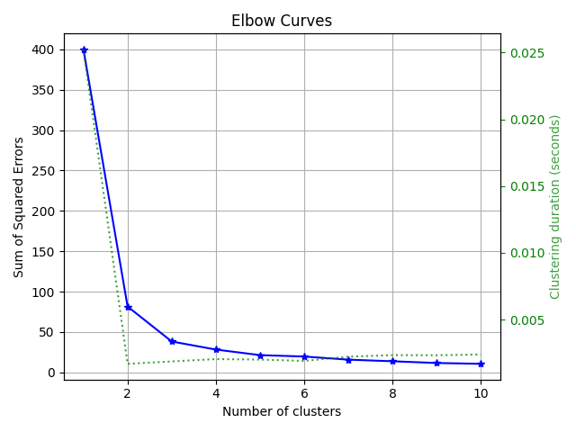
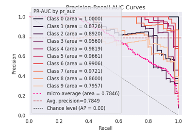

> **Note**
> [Go to the end](#sphx-glr-download-auto-examples-clustering-plot-elbow-script-py)
to download the full example code or to run this example in your browser via JupyterLite or Binder.

# plot\_elbow with examples[#](#plot-elbow-with-examples "Link to this heading")

An example showing the [`plot_elbow`](../../modules/generated/scikitplot.api.estimators.plot_elbow.html#scikitplot.api.estimators.plot_elbow "scikitplot.api.estimators.plot_elbow") function
used by a scikit-learn clusterer.

```
# Authors: The scikit-plots developers
# SPDX-License-Identifier: BSD-3-Clause

```

## Load the dataset[#](#load-the-dataset "Link to this heading")

We will start by loading the `iris` dataset.

```
from sklearn.cluster import KMeans
from sklearn.datasets import (
    load_iris as data_3_classes,
)
from sklearn.model_selection import train_test_split

import numpy as np

np.random.seed(0)  # reproducibility
# importing pylab or pyplot
import matplotlib.pyplot as plt

# Import scikit-plot
import scikitplot as sp

```

## Loading the dataset[#](#loading-the-dataset "Link to this heading")

```
# Load the data
X, y = data_3_classes(return_X_y=True, as_frame=False)
X_train, X_val, y_train, y_val = train_test_split(X, y, test_size=0.5, random_state=0)

```

## Model Training[#](#model-training "Link to this heading")

Create an instance of the LogisticRegression

```
model = KMeans(n_clusters=4, random_state=1)

```

## Visualize the results[#](#visualize-the-results "Link to this heading")

Plot!

```
ax = sp.estimators.plot_elbow(
    model,
    X_train,
    cluster_ranges=range(1, 11),
    save_fig=True,
    save_fig_filename="",
    # overwrite=True,
    add_timestamp=True,
    # verbose=True,
)

```


Tags: [model-type: clustering](../../_tags/model-type-clustering.html) [model-workflow: model evaluation](../../_tags/model-workflow-model-evaluation.html) [plot-type: line](../../_tags/plot-type-line.html) [plot-type: WSS (within-cluster sum of squares)](../../_tags/plot-type-wss-within-cluster-sum-of-squares.html) [plot-type: Inertia (sum of squared distances)](../../_tags/plot-type-inertia-sum-of-squared-distances.html) [level: beginner](../../_tags/level-beginner.html) [purpose: showcase](../../_tags/purpose-showcase.html)

****Total running time of the script:**** (0 minutes 0.455 seconds)

[](https://mybinder.org/v2/gh/scikit-plots/scikit-plots/main?urlpath=lab/tree/notebooks/auto_examples/clustering/plot_elbow_script.ipynb)[](../../lite/lab/index.html?path=auto_examples/clustering/plot_elbow_script.ipynb)

[`Download Jupyter notebook: plot_elbow_script.ipynb`](../../_downloads/430594b98221a07a5c3c347b0d3b7a81/plot_elbow_script.ipynb)

[`Download Python source code: plot_elbow_script.py`](../../_downloads/100a7bd970ef74b09ad0391728df2800/plot_elbow_script.py)

[`Download zipped: plot_elbow_script.zip`](../../_downloads/6381054f2ec8424dfb6061042bf96a3d/plot_elbow_script.zip)

Related examples


[plot\_silhouette with examples](plot_silhouette_script.html)

plot\_silhouette with examples

[plot\_feature\_importances with examples](../classification/plot_feature_importances_script.html)

plot\_feature\_importances with examples

[plot\_precision\_recall with examples](../classification/plot_precision_recall_script.html)

plot\_precision\_recall with examples

[plot\_roc\_curve with examples](../classification/plot_roc_script.html)

plot\_roc\_curve with examples

[Gallery generated by Sphinx-Gallery](https://sphinx-gallery.github.io)