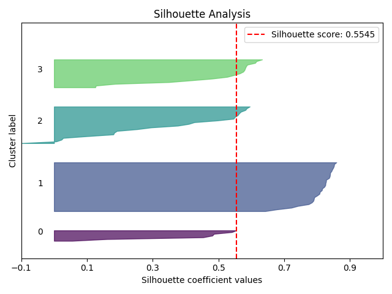

> **Note**
> [Go to the end](#sphx-glr-download-auto-examples-clustering-plot-silhouette-script-py)
to download the full example code or to run this example in your browser via JupyterLite or Binder.

# plot\_silhouette with examples[#](#plot-silhouette-with-examples "Link to this heading")

An example showing the [`plot_silhouette`](../../modules/generated/scikitplot.api.metrics.plot_silhouette.html#scikitplot.api.metrics.plot_silhouette "scikitplot.api.metrics.plot_silhouette") function
used by a scikit-learn clusterer.

```
# Authors: The scikit-plots developers
# SPDX-License-Identifier: BSD-3-Clause

```

## Import scikit-plots[#](#import-scikit-plots "Link to this heading")

```
from sklearn.cluster import KMeans
from sklearn.datasets import (
    load_iris as data_3_classes,
)
from sklearn.model_selection import train_test_split

import numpy as np

np.random.seed(0)  # reproducibility
# importing pylab or pyplot
import matplotlib.pyplot as plt

# Import scikit-plot
import scikitplot as sp

```

## Loading the dataset[#](#loading-the-dataset "Link to this heading")

```
# Load the data
X, y = data_3_classes(return_X_y=True, as_frame=False)
X_train, X_val, y_train, y_val = train_test_split(X, y, test_size=0.5, random_state=0)

```

## Model Training[#](#model-training "Link to this heading")

```
# Create an instance of the LogisticRegression
model = KMeans(n_clusters=4, random_state=0)

cluster_labels = model.fit_predict(X_train)

```

## Plot

```
# Plot!
ax = sp.metrics.plot_silhouette(
    X_train,
    cluster_labels,
    save_fig=True,
    save_fig_filename="",
    # overwrite=True,
    add_timestamp=True,
    # verbose=True,
)

```


Tags: [model-type: clustering](../../_tags/model-type-clustering.html) [model-workflow: model evaluation](../../_tags/model-workflow-model-evaluation.html) [plot-type: bar](../../_tags/plot-type-bar.html) [plot-type: silhouette](../../_tags/plot-type-silhouette.html) [level: beginner](../../_tags/level-beginner.html) [purpose: showcase](../../_tags/purpose-showcase.html)

****Total running time of the script:**** (0 minutes 0.289 seconds)

[](https://mybinder.org/v2/gh/scikit-plots/scikit-plots/main?urlpath=lab/tree/notebooks/auto_examples/clustering/plot_silhouette_script.ipynb)[](../../lite/lab/index.html?path=auto_examples/clustering/plot_silhouette_script.ipynb)

[`Download Jupyter notebook: plot_silhouette_script.ipynb`](../../_downloads/37185a77d80f5f2328b58133b16770a7/plot_silhouette_script.ipynb)

[`Download Python source code: plot_silhouette_script.py`](../../_downloads/834df634ffa91eef2ca76a78f4f4a516/plot_silhouette_script.py)

[`Download zipped: plot_silhouette_script.zip`](../../_downloads/4179b53cf53ff8a8bcdee839d9328740/plot_silhouette_script.zip)

Related examples


[plot\_elbow with examples](plot_elbow_script.html)

plot\_elbow with examples

[plot\_feature\_importances with examples](../classification/plot_feature_importances_script.html)

plot\_feature\_importances with examples

[plot\_precision\_recall with examples](../classification/plot_precision_recall_script.html)

plot\_precision\_recall with examples

[plot\_roc\_curve with examples](../classification/plot_roc_script.html)

plot\_roc\_curve with examples

[Gallery generated by Sphinx-Gallery](https://sphinx-gallery.github.io)