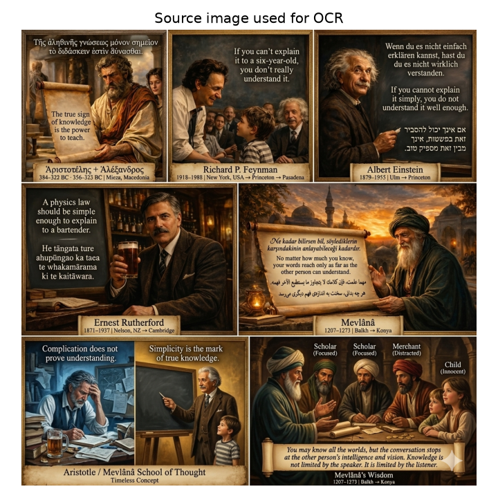

> **Note**
> [Go to the end](#sphx-glr-download-auto-examples-corpus-plot-corpus-knowledge-script-py)
to download the full example code or to run this example in your browser via JupyterLite or Binder.

# Compare Corpus Chunking Strategies on OCR Text[#](#compare-corpus-chunking-strategies-on-ocr-text "Link to this heading")

This example asks one focused question:

****How do different chunking strategies divide the same OCR-extracted text?****

The source image contains multilingual text. OCR is performed once and the
same extracted text is then passed to every chunker, so the comparison is not
confounded by repeated OCR runs or CSV export behavior.

The executed comparison uses portable Corpus backends:

* [`WordChunker`](../../modules/generated/scikitplot.corpus.WordChunker.html#scikitplot.corpus.WordChunker "scikitplot.corpus.WordChunker") by document,
* [`WordChunker`](../../modules/generated/scikitplot.corpus.WordChunker.html#scikitplot.corpus.WordChunker "scikitplot.corpus.WordChunker") by sentence,
* [`SentenceChunker`](../../modules/generated/scikitplot.corpus.SentenceChunker.html#scikitplot.corpus.SentenceChunker "scikitplot.corpus.SentenceChunker") with the REGEX backend,
* [`FixedWindowChunker`](../../modules/generated/scikitplot.corpus.FixedWindowChunker.html#scikitplot.corpus.FixedWindowChunker "scikitplot.corpus.FixedWindowChunker") by characters,
* [`FixedWindowChunker`](../../modules/generated/scikitplot.corpus.FixedWindowChunker.html#scikitplot.corpus.FixedWindowChunker "scikitplot.corpus.FixedWindowChunker") by tokens,
* `SemanticChunker` with the MORPHOLOGICAL backend.

Two NLTK-enhanced variants are shown separately and run only when NLTK and the
required local NLTK data resources are already installed. No example in this
file downloads optional data automatically.

If OCR capability is unavailable, the OCR-dependent comparison is reported as
`SKIP` and the source image is still displayed. A missing optional
dependency is not treated as a Corpus defect.

## What to look for[#](#what-to-look-for "Link to this heading")

The summary near the end compares:

* number of chunks,
* average/minimum/maximum chunk size,
* a bounded sample,
* the intended use case of each strategy.

This makes the example a decision guide rather than a sequence of unrelated
configuration snippets.

```
# Authors: The scikit-plots developers
# SPDX-License-Identifier: BSD-3-Clause

```
```
from __future__ import annotations

import os
import importlib.util
import shutil
from pathlib import Path
from statistics import mean

import matplotlib.image as mpimg
import matplotlib.pyplot as plt

from scikitplot.corpus import (
    DocumentReader,
    FixedWindowChunker,
    FixedWindowChunkerConfig,
    LemmatizationBackend,
    MultilangConfig,
    SemanticBackend,
    SemanticChunker,
    SemanticChunkerConfig,
    SentenceBackend,
    SentenceChunker,
    SentenceChunkerConfig,
    StemmingBackend,
    StopwordSource,
    TokenizerBackend,
    WindowUnit,
    WordChunker,
    WordChunkerConfig,
)

# os.environ["SCIKITPLOT_GALLERY_RUN_ASR"] = "1"
# os.environ["SCIKITPLOT_CORPUS_ALLOW_DOWNLOADS"] = "1"
_RUN_ASR = os.environ.get("SCIKITPLOT_GALLERY_RUN_ASR", "1").strip().lower() in {
    "1",
    "true",
    "yes",
    "on",
}
_SCIKITPLOT_CORPUS_ALLOW_DOWNLOADS = os.getenv("SCIKITPLOT_CORPUS_ALLOW_DOWNLOADS", "1").strip().lower() in {
    "1",
    "true",
    "yes",
    "on",
}

```

## Resolve the gallery asset[#](#resolve-the-gallery-asset "Link to this heading")

Sphinx-Gallery may execute examples in a generated context where `__file__`
is not available. The fallback keeps the script usable from notebooks and
direct Python sessions without changing the caller’s working directory.

```
def _resolve_example_dir() -> Path:
    """Resolve the example directory across script and gallery runtimes."""
    file = globals().get("__file__")
    if file:
        return Path(file).resolve().parent
    return Path.cwd().resolve()


_EXAMPLE_DIR = _resolve_example_dir()
_DATA_DIR = _EXAMPLE_DIR / "data"
_IMAGE_PATH = _DATA_DIR / "echo_of_the_wise" / "AI_Generated_Image_1ix.png"

```

## Optional-capability preflight[#](#optional-capability-preflight "Link to this heading")

Optional functionality is checked **before** executing that scenario.

The rule used by this gallery is:

`missing optional package/resource/native capability → SKIP`

Unexpected failures after a successful preflight are allowed to propagate,
because they may indicate a real API, environment, or implementation defect.

```
def _probe_tesseract() -> tuple[bool, str]:
    """Return whether the default ImageReader OCR path can be attempted."""
    if not _IMAGE_PATH.exists():
        return False, f"gallery asset is missing: {_IMAGE_PATH}"
    if importlib.util.find_spec("PIL") is None:
        return False, "Pillow is not installed"
    if importlib.util.find_spec("pytesseract") is None:
        return False, "pytesseract is not installed"
    if shutil.which("tesseract") is None:
        return False, "the Tesseract executable is not available on PATH"
    return True, "pytesseract + Tesseract available"


def _probe_nltk(*resource_paths: str) -> tuple[bool, str]:
    """Check NLTK and local data resources without downloading anything."""
    if importlib.util.find_spec("nltk") is None:
        return False, "NLTK is not installed"

    try:
        import nltk
    except ImportError:
        return False, "NLTK could not be imported"

    missing: list[str] = []
    for resource_path in resource_paths:
        try:
            nltk.data.find(resource_path)
        except LookupError:
            missing.append(resource_path)

    if missing and not _SCIKITPLOT_CORPUS_ALLOW_DOWNLOADS:
        return False, "missing local NLTK resources: " + ", ".join(missing)
    return True, "NLTK resources available"

```

## Extract OCR text once[#](#extract-ocr-text-once "Link to this heading")

OCR belongs to the reader layer; chunking happens **after** text exists.
Performing OCR once makes every strategy below consume exactly the same
source text and avoids repeating an expensive optional operation.

```
ocr_ready, ocr_reason = _probe_tesseract()

ocr_documents = ()
ocr_text: str | None = None

if not ocr_ready:
    print(f"[SKIP] OCR extraction: {ocr_reason}")
    print("[SKIP] Chunking comparison requires OCR text and is not executed.")
else:
    reader = DocumentReader.create(_IMAGE_PATH)
    ocr_documents = tuple(reader.get_documents())

    if not ocr_documents:
        print("[SKIP] OCR produced no CorpusDocument evidence.")
    else:
        ocr_text = "\n\n".join(
            doc.text for doc in ocr_documents if doc.text.strip()
        )

        if not ocr_text.strip():
            ocr_text = None
            print("[SKIP] OCR produced documents but no usable text.")
        else:
            confidences = [
                doc.confidence
                for doc in ocr_documents
                if doc.confidence is not None
            ]

            print(f"OCR documents: {len(ocr_documents)}")
            print(f"OCR characters: {len(ocr_text):,}")
            if confidences:
                print(f"Mean OCR confidence: {mean(confidences):.3f}")
            print("OCR preview:")
            print(ocr_text[:500])

```
```
OCR documents: 1
OCR characters: 1,300
Mean OCR confidence: 0.637
OCR preview:


ire uursacesced Caraga io
10 Bi6doKew 8 Erna monet) 1b / aoe Maa ETT
RCO RSP eo ere

Memmnminsane(s)
erklaren kannst, hast du
Creerona eats


Brome ccrlhy | |
 Petesercne | verstanden.
>
If you cannot explain
» Sas ONAN Co oiag
understand it well enough.

ge VIDA ND TRON

Sa eas
aE Nia)


‘ApiotoréAnc + AASEavSp0¢ , Richard P. Feynman j Albert Einstein

384-322 BC - 356-323 BC | Mieza, Macedonia 1918-1988 | New York, USA — Princeton — Pasadena 99-

```

## Compare chunkers on one shared text[#](#compare-chunkers-on-one-shared-text "Link to this heading")

Results are kept in memory. Export is deliberately not part of the primary
path because this example is about chunk boundaries, not CSV serialization.

```
comparison_rows: list[dict[str, object]] = []


def _record_skip(label: str, use_case: str, reason: str) -> None:
    """Record one optional strategy that could not run."""
    print(f"\n[SKIP] {label}: {reason}")
    comparison_rows.append(
        {
            "strategy": label,
            "status": "SKIP",
            "chunks": None,
            "avg_chars": None,
            "min_chars": None,
            "max_chars": None,
            "use_case": use_case,
            "sample": "",
        }
    )


def _run_strategy(
    label: str,
    chunker: object,
    *,
    use_case: str,
) -> object | None:
    """Run one chunker against the shared OCR text and record a compact summary."""
    if ocr_text is None:
        _record_skip(label, use_case, "OCR text is unavailable")
        return None

    result = chunker.chunk(
        ocr_text,
        doc_id=ocr_documents[0].doc_id if ocr_documents else None,
    )

    chunks = tuple(result.chunks)
    lengths = [len(chunk.text) for chunk in chunks]

    comparison_rows.append(
        {
            "strategy": label,
            "status": "OK",
            "chunks": len(chunks),
            "avg_chars": round(mean(lengths), 1) if lengths else 0.0,
            "min_chars": min(lengths) if lengths else 0,
            "max_chars": max(lengths) if lengths else 0,
            "use_case": use_case,
            "sample": chunks[0].text[:140].replace("\n", " ") if chunks else "",
        }
    )

    print(f"\n{label}")
    print("-" * len(label))
    print(f"chunks: {len(chunks)}")
    if lengths:
        print(
            "chars/chunk: "
            f"avg={mean(lengths):.1f}, min={min(lengths)}, max={max(lengths)}"
        )
    if chunks:
        print(f"sample: {chunks[0].text[:240]!r}")

    return result

```

## 1. Word chunker — one document-level lexical chunk[#](#word-chunker-one-document-level-lexical-chunk "Link to this heading")

This portable configuration uses the built-in SIMPLE tokenizer and disables
optional stemming/lemmatization resources. It is useful when the entire
document should share one lexical feature space.

```
result_word_doc = _run_strategy(
    "Word / document",
    WordChunker(
        WordChunkerConfig(
            chunk_by="document",
            tokenizer=TokenizerBackend.SIMPLE,
            stemmer=StemmingBackend.NONE,
            lemmatizer=LemmatizationBackend.NONE,
            stopwords=StopwordSource.NONE,
            lowercase=True,
            remove_punctuation=False,
            min_token_length=2,
            ngram_range=(1, 1),
        )
    ),
    use_case="whole-document lexical preprocessing",
)

```
```
Word / document
---------------
chunks: 1
chars/chunk: avg=1039.0, min=1039, max=1039
sample: 'ire uursacesced caraga io 10 bi6dokew erna monet 1b aoe maa ett rco rsp eo ere memmnminsanes erklaren kannst hast du creerona eats brome ccrlhy petesercne verstanden if you cannot explain sas onan co oiag understand it well enough ge vida n'

```

## 2. Word chunker — sentence-sized lexical chunks[#](#word-chunker-sentence-sized-lexical-chunks "Link to this heading")

`chunk_by="sentence"` keeps lexical processing while dividing the document
into smaller sentence-like units. The internal sentence split uses the
portable REGEX path for this configuration.

```
result_word_sent = _run_strategy(
    "Word / sentence",
    WordChunker(
        WordChunkerConfig(
            chunk_by="sentence",
            tokenizer=TokenizerBackend.SIMPLE,
            stemmer=StemmingBackend.NONE,
            lemmatizer=LemmatizationBackend.NONE,
            stopwords=StopwordSource.NONE,
            lowercase=True,
            remove_punctuation=False,
            min_token_length=2,
            ngram_range=(1, 1),
        )
    ),
    use_case="lexical features per sentence-like unit",
)

```
```
Word / sentence
---------------
chunks: 5
chars/chunk: avg=207.0, min=29, max=639
sample: 'ire uursacesced caraga io 10 bi6dokew erna monet 1b aoe maa ett rco rsp eo ere memmnminsanes erklaren kannst hast du creerona eats brome ccrlhy petesercne verstanden if you cannot explain sas onan co oiag understand it well enough ge vida n'

```

## 3. Sentence chunker — REGEX backend[#](#sentence-chunker-regex-backend "Link to this heading")

This is the portable default sentence backend. It preserves natural textual
boundaries without requiring NLTK data or a spaCy model.

```
result_sentence_regex = _run_strategy(
    "Sentence / REGEX",
    SentenceChunker(
        SentenceChunkerConfig(
            backend=SentenceBackend.REGEX,
            strip_whitespace=True,
            include_offsets=True,
        )
    ),
    use_case="natural sentence boundaries with minimal dependencies",
)

```
```
Sentence / REGEX
----------------
chunks: 5
chars/chunk: avg=256.8, min=30, max=801
sample: 'ire uursacesced Caraga io\n10 Bi6doKew 8 Erna monet) 1b / aoe Maa ETT\nRCO RSP eo ere\n\nMemmnminsane(s)\nerklaren kannst, hast du\nCreerona eats\n\n \n \n      \n     \n   \n \n \n \n \n \n  \n \n\n \n\nBrome ccrlhy | |\n Petesercne | verstanden.\n>\nIf you cannot '

```

## 4. Fixed character windows[#](#fixed-character-windows "Link to this heading")

Character windows provide deterministic size bounds and explicit overlap.
They do not attempt to preserve linguistic boundaries.

```
result_fw_chars = _run_strategy(
    "Fixed / characters",
    FixedWindowChunker(
        FixedWindowChunkerConfig(
            unit=WindowUnit.CHARS,
            window_size=512,
            step_size=256,
            min_length=10,
        )
    ),
    use_case="deterministic character-size limits with overlap",
)

```
```
Fixed / characters
------------------
chunks: 5
chars/chunk: avg=461.8, min=269, max=512
sample: 'ire uursacesced Caraga io\n10 Bi6doKew 8 Erna monet) 1b / aoe Maa ETT\nRCO RSP eo ere\n\nMemmnminsane(s)\nerklaren kannst, hast du\nCreerona eats\n\n \n \n      \n     \n   \n \n \n \n \n \n  \n \n\n \n\nBrome ccrlhy | |\n Petesercne | verstanden.\n>\nIf you cannot '

```

## 5. Fixed token windows[#](#fixed-token-windows "Link to this heading")

Token windows are useful when downstream systems are constrained by
token-oriented budgets. The Corpus implementation also has writing-system
fallbacks for text where whitespace tokenization is not sufficient.

```
result_fw_tokens = _run_strategy(
    "Fixed / tokens",
    FixedWindowChunker(
        FixedWindowChunkerConfig(
            unit=WindowUnit.TOKENS,
            window_size=64,
            step_size=32,
            min_length=10,
        )
    ),
    use_case="token-budget-like windows with deterministic overlap",
)

```
```
Fixed / tokens
--------------
chunks: 6
chars/chunk: avg=331.7, min=317, max=346
sample: 'ire uursacesced Caraga io 10 Bi6doKew 8 Erna monet) 1b / aoe Maa ETT RCO RSP eo ere Memmnminsane(s) erklaren kannst, hast du Creerona eats Brome ccrlhy | | Petesercne | verstanden. > If you cannot explain » Sas ONAN Co oiag understand it we'

```

## 6. Semantic chunking — morphological backend[#](#semantic-chunking-morphological-backend "Link to this heading")

The MORPHOLOGICAL backend is the portable semantic path: it does not download
a sentence-transformer model. Multilingual metadata is retained so the
result can be inspected for writing-system and preprocessing information.

```
ml = MultilangConfig(
    include_raw_text=True,
    include_preprocessing_trace=True,
    include_semantemes=True,
    include_grapheme_counts=True,
    include_script_spans=True,
)

result_semantic = _run_strategy(
    "Semantic / morphological",
    SemanticChunker(
        SemanticChunkerConfig(
            backend=SemanticBackend.MORPHOLOGICAL,
            multilang_config=ml,
        )
    ),
    use_case="content-aware multilingual boundaries without a model download",
)

```
```
Semantic / morphological
------------------------
chunks: 217
chars/chunk: avg=4.4, min=1, max=15
sample: 'ire'

```

## 7. Optional NLTK sentence segmentation[#](#optional-nltk-sentence-segmentation "Link to this heading")

This is intentionally a separate capability scenario. It runs only when
NLTK and `punkt_tab` are already installed locally.

```
nltk_sentence_ready, nltk_sentence_reason = _probe_nltk(
    "tokenizers/punkt_tab",
)

if not nltk_sentence_ready:
    _record_skip(
        "Sentence / NLTK",
        "NLTK sentence segmentation when its local tokenizer data is available",
        nltk_sentence_reason,
    )
    result_sentence_nltk = None
else:
    result_sentence_nltk = _run_strategy(
        "Sentence / NLTK",
        SentenceChunker(
            SentenceChunkerConfig(
                backend=SentenceBackend.NLTK,
                nltk_language="english",
                strip_whitespace=True,
                include_offsets=True,
            )
        ),
        use_case="NLTK sentence segmentation with pre-provisioned data",
    )

```
```
Sentence / NLTK
---------------
chunks: 8
chars/chunk: avg=160.0, min=30, max=406
sample: 'ire uursacesced Caraga io\n10 Bi6doKew 8 Erna monet) 1b / aoe Maa ETT\nRCO RSP eo ere\n\nMemmnminsane(s)\nerklaren kannst, hast du\nCreerona eats\n\n \n \n      \n     \n   \n \n \n \n \n \n  \n \n\n \n\nBrome ccrlhy | |\n Petesercne | verstanden.'

```

## 8. Optional NLTK lexical analysis[#](#optional-nltk-lexical-analysis "Link to this heading")

The original showcase also demonstrated NLTK tokenization, Porter stemming,
and WordNet lemmatization. Those features are preserved here, but they are
not allowed to turn a missing optional resource into a gallery failure.

```
nltk_word_ready, nltk_word_reason = _probe_nltk(
    "tokenizers/punkt_tab",
    "corpora/wordnet",
    "corpora/omw-1.4",
)

if not nltk_word_ready:
    _record_skip(
        "Word / NLTK + WordNet",
        "NLTK tokenization, Porter stemming, and WordNet lemmatization",
        nltk_word_reason,
    )
    result_word_nltk = None
else:
    result_word_nltk = _run_strategy(
        "Word / NLTK + WordNet",
        WordChunker(
            WordChunkerConfig(
                chunk_by="document",
                tokenizer=TokenizerBackend.NLTK,
                stemmer=StemmingBackend.PORTER,
                lemmatizer=LemmatizationBackend.NLTK_WORDNET,
                stopwords=StopwordSource.BUILTIN,
                nltk_language="english",
                lowercase=True,
                remove_punctuation=False,
                min_token_length=2,
                ngram_range=(1, 1),
            )
        ),
        use_case="richer English lexical preprocessing with local NLTK data",
    )

```
```
Word / NLTK + WordNet
---------------------
chunks: 1
chars/chunk: avg=875.0, min=875, max=875
sample: 'ire uursacesc caraga io 10 bi6dokew erna monet 1b aoe maa ett rco rsp eo ere memmnminsan erklaren kannst hast du creerona eat brome ccrlhi petesercn verstanden explain sa onan co oiag understand well enough ge vida nd tron sa ea ae nia apio'

```

## Comparison summary[#](#comparison-summary "Link to this heading")

The useful question is not “which chunker is best?” The strategies preserve
different kinds of boundaries, so the correct choice depends on the
downstream task.

```
print("\nChunking comparison")
print("=" * 108)
print(
    f"{'strategy':26s} {'status':7s} {'chunks':>7s} "
    f"{'avg':>8s} {'min':>7s} {'max':>7s}  use case"
)
print("-" * 108)

for row in comparison_rows:
    chunks = "-" if row["chunks"] is None else str(row["chunks"])
    avg_chars = "-" if row["avg_chars"] is None else str(row["avg_chars"])
    min_chars = "-" if row["min_chars"] is None else str(row["min_chars"])
    max_chars = "-" if row["max_chars"] is None else str(row["max_chars"])

    print(
        f"{str(row['strategy']):26.26s} "
        f"{str(row['status']):7s} "
        f"{chunks:>7s} {avg_chars:>8s} {min_chars:>7s} {max_chars:>7s}  "
        f"{row['use_case']}"
    )

print("\nDecision guide")
print("--------------")
print("Word/document       → one lexical representation for the whole document")
print("Word/sentence       → lexical features at sentence-like granularity")
print("Sentence            → preserve natural language boundaries")
print("Fixed/characters    → predictable character limits")
print("Fixed/tokens        → token-budget-like windows")
print("Semantic            → content-aware multilingual segmentation")
print("NLTK variants       → richer optional English NLP when resources are present")

```
```
Chunking comparison
============================================================================================================
strategy                   status   chunks      avg     min     max  use case
------------------------------------------------------------------------------------------------------------
Word / document            OK            1     1039    1039    1039  whole-document lexical preprocessing
Word / sentence            OK            5      207      29     639  lexical features per sentence-like unit
Sentence / REGEX           OK            5    256.8      30     801  natural sentence boundaries with minimal dependencies
Fixed / characters         OK            5    461.8     269     512  deterministic character-size limits with overlap
Fixed / tokens             OK            6    331.7     317     346  token-budget-like windows with deterministic overlap
Semantic / morphological   OK          217      4.4       1      15  content-aware multilingual boundaries without a model download
Sentence / NLTK            OK            8      160      30     406  NLTK sentence segmentation with pre-provisioned data
Word / NLTK + WordNet      OK            1      875     875     875  richer English lexical preprocessing with local NLTK data

Decision guide
--------------
Word/document       → one lexical representation for the whole document
Word/sentence       → lexical features at sentence-like granularity
Sentence            → preserve natural language boundaries
Fixed/characters    → predictable character limits
Fixed/tokens        → token-budget-like windows
Semantic            → content-aware multilingual segmentation
NLTK variants       → richer optional English NLP when resources are present

```

## Inspect multilingual semantic metadata[#](#inspect-multilingual-semantic-metadata "Link to this heading")

Semantic/multilingual output can carry much richer metadata than a simple
fixed window. Show only a bounded set of keys so the gallery stays readable.

```
if result_semantic is not None and result_semantic.chunks:
    semantic_meta = result_semantic.chunks[0].metadata
    print("\nSemantic chunk metadata keys:")
    print(sorted(semantic_meta.keys())[:20])

```
```
Semantic chunk metadata keys:
['chunk_index', 'chunking_strategy', 'doc_id', 'layer2_strategy', 'multilang']

```

## Display the OCR source image[#](#display-the-ocr-source-image "Link to this heading")

The image remains useful even when OCR capability is absent: the gallery can
show exactly which source would have been processed and why the comparison
was skipped.

```
print(f"\nSource image: {_IMAGE_PATH}")

if _IMAGE_PATH.exists():
    plt.figure(figsize=(6, 6), dpi=120)
    img = mpimg.imread(_IMAGE_PATH)
    plt.imshow(img)
    plt.axis("off")
    plt.title("Source image used for OCR", fontsize=12)
    plt.tight_layout()
    plt.show()
else:
    print(f"[SKIP] Source image is unavailable: {_IMAGE_PATH}")

```

```
Source image: /home/circleci/repo/galleries/examples/corpus/data/echo_of_the_wise/AI_Generated_Image_1ix.png

```

## Takeaway[#](#takeaway "Link to this heading")

Chunking is a downstream design decision, not an OCR decision.

A practical starting point is:

* sentence boundaries when preserving readable units matters,
* fixed windows when deterministic size limits matter,
* semantic chunking when content-aware boundaries justify the extra work,
* word chunking when lexical/token features are the primary output.

Optional NLP backends should be selected intentionally and pre-provisioned in
reproducible CI/documentation environments.

Tags: [model-workflow: corpus](../../_tags/model-workflow-corpus.html) [plot-type: text](../../_tags/plot-type-text.html) [level: beginner](../../_tags/level-beginner.html) [purpose: showcase](../../_tags/purpose-showcase.html)

****Total running time of the script:**** (0 minutes 4.216 seconds)

[](https://mybinder.org/v2/gh/scikit-plots/scikit-plots/main?urlpath=lab/tree/notebooks/auto_examples/corpus/plot_corpus_knowledge_script.ipynb)[](../../lite/lab/index.html?path=auto_examples/corpus/plot_corpus_knowledge_script.ipynb)

[`Download Jupyter notebook: plot_corpus_knowledge_script.ipynb`](../../_downloads/03d2342478eb1dcd2ccaabfc27527592/plot_corpus_knowledge_script.ipynb)

[`Download Python source code: plot_corpus_knowledge_script.py`](../../_downloads/87bcb576061c2ea06beafd9df4c81887/plot_corpus_knowledge_script.py)

[`Download zipped: plot_corpus_knowledge_script.zip`](../../_downloads/b1fa817840036a2ad9ee0f00f5a6f0a8/plot_corpus_knowledge_script.zip)

Related examples


[Build a Multi-Source WHO Corpus](plot_corpus_who_per_file_script.html)

Build a Multi-Source WHO Corpus

[Process an MP3 with Corpus](plot_corpus_a_tale_of_two_cities_mp3_script.html)

Process an MP3 with Corpus

[Process a Mixed-Media ZIP Archive with Corpus](plot_corpus_who_zip_script.html)

Process a Mixed-Media ZIP Archive with Corpus

[Build and Search a Real Hamlet Corpus with FluentCorpus](plot_corpus_fluent_hamlet_retrieval_script_v1.html)

Build and Search a Real Hamlet Corpus with FluentCorpus

[Gallery generated by Sphinx-Gallery](https://sphinx-gallery.github.io)