> **Note**
> [Go to the end](#sphx-glr-download-auto-examples-decile-plot-modelplotpy-script-py)
to download the full example code or to run this example in your browser via JupyterLite or Binder.

# Introduction to modelplotpy[#](#introduction-to-modelplotpy "Link to this heading")

To install the latest version (with pip):

```
>>> pip install scikit-learn scikit-plots --upgrade
>>> ## Cause numpy>=2.0.0 but support old numpy
>>> pip install numpy==1.26.4

```

This exercise is used in [`scikitplot.decile.ModelPlotPy`](../../modules/generated/scikitplot.decile.ModelPlotPy.html#scikitplot.decile.ModelPlotPy "scikitplot.decile.ModelPlotPy") class the part of the
[ModelPlotPy](../../user_guide/decile/modelplotpy.html#decile-modelplotpy-index) and [modelplotpy financial](../../user_guide/decile/modelplotpy.html#decile-modelplotpy-financial-index) sections.

References

* <https://modelplot.github.io/intro_modelplotpy.html>

A tutorial exercise example: Predictive models from sklearn
on the Bank Marketing Data Set

This example is based on a publicly available dataset, called the Bank Marketing Data Set.
It is one of the most popular datasets which is made available on the
[UCI Machine Learning Repository](https://archive.ics.uci.edu/dataset/222/bank+marketing).

The data set comes from a Portuguese bank and deals with a frequently-posed marketing question:
whether a customer did or did not acquire a term deposit, a financial product.
There are 4 datasets available and the bank-additional-full.csv is the one we use.
It contains the information of 41.188 customers and 21 columns of information.

To illustrate how to use modelplotpy, let’s say that we work for this bank
and our marketing colleagues have asked us to help to select the customers
that are most likely to respond to a term deposit offer. For that purpose,
we will develop a predictive model and create the plots to discuss the results
with our marketing colleagues. Since we want to show you how to build the plots,
not how to build a perfect model, we’ll use six of these columns in our example.

Here’s a short description on the data we use:

* `y`: has the client subscribed a term deposit?
* `duration`: last contact duration, in seconds (numeric)
* `campaign`: number of contacts performed during this campaign and for this client
* `pdays`: number of days that passed by after the client was last contacted from a previous campaign
* `previous`: number of contacts performed before this campaign and for this client (numeric)
* `euribor3m`: euribor 3 month rate

Let’s load the data and have a quick look at it:

```
# Authors: The scikit-plots developers
# SPDX-License-Identifier: BSD-3-Clause

```

## Loading the dataset[#](#loading-the-dataset "Link to this heading")

```
import io
import os
import zipfile

import warnings

warnings.filterwarnings("ignore")

import numpy as np

np.random.seed(0)  # reproducibility

import requests
import pandas as pd

# You can change the path, currently the data is written to the working directory
path = os.getcwd()

# r = requests.get(
#     "https://archive.ics.uci.edu/ml/machine-learning-databases/00222/bank-additional.zip"
# )
# we encountered that the source at uci.edu is not always available,
# therefore we made a copy to our repos.
r = requests.get("https://modelplot.github.io/img/bank-additional.zip")
z = zipfile.ZipFile(io.BytesIO(r.content))
z.extractall(path)

# Load csv data
bank = pd.read_csv(path + "/bank-additional/bank-additional-full.csv", sep=";")

# select the 6 columns
bank = bank[["y", "duration", "campaign", "pdays", "previous", "euribor3m"]]

# rename target class value 'yes' for better interpretation
bank.y[bank.y == "yes"] = "term deposit"

# dimensions of the data
print(bank.shape)

# show the first rows of the dataset
print(bank.head())

```
```
(41188, 6)
    y  duration  campaign  pdays  previous  euribor3m
0  no       261         1    999         0      4.857
1  no       149         1    999         0      4.857
2  no       226         1    999         0      4.857
3  no       151         1    999         0      4.857
4  no       307         1    999         0      4.857

```

## Import Models[#](#import-models "Link to this heading")

!pip install catboost -Uq

```
import catboost
from catboost import CatBoostClassifier, Pool

catboost.__version__  # support numpy >= 2.0.0 for >=1.2.8

```
```
'1.2.10'

```
```
# !pip install xgboost -Uq
import xgboost
from xgboost import XGBClassifier

```
```
# to create predictive models
from sklearn.ensemble import RandomForestClassifier
from sklearn.linear_model import LogisticRegression
from sklearn.model_selection import train_test_split
from sklearn.preprocessing import LabelEncoder
from sklearn.metrics import log_loss

```
```
# Import scikit-plots
import scikitplot as sp
from scikitplot.utils._time import Timer

sp.__version__

```
```
'0.5.dev0+git.20260711.4094af5'

```

## Train models on the bank dataset[#](#train-models-on-the-bank-dataset "Link to this heading")

On this data, we’ve applied some predictive modeling techniques from the sklearn module.
This well known module is a wrapper for many predictive modeling techniques,
such as logistic regression, random forest and many, many others.
Lets train a few models to evaluate with our plots.

```
# define target vector y
y = bank.y  #.astype('category')
# define feature matrix X
X = bank.drop('y', axis=1)

# Encode target variable for xgb
label_encoder = LabelEncoder()
y = pd.Series(label_encoder.fit_transform(y))

# Create the necessary datasets to build models
X_train, X_test, y_train, y_test = train_test_split(
    X, y, test_size=0.3, random_state=2018
)

# Instantiate a few classification models
with Timer():
    clf_mult = LogisticRegression(max_iter=int(1e5), random_state=0).fit(X_train, y_train)

with Timer("RandomForestClassifier"):
    clf_rf = RandomForestClassifier().fit(X_train, y_train)

params_boost = {
    "random_state": 0,  # seed, random_seed
    "n_estimators": 500,
    "learning_rate": 0.15,
    "max_depth": 6,
    # "objective": None,  # cat Alias: loss_function
}
params_xgb = {
    **params_boost,
    "seed": 0,
    "verbosity": None,  # Optional[int] [default=1] Verbosity of printing messages. Valid values of 0 (silent), 1 (warning), 2 (info), and 3 (debug).
    # "early_stopping_rounds": None,
    # https://xgboost.readthedocs.io/en/stable/tutorials/custom_metric_obj.html#customized-metric-function
    "eval_metric": log_loss,  # logloss
    "custom_metric": log_loss,
}
params_cat = {
    **params_boost,
    "random_seed": 0,
    "verbose": None,  # bool Alias: verbose_eval. Like: logging_level
    # "early_stopping_rounds": None,
    # https://catboost.ai/docs/en/concepts/python-usages-examples#logloss
    # Logloss, CrossEntropy, LogLikelihoodOfPrediction, PrecisionAt,
    "eval_metric": ['Logloss', 'AUC:hints=skip_train~false', 'CrossEntropy:hints=skip_train~false'],
    # https://catboost.ai/docs/en/concepts/loss-functions#enable-disable-configure-metrics
    "custom_metric": ['Logloss', 'AUC:hints=skip_train~false', 'CrossEntropy:hints=skip_train~false'],
    # "class_names": ['A', 'B', 'C', 'D', 'E'],
}
with Timer("XGBClassifier"):
    # https://xgboost.readthedocs.io/en/stable/python/python_api.html#xgboost.XGBClassifier
    # https://xgboost.readthedocs.io/en/stable/python/python_api.html#xgboost.XGBClassifier.fit
    clf_xgb = XGBClassifier(**params_boost).fit(X_train, y_train, eval_set=[(X_test, y_test)], verbose=100)

with Timer("CatBoostClassifier"):
    # https://catboost.ai/docs/en/concepts/python-reference_catboostclassifier
    # https://catboost.ai/docs/en/concepts/python-reference_catboostclassifier_fit#call-format
    clf_cat = CatBoostClassifier(**params_boost).fit(Pool(X_train, y_train), eval_set=Pool(X_test, y_test), verbose=100)  # plot=False, early_stopping_rounds=None, use_best_model=None,

```
```
[0]     validation_0-logloss:0.29779
[100]   validation_0-logloss:0.18010
[200]   validation_0-logloss:0.18471
[300]   validation_0-logloss:0.18854
[400]   validation_0-logloss:0.19232
[499]   validation_0-logloss:0.19573
0:      learn: 0.4927453        test: 0.4923715 best: 0.4923715 (0)     total: 51.3ms   remaining: 25.6s
100:    learn: 0.1676717        test: 0.1816126 best: 0.1815845 (99)    total: 353ms    remaining: 1.39s
200:    learn: 0.1558113        test: 0.1821743 best: 0.1810643 (134)   total: 654ms    remaining: 972ms
300:    learn: 0.1470072        test: 0.1834927 best: 0.1810643 (134)   total: 958ms    remaining: 633ms
400:    learn: 0.1397645        test: 0.1855101 best: 0.1810643 (134)   total: 1.26s    remaining: 312ms
499:    learn: 0.1339617        test: 0.1875986 best: 0.1810643 (134)   total: 1.56s    remaining: 0us

bestTest = 0.1810643099
bestIteration = 134

Shrink model to first 135 iterations.

```

## Plotting partial dependence for two features[#](#plotting-partial-dependence-for-two-features "Link to this heading")

For now, we focus on explaining to our marketing colleagues how good our predictive model
can help them select customers for their term deposit campaign.

```
# import scikitplot.decile.modelplotpy as mp  # legacy ModelPlotPy
# from scikitplot import decile as mp  # new ModelPlotPy
import scikitplot.decile as mp  # new ModelPlotPy


obj = mp.ModelPlotPy(
    feature_data=[X_train, X_test],
    label_data=[y_train, y_test],
    dataset_labels=['train data', 'test data'],
    models=[clf_rf, clf_mult, clf_xgb, clf_cat],
    model_labels=['random forest', 'multinomial logit', 'XGBClassifier', 'CatBoostClassifier'],
    ntiles=10,
)
# transform data generated with prepare_scores_and_deciles into aggregated data for chosen plotting scope
ps = obj.plotting_scope(
    scope='compare_models',
    # select_model_label=['random forest', 'multinomial logit'],
    select_model_label=['random forest', 'multinomial logit', 'XGBClassifier', 'CatBoostClassifier'],
    select_dataset_label=['test data'],
    # select_targetclass=['term deposit'],
)
obj.get_params()

```
```
{'feature_data': [       duration  campaign  pdays  previous  euribor3m
10013       514         4    999         0      4.959
26717        92         2    999         0      4.076
6902        297         1    999         0      4.860
37534       275         1    999         0      0.873
22795        90         2    999         0      4.965
...         ...       ...    ...       ...        ...
35718        74         2    999         0      1.244
10388        27         3    999         0      4.960
40092       305         4      3         1      0.827
19209       902         2    999         0      4.967
14562       182         1    999         0      4.961

[28831 rows x 5 columns],        duration  campaign  pdays  previous  euribor3m
19607       276         1    999         0      4.968
18843       498         1    999         0      4.970
3476        196         4    999         0      4.860
21897       196         1    999         0      4.964
10906        41         1    999         0      4.962
...         ...       ...    ...       ...        ...
24130       238         1    999         0      4.191
25           99         1    999         0      4.857
31769       196         2    999         1      1.327
598         208         1    999         0      4.857
11220       416         3    999         0      4.961

[12357 rows x 5 columns]], 'label_data': [10013    0
26717    0
6902     0
37534    0
22795    0
        ..
35718    0
10388    0
40092    0
19209    1
14562    0
Length: 28831, dtype: int64, 19607    0
18843    0
3476     0
21897    0
10906    0
        ..
24130    0
25       0
31769    0
598      0
11220    0
Length: 12357, dtype: int64], 'dataset_labels': ['train data', 'test data'], 'models': [RandomForestClassifier(), LogisticRegression(max_iter=100000, random_state=0), XGBClassifier(base_score=None, booster=None, callbacks=None,
              colsample_bylevel=None, colsample_bynode=None,
              colsample_bytree=None, device=None, early_stopping_rounds=None,
              enable_categorical=True, eval_metric=None, feature_types=None,
              feature_weights=None, gamma=None, grow_policy=None,
              importance_type=None, interaction_constraints=None,
              learning_rate=0.15, max_bin=None, max_cat_threshold=None,
              max_cat_to_onehot=None, max_delta_step=None, max_depth=6,
              max_leaves=None, min_child_weight=None, missing=nan,
              monotone_constraints=None, multi_strategy=None, n_estimators=500,
              n_jobs=None, num_parallel_tree=None, ...), CatBoostClassifier(learning_rate=0.15, max_depth=6, n_estimators=500, random_state=0)], 'model_labels': ['random forest', 'multinomial logit', 'XGBClassifier', 'CatBoostClassifier'], 'ntiles': 10, 'seed': 0}

```

What just happened? In the modelplotpy a class is instantiated and the plotting\_scope function specifies
the scope of the plots you want to show. In general, there are 3 methods (functions) that can be applied to
the modelplotpy class but you don’t have to specify them since they are chained to each other.

These functions are:

* `prepare_scores_and_deciles`: scores the customers in the train dataset
  and test dataset with their probability to acquire a term deposit
* `aggregate_over_deciles`: aggregates all scores to deciles and calculates the information to show
* `plotting_scope`: allows you to specify the scope of the analysis.

In the second line of code, we specified the scope of the analysis.
We’ve not specified the “scope” parameter, therefore the default - no comparison - is chosen.
As the output notes, you can use modelplotpy to evaluate your model(s) from several perspectives:

* `Interpret just one model (the default)`
* `Compare the model performance across different datasets`
* `Compare the performance across different models`
* `Compare the performance across different target classes`

Here, we will keep it simple and evaluate - from a business perspective - how well a selected model
will perform in a selected dataset for one target class. We did specify values for some parameters,
to focus on the random forest model on the test data. The default value for the target class is
`term deposit` since we want to focus on customers that do take term deposits,
this default is perfect.

## Let’s introduce the Gains, Lift and (cumulative) Response plots.[#](#let-s-introduce-the-gains-lift-and-cumulative-response-plots "Link to this heading")

Although each plot sheds light on the business value of your model
from a different angle, they all use the same data:

* Predicted probability for the target class
* Equally sized groups based on this predicted probability
* Actual number of observed target class observations in these groups

### 1. Cumulative gains plot[#](#cumulative-gains-plot "Link to this heading")

The cumulative gains plot - often named ‘gains plot’ - helps you answer the question:

When we apply the model and select the best X deciles,
what % of the actual target class observations can we expect to target?

```
# plot the cumulative gains plot and annotate the plot at decile = 3
ax = mp.plot_cumgains(
    ps, highlight_ntile=[2,3],
    highlight_how='text',  # "plot_text",
    save_fig=True,
)

```
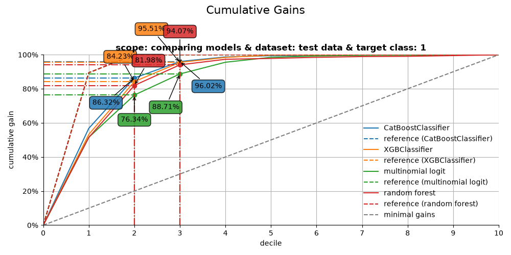
```
CumGains 1..decile 2 | model=CatBoostClassifier | dataset=test data | target=1 | value=86.32% — pos/tot=1,193 / 1,382
CumGains 1..decile 2 | model=XGBClassifier | dataset=test data | target=1 | value=84.23% — pos/tot=1,164 / 1,382
CumGains 1..decile 2 | model=multinomial logit | dataset=test data | target=1 | value=76.34% — pos/tot=1,055 / 1,382
CumGains 1..decile 2 | model=random forest | dataset=test data | target=1 | value=81.98% — pos/tot=1,133 / 1,382
CumGains 1..decile 3 | model=CatBoostClassifier | dataset=test data | target=1 | value=96.02% — pos/tot=1,327 / 1,382
CumGains 1..decile 3 | model=XGBClassifier | dataset=test data | target=1 | value=95.51% — pos/tot=1,320 / 1,382
CumGains 1..decile 3 | model=multinomial logit | dataset=test data | target=1 | value=88.71% — pos/tot=1,226 / 1,382
CumGains 1..decile 3 | model=random forest | dataset=test data | target=1 | value=94.07% — pos/tot=1,300 / 1,382

```

Tags: [model-type: classification](../../_tags/model-type-classification.html) [model-workflow: model evaluation](../../_tags/model-workflow-model-evaluation.html) [plot-type: line](../../_tags/plot-type-line.html) [plot-type: decile](../../_tags/plot-type-decile.html) [level: beginner](../../_tags/level-beginner.html) [purpose: showcase](../../_tags/purpose-showcase.html)

### 2. Cumulative lift plot[#](#cumulative-lift-plot "Link to this heading")

The cumulative lift plot, often referred to as lift plot or index plot, helps you answer the question:

When we apply the model and select the best X deciles,
how many times better is that than using no model at all?

```
# plot the cumulative lift plot and annotate the plot at decile = 3
ax = mp.plot_cumlift(
    ps, highlight_ntile=[2,3],
    save_fig=True,
)

```
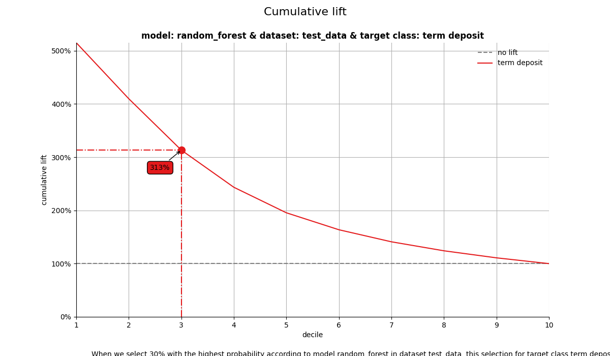
```
CumLift 1..decile 2 | model=CatBoostClassifier | dataset=test data | target=1 | value=4.32x — pos/tot=1,193 / 2,472
CumLift 1..decile 2 | model=XGBClassifier | dataset=test data | target=1 | value=4.21x — pos/tot=1,164 / 2,472
CumLift 1..decile 2 | model=multinomial logit | dataset=test data | target=1 | value=3.82x — pos/tot=1,055 / 2,472
CumLift 1..decile 2 | model=random forest | dataset=test data | target=1 | value=4.10x — pos/tot=1,133 / 2,472
CumLift 1..decile 3 | model=CatBoostClassifier | dataset=test data | target=1 | value=3.20x — pos/tot=1,327 / 3,708
CumLift 1..decile 3 | model=XGBClassifier | dataset=test data | target=1 | value=3.18x — pos/tot=1,320 / 3,708
CumLift 1..decile 3 | model=multinomial logit | dataset=test data | target=1 | value=2.96x — pos/tot=1,226 / 3,708
CumLift 1..decile 3 | model=random forest | dataset=test data | target=1 | value=3.13x — pos/tot=1,300 / 3,708

```

Tags: [model-type: classification](../../_tags/model-type-classification.html) [model-workflow: model evaluation](../../_tags/model-workflow-model-evaluation.html) [plot-type: line](../../_tags/plot-type-line.html) [plot-type: decile](../../_tags/plot-type-decile.html) [domain: statistics](../../_tags/domain-statistics.html) [level: beginner](../../_tags/level-beginner.html) [purpose: showcase](../../_tags/purpose-showcase.html)

### 3. Response plot[#](#response-plot "Link to this heading")

One of the easiest to explain evaluation plots is the response plot.
It simply plots the percentage of target class observations per decile.
It can be used to answer the following business question:

When we apply the model and select decile X,
what is the expected % of target class observations in that decile?

```
# plot the response plot and annotate the plot at decile = 3
ax = mp.plot_response(
    ps, highlight_ntile=[2,3],
    annotation_kws={"mode": "marker"},
    footer_kws={"base_pad": 0.12, "line_pad": 0.03, "fontsize": 9},
    line_kws={"linewidth": 2.0},
    save_fig=True,
)

```
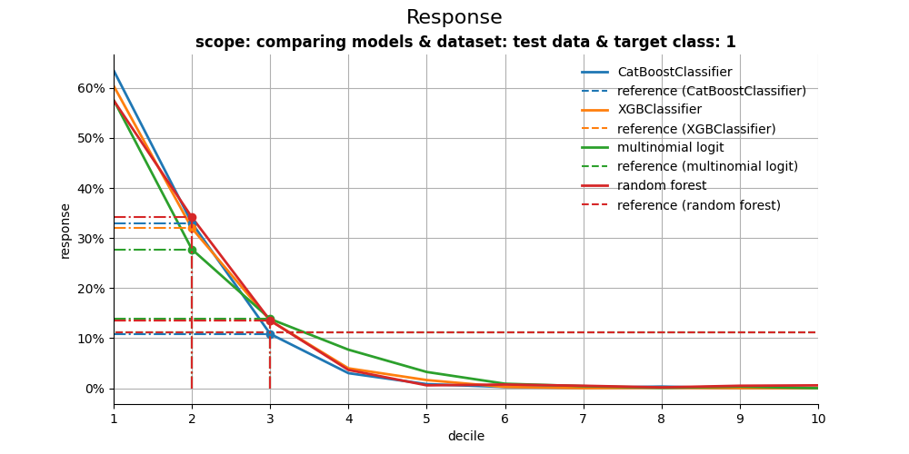
```
Response @ decile 2 | model=CatBoostClassifier | dataset=test data | target=1 | value=33.01% — pos/tot=408 / 1,236
Response @ decile 2 | model=XGBClassifier | dataset=test data | target=1 | value=34.63% — pos/tot=428 / 1,236
Response @ decile 2 | model=multinomial logit | dataset=test data | target=1 | value=27.75% — pos/tot=343 / 1,236
Response @ decile 2 | model=random forest | dataset=test data | target=1 | value=34.14% — pos/tot=422 / 1,236
Response @ decile 3 | model=CatBoostClassifier | dataset=test data | target=1 | value=10.84% — pos/tot=134 / 1,236
Response @ decile 3 | model=XGBClassifier | dataset=test data | target=1 | value=12.62% — pos/tot=156 / 1,236
Response @ decile 3 | model=multinomial logit | dataset=test data | target=1 | value=13.83% — pos/tot=171 / 1,236
Response @ decile 3 | model=random forest | dataset=test data | target=1 | value=13.51% — pos/tot=167 / 1,236

```

### 4. Cumulative response plot[#](#cumulative-response-plot "Link to this heading")

Finally, one of the most used plots: The cumulative response plot.
It answers the question burning on each business reps lips:

When we apply the model and select up until decile X,
what is the expected % of target class observations in the selection?

```
# plot the cumulative response plot and annotate the plot at decile = 3
ax = mp.plot_cumresponse(ps, highlight_ntile=[2,3], save_fig=True)

```
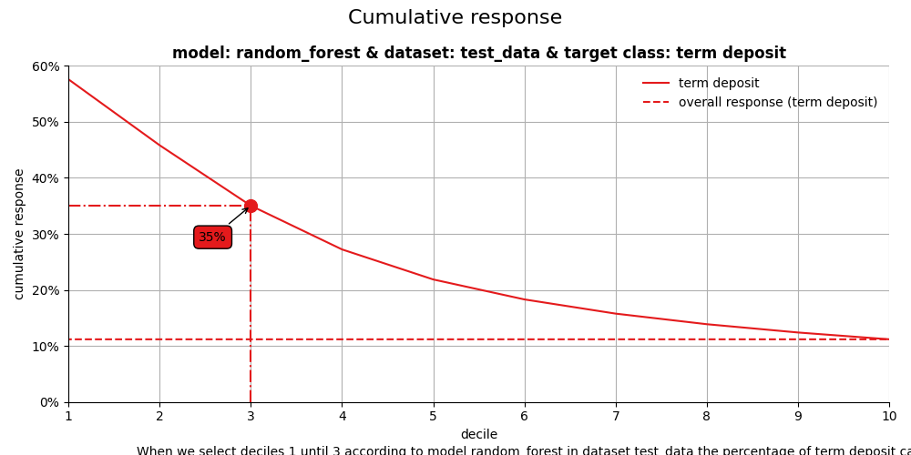
```
CumResponse 1..decile 2 | model=CatBoostClassifier | dataset=test data | target=1 | value=48.26% — pos/tot=1,193 / 2,472
CumResponse 1..decile 2 | model=XGBClassifier | dataset=test data | target=1 | value=47.09% — pos/tot=1,164 / 2,472
CumResponse 1..decile 2 | model=multinomial logit | dataset=test data | target=1 | value=42.68% — pos/tot=1,055 / 2,472
CumResponse 1..decile 2 | model=random forest | dataset=test data | target=1 | value=45.83% — pos/tot=1,133 / 2,472
CumResponse 1..decile 3 | model=CatBoostClassifier | dataset=test data | target=1 | value=35.79% — pos/tot=1,327 / 3,708
CumResponse 1..decile 3 | model=XGBClassifier | dataset=test data | target=1 | value=35.60% — pos/tot=1,320 / 3,708
CumResponse 1..decile 3 | model=multinomial logit | dataset=test data | target=1 | value=33.06% — pos/tot=1,226 / 3,708
CumResponse 1..decile 3 | model=random forest | dataset=test data | target=1 | value=35.06% — pos/tot=1,300 / 3,708

```

## All four plots together[#](#all-four-plots-together "Link to this heading")

With the function call plot\_all we get all four plots on one grid.
We can easily save it to a file to include it in a presentation or share it with colleagues.

```
# plot all four evaluation plots and save to file
ax = mp.plot_all(
    ps,
    highlight_ntile=[2,3],
    # save_fig=True,
    # overwrite=False,
    # add_timestamp=True,
    # verbose=True,
)

```

```
CumGains 1..decile 2 | model=CatBoostClassifier | dataset=test data | target=1 | value=86.32% — pos/tot=1,193 / 1,382
CumGains 1..decile 2 | model=XGBClassifier | dataset=test data | target=1 | value=84.23% — pos/tot=1,164 / 1,382
CumGains 1..decile 2 | model=multinomial logit | dataset=test data | target=1 | value=76.34% — pos/tot=1,055 / 1,382
CumGains 1..decile 2 | model=random forest | dataset=test data | target=1 | value=81.98% — pos/tot=1,133 / 1,382
CumGains 1..decile 3 | model=CatBoostClassifier | dataset=test data | target=1 | value=96.02% — pos/tot=1,327 / 1,382
CumGains 1..decile 3 | model=XGBClassifier | dataset=test data | target=1 | value=95.51% — pos/tot=1,320 / 1,382
CumGains 1..decile 3 | model=multinomial logit | dataset=test data | target=1 | value=88.71% — pos/tot=1,226 / 1,382
CumGains 1..decile 3 | model=random forest | dataset=test data | target=1 | value=94.07% — pos/tot=1,300 / 1,382
CumLift 1..decile 2 | model=CatBoostClassifier | dataset=test data | target=1 | value=4.32x — pos/tot=1,193 / 2,472
CumLift 1..decile 2 | model=XGBClassifier | dataset=test data | target=1 | value=4.21x — pos/tot=1,164 / 2,472
CumLift 1..decile 2 | model=multinomial logit | dataset=test data | target=1 | value=3.82x — pos/tot=1,055 / 2,472
CumLift 1..decile 2 | model=random forest | dataset=test data | target=1 | value=4.10x — pos/tot=1,133 / 2,472
CumLift 1..decile 3 | model=CatBoostClassifier | dataset=test data | target=1 | value=3.20x — pos/tot=1,327 / 3,708
CumLift 1..decile 3 | model=XGBClassifier | dataset=test data | target=1 | value=3.18x — pos/tot=1,320 / 3,708
CumLift 1..decile 3 | model=multinomial logit | dataset=test data | target=1 | value=2.96x — pos/tot=1,226 / 3,708
CumLift 1..decile 3 | model=random forest | dataset=test data | target=1 | value=3.13x — pos/tot=1,300 / 3,708
Response @ decile 2 | model=CatBoostClassifier | dataset=test data | target=1 | value=33.01% — pos/tot=408 / 1,236
Response @ decile 2 | model=XGBClassifier | dataset=test data | target=1 | value=34.63% — pos/tot=428 / 1,236
Response @ decile 2 | model=multinomial logit | dataset=test data | target=1 | value=27.75% — pos/tot=343 / 1,236
Response @ decile 2 | model=random forest | dataset=test data | target=1 | value=34.14% — pos/tot=422 / 1,236
Response @ decile 3 | model=CatBoostClassifier | dataset=test data | target=1 | value=10.84% — pos/tot=134 / 1,236
Response @ decile 3 | model=XGBClassifier | dataset=test data | target=1 | value=12.62% — pos/tot=156 / 1,236
Response @ decile 3 | model=multinomial logit | dataset=test data | target=1 | value=13.83% — pos/tot=171 / 1,236
Response @ decile 3 | model=random forest | dataset=test data | target=1 | value=13.51% — pos/tot=167 / 1,236
CumResponse 1..decile 2 | model=CatBoostClassifier | dataset=test data | target=1 | value=48.26% — pos/tot=1,193 / 2,472
CumResponse 1..decile 2 | model=XGBClassifier | dataset=test data | target=1 | value=47.09% — pos/tot=1,164 / 2,472
CumResponse 1..decile 2 | model=multinomial logit | dataset=test data | target=1 | value=42.68% — pos/tot=1,055 / 2,472
CumResponse 1..decile 2 | model=random forest | dataset=test data | target=1 | value=45.83% — pos/tot=1,133 / 2,472
CumResponse 1..decile 3 | model=CatBoostClassifier | dataset=test data | target=1 | value=35.79% — pos/tot=1,327 / 3,708
CumResponse 1..decile 3 | model=XGBClassifier | dataset=test data | target=1 | value=35.60% — pos/tot=1,320 / 3,708
CumResponse 1..decile 3 | model=multinomial logit | dataset=test data | target=1 | value=33.06% — pos/tot=1,226 / 3,708
CumResponse 1..decile 3 | model=random forest | dataset=test data | target=1 | value=35.06% — pos/tot=1,300 / 3,708
CumGains 1..decile 2 | model=CatBoostClassifier | dataset=test data | target=1 | value=86.32% — pos/tot=1,193 / 1,382
CumGains 1..decile 2 | model=XGBClassifier | dataset=test data | target=1 | value=84.23% — pos/tot=1,164 / 1,382
CumGains 1..decile 2 | model=multinomial logit | dataset=test data | target=1 | value=76.34% — pos/tot=1,055 / 1,382
CumGains 1..decile 2 | model=random forest | dataset=test data | target=1 | value=81.98% — pos/tot=1,133 / 1,382
CumGains 1..decile 3 | model=CatBoostClassifier | dataset=test data | target=1 | value=96.02% — pos/tot=1,327 / 1,382
CumGains 1..decile 3 | model=XGBClassifier | dataset=test data | target=1 | value=95.51% — pos/tot=1,320 / 1,382
CumGains 1..decile 3 | model=multinomial logit | dataset=test data | target=1 | value=88.71% — pos/tot=1,226 / 1,382
CumGains 1..decile 3 | model=random forest | dataset=test data | target=1 | value=94.07% — pos/tot=1,300 / 1,382
CumLift 1..decile 2 | model=CatBoostClassifier | dataset=test data | target=1 | value=4.32x — pos/tot=1,193 / 2,472
CumLift 1..decile 2 | model=XGBClassifier | dataset=test data | target=1 | value=4.21x — pos/tot=1,164 / 2,472
CumLift 1..decile 2 | model=multinomial logit | dataset=test data | target=1 | value=3.82x — pos/tot=1,055 / 2,472
CumLift 1..decile 2 | model=random forest | dataset=test data | target=1 | value=4.10x — pos/tot=1,133 / 2,472
CumLift 1..decile 3 | model=CatBoostClassifier | dataset=test data | target=1 | value=3.20x — pos/tot=1,327 / 3,708
CumLift 1..decile 3 | model=XGBClassifier | dataset=test data | target=1 | value=3.18x — pos/tot=1,320 / 3,708
CumLift 1..decile 3 | model=multinomial logit | dataset=test data | target=1 | value=2.96x — pos/tot=1,226 / 3,708
CumLift 1..decile 3 | model=random forest | dataset=test data | target=1 | value=3.13x — pos/tot=1,300 / 3,708
Response @ decile 2 | model=CatBoostClassifier | dataset=test data | target=1 | value=33.01% — pos/tot=408 / 1,236
Response @ decile 2 | model=XGBClassifier | dataset=test data | target=1 | value=34.63% — pos/tot=428 / 1,236
Response @ decile 2 | model=multinomial logit | dataset=test data | target=1 | value=27.75% — pos/tot=343 / 1,236
Response @ decile 2 | model=random forest | dataset=test data | target=1 | value=34.14% — pos/tot=422 / 1,236
Response @ decile 3 | model=CatBoostClassifier | dataset=test data | target=1 | value=10.84% — pos/tot=134 / 1,236
Response @ decile 3 | model=XGBClassifier | dataset=test data | target=1 | value=12.62% — pos/tot=156 / 1,236
Response @ decile 3 | model=multinomial logit | dataset=test data | target=1 | value=13.83% — pos/tot=171 / 1,236
Response @ decile 3 | model=random forest | dataset=test data | target=1 | value=13.51% — pos/tot=167 / 1,236
CumResponse 1..decile 2 | model=CatBoostClassifier | dataset=test data | target=1 | value=48.26% — pos/tot=1,193 / 2,472
CumResponse 1..decile 2 | model=XGBClassifier | dataset=test data | target=1 | value=47.09% — pos/tot=1,164 / 2,472
CumResponse 1..decile 2 | model=multinomial logit | dataset=test data | target=1 | value=42.68% — pos/tot=1,055 / 2,472
CumResponse 1..decile 2 | model=random forest | dataset=test data | target=1 | value=45.83% — pos/tot=1,133 / 2,472
CumResponse 1..decile 3 | model=CatBoostClassifier | dataset=test data | target=1 | value=35.79% — pos/tot=1,327 / 3,708
CumResponse 1..decile 3 | model=XGBClassifier | dataset=test data | target=1 | value=35.60% — pos/tot=1,320 / 3,708
CumResponse 1..decile 3 | model=multinomial logit | dataset=test data | target=1 | value=33.06% — pos/tot=1,226 / 3,708
CumResponse 1..decile 3 | model=random forest | dataset=test data | target=1 | value=35.06% — pos/tot=1,300 / 3,708

```
```
mp.summarize_selection(ps, ntile=2)

```

|  | model\_label | dataset\_label | target\_class | ntile | tot | pos | pct | cumtot | cumpos | cumpct | cumlift | cumgain |
| --- | --- | --- | --- | --- | --- | --- | --- | --- | --- | --- | --- | --- |
| 0 | CatBoostClassifier | test data | 1 | 2 | 1236 | 408 | 0.330097 | 2472.0 | 1193.0 | 0.482605 | 4.315161 | 0.863242 |
| 1 | XGBClassifier | test data | 1 | 2 | 1236 | 428 | 0.346278 | 2472.0 | 1164.0 | 0.470874 | 4.210266 | 0.842258 |
| 2 | multinomial logit | test data | 1 | 2 | 1236 | 343 | 0.277508 | 2472.0 | 1055.0 | 0.426780 | 3.816006 | 0.763386 |
| 3 | random forest | test data | 1 | 2 | 1236 | 422 | 0.341424 | 2472.0 | 1133.0 | 0.458333 | 4.098137 | 0.819826 |

  
  
```
mp.summarize_selection(ps, ntile=3)

```

|  | model\_label | dataset\_label | target\_class | ntile | tot | pos | pct | cumtot | cumpos | cumpct | cumlift | cumgain |
| --- | --- | --- | --- | --- | --- | --- | --- | --- | --- | --- | --- | --- |
| 0 | CatBoostClassifier | test data | 1 | 3 | 1236 | 134 | 0.108414 | 3708.0 | 1327.0 | 0.357875 | 3.199898 | 0.960203 |
| 1 | XGBClassifier | test data | 1 | 3 | 1236 | 156 | 0.126214 | 3708.0 | 1320.0 | 0.355987 | 3.183019 | 0.955137 |
| 2 | multinomial logit | test data | 1 | 3 | 1236 | 171 | 0.138350 | 3708.0 | 1226.0 | 0.330636 | 2.956349 | 0.887120 |
| 3 | random forest | test data | 1 | 3 | 1236 | 167 | 0.135113 | 3708.0 | 1300.0 | 0.350593 | 3.134791 | 0.940666 |

## Get more out of modelplotpy: using different scopes[#](#get-more-out-of-modelplotpy-using-different-scopes "Link to this heading")

As we mentioned discussed earlier, the modelplotpy also enables to make interesting comparisons,
using the scope parameter. Comparisons between different models, between different datasets
and (in case of a multiclass target) between different target classes. Curious?
Please have a look at the package documentation or read our other posts on modelplot.

### 1. compare\_models[#](#compare-models "Link to this heading")

However, to give one example, we could compare whether random forest
was indeed the best choice to select the top-30% customers for a term deposit offer:

```
ps2 = obj.plotting_scope(scope="compare_models", select_dataset_label=["test data"])

# plot the cumulative response plot and annotate the plot at decile = 3
ax = mp.plot_cumresponse(ps2, highlight_ntile=[2,3], save_fig=True)

```

```
CumResponse 1..decile 2 | model=CatBoostClassifier | dataset=test data | target=1 | value=48.26% — pos/tot=1,193 / 2,472
CumResponse 1..decile 2 | model=XGBClassifier | dataset=test data | target=1 | value=47.09% — pos/tot=1,164 / 2,472
CumResponse 1..decile 2 | model=multinomial logit | dataset=test data | target=1 | value=42.68% — pos/tot=1,055 / 2,472
CumResponse 1..decile 2 | model=random forest | dataset=test data | target=1 | value=45.83% — pos/tot=1,133 / 2,472
CumResponse 1..decile 3 | model=CatBoostClassifier | dataset=test data | target=1 | value=35.79% — pos/tot=1,327 / 3,708
CumResponse 1..decile 3 | model=XGBClassifier | dataset=test data | target=1 | value=35.60% — pos/tot=1,320 / 3,708
CumResponse 1..decile 3 | model=multinomial logit | dataset=test data | target=1 | value=33.06% — pos/tot=1,226 / 3,708
CumResponse 1..decile 3 | model=random forest | dataset=test data | target=1 | value=35.06% — pos/tot=1,300 / 3,708

```

## Financial Implications[#](#financial-implications "Link to this heading")

To plot the financial implications of implementing a predictive model,
modelplotr provides three additional plots: the Costs & revenues plot,
the Profit plot and the ROI plot.

For financial plots, three extra parameters need to be provided:

Parameter | Type.and.Description |:-: | :-: |fixed\_costs | Numeric. Specifying the fixed costs related to a selection based on the model. These costs are constant and do not vary with selection size (ntiles). |variable\_costs\_per\_unit | Numeric. Specifying the variable costs per selected unit for a selection based on the model. These costs vary with selection size (ntiles). |profit\_per\_unit | Numeric. Specifying the profit per unit in case the selected unit converts / responds positively. |

### 1. Return on investment plot[#](#return-on-investment-plot "Link to this heading")

The Return on Investment plot plots the cumulative revenues as a percentage of investments up
until that decile when the model is used for campaign selection.
It can be used to answer the following business question:

When we apply the model and select up until decile X,
what is the expected % return on investment of the campaign?

```
# Return on Investment (ROI) plot
ax = mp.plot_roi(
    ps2,
    fixed_costs=1000,
    variable_costs_per_unit=10,
    profit_per_unit=50,
    highlight_ntile=[2,3],
    save_fig=True,
)

```
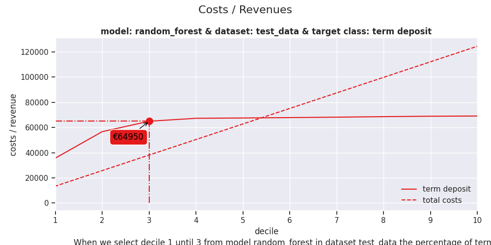
```
ROI 1..decile 2 | model=CatBoostClassifier | dataset=test data | target=1 | value=131.92% — pos/tot=1,193 / 2,472
ROI 1..decile 2 | model=XGBClassifier | dataset=test data | target=1 | value=126.28% — pos/tot=1,164 / 2,472
ROI 1..decile 2 | model=multinomial logit | dataset=test data | target=1 | value=105.09% — pos/tot=1,055 / 2,472
ROI 1..decile 2 | model=random forest | dataset=test data | target=1 | value=120.26% — pos/tot=1,133 / 2,472
ROI 1..decile 3 | model=CatBoostClassifier | dataset=test data | target=1 | value=74.24% — pos/tot=1,327 / 3,708
ROI 1..decile 3 | model=XGBClassifier | dataset=test data | target=1 | value=73.32% — pos/tot=1,320 / 3,708
ROI 1..decile 3 | model=multinomial logit | dataset=test data | target=1 | value=60.98% — pos/tot=1,226 / 3,708
ROI 1..decile 3 | model=random forest | dataset=test data | target=1 | value=70.69% — pos/tot=1,300 / 3,708

```

### 2. Costs & Revenues plot[#](#costs-revenues-plot "Link to this heading")

The costs & revenues plot plots both the cumulative revenues and the cumulative costs
(investments) up until that decile when the model is used for campaign selection.
It can be used to answer the following business question:

When we apply the model and select up until decile X,
what are the expected revenues and investments of the campaign?

```
# Costs & Revenues plot, highlighted at max roi instead of max profit
ax = mp.plot_costsrevs(
    ps2,
    fixed_costs=1000,
    variable_costs_per_unit=10,
    profit_per_unit=50,
    highlight_ntile=[2,3],
    # highlight_ntile = "max_roi",
    save_fig=True,
)

```
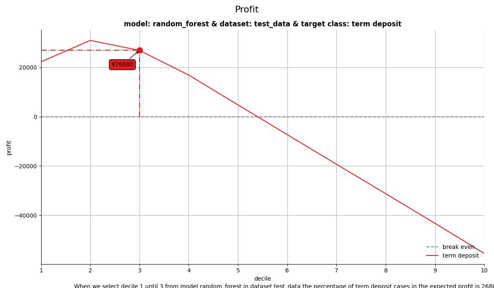
```
Revenues 1..decile 2 | model=CatBoostClassifier | dataset=test data | target=1 | value=€59,650 — pos/tot=1,193 / 2,472
Revenues 1..decile 3 | model=CatBoostClassifier | dataset=test data | target=1 | value=€66,350 — pos/tot=1,327 / 3,708
Revenues 1..decile 2 | model=XGBClassifier | dataset=test data | target=1 | value=€58,200 — pos/tot=1,164 / 2,472
Revenues 1..decile 3 | model=XGBClassifier | dataset=test data | target=1 | value=€66,000 — pos/tot=1,320 / 3,708
Revenues 1..decile 2 | model=multinomial logit | dataset=test data | target=1 | value=€52,750 — pos/tot=1,055 / 2,472
Revenues 1..decile 3 | model=multinomial logit | dataset=test data | target=1 | value=€61,300 — pos/tot=1,226 / 3,708
Revenues 1..decile 2 | model=random forest | dataset=test data | target=1 | value=€56,650 — pos/tot=1,133 / 2,472
Revenues 1..decile 3 | model=random forest | dataset=test data | target=1 | value=€65,000 — pos/tot=1,300 / 3,708

```

### 3. Profit plot[#](#profit-plot "Link to this heading")

The profit plot visualized the cumulative profit up until that decile
when the model is used for campaign selection.
It can be used to answer the following business question:

When we apply the model and select up until decile X,
what is the expected profit of the campaign?

```
# Profit plot , highlighted at custom ntile instead of at max profit
ax = mp.plot_profit(
    ps2,
    fixed_costs=1000,
    currency="$",
    variable_costs_per_unit=10,
    profit_per_unit=50,
    highlight_ntile=[2,3],
    save_fig=True,
)

```
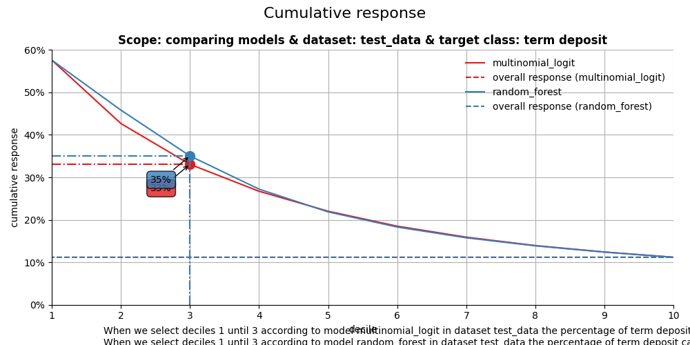
```
Profit 1..decile 2 | model=CatBoostClassifier | dataset=test data | target=1 | value=$33,930 — pos/tot=1,193 / 2,472
Profit 1..decile 2 | model=XGBClassifier | dataset=test data | target=1 | value=$32,480 — pos/tot=1,164 / 2,472
Profit 1..decile 2 | model=multinomial logit | dataset=test data | target=1 | value=$27,030 — pos/tot=1,055 / 2,472
Profit 1..decile 2 | model=random forest | dataset=test data | target=1 | value=$30,930 — pos/tot=1,133 / 2,472
Profit 1..decile 3 | model=CatBoostClassifier | dataset=test data | target=1 | value=$28,270 — pos/tot=1,327 / 3,708
Profit 1..decile 3 | model=XGBClassifier | dataset=test data | target=1 | value=$27,920 — pos/tot=1,320 / 3,708
Profit 1..decile 3 | model=multinomial logit | dataset=test data | target=1 | value=$23,220 — pos/tot=1,226 / 3,708
Profit 1..decile 3 | model=random forest | dataset=test data | target=1 | value=$26,920 — pos/tot=1,300 / 3,708

```

## All four plots together[#](#id1 "Link to this heading")

With the function call plot\_all we get all four plots on one grid.
We can easily save it to a file to include it in a presentation or share it with colleagues.

```
# plot all four evaluation plots and save to file
ax = mp.plot_all(
    ps2,
    highlight_ntile=[2,3],
    annotation_kws={"mode": "marker"},
    highlight_how='text',
    # save_fig=True,
    # overwrite=False,
    # add_timestamp=True,
    # verbose=True,
)

```

```
CumGains 1..decile 2 | model=CatBoostClassifier | dataset=test data | target=1 | value=86.32% — pos/tot=1,193 / 1,382
CumGains 1..decile 2 | model=XGBClassifier | dataset=test data | target=1 | value=84.23% — pos/tot=1,164 / 1,382
CumGains 1..decile 2 | model=multinomial logit | dataset=test data | target=1 | value=76.34% — pos/tot=1,055 / 1,382
CumGains 1..decile 2 | model=random forest | dataset=test data | target=1 | value=81.98% — pos/tot=1,133 / 1,382
CumGains 1..decile 3 | model=CatBoostClassifier | dataset=test data | target=1 | value=96.02% — pos/tot=1,327 / 1,382
CumGains 1..decile 3 | model=XGBClassifier | dataset=test data | target=1 | value=95.51% — pos/tot=1,320 / 1,382
CumGains 1..decile 3 | model=multinomial logit | dataset=test data | target=1 | value=88.71% — pos/tot=1,226 / 1,382
CumGains 1..decile 3 | model=random forest | dataset=test data | target=1 | value=94.07% — pos/tot=1,300 / 1,382
CumLift 1..decile 2 | model=CatBoostClassifier | dataset=test data | target=1 | value=4.32x — pos/tot=1,193 / 2,472
CumLift 1..decile 2 | model=XGBClassifier | dataset=test data | target=1 | value=4.21x — pos/tot=1,164 / 2,472
CumLift 1..decile 2 | model=multinomial logit | dataset=test data | target=1 | value=3.82x — pos/tot=1,055 / 2,472
CumLift 1..decile 2 | model=random forest | dataset=test data | target=1 | value=4.10x — pos/tot=1,133 / 2,472
CumLift 1..decile 3 | model=CatBoostClassifier | dataset=test data | target=1 | value=3.20x — pos/tot=1,327 / 3,708
CumLift 1..decile 3 | model=XGBClassifier | dataset=test data | target=1 | value=3.18x — pos/tot=1,320 / 3,708
CumLift 1..decile 3 | model=multinomial logit | dataset=test data | target=1 | value=2.96x — pos/tot=1,226 / 3,708
CumLift 1..decile 3 | model=random forest | dataset=test data | target=1 | value=3.13x — pos/tot=1,300 / 3,708
Response @ decile 2 | model=CatBoostClassifier | dataset=test data | target=1 | value=33.01% — pos/tot=408 / 1,236
Response @ decile 2 | model=XGBClassifier | dataset=test data | target=1 | value=34.63% — pos/tot=428 / 1,236
Response @ decile 2 | model=multinomial logit | dataset=test data | target=1 | value=27.75% — pos/tot=343 / 1,236
Response @ decile 2 | model=random forest | dataset=test data | target=1 | value=34.14% — pos/tot=422 / 1,236
Response @ decile 3 | model=CatBoostClassifier | dataset=test data | target=1 | value=10.84% — pos/tot=134 / 1,236
Response @ decile 3 | model=XGBClassifier | dataset=test data | target=1 | value=12.62% — pos/tot=156 / 1,236
Response @ decile 3 | model=multinomial logit | dataset=test data | target=1 | value=13.83% — pos/tot=171 / 1,236
Response @ decile 3 | model=random forest | dataset=test data | target=1 | value=13.51% — pos/tot=167 / 1,236
CumResponse 1..decile 2 | model=CatBoostClassifier | dataset=test data | target=1 | value=48.26% — pos/tot=1,193 / 2,472
CumResponse 1..decile 2 | model=XGBClassifier | dataset=test data | target=1 | value=47.09% — pos/tot=1,164 / 2,472
CumResponse 1..decile 2 | model=multinomial logit | dataset=test data | target=1 | value=42.68% — pos/tot=1,055 / 2,472
CumResponse 1..decile 2 | model=random forest | dataset=test data | target=1 | value=45.83% — pos/tot=1,133 / 2,472
CumResponse 1..decile 3 | model=CatBoostClassifier | dataset=test data | target=1 | value=35.79% — pos/tot=1,327 / 3,708
CumResponse 1..decile 3 | model=XGBClassifier | dataset=test data | target=1 | value=35.60% — pos/tot=1,320 / 3,708
CumResponse 1..decile 3 | model=multinomial logit | dataset=test data | target=1 | value=33.06% — pos/tot=1,226 / 3,708
CumResponse 1..decile 3 | model=random forest | dataset=test data | target=1 | value=35.06% — pos/tot=1,300 / 3,708
CumGains 1..decile 2 | model=CatBoostClassifier | dataset=test data | target=1 | value=86.32% — pos/tot=1,193 / 1,382
CumGains 1..decile 2 | model=XGBClassifier | dataset=test data | target=1 | value=84.23% — pos/tot=1,164 / 1,382
CumGains 1..decile 2 | model=multinomial logit | dataset=test data | target=1 | value=76.34% — pos/tot=1,055 / 1,382
CumGains 1..decile 2 | model=random forest | dataset=test data | target=1 | value=81.98% — pos/tot=1,133 / 1,382
CumGains 1..decile 3 | model=CatBoostClassifier | dataset=test data | target=1 | value=96.02% — pos/tot=1,327 / 1,382
CumGains 1..decile 3 | model=XGBClassifier | dataset=test data | target=1 | value=95.51% — pos/tot=1,320 / 1,382
CumGains 1..decile 3 | model=multinomial logit | dataset=test data | target=1 | value=88.71% — pos/tot=1,226 / 1,382
CumGains 1..decile 3 | model=random forest | dataset=test data | target=1 | value=94.07% — pos/tot=1,300 / 1,382
CumLift 1..decile 2 | model=CatBoostClassifier | dataset=test data | target=1 | value=4.32x — pos/tot=1,193 / 2,472
CumLift 1..decile 2 | model=XGBClassifier | dataset=test data | target=1 | value=4.21x — pos/tot=1,164 / 2,472
CumLift 1..decile 2 | model=multinomial logit | dataset=test data | target=1 | value=3.82x — pos/tot=1,055 / 2,472
CumLift 1..decile 2 | model=random forest | dataset=test data | target=1 | value=4.10x — pos/tot=1,133 / 2,472
CumLift 1..decile 3 | model=CatBoostClassifier | dataset=test data | target=1 | value=3.20x — pos/tot=1,327 / 3,708
CumLift 1..decile 3 | model=XGBClassifier | dataset=test data | target=1 | value=3.18x — pos/tot=1,320 / 3,708
CumLift 1..decile 3 | model=multinomial logit | dataset=test data | target=1 | value=2.96x — pos/tot=1,226 / 3,708
CumLift 1..decile 3 | model=random forest | dataset=test data | target=1 | value=3.13x — pos/tot=1,300 / 3,708
Response @ decile 2 | model=CatBoostClassifier | dataset=test data | target=1 | value=33.01% — pos/tot=408 / 1,236
Response @ decile 2 | model=XGBClassifier | dataset=test data | target=1 | value=34.63% — pos/tot=428 / 1,236
Response @ decile 2 | model=multinomial logit | dataset=test data | target=1 | value=27.75% — pos/tot=343 / 1,236
Response @ decile 2 | model=random forest | dataset=test data | target=1 | value=34.14% — pos/tot=422 / 1,236
Response @ decile 3 | model=CatBoostClassifier | dataset=test data | target=1 | value=10.84% — pos/tot=134 / 1,236
Response @ decile 3 | model=XGBClassifier | dataset=test data | target=1 | value=12.62% — pos/tot=156 / 1,236
Response @ decile 3 | model=multinomial logit | dataset=test data | target=1 | value=13.83% — pos/tot=171 / 1,236
Response @ decile 3 | model=random forest | dataset=test data | target=1 | value=13.51% — pos/tot=167 / 1,236
CumResponse 1..decile 2 | model=CatBoostClassifier | dataset=test data | target=1 | value=48.26% — pos/tot=1,193 / 2,472
CumResponse 1..decile 2 | model=XGBClassifier | dataset=test data | target=1 | value=47.09% — pos/tot=1,164 / 2,472
CumResponse 1..decile 2 | model=multinomial logit | dataset=test data | target=1 | value=42.68% — pos/tot=1,055 / 2,472
CumResponse 1..decile 2 | model=random forest | dataset=test data | target=1 | value=45.83% — pos/tot=1,133 / 2,472
CumResponse 1..decile 3 | model=CatBoostClassifier | dataset=test data | target=1 | value=35.79% — pos/tot=1,327 / 3,708
CumResponse 1..decile 3 | model=XGBClassifier | dataset=test data | target=1 | value=35.60% — pos/tot=1,320 / 3,708
CumResponse 1..decile 3 | model=multinomial logit | dataset=test data | target=1 | value=33.06% — pos/tot=1,226 / 3,708
CumResponse 1..decile 3 | model=random forest | dataset=test data | target=1 | value=35.06% — pos/tot=1,300 / 3,708

```
```
import scikitplot as sp

sp.utils.remove_path()

```

Seems like the algorithm used will not make a big difference in this case.
Hopefully you agree by now that using these plots really can make a difference in explaining
the business value of your predictive models!

In case you experience issues when using modelplotpy, please let us know
via the [issues section on Github](https://github.com/pbmarcus/modelplotpy/issues).
Any other feedback or suggestions, please let us know
via [pb.marcus](mailto:pb.marcus%40hotmail.com)
or [jurriaan.nagelkerke](mailto:jurriaan.nagelkerke%40gmail.com).

Happy modelplotting!

****Total running time of the script:**** (0 minutes 16.460 seconds)

[](https://mybinder.org/v2/gh/scikit-plots/scikit-plots/main?urlpath=lab/tree/notebooks/auto_examples/decile/plot_modelplotpy_script.ipynb)[](../../lite/lab/index.html?path=auto_examples/decile/plot_modelplotpy_script.ipynb)

[`Download Jupyter notebook: plot_modelplotpy_script.ipynb`](../../_downloads/1ba7c4f462620b51056711582a22d3fe/plot_modelplotpy_script.ipynb)

[`Download Python source code: plot_modelplotpy_script.py`](../../_downloads/388a02c64ed0507c1b32e415c7bfb450/plot_modelplotpy_script.py)

[`Download zipped: plot_modelplotpy_script.zip`](../../_downloads/56435be07b68c4ea63f1f622e1fe35d1/plot_modelplotpy_script.zip)

Related examples

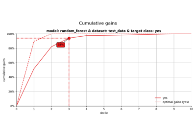

[Introduction to modelplotpy (legacy)](plot_modelplotpy_legacy_script.html)

Introduction to modelplotpy (legacy)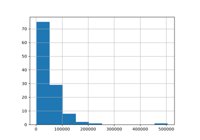

[Comparing DummyCode Encoder with Other Encoders](../preprocessing/plot_dummy_code_encoder.html)

Comparing DummyCode Encoder with Other Encoders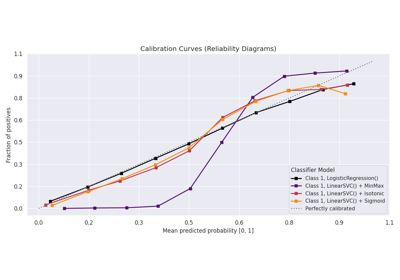

[plot\_calibration with examples](../calibration/plot_calibration_script.html)

plot\_calibration with examples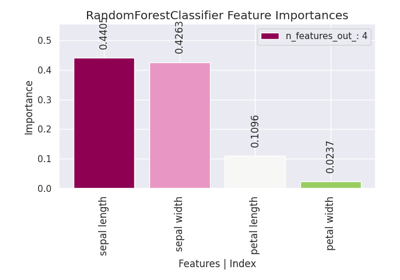

[plot\_feature\_importances with examples](../classification/plot_feature_importances_script.html)

plot\_feature\_importances with examples

[Gallery generated by Sphinx-Gallery](https://sphinx-gallery.github.io)