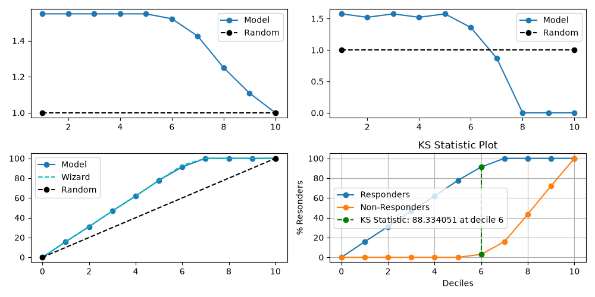

> **Note**
> [Go to the end](#sphx-glr-download-auto-examples-decile-plot-report-script-py)
to download the full example code or to run this example in your browser via JupyterLite or Binder.

# plot\_report with examples[#](#plot-report-with-examples "Link to this heading")

An example showing the [`report`](../../modules/generated/scikitplot.decile.kds.report.html#scikitplot.decile.kds.report "scikitplot.decile.kds.report") function
with a scikit-learn classifier (e.g., [`LogisticRegression`](https://scikit-learn.org/dev/modules/generated/sklearn.linear_model.LogisticRegression.html#sklearn.linear_model.LogisticRegression "(in scikit-learn v1.10)")) instance.

```
# Authors: The scikit-plots developers
# SPDX-License-Identifier: BSD-3-Clause

```
```
from sklearn.datasets import (
    load_breast_cancer as data_2_classes,
    # load_iris as data_3_classes,
)
from sklearn.linear_model import LogisticRegression
from sklearn.model_selection import train_test_split

# importing pylab or pyplot
import matplotlib.pyplot as plt
import numpy as np; np.random.seed(0)  # reproducibility

# Import scikit-plot
import scikitplot.decile as sp

# Load the data
X, y = data_2_classes(return_X_y=True, as_frame=False)
X_train, X_val, y_train, y_val = train_test_split(X, y, test_size=0.5, random_state=0)

# Create an instance of the LogisticRegression
model = LogisticRegression(max_iter=int(1e5), random_state=0).fit(X_train, y_train)

# Perform predictions
y_val_prob = model.predict_proba(X_val)

```
```
sp.kds.decile_table(
    y_val,
    y_val_prob,
    save_fig=True,
    save_fig_filename="",
    # overwrite=True,
    add_timestamp=True,
    # verbose=True,
    display_term_tables=True,
)

```

|  | decile | prob\_min | prob\_max | prob\_avg | cnt\_cust | cnt\_resp | cnt\_non\_resp | cnt\_resp\_rndm | cnt\_resp\_wiz | resp\_rate | cum\_cust | cum\_resp | cum\_resp\_wiz | cum\_non\_resp | cum\_cust\_pct | cum\_resp\_pct | cum\_resp\_pct\_wiz | cum\_non\_resp\_pct | KS | lift |
| --- | --- | --- | --- | --- | --- | --- | --- | --- | --- | --- | --- | --- | --- | --- | --- | --- | --- | --- | --- | --- |
| 0 | 1 | 0.999898 | 0.999998 | 0.999953 | 29.0 | 29.0 | 0.0 | 18.4 | 29 | 100.000000 | 29.0 | 29.0 | 29 | 0.0 | 10.175439 | 15.760870 | 15.760870 | 0.000000 | 15.760870 | 1.548913 |
| 1 | 2 | 0.999395 | 0.999897 | 0.999689 | 28.0 | 28.0 | 0.0 | 18.4 | 28 | 100.000000 | 57.0 | 57.0 | 57 | 0.0 | 20.000000 | 30.978261 | 30.978261 | 0.000000 | 30.978261 | 1.548913 |
| 2 | 3 | 0.997622 | 0.999376 | 0.998770 | 29.0 | 29.0 | 0.0 | 18.4 | 29 | 100.000000 | 86.0 | 86.0 | 86 | 0.0 | 30.175439 | 46.739130 | 46.739130 | 0.000000 | 46.739130 | 1.548913 |
| 3 | 4 | 0.992830 | 0.997497 | 0.996062 | 28.0 | 28.0 | 0.0 | 18.4 | 28 | 100.000000 | 114.0 | 114.0 | 114 | 0.0 | 40.000000 | 61.956522 | 61.956522 | 0.000000 | 61.956522 | 1.548913 |
| 4 | 5 | 0.959560 | 0.992494 | 0.980356 | 29.0 | 29.0 | 0.0 | 18.4 | 29 | 100.000000 | 143.0 | 143.0 | 143 | 0.0 | 50.175439 | 77.717391 | 77.717391 | 0.000000 | 77.717391 | 1.548913 |
| 5 | 6 | 0.771810 | 0.955756 | 0.888427 | 28.0 | 25.0 | 3.0 | 18.4 | 28 | 89.285714 | 171.0 | 168.0 | 171 | 3.0 | 60.000000 | 91.304348 | 92.934783 | 2.970297 | 88.334051 | 1.521739 |
| 6 | 7 | 0.065823 | 0.769488 | 0.346444 | 29.0 | 16.0 | 13.0 | 18.4 | 13 | 55.172414 | 200.0 | 184.0 | 184 | 16.0 | 70.175439 | 100.000000 | 100.000000 | 15.841584 | 84.158416 | 1.425000 |
| 7 | 8 | 0.000369 | 0.048060 | 0.010959 | 28.0 | 0.0 | 28.0 | 18.4 | 0 | 0.000000 | 228.0 | 184.0 | 184 | 44.0 | 80.000000 | 100.000000 | 100.000000 | 43.564356 | 56.435644 | 1.250000 |
| 8 | 9 | 0.000001 | 0.000349 | 0.000057 | 29.0 | 0.0 | 29.0 | 18.4 | 0 | 0.000000 | 257.0 | 184.0 | 184 | 73.0 | 90.175439 | 100.000000 | 100.000000 | 72.277228 | 27.722772 | 1.108949 |
| 9 | 10 | 0.000000 | 0.000001 | 0.000000 | 28.0 | 0.0 | 28.0 | 18.4 | 0 | 0.000000 | 285.0 | 184.0 | 184 | 101.0 | 100.000000 | 100.000000 | 100.000000 | 100.000000 | 0.000000 | 1.000000 |

  
  

Plot!

```
ax = sp.kds.report(
    y_val,
    y_val_prob,
    save_fig=True,
    save_fig_filename="",
    # overwrite=True,
    add_timestamp=True,
    # verbose=True,
    display_term_tables=True,
)

```

```
LABELS INFO:

 prob_min         : Minimum probability in a particular decile
 prob_max         : Minimum probability in a particular decile
 prob_avg         : Average probability in a particular decile
 cnt_events       : Count of events in a particular decile
 cnt_resp         : Count of responders in a particular decile
 cnt_non_resp     : Count of non-responders in a particular decile
 cnt_resp_rndm    : Count of responders if events assigned randomly in a particular decile
 cnt_resp_wiz     : Count of best possible responders in a particular decile
 resp_rate        : Response Rate in a particular decile [(cnt_resp/cnt_cust)*100]
 cum_events       : Cumulative sum of events decile-wise
 cum_resp         : Cumulative sum of responders decile-wise
 cum_resp_wiz     : Cumulative sum of best possible responders decile-wise
 cum_non_resp     : Cumulative sum of non-responders decile-wise
 cum_events_pct   : Cumulative sum of percentages of events decile-wise
 cum_resp_pct     : Cumulative sum of percentages of responders decile-wise
 cum_resp_pct_wiz : Cumulative sum of percentages of best possible responders decile-wise
 cum_non_resp_pct : Cumulative sum of percentages of non-responders decile-wise
 KS               : KS Statistic decile-wise
 lift             : Cumuative Lift Value decile-wise

```

Tags: [model-type: classification](../../_tags/model-type-classification.html) [model-workflow: model evaluation](../../_tags/model-workflow-model-evaluation.html) [plot-type: line](../../_tags/plot-type-line.html) [plot-type: decile](../../_tags/plot-type-decile.html) [level: beginner](../../_tags/level-beginner.html) [purpose: showcase](../../_tags/purpose-showcase.html)

****Total running time of the script:**** (0 minutes 3.568 seconds)

[](https://mybinder.org/v2/gh/scikit-plots/scikit-plots/main?urlpath=lab/tree/notebooks/auto_examples/decile/plot_report_script.ipynb)[](../../lite/lab/index.html?path=auto_examples/decile/plot_report_script.ipynb)

[`Download Jupyter notebook: plot_report_script.ipynb`](../../_downloads/1302b841cab9ece4982fc25e7a2928be/plot_report_script.ipynb)

[`Download Python source code: plot_report_script.py`](../../_downloads/2ec0b16280401aafe4cc5173b8dab0a5/plot_report_script.py)

[`Download zipped: plot_report_script.zip`](../../_downloads/660940c67aa3b551950587a81f35e8ca/plot_report_script.zip)

Related examples


[plot\_cumulative\_gain with examples](plot_cumulative_gain_script.html)

plot\_cumulative\_gain with examples

[plot\_ks\_statistic with examples](plot_ks_statistic_script.html)

plot\_ks\_statistic with examples

[plot\_lift with examples](plot_lift_script.html)

plot\_lift with examples

[plot\_precision\_recall with examples](../classification/plot_precision_recall_script.html)

plot\_precision\_recall with examples

[Gallery generated by Sphinx-Gallery](https://sphinx-gallery.github.io)