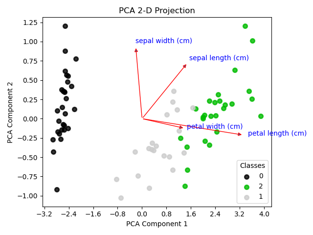
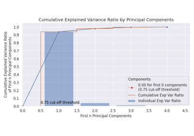
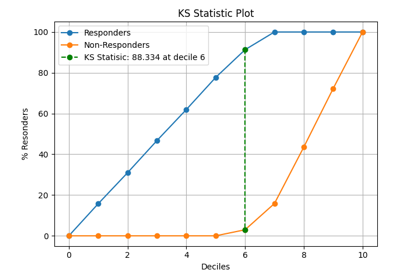
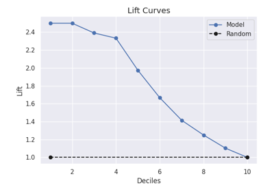

> **Note**
> [Go to the end](#sphx-glr-download-auto-examples-decomposition-plot-pca-2d-projection-script-py)
to download the full example code or to run this example in your browser via JupyterLite or Binder.

# plot\_pca\_2d\_projection with examples[#](#plot-pca-2d-projection-with-examples "Link to this heading")

An example showing the [`plot_pca_2d_projection`](../../modules/generated/scikitplot.api.decomposition.plot_pca_2d_projection.html#scikitplot.api.decomposition.plot_pca_2d_projection "scikitplot.api.decomposition.plot_pca_2d_projection") function
used by a scikit-learn PCA object.

```
# Authors: The scikit-plots developers
# SPDX-License-Identifier: BSD-3-Clause

```

## Import scikit-plots[#](#import-scikit-plots "Link to this heading")

```
from sklearn.datasets import (
    load_iris as data_3_classes,
)
from sklearn.decomposition import PCA
from sklearn.model_selection import train_test_split

import numpy as np

np.random.seed(0)  # reproducibility
# importing pylab or pyplot
import matplotlib.pyplot as plt

# Import scikit-plot
import scikitplot as sp

```

## Loading the dataset[#](#loading-the-dataset "Link to this heading")

```
# Load the data
X, y = data_3_classes(return_X_y=True, as_frame=True)
X_train, X_val, y_train, y_val = train_test_split(X, y, test_size=0.5, random_state=0)

```

## PCA[#](#pca "Link to this heading")

```
# Create an instance of the PCA
pca = PCA(random_state=0).fit(X_train)

# Create an instance of the LogisticRegression
# model = LogisticRegression(max_iter=int(1e5), random_state=0).fit(X_train, y_train)

# Perform predictions
# y_val_prob = model.predict_proba(X_val)

```

## Plot

```
# Plot!
ax = sp.decomposition.plot_pca_2d_projection(
    pca,
    X_train,
    y_train,
    biplot=True,
    feature_labels=X.columns.tolist(),
    save_fig=True,
    save_fig_filename="",
    # overwrite=True,
    add_timestamp=True,
    # verbose=True,
)

```


Tags: [model-type: classification](../../_tags/model-type-classification.html) [model-workflow: feature engineering](../../_tags/model-workflow-feature-engineering.html) [plot-type: scatter](../../_tags/plot-type-scatter.html) [plot-type: PCA](../../_tags/plot-type-pca.html) [level: beginner](../../_tags/level-beginner.html) [purpose: showcase](../../_tags/purpose-showcase.html)

****Total running time of the script:**** (0 minutes 0.672 seconds)

[](https://mybinder.org/v2/gh/scikit-plots/scikit-plots/main?urlpath=lab/tree/notebooks/auto_examples/decomposition/plot_pca_2d_projection_script.ipynb)[](../../lite/lab/index.html?path=auto_examples/decomposition/plot_pca_2d_projection_script.ipynb)

[`Download Jupyter notebook: plot_pca_2d_projection_script.ipynb`](../../_downloads/1cf8081827f51129c2a707b474f42ed4/plot_pca_2d_projection_script.ipynb)

[`Download Python source code: plot_pca_2d_projection_script.py`](../../_downloads/dad01d3a075bbda07ba3c76103a953fc/plot_pca_2d_projection_script.py)

[`Download zipped: plot_pca_2d_projection_script.zip`](../../_downloads/a3a06f8147e232293987c19b5797a48f/plot_pca_2d_projection_script.zip)

Related examples



[plot\_pca\_component\_variance with examples](plot_pca_component_variance_script.html)

plot\_pca\_component\_variance with examples

[plot\_cumulative\_gain with examples](../decile/plot_cumulative_gain_script.html)

plot\_cumulative\_gain with examples

[plot\_ks\_statistic with examples](../decile/plot_ks_statistic_script.html)

plot\_ks\_statistic with examples

[plot\_lift with examples](../decile/plot_lift_script.html)

plot\_lift with examples

[Gallery generated by Sphinx-Gallery](https://sphinx-gallery.github.io)