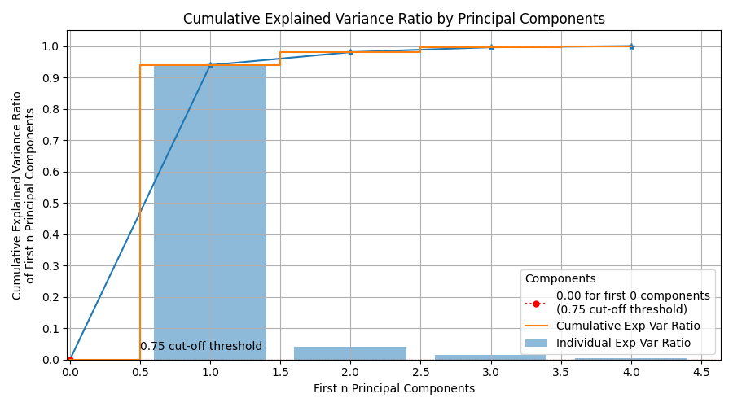
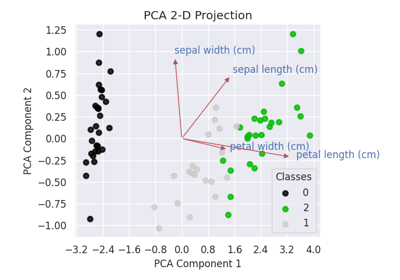
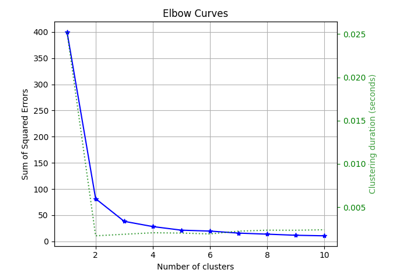

> **Note**
> [Go to the end](#sphx-glr-download-auto-examples-decomposition-plot-pca-component-variance-script-py)
to download the full example code or to run this example in your browser via JupyterLite or Binder.

# plot\_pca\_component\_variance with examples[#](#plot-pca-component-variance-with-examples "Link to this heading")

An example showing the [`plot_pca_component_variance`](../../modules/generated/scikitplot.api.decomposition.plot_pca_component_variance.html#scikitplot.api.decomposition.plot_pca_component_variance "scikitplot.api.decomposition.plot_pca_component_variance") function
used by a scikit-learn PCA object.

```
# Authors: The scikit-plots developers
# SPDX-License-Identifier: BSD-3-Clause

```

## Import scikit-plots[#](#import-scikit-plots "Link to this heading")

```
from sklearn.datasets import (
    load_iris as data_3_classes,
)
from sklearn.decomposition import PCA
from sklearn.model_selection import train_test_split

import numpy as np

np.random.seed(0)  # reproducibility
# importing pylab or pyplot
import matplotlib.pyplot as plt

# Import scikit-plot
import scikitplot as sp

```

## Loading the dataset[#](#loading-the-dataset "Link to this heading")

```
# Load the data
X, y = data_3_classes(return_X_y=True, as_frame=False)
X_train, X_val, y_train, y_val = train_test_split(X, y, test_size=0.5, random_state=0)

```

## PCA[#](#pca "Link to this heading")

```
# Create an instance of the PCA
pca = PCA(random_state=0).fit(X_train)

```

## Plot

```
# Plot!
ax = sp.decomposition.plot_pca_component_variance(
    pca,
    figsize=(9, 5),
    save_fig=True,
    save_fig_filename="",
    # overwrite=True,
    add_timestamp=True,
    # verbose=True,
)

```


Tags: [model-type: regression](../../_tags/model-type-regression.html) [model-type: classification](../../_tags/model-type-classification.html) [model-workflow: feature engineering](../../_tags/model-workflow-feature-engineering.html) [plot-type: line](../../_tags/plot-type-line.html) [level: beginner](../../_tags/level-beginner.html) [purpose: showcase](../../_tags/purpose-showcase.html)

****Total running time of the script:**** (0 minutes 0.451 seconds)

[](https://mybinder.org/v2/gh/scikit-plots/scikit-plots/main?urlpath=lab/tree/notebooks/auto_examples/decomposition/plot_pca_component_variance_script.ipynb)[](../../lite/lab/index.html?path=auto_examples/decomposition/plot_pca_component_variance_script.ipynb)

[`Download Jupyter notebook: plot_pca_component_variance_script.ipynb`](../../_downloads/613daab51d9df5d1eab50bab455be2a0/plot_pca_component_variance_script.ipynb)

[`Download Python source code: plot_pca_component_variance_script.py`](../../_downloads/a1b91f9021e62d296095d83494986109/plot_pca_component_variance_script.py)

[`Download zipped: plot_pca_component_variance_script.zip`](../../_downloads/4ae1da170a6989a99909c84226769c97/plot_pca_component_variance_script.zip)

Related examples



[plot\_pca\_2d\_projection with examples](plot_pca_2d_projection_script.html)

plot\_pca\_2d\_projection with examples

[plot\_silhouette with examples](../clustering/plot_silhouette_script.html)

plot\_silhouette with examples

[plot\_elbow with examples](../clustering/plot_elbow_script.html)

plot\_elbow with examples

[plot\_feature\_importances with examples](../classification/plot_feature_importances_script.html)

plot\_feature\_importances with examples

[Gallery generated by Sphinx-Gallery](https://sphinx-gallery.github.io)