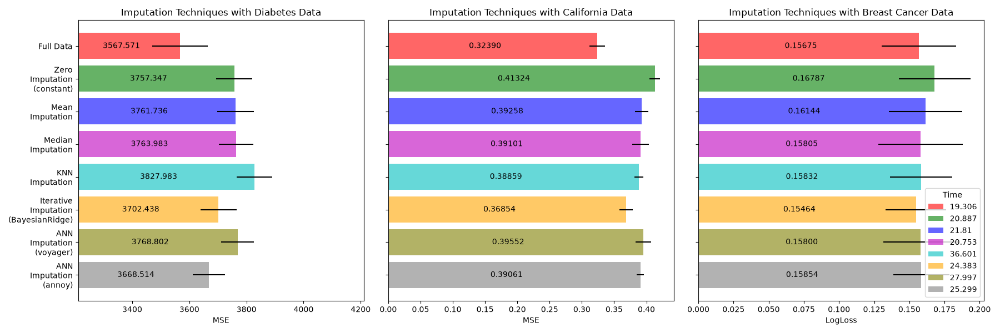
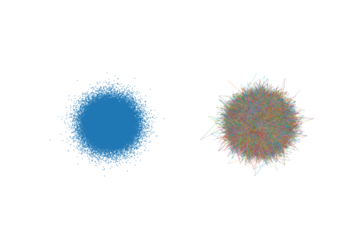

> **Note**
> [Go to the end](#sphx-glr-download-auto-examples-impute-plot-impute-script-py)
to download the full example code or to run this example in your browser via JupyterLite or Binder.

# annoy impute with examples[#](#annoy-impute-with-examples "Link to this heading")

Examples related to the [`ANNImputer`](../../modules/generated/scikitplot.impute._ann.ANNImputer.html#scikitplot.impute._ann.ANNImputer "scikitplot.impute._ann.ANNImputer") class
with a scikit-learn regressor (e.g., [`LinearRegression`](https://scikit-learn.org/dev/modules/generated/sklearn.linear_model.LinearRegression.html#sklearn.linear_model.LinearRegression "(in scikit-learn v1.10)")) instance.

> **See also**
> * <https://scikit-learn.org/stable/auto_examples/impute/plot_missing_values.html#sphx-glr-auto-examples-impute-plot-missing-values-py>
```
# Authors: The scikit-plots developers
# SPDX-License-Identifier: BSD-3-Clause

```

## Download the data and make missing values sets[#](#download-the-data-and-make-missing-values-sets "Link to this heading")

First we download the two datasets. Diabetes dataset is shipped with
scikit-learn. It has 442 entries, each with 10 features. California housing
dataset is much larger with 20640 entries and 8 features. It needs to be
downloaded. We will only use the first 300 entries for the sake of speeding
up the calculations but feel free to use the whole dataset.

<https://www.geeksforgeeks.org/machine-learning/ml-credit-card-fraud-detection/>
<https://media.geeksforgeeks.org/wp-content/uploads/20240904104950/creditcard.csv>
df = pd.read\_csv(”<https://media.geeksforgeeks.org/wp-content/uploads/20240904104950/creditcard.csv>”)
df.head()

```
import os
import time
from pathlib import Path

import numpy as np; np.random.seed(0)  # reproducibility
import pandas as pd

from sklearn.datasets import make_classification, make_regression
from sklearn.datasets import (
    load_breast_cancer as data_2_classes,
    load_iris as data_3_classes,
    load_digits as data_10_classes,
)
from sklearn.datasets import fetch_california_housing, load_diabetes
from sklearn.model_selection import train_test_split
from sklearn.ensemble import RandomForestRegressor, RandomForestClassifier

# To use the experimental IterativeImputer, we need to explicitly ask for it:
from sklearn.experimental import enable_iterative_imputer  # noqa: F401
from sklearn.impute import IterativeImputer, KNNImputer, SimpleImputer
from sklearn.model_selection import cross_val_score
from sklearn.pipeline import make_pipeline
from sklearn.preprocessing import MaxAbsScaler, RobustScaler, StandardScaler

```
```
import inspect
import joblib
from pathlib import Path

def get_current_script_dir() -> Path:
    """
    Returns the directory of the current script in a robust way.

    Returns
    -------
    Path
        Absolute directory path.

    Raises
    ------
    RuntimeError
        If location cannot be determined.
    """
    # Case 1: normal Python execution
    if "__file__" in globals():
        return Path(__file__).resolve().parent

    # Case 2: fallback for Sphinx-gallery / exec environments
    frame = inspect.currentframe()
    if frame is not None:
        file = inspect.getfile(frame)
        return Path(file).resolve().parent

    raise RuntimeError("Cannot determine script directory.")

BASE_DIR = get_current_script_dir()
# joblib.dump(fetch_california_housing(return_X_y=True), "fetch_california_housing.joblib")
joblib.load(BASE_DIR / "fetch_california_housing.joblib")

```
```
(array([[   8.3252    ,   41.        ,    6.98412698, ...,    2.55555556,
          37.88      , -122.23      ],
       [   8.3014    ,   21.        ,    6.23813708, ...,    2.10984183,
          37.86      , -122.22      ],
       [   7.2574    ,   52.        ,    8.28813559, ...,    2.80225989,
          37.85      , -122.24      ],
       ...,
       [   1.7       ,   17.        ,    5.20554273, ...,    2.3256351 ,
          39.43      , -121.22      ],
       [   1.8672    ,   18.        ,    5.32951289, ...,    2.12320917,
          39.43      , -121.32      ],
       [   2.3886    ,   16.        ,    5.25471698, ...,    2.61698113,
          39.37      , -121.24      ]], shape=(20640, 8)), array([4.526, 3.585, 3.521, ..., 0.923, 0.847, 0.894], shape=(20640,)))

```
```
def add_missing_values(X_full, y_full, rng=np.random.RandomState(0)):
    n_samples, n_features = X_full.shape

    # Add missing values in 75% of the lines
    missing_rate = 0.75
    n_missing_samples = int(n_samples * missing_rate)

    missing_samples = np.zeros(n_samples, dtype=bool)
    missing_samples[:n_missing_samples] = True

    rng.shuffle(missing_samples)
    missing_features = rng.randint(0, n_features, n_missing_samples)
    X_missing = X_full.copy()
    X_missing[missing_samples, missing_features] = np.nan
    y_missing = y_full.copy()
    return X_missing, y_missing

```
```
Xdi_train, Xdi_val, ydi_train, ydi_val = train_test_split(
    *load_diabetes(return_X_y=True),
    test_size=0.25, random_state=42
)
Xca_train, Xca_val, yca_train, yca_val = train_test_split(
    # *fetch_california_housing(return_X_y=True),
    *joblib.load("fetch_california_housing.joblib"),
    test_size=0.25, random_state=42
)
Xbc_train, Xbc_val, ybc_train, ybc_val = train_test_split(
    *data_2_classes(return_X_y=True),
    test_size=0.25, random_state=42,
    stratify=data_2_classes(return_X_y=True)[1]  # (data, target)
)

```
```
Xdi_train_miss, ydi_train_miss = add_missing_values(Xdi_train, ydi_train)
Xca_train_miss, yca_train_miss = add_missing_values(Xca_train, yca_train)
Xbc_train_miss, ybc_train_miss = add_missing_values(Xbc_train, ybc_train)

Xdi_val_miss, ydi_val_miss = add_missing_values(Xdi_val, ydi_val)
Xca_val_miss, yca_val_miss = add_missing_values(Xca_val, yca_val)
Xbc_val_miss, ybc_val_miss = add_missing_values(Xbc_val, ybc_val)

```
```
N_SPLITS = 4

def get_score(Xt, Xv, yt, yv, imputer=None, regresion=True):
    if regresion:
        estimator = RandomForestRegressor(random_state=42)
        scoring="neg_mean_squared_error"
    else:
        estimator = RandomForestClassifier(random_state=42, max_depth=6, class_weight='balanced')
        scoring="neg_log_loss"
    if imputer is not None:
        Xt = imputer.fit_transform(Xt, yt)
        Xv = imputer.transform(Xv)
    estimator.fit(Xt, yt)
    scores = cross_val_score(
        estimator,
        Xv, yv, scoring=scoring, cv=N_SPLITS
    )
    return scores.mean(), scores.std()

n_size = 8
x_labels = np.zeros(n_size, dtype=object)
mses_diabetes = np.zeros(n_size)
stds_diabetes = np.zeros(n_size)
mses_california = np.zeros(n_size)
stds_california = np.zeros(n_size)
mses_train = np.zeros(n_size)
stds_train = np.zeros(n_size)
time_data = np.zeros(n_size)

```

### Estimate the score[#](#estimate-the-score "Link to this heading")

First, we want to estimate the score on the original data:

```
t0 = time.time()
mses_diabetes[0], stds_diabetes[0] = get_score(Xdi_train, Xdi_val, ydi_train, ydi_val)
mses_california[0], stds_california[0] = get_score(Xca_train, Xca_val, yca_train, yca_val)
mses_train[0], stds_train[0] = get_score(Xbc_train, Xbc_val, ybc_train, ybc_val, regresion=False)
x_labels[0] = "Full Data"
T = time.time() - t0
print(T)
time_data[0] = T

```
```
19.30594825744629

```

### Replace missing values by 0[#](#replace-missing-values-by-0 "Link to this heading")

Now we will estimate the score on the data where the missing values are
replaced by 0:

```
t0 = time.time()
imputer = SimpleImputer(strategy="constant", fill_value=0, add_indicator=True)
mses_diabetes[1], stds_diabetes[1] = get_score(
    Xdi_train_miss, Xdi_val_miss, ydi_train_miss, ydi_val_miss, imputer
)
mses_california[1], stds_california[1] = get_score(
    Xca_train_miss, Xca_val_miss, yca_train_miss, yca_val_miss, imputer
)
mses_train[1], stds_train[1] = get_score(
    Xbc_train_miss, Xbc_val_miss, ybc_train_miss, ybc_val_miss, imputer,
    regresion=False
)
x_labels[1] = "Zero\nImputation\n(constant)"
T = time.time() - t0
print(T)
time_data[1] = T

```
```
20.88720393180847

```

### Impute missing values with mean[#](#impute-missing-values-with-mean "Link to this heading")

```
t0 = time.time()
imputer = SimpleImputer(strategy="mean", add_indicator=True)
mses_diabetes[2], stds_diabetes[2] = get_score(
    Xdi_train_miss, Xdi_val_miss, ydi_train_miss, ydi_val_miss, imputer
)
mses_california[2], stds_california[2] = get_score(
    Xca_train_miss, Xca_val_miss, yca_train_miss, yca_val_miss, imputer
)
mses_train[2], stds_train[2] = get_score(
    Xbc_train_miss, Xbc_val_miss, ybc_train_miss, ybc_val_miss, imputer,
    regresion=False
)
x_labels[2] = "Mean\nImputation"
T = time.time() - t0
print(T)
time_data[2] = T

```
```
21.810462713241577

```

### Impute missing values with median[#](#impute-missing-values-with-median "Link to this heading")

The median is a more
robust estimator for data with high magnitude variables which could dominate
results (otherwise known as a ‘long tail’).

```
t0 = time.time()
imputer = SimpleImputer(strategy="median", add_indicator=True)
mses_diabetes[3], stds_diabetes[3] = get_score(
    Xdi_train_miss, Xdi_val_miss, ydi_train_miss, ydi_val_miss, imputer
)
mses_california[3], stds_california[3] = get_score(
    Xca_train_miss, Xca_val_miss, yca_train_miss, yca_val_miss, imputer
)
mses_train[3], stds_train[3] = get_score(
    Xbc_train_miss, Xbc_val_miss, ybc_train_miss, ybc_val_miss, imputer,
    regresion=False
)
x_labels[3] = "Median\nImputation"
T = time.time() - t0
print(T)
time_data[3] = T

```
```
20.753169059753418

```

### kNN-imputation of the missing values[#](#knn-imputation-of-the-missing-values "Link to this heading")

[`KNNImputer`](https://scikit-learn.org/dev/modules/generated/sklearn.impute.KNNImputer.html#sklearn.impute.KNNImputer "(in scikit-learn v1.10)") imputes missing values using the weighted
or unweighted mean of the desired number of nearest neighbors. If your features
have vastly different scales (as in the California housing dataset),
consider re-scaling them to potentially improve performance.

```
t0 = time.time()
imputer = KNNImputer(add_indicator=True)
mses_diabetes[4], stds_diabetes[4] = get_score(
    Xdi_train_miss, Xdi_val_miss, ydi_train_miss, ydi_val_miss,
    make_pipeline(MaxAbsScaler(), RobustScaler(), imputer)
)
mses_california[4], stds_california[4] = get_score(
    Xca_train_miss, Xca_val_miss, yca_train_miss, yca_val_miss,
    make_pipeline(MaxAbsScaler(), RobustScaler(), imputer)
)
mses_train[4], stds_train[4] = get_score(
    Xbc_train_miss, Xbc_val_miss, ybc_train_miss, ybc_val_miss,
    make_pipeline(MaxAbsScaler(), RobustScaler(), imputer),
    regresion=False
)
x_labels[4] = "KNN\nImputation"
T = time.time() - t0
print(T)
time_data[4] = T

```
```
36.60140943527222

```

### Iterative imputation of the missing values[#](#iterative-imputation-of-the-missing-values "Link to this heading")

Another option is the [`IterativeImputer`](https://scikit-learn.org/dev/modules/generated/sklearn.impute.IterativeImputer.html#sklearn.impute.IterativeImputer "(in scikit-learn v1.10)"). This uses
round-robin regression, modeling each feature with missing values as a
function of other features, in turn. We use the class’s default choice
of the regressor model ([`BayesianRidge`](https://scikit-learn.org/dev/modules/generated/sklearn.linear_model.BayesianRidge.html#sklearn.linear_model.BayesianRidge "(in scikit-learn v1.10)"))
to predict missing feature values. The performance of the predictor
may be negatively affected by vastly different scales of the features,
so we re-scale the features in the California housing dataset.

```
t0 = time.time()
imputer = IterativeImputer(add_indicator=True)

mses_diabetes[5], stds_diabetes[5] = get_score(
    Xdi_train_miss, Xdi_val_miss, ydi_train_miss, ydi_val_miss,
    make_pipeline(MaxAbsScaler(), RobustScaler(), imputer)
)
mses_california[5], stds_california[5] = get_score(
    Xca_train_miss, Xca_val_miss, yca_train_miss, yca_val_miss,
    make_pipeline(MaxAbsScaler(), RobustScaler(), imputer)
)
mses_train[5], stds_train[5] = get_score(
    Xbc_train_miss, Xbc_val_miss, ybc_train_miss, ybc_val_miss,
    make_pipeline(MaxAbsScaler(), RobustScaler(), imputer),
    regresion=False
)
x_labels[5] = "Iterative\nImputation\n(BayesianRidge)"
T = time.time() - t0
print(T)
time_data[5] = T

```
```
24.38328790664673

```

### ANN-imputation of the missing values[#](#ann-imputation-of-the-missing-values "Link to this heading")

[`ANNImputer`](../../modules/generated/scikitplot.impute._ann.ANNImputer.html#scikitplot.impute._ann.ANNImputer "scikitplot.impute._ann.ANNImputer")

```
import scikitplot as sp
# sp.get_logger().setLevel(sp.logging.WARNING)  # sp.logging == sp.logger
sp.logger.setLevel(sp.logger.INFO)  # default WARNING
print(sp.__version__)

from scikitplot.experimental import enable_ann_imputer
from scikitplot.impute import ANNImputer
# 'angular', 'euclidean', 'manhattan', 'hamming', 'dot'
# print(ANNImputer.__doc__)

```
```
0.5.dev0+git.20260729.db9d710

```
```
t0 = time.time()
imputer = ANNImputer(add_indicator=True, random_state=42, backend="voyager")
mses_diabetes[6], stds_diabetes[6] = get_score(
    Xdi_train_miss, Xdi_val_miss, ydi_train_miss, ydi_val_miss,
    make_pipeline(MaxAbsScaler(), RobustScaler(), imputer),
)
mses_california[6], stds_california[6] = get_score(
    Xca_train_miss, Xca_val_miss, yca_train_miss, yca_val_miss,
    make_pipeline(MaxAbsScaler(), RobustScaler(), imputer),
)
mses_train[6], stds_train[6] = get_score(
    Xbc_train_miss, Xbc_val_miss, ybc_train_miss, ybc_val_miss,
    make_pipeline(MaxAbsScaler(), RobustScaler(), imputer),
    regresion=False
)
x_labels[6] = "ANN\nImputation\n(voyager)"
T = time.time() - t0
print(T)
time_data[6] = T

```
```
27.996591806411743

```
```
t0 = time.time()
# ⚠️ Reproducibility for Annoy required both random_state and n_trees
imputer = ANNImputer(add_indicator=True, random_state=42, # n_trees=5,
    index_access="private", on_disk_build=True, index_store_path=None,)
mses_diabetes[7], stds_diabetes[7] = get_score(
    Xdi_train_miss, Xdi_val_miss, ydi_train_miss, ydi_val_miss,
    make_pipeline(MaxAbsScaler(), RobustScaler(), imputer),
)
imputer = ANNImputer(add_indicator=True, random_state=42, n_trees=10,
    # metric='euclidean', initial_strategy="median", weights="distance", n_neighbors=430,)
    # metric='euclidean', initial_strategy="median", weights="distance", n_neighbors=484, n_trees=10
    index_access="public", on_disk_build=True, index_store_path=None,)
mses_california[7], stds_california[7] = get_score(
    Xca_train_miss, Xca_val_miss, yca_train_miss, yca_val_miss,
    make_pipeline(MaxAbsScaler(), RobustScaler(), imputer),
)
imputer = ANNImputer(add_indicator=True, random_state=42, # n_trees=10
                     )
mses_train[7], stds_train[7] = get_score(
    Xbc_train_miss, Xbc_val_miss, ybc_train_miss, ybc_val_miss,
    make_pipeline(MaxAbsScaler(), RobustScaler(), imputer),
    regresion=False
)
x_labels[7] = "ANN\nImputation\n(annoy)"
T = time.time() - t0
print(T)
time_data[7] = T

```
```
25.299124240875244

```

## Plot the results[#](#plot-the-results "Link to this heading")

Finally we are going to visualize the score:

```
import matplotlib.pyplot as plt

mses_diabetes = np.abs(mses_diabetes)  # * -1
mses_california = np.abs(mses_california)
mses_train = np.abs(mses_train)

n_bars = len(mses_diabetes)
xval = np.arange(n_bars)

colors = ["r", "g", "b", "m", "c", "orange", "olive", "gray"]

# plot diabetes results
plt.figure(figsize=(18, 6))
ax1 = plt.subplot(131)
bars1 = []
for j, td in zip(xval, time_data):
    bar = ax1.barh(
        j,
        mses_diabetes[j],
        xerr=stds_diabetes[j] / 10,
        color=colors[j],
        alpha=0.6,
        align="center",
        label=str(np.round(td, 3))
    )
    bars1.append(bar)

# Add bar value labels
for bar in bars1:
    ax1.bar_label(bar, fmt="%.3f", label_type='center', padding=-10)

ax1.set_title("Imputation Techniques with Diabetes Data")
ax1.set_xlim(left=np.min(mses_diabetes) * 0.9, right=np.max(mses_diabetes) * 1.1)
ax1.set_yticks(xval)
ax1.set_xlabel("MSE")
ax1.invert_yaxis()
ax1.set_yticklabels(x_labels)

# plot california dataset results
ax2 = plt.subplot(132)
bars2 = []
for j, td in zip(xval, time_data):
    bar = ax2.barh(
        j,
        mses_california[j],
        xerr=stds_california[j],
        color=colors[j],
        alpha=0.6,
        align="center",
        label=str(np.round(td, 3))
    )
    bars2.append(bar)

# Add bar value labels
for bar in bars2:
    ax2.bar_label(bar, fmt="%.5f", label_type='center', padding=-10)

ax2.set_title("Imputation Techniques with California Data")
ax2.set_yticks(xval)
ax2.set_xlabel("MSE")
ax2.invert_yaxis()
ax2.set_yticklabels([""] * n_bars)

# plot train dataset results
ax3 = plt.subplot(133)
bars3 = []
for j, td in zip(xval, time_data):
    bar = ax3.barh(
        j,
        mses_train[j],
        xerr=stds_train[j],
        color=colors[j],
        alpha=0.6,
        align="center",
        label=str(np.round(td, 3))
    )
    bars3.append(bar)

# Add bar value labels
for bar in bars3:
    ax3.bar_label(bar, fmt="%.5f", label_type='center', padding=-10)

ax3.set_title("Imputation Techniques with Breast Cancer Data")
ax3.set_yticks(xval)
ax3.set_xlabel("LogLoss")
ax3.invert_yaxis()
ax3.set_yticklabels([""] * n_bars)

plt.legend(title='Time')
plt.tight_layout()
plt.show()

```


ANNImputer performance and accuracy are highly sensitive to both the
selected distance metric and the number of trees used to build the Annoy index.
An inappropriate metric or insufficient number of trees may lead to poor
neighbor retrieval and degraded imputation quality.

Tags: [model-type: classification](../../_tags/model-type-classification.html) [model-workflow: impute](../../_tags/model-workflow-impute.html) [plot-type: bar](../../_tags/plot-type-bar.html) [level: beginner](../../_tags/level-beginner.html) [purpose: showcase](../../_tags/purpose-showcase.html)

****Total running time of the script:**** (3 minutes 17.641 seconds)

[](https://mybinder.org/v2/gh/scikit-plots/scikit-plots/main?urlpath=lab/tree/notebooks/auto_examples/impute/plot_impute_script.ipynb)[](../../lite/lab/index.html?path=auto_examples/impute/plot_impute_script.ipynb)

[`Download Jupyter notebook: plot_impute_script.ipynb`](../../_downloads/c017cf42fb7eb47bd929a9e4c52abe5d/plot_impute_script.ipynb)

[`Download Python source code: plot_impute_script.py`](../../_downloads/7c7c0c3145e2571e0fe60b011351e0be/plot_impute_script.py)

[`Download zipped: plot_impute_script.zip`](../../_downloads/d61e852597e3141df90849ada3995295/plot_impute_script.zip)

Related examples


[Comparing DummyCode Encoder with Other Encoders](../preprocessing/plot_dummy_code_encoder.html)

Comparing DummyCode Encoder with Other Encoders

[Precision annoy.AnnoyIndex with examples](../annoy/plot_precision_script.html)

Precision annoy.AnnoyIndex with examples

[plot\_feature\_importances with examples](../classification/plot_feature_importances_script.html)

plot\_feature\_importances with examples

[plot\_aucplot\_script with examples](../seaborn/plot_aucplot_script.html)

plot\_aucplot\_script with examples

[Gallery generated by Sphinx-Gallery](https://sphinx-gallery.github.io)