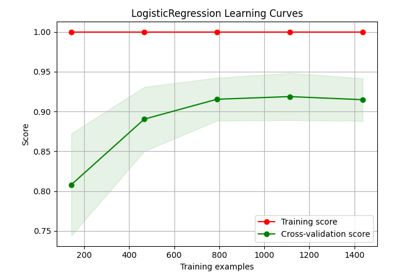
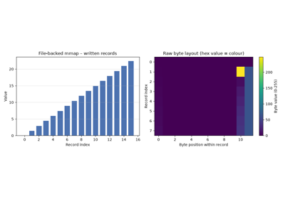

🤓 Scikit-plots Examples & Tutorials
  
 0.5.dev0+git.20260823.71eae2e - August 23, 2026 18:39 UTC

# Examples[#](#examples "Link to this heading")

This is the gallery of examples that showcase how scikit-plots can be used.
Some examples demonstrate the use of the [APIs Reference](../apis/index.html#apis-ref-index)
in general and some demonstrate specific applications in tutorial form.
Also check out our [user guide](../user_guide/index.html#user-guide-index) for more detailed
illustrations.

This page contains example plots. Click on any image to see the full image
and source code.

> **Tagging!**
> You can also browse the example gallery by [tags](../_tags/tagsindex.html#tagoverview).

## Jupyter Notebooks[#](#jupyter-notebooks "Link to this heading")

> **Note**
> GitHub

* [GitHub Sample Notebooks](https://github.com/scikit-plots/scikit-plots/tree/main/galleries/examples/00-jupyter_notebooks).
> **See also**
> 🚀 Try Scikit-Plots in Your Browser with Notebooks

No installation required. Launch one of the interactive environments below.

🚀 Launch Interactive Environments[#](#id5 "Link to this table")


| Interface | URL |
| --- | --- |
| Lab | <https://scikit-plots.github.io/dev/lite/lab/index.html> |
| Retro | <https://scikit-plots.github.io/dev/lite/tree/index.html> |
| REPL | <https://scikit-plots.github.io/dev/lite/repl/index.html?kernel=python&code=import%20this> |
jupyterlite (pyodide, xeus-python, c, c++)

jupyterlite lab pyodide:

* <https://jupyterlite-pyodide-kernel.readthedocs.io/en/latest/_static/lab/index.html>

jupyterlite lab all-in-one-pyodide[pyodide, xpython, r, c, cpp, sqlite, js, p5]:

* <https://jupyter.org/try-jupyter/lab/index.html>
* <https://jupyterlite.github.io/demo/lab/index.html>
* <https://jupyterlite.readthedocs.io/en/stable/_static/lab/index.html>

jupyterlite lab all-in-one-xeus[xpython, r, c, cpp, js]:

* <https://jupyterlite-xeus.readthedocs.io/en/stable/lite/lab/index.html>
* <https://jupyterlite.github.io/xeus-lite-demo/lab/index.html>

jupyterlite lab terminal[pyodide]:

* <https://jupyterlite.github.io/terminal/lab/index.html>
* <https://jupyterlite.github.io/cockle/>

jupyterlite lab misc:

* <https://jupyterlite.github.io/javascript-kernel/lab/index.html>
* <https://jupyterlite.github.io/p5-kernel/lab/index.html>
* <https://jupyterlite.github.io/echo-kernel/lab/index.html>

## ANNoy[#](#annoy "Link to this heading")

### ANNoy Vector Index DB[#](#annoy-vector-index-db "Link to this heading")

Examples related to the [`annoy`](../apis/scikitplot.annoy.html#module-scikitplot.annoy "scikitplot.annoy") and [`_annoy`](../apis/scikitplot.cexternals.html#module-scikitplot.cexternals._annoy "scikitplot.cexternals._annoy") submodule instance.

> **See also**
> * [Houses Prices Tree Based Models (pickling ANNImputer)](https://www.kaggle.com/code/clkmuhammed/houses-prices-tree-based-models)


[annoy.Annoy legacy c-api with examples](annoy/plot_Annoy_legacy_c_api.html)

annoy.Annoy legacy c-api with examples

[annoy.Index python-api with examples](annoy/plot_Annoy_python_api.html)

annoy.Index python-api with examples

[Index (cython) python-api benchmark with examples](annoy/plot_annoy_cython_0benchmark.html)

Index (cython) python-api benchmark with examples

[Index (cython) python-api with examples](annoy/plot_annoy_cython_api.html)

Index (cython) python-api with examples

[Approximate Nearest Neighbors with Annoy — A Hamlet Example](annoy/plot_annoy_cython_hamlet_example.html)

Approximate Nearest Neighbors with Annoy — A Hamlet Example

[annoy.Index to NPY or CSV with examples](annoy/plot_annoy_to_NPY_CSV.html)

annoy.Index to NPY or CSV with examples

[Mmap annoy.AnnoyIndex with examples](annoy/plot_mmap_script.html)

Mmap annoy.AnnoyIndex with examples

[Precision annoy.AnnoyIndex with examples](annoy/plot_precision_script.html)

Precision annoy.AnnoyIndex with examples

[Simple annoy.AnnoyIndex with examples](annoy/plot_simple_script.html)

Simple annoy.AnnoyIndex with examples

[Compile and run the C++ Annoy with examples](annoy/s_compile_cpp.html)

Compile and run the C++ Annoy with examples

## Array API support[#](#array-api-support "Link to this heading")

Examples related to the `_lib` submodule with e.g. [`LogisticRegression`](https://scikit-learn.org/dev/modules/generated/sklearn.linear_model.LogisticRegression.html#sklearn.linear_model.LogisticRegression "(in scikit-learn v1.10)") instance.

## Calibration[#](#calibration "Link to this heading")

Examples related to the [`metrics`](../apis/scikitplot.api.html#module-scikitplot.api.metrics "scikitplot.api.metrics") submodule with e.g. [`LogisticRegression`](https://scikit-learn.org/dev/modules/generated/sklearn.linear_model.LogisticRegression.html#sklearn.linear_model.LogisticRegression "(in scikit-learn v1.10)") instance.


[plot\_calibration with examples](calibration/plot_calibration_script.html)

plot\_calibration with examples

## Classification[#](#classification "Link to this heading")

Examples related to the [`estimators`](../apis/scikitplot.api.html#module-scikitplot.api.estimators "scikitplot.api.estimators") submodule with e.g. [`LogisticRegression`](https://scikit-learn.org/dev/modules/generated/sklearn.linear_model.LogisticRegression.html#sklearn.linear_model.LogisticRegression "(in scikit-learn v1.10)") instance.


[plot\_classifier\_eval with examples](classification/plot_classifier_eval_script.html)

plot\_classifier\_eval with examples

[plot\_confusion\_matrix with examples](classification/plot_confusion_matrix_script.html)

plot\_confusion\_matrix with examples

[plot\_feature\_importances with examples](classification/plot_feature_importances_script.html)

plot\_feature\_importances with examples

[plot\_learning\_curve with examples](classification/plot_learning_curve_script.html)

plot\_learning\_curve with examples

[plot\_precision\_recall with examples](classification/plot_precision_recall_script.html)

plot\_precision\_recall with examples

[plot\_roc\_curve with examples](classification/plot_roc_script.html)

plot\_roc\_curve with examples

## Clustering[#](#clustering "Link to this heading")

Examples related to the [`estimators`](../apis/scikitplot.api.html#module-scikitplot.api.estimators "scikitplot.api.estimators") submodule with e.g. [`LogisticRegression`](https://scikit-learn.org/dev/modules/generated/sklearn.linear_model.LogisticRegression.html#sklearn.linear_model.LogisticRegression "(in scikit-learn v1.10)") instance.


[plot\_elbow with examples](clustering/plot_elbow_script.html)

plot\_elbow with examples

[plot\_silhouette with examples](clustering/plot_silhouette_script.html)

plot\_silhouette with examples

# Corpus[#](#corpus "Link to this heading")

Examples for [`corpus`](../apis/scikitplot.corpus.html#module-scikitplot.corpus "scikitplot.corpus") are ordered as a learning path rather
than by implementation detail.

```
# 💡 corpus Need additionals packages
curl -O https://raw.githubusercontent.com/scikit-plots/scikit-plots/main/requirements/corpus.txt
pip install -r requirements/corpus.txt
pip install scikit-plots[corpus]

# (Recommended)
# !pip install datasets transformers
# !pip install nltk gensim langdetect faster-whisper openai-whisper pytesseract youtube-transcript-api
# sudo apt-get install tesseract-ocr

```

## Start here[#](#start-here "Link to this heading")

1. ****Configure Corpus declaratively**** — learn `FluentCorpus`, immutable
   plans, validation, branching, fingerprints, and the `materialize()`
   boundary.
2. ****Build and search a real Hamlet corpus**** — use
   `RuntimeCorpus` end to end: `run()`, `add()`, storage, retrieval,
   export, and lifecycle.
3. ****Compare chunking strategies**** — compare sentence, word, fixed-window, and
   morphological semantic chunking on the same OCR text.
4. ****Process an MP3**** — learn audio provenance and companion-transcript
   precedence without requiring Whisper in the normal gallery path.
5. ****Process a mixed-media ZIP**** — inspect archive-member routing,
   `archive.zip/member.ext` provenance, and per-extension reader settings.
6. ****Process a YouTube transcript**** — execute a deterministic local proxy,
   configure the real YouTube reader, and keep the live transcript request
   explicit and optional.
7. ****Build a multi-source WHO corpus**** — see the explicit stage-by-stage
   integration path, partial source success, keyword retrieval, adapters, and
   where `CorpusBuilder` fits.

## Which API should I use?[#](#which-api-should-i-use "Link to this heading")

| Goal | Start with |
| --- | --- |
| Process one source with direct stage control | `CorpusPipeline` |
| Build/search heterogeneous sources with partial-success reporting | `CorpusBuilder` |
| Create immutable, reusable, branchable configuration | `FluentCorpus` |
| Execute a Fluent plan and manage runtime state/lifecycle | `RuntimeCorpus` |
| Extend vector indexing/retrieval directly | `RetrievalIndex` / `VectorIndexBackend` |

## Capability matrix[#](#capability-matrix "Link to this heading")

The normal gallery path prefers deterministic local execution. Optional
capabilities are either preflighted and skipped when unavailable, or shown as
configuration-only examples.

| Example | Normal path | Optional capability | Behavior when unavailable |
| --- | --- | --- | --- |
| FluentCorpus basics | local/core | none | not applicable |
| Hamlet RuntimeCorpus | local/core + NumPy | native Annoy branch | configuration only; not built |
| OCR chunking comparison | local image | Tesseract, NLTK | explicit `SKIP` for unavailable capability |
| MP3 ingestion | MP3 + local SRT companion | NLTK, Whisper | optional sections `SKIP` |
| Mixed-media ZIP | local archive | PDF/OCR/Whisper readers | individual optional member capability may produce no documents; archive-security failures still fail |
| YouTube transcript | local synthetic proxy | youtube-transcript-api + network, NLTK | live/optional sections `SKIP` |
| WHO multi-source integration | local sidecars only | PDF/OCR/Whisper | each unavailable source reports `SKIP`; successful evidence remains |

## Gallery reliability rule[#](#gallery-reliability-rule "Link to this heading")

The examples distinguish optional capability absence from real defects:

`missing optional package/resource/native capability/network opt-in`
:   Report a visible, specific `SKIP` and continue when the example can
    remain truthful.

`invalid public API / security-policy failure / installed-backend defect`
:   Fail visibly. The gallery must not convert a real regression into a skip.

A missing local sidecar never silently enables public-network access.

## Install only what you need[#](#install-only-what-you-need "Link to this heading")

The core text/runtime examples use the normal Corpus installation. Media and
NLP examples may additionally use packages such as NLTK, an OCR backend,
Whisper, or `youtube-transcript-api`. System tools such as Tesseract may also
be required for the corresponding optional path.

Do not install every optional dependency merely to read the gallery. The
portable path is designed to remain useful when those capabilities are absent.

## Browser / WASM note[#](#browser-wasm-note "Link to this heading")

Declarative configuration, local text processing, and portable brute-force
retrieval are the strongest browser/WASM candidates. OCR, Whisper, native ANN
backends, and live external services depend on the actual JupyterLite/xeus
runtime and should not be assumed available until verified in that target
environment.


[Process an MP3 with Corpus](corpus/plot_corpus_a_tale_of_two_cities_mp3_script.html)

Process an MP3 with Corpus

[Configure Corpus with FluentCorpus](corpus/plot_corpus_fluent_corpus_script.html)

Configure Corpus with FluentCorpus

[Build and Search a Real Hamlet Corpus with FluentCorpus](corpus/plot_corpus_fluent_hamlet_retrieval_script.html)

Build and Search a Real Hamlet Corpus with FluentCorpus

[Build and Search a Real Hamlet Corpus with FluentCorpus](corpus/plot_corpus_fluent_hamlet_retrieval_script_v1.html)

Build and Search a Real Hamlet Corpus with FluentCorpus

[Build and Search a Real Hamlet Corpus with FluentCorpus](corpus/plot_corpus_fluent_hamlet_retrieval_script_v2.html)

Build and Search a Real Hamlet Corpus with FluentCorpus

[Compare Corpus Chunking Strategies on OCR Text](corpus/plot_corpus_knowledge_script.html)

Compare Corpus Chunking Strategies on OCR Text

[Build a Multi-Source WHO Corpus](corpus/plot_corpus_who_per_file_script.html)

Build a Multi-Source WHO Corpus

[Process a YouTube Transcript with Corpus](corpus/plot_corpus_who_youtube_script.html)

Process a YouTube Transcript with Corpus

[Process a Mixed-Media ZIP Archive with Corpus](corpus/plot_corpus_who_zip_script.html)

Process a Mixed-Media ZIP Archive with Corpus

## Cython[#](#id1 "Link to this heading")

Examples related to the [`cython`](../apis/scikitplot.cython.html#module-scikitplot.cython "scikitplot.cython") submodule.

```
# 💡cython Need cython and setuptools
pip install scikitplot[build] setuptools

# (Recommended)
# !pip install cython setuptools

```


[Cython quickstart: compile\_and\_load](cython/plot_00_quickstart_compile_and_load.html)

Cython quickstart: compile\_and\_load

[Browse and compile templates](cython/plot_01_browse_and_compile_templates.html)

Browse and compile templates

[Build profiles: fast-debug, release, annotate](cython/plot_02_build_profiles.html)

Build profiles: fast-debug, release, annotate

[Cache and restart reuse](cython/plot_03_cache_and_restart_reuse.html)

Cache and restart reuse

[Pin/Alias: stable handles for cached builds](cython/plot_04_pin_alias.html)

Pin/Alias: stable handles for cached builds

[Multi-module package builds (5 package examples)](cython/plot_05_package_examples_multimodule.html)

Multi-module package builds (5 package examples)

[Multi-file builds: .pxi includes and external headers](cython/plot_06_multifile_support_files.html)

Multi-file builds: .pxi includes and external headers

[C++ mode basics: cppclass and libcpp containers](cython/plot_07_cpp_mode_basics.html)

C++ mode basics: cppclass and libcpp containers

[Vector ops without NumPy: array(‘d’) + memoryviews](cython/plot_08_vector_ops_without_numpy.html)

Vector ops without NumPy: array('d') + memoryviews

[Workflow templates (train / hpo / predict) + CLI entry template](cython/plot_09_workflow_templates_cli.html)

Workflow templates (train / hpo / predict) + CLI entry template

[Cython: Realtime compile\_and\_load (.pyx)](cython/plot_cython_template.html)

Cython: Realtime compile\_and\_load (.pyx)

## Decile[#](#decile "Link to this heading")

Examples related to the [`decile`](../apis/scikitplot.decile.html#module-scikitplot.decile "scikitplot.decile") submodule with e.g. [`LogisticRegression`](https://scikit-learn.org/dev/modules/generated/sklearn.linear_model.LogisticRegression.html#sklearn.linear_model.LogisticRegression "(in scikit-learn v1.10)") instance.

> **See also**
> * Seaborn-style decile analysis (Lift / Gain / KS) [`decileplot`](../modules/generated/scikitplot.seaborn.decileplot.html#scikitplot.seaborn.decileplot "scikitplot.seaborn.decileplot")


[plot\_cumulative\_gain with examples](decile/plot_cumulative_gain_script.html)

plot\_cumulative\_gain with examples

[plot\_ks\_statistic with examples](decile/plot_ks_statistic_script.html)

plot\_ks\_statistic with examples

[plot\_lift with examples](decile/plot_lift_script.html)

plot\_lift with examples

[Introduction to modelplotpy (legacy)](decile/plot_modelplotpy_legacy_script.html)

Introduction to modelplotpy (legacy)

[Introduction to modelplotpy](decile/plot_modelplotpy_script.html)

Introduction to modelplotpy

[plot\_report with examples](decile/plot_report_script.html)

plot\_report with examples

## Decomposition[#](#decomposition "Link to this heading")

Examples related to the [`decomposition`](../apis/scikitplot.api.html#module-scikitplot.api.decomposition "scikitplot.api.decomposition") submodule with e.g. [`PCA`](https://scikit-learn.org/dev/modules/generated/sklearn.decomposition.PCA.html#sklearn.decomposition.PCA "(in scikit-learn v1.10)") instance.


[plot\_pca\_2d\_projection with examples](decomposition/plot_pca_2d_projection_script.html)

plot\_pca\_2d\_projection with examples

[plot\_pca\_component\_variance with examples](decomposition/plot_pca_component_variance_script.html)

plot\_pca\_component\_variance with examples

## Impute[#](#impute "Link to this heading")

Examples related to the [`impute`](../apis/scikitplot.impute.html#module-scikitplot.impute "scikitplot.impute") submodule
with a scikit-learn regressor (e.g., [`LinearRegression`](https://scikit-learn.org/dev/modules/generated/sklearn.linear_model.LinearRegression.html#sklearn.linear_model.LinearRegression "(in scikit-learn v1.10)")) instance.

> **See also**
> * [Houses Prices Tree Based Models (pickling ANNImputer)](https://www.kaggle.com/code/clkmuhammed/houses-prices-tree-based-models)
```
# 💡impute may need voyager
pip install scikitplot[core]

# (Optionally)
# !pip install voyager

```


[annoy impute with examples](impute/plot_impute_script.html)

annoy impute with examples

## MemMap[#](#memmap "Link to this heading")

Examples related to the [`memmap`](../apis/scikitplot.memmap.html#module-scikitplot.memmap "scikitplot.memmap") submodule.



[Memory-Mapping Showcase – Basic / Medium / Advanced](memmap/plot_mman.html)

Memory-Mapping Showcase – Basic / Medium / Advanced

## Misc[#](#misc "Link to this heading")

Examples related to the `misc` submodule.


[Misc Showcase](misc/plot_misc_script.html)

Misc Showcase

## MLflow[#](#id3 "Link to this heading")

Examples related to the [`mlflow`](../apis/scikitplot.mlflow.html#module-scikitplot.mlflow "scikitplot.mlflow") submodule
with a scikit-learn regressor (e.g., [`LinearRegression`](https://scikit-learn.org/dev/modules/generated/sklearn.linear_model.LinearRegression.html#sklearn.linear_model.LinearRegression "(in scikit-learn v1.10)")) instance.

```
# 💡mlflow Need mlflow
pip install scikitplot[mlflow]

# (Recommended)
# !pip install mlflow

```


[MLflow](mlflow/plot_mlflow.html)

MLflow

## Nc (NumCpp)[#](#nc-numcpp "Link to this heading")

Examples related to the [`nc`](../apis/scikitplot.nc.html#module-scikitplot.nc "scikitplot.nc") submodule.


[nc with examples](nc/plot_nc_test.html)

nc with examples

## Preprocessing[#](#preprocessing "Link to this heading")

Examples related to the [`preprocessing`](../apis/scikitplot.preprocessing.html#module-scikitplot.preprocessing "scikitplot.preprocessing") submodule with
e.g., [`DummyCodeEncoder`](../modules/generated/scikitplot.preprocessing.DummyCodeEncoder.html#scikitplot.preprocessing.DummyCodeEncoder "scikitplot.preprocessing.DummyCodeEncoder"),
[`GetDummies`](../modules/generated/scikitplot.preprocessing.GetDummies.html#scikitplot.preprocessing.GetDummies "scikitplot.preprocessing.GetDummies") instance.

> **See also**
> * [DummyCodeEncoder vs GetDummies](https://www.kaggle.com/code/clkmuhammed/expand-equipment-x-features)


[Comparing DummyCode Encoder with Other Encoders](preprocessing/plot_dummy_code_encoder.html)

Comparing DummyCode Encoder with Other Encoders

## Random[#](#random "Link to this heading")

Examples related to the [`random`](../apis/scikitplot.random.html#module-scikitplot.random "scikitplot.random") submodule.


[Enhanced KISS Random Generator - Complete Usage Examples](random/plot_kiss_random.html)

Enhanced KISS Random Generator - Complete Usage Examples

## Regression[#](#regression "Link to this heading")

Examples related to the [`metrics`](../apis/scikitplot.api.html#module-scikitplot.api.metrics "scikitplot.api.metrics") submodule with e.g., [`LinearRegression`](https://scikit-learn.org/dev/modules/generated/sklearn.linear_model.LinearRegression.html#sklearn.linear_model.LinearRegression "(in scikit-learn v1.10)") instance.


[plot\_residuals\_distribution with examples](regression/plot_residuals_distribution_script.html)

plot\_residuals\_distribution with examples

## Seaborn[#](#id4 "Link to this heading")

Examples related to the [`seaborn`](../apis/scikitplot.seaborn.html#module-scikitplot.seaborn "scikitplot.seaborn") submodule
with a scikit-learn regressor (e.g., [`LinearRegression`](https://scikit-learn.org/dev/modules/generated/sklearn.linear_model.LinearRegression.html#sklearn.linear_model.LinearRegression "(in scikit-learn v1.10)")) instance.


[plot\_aucplot\_script with examples](seaborn/plot_aucplot_script.html)

plot\_aucplot\_script with examples

[plot\_decileplot\_script with examples](seaborn/plot_decileplot_script.html)

plot\_decileplot\_script with examples

[plot\_evalplot\_script with examples](seaborn/plot_evalplot_script.html)

plot\_evalplot\_script with examples

## Stats[#](#stats "Link to this heading")

Examples related to the [`stats`](../apis/scikitplot.stats.html#module-scikitplot.stats "scikitplot.stats") submodule with e.g. [`LinearRegression`](https://scikit-learn.org/dev/modules/generated/sklearn.linear_model.LinearRegression.html#sklearn.linear_model.LinearRegression "(in scikit-learn v1.10)") instance.


[Gaussian Mixture Models — AIC, AICc, and BIC Model Selection](stats/plot_gaussian_mixture_models.html)

Gaussian Mixture Models — AIC, AICc, and BIC Model Selection

[plot\_residuals\_distribution with examples](stats/plot_residuals_distribution_script.html)

plot\_residuals\_distribution with examples

## Visualkeras[#](#visualkeras "Link to this heading")

Examples related to the [`visualkeras`](../apis/scikitplot.visualkeras.html#module-scikitplot.visualkeras "scikitplot.visualkeras") submodule with
e.g. a DL (ANN, CNN, NLP) [`tf.keras.Model`](https://www.tensorflow.org/api_docs/python/tf/keras/Model "(in TensorFlow v2.8)") model instance.

> **Important**
> * ⚠️ Hugging Face Deprecated Transformers models are not supported in TensorFlow — use KerasNLP or KerasHub instead.
* [🚫 transformers deprecated models](https://www.linkedin.com/feed/update/urn:li:activity:7338966863403528192/).
```
# 💡visualkeras Need aggdraw tensorflow or tensorflow-cpu
pip install scikitplot[core, cpu]

# (Recommended)
# !pip install aggdraw
# !pip install tensorflow

python -c "import tensorflow as tf, google.protobuf as pb; print('tf', tf.__version__); print('protobuf', pb.__version__)"
python -m pip check

# If Needed
# pip install -U "protobuf<6"
# pip install protobuf==5.29.4
import tensorflow as tf

```


[Visualkeras: Spam Classification Conv1D Dense Example](visualkeras/plot_dl_ann_conv_dense.html)

Visualkeras: Spam Classification Conv1D Dense Example

[visualkeras: Spam Dense example](visualkeras/plot_dl_ann_dense.html)

visualkeras: Spam Dense example

[visualkeras: autoencoder example](visualkeras/plot_dl_cnn_autoencoder.html)

visualkeras: autoencoder example

[visualkeras: custom vgg16 example](visualkeras/plot_dl_cnn_custom_vgg16.html)

visualkeras: custom vgg16 example

[visualkeras: custom vgg16 show dimension example](visualkeras/plot_dl_cnn_custom_vgg16_show_dimension.html)

visualkeras: custom vgg16 show dimension example

[visualkeras: EfficientNetV2 example](visualkeras/plot_dl_cnn_efficientnetv2.html)

visualkeras: EfficientNetV2 example

[visualkeras: ResNetV2 example](visualkeras/plot_dl_cnn_resnetv2.html)

visualkeras: ResNetV2 example

[visualkeras: custom VGG example](visualkeras/plot_dl_cnn_vgg.html)

visualkeras: custom VGG example

[visualkeras: Vector Index DB](visualkeras/plot_dl_nlp_vector_index_db.html)

visualkeras: Vector Index DB

[`Download all examples in Python source code: auto_examples_python.zip`](../_downloads/07fcc19ba03226cd3d83d4e40ec44385/auto_examples_python.zip)

[`Download all examples in Jupyter notebooks: auto_examples_jupyter.zip`](../_downloads/6f1e7a639e0699d6164445b55e6c116d/auto_examples_jupyter.zip)

[Gallery generated by Sphinx-Gallery](https://sphinx-gallery.github.io)