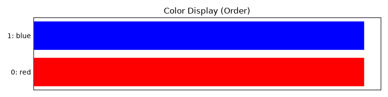
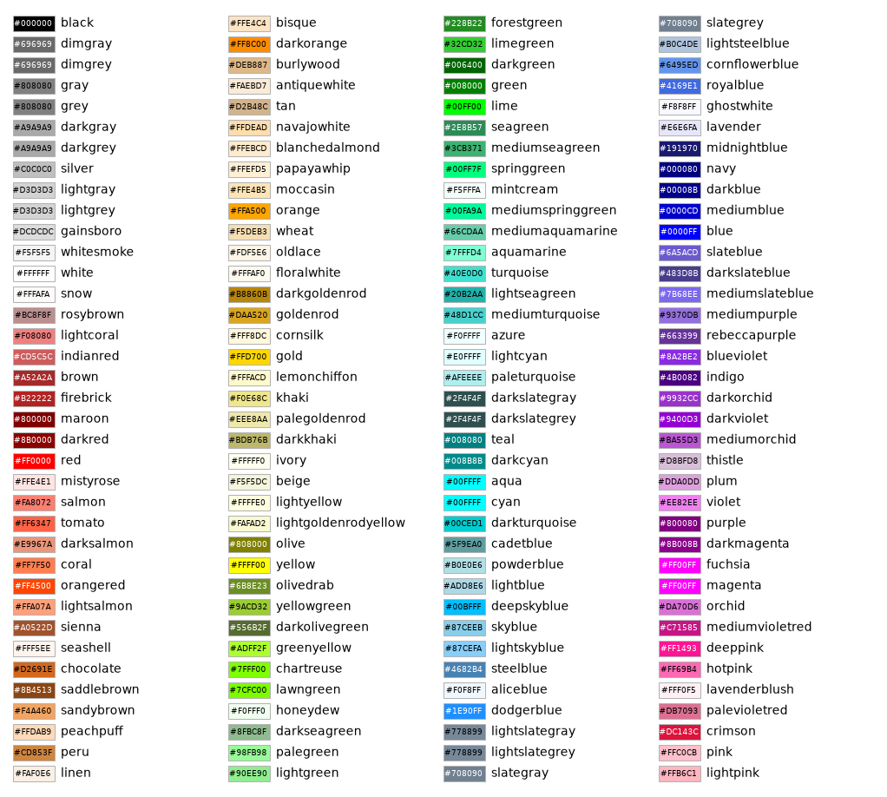
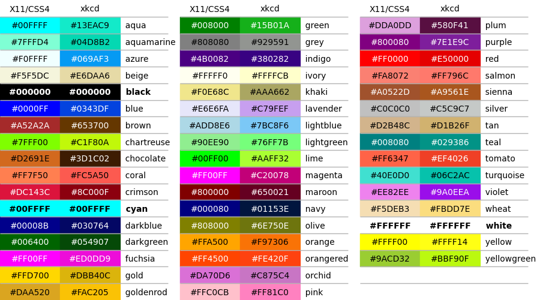

> **Note**
> [Go to the end](#sphx-glr-download-auto-examples-misc-plot-misc-script-py)
to download the full example code or to run this example in your browser via JupyterLite or Binder.

# Misc Showcase[#](#misc-showcase "Link to this heading")

This gallery example demonstrates the
 module.

## Imports[#](#imports "Link to this heading")

```
from scikitplot.misc import (
    closest_color_name,
    display_colors,
    plot_colortable,
    plot_overlapping_colors,
)

```
```
closest_color_name()

```
```
['black']

```
```
display_colors(['red', 'blue'], show_indices=True)

```

```
fig = plot_colortable()

```

```
# https://xkcd.com/color/rgb/
# https://xkcd.com/color/rgb.txt
# https://www.w3schools.com/cssref/css_colors.php
fig = plot_overlapping_colors()

```


Tags: [plot-type: barh](../../_tags/plot-type-barh.html) [plot-type: text](../../_tags/plot-type-text.html) [level: beginner](../../_tags/level-beginner.html) [purpose: showcase](../../_tags/purpose-showcase.html)

****Total running time of the script:**** (0 minutes 1.390 seconds)

[](https://mybinder.org/v2/gh/scikit-plots/scikit-plots/main?urlpath=lab/tree/notebooks/auto_examples/misc/plot_misc_script.ipynb)[](../../lite/lab/index.html?path=auto_examples/misc/plot_misc_script.ipynb)

[`Download Jupyter notebook: plot_misc_script.ipynb`](../../_downloads/e71085dfe27337a86e3061926186c620/plot_misc_script.ipynb)

[`Download Python source code: plot_misc_script.py`](../../_downloads/488bafe3b9be3d22c4c2dee6e7cd2550/plot_misc_script.py)

[`Download zipped: plot_misc_script.zip`](../../_downloads/5dbae822e2c247f22d27eb7ca08b3ac0/plot_misc_script.zip)

Related examples


[plot\_residuals\_distribution with examples](../stats/plot_residuals_distribution_script.html)

plot\_residuals\_distribution with examples

[plot\_residuals\_distribution with examples](../regression/plot_residuals_distribution_script.html)

plot\_residuals\_distribution with examples

[Introduction to modelplotpy](../decile/plot_modelplotpy_script.html)

Introduction to modelplotpy

[plot\_feature\_importances with examples](../classification/plot_feature_importances_script.html)

plot\_feature\_importances with examples

[Gallery generated by Sphinx-Gallery](https://sphinx-gallery.github.io)