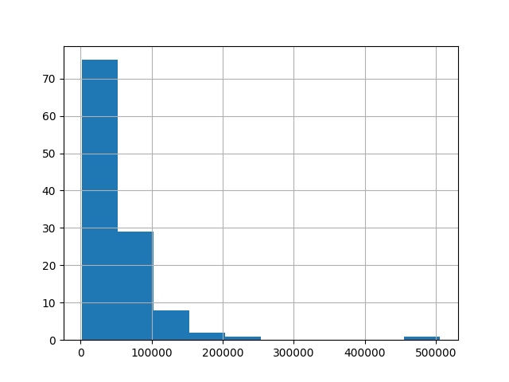
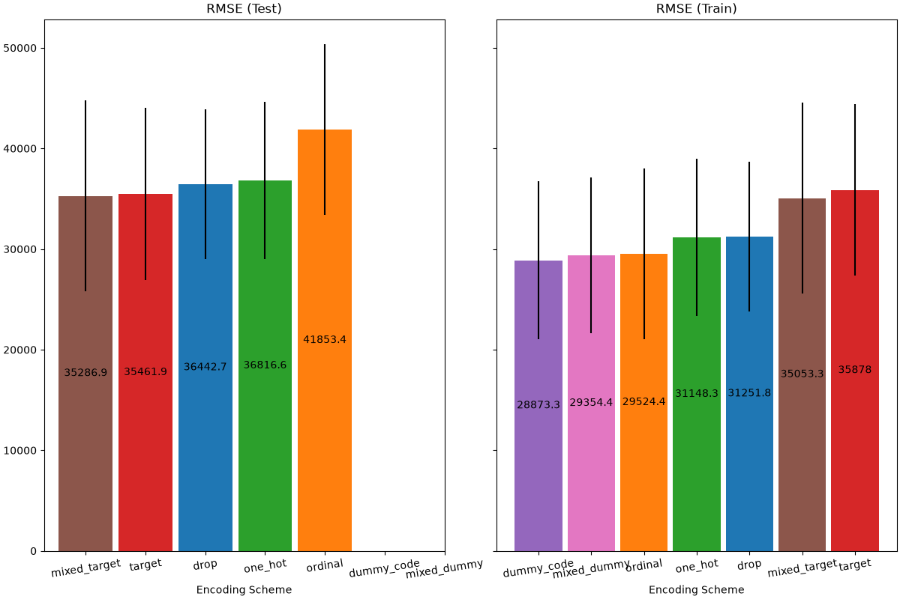
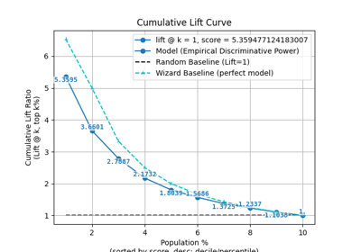
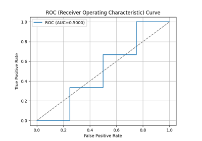
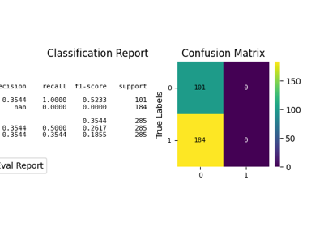

> **Note**
> [Go to the end](#sphx-glr-download-auto-examples-preprocessing-plot-dummy-code-encoder-py)
to download the full example code or to run this example in your browser via JupyterLite or Binder.

# Comparing DummyCode Encoder with Other Encoders[#](#comparing-dummycode-encoder-with-other-encoders "Link to this heading")

The [`DummyCodeEncoder`](../../modules/generated/scikitplot.preprocessing.DummyCodeEncoder.html#scikitplot.preprocessing.DummyCodeEncoder "scikitplot.preprocessing.DummyCodeEncoder") to encode each categorical features into
dummy/indicator 0/1 variables. In this example, we will compare various
different approaches for handling categorical features:
[`GetDummies`](../../modules/generated/scikitplot.preprocessing.GetDummies.html#scikitplot.preprocessing.GetDummies "scikitplot.preprocessing.GetDummies"), `TargetEncoder`,
`OrdinalEncoder`, `OneHotEncoder`,
and dropping the category.

> **Note**
> `fit(X, y).transform(X)` does not equal `fit_transform(X, y)` because a
cross fitting scheme is used in `fit_transform` for encoding. See the
[User Guide](https://scikit-learn.org/dev/modules/preprocessing.html#target-encoder "(in scikit-learn v1.10)") for details.
```
# Authors: The scikit-plots developers
# SPDX-License-Identifier: BSD-3-Clause

```

## Loading Data[#](#loading-data "Link to this heading")

First, we load the “autoscout24” dataset:

```
from scikitplot.datasets import load_dataset

df = load_dataset("autoscout24")
df

```

|  | id | price | make | model | model\_version | registration\_date | mileage\_km\_raw | vehicle\_type | body\_type | fuel\_category | primary\_fuel | transmission | power\_kw | power\_hp | nr\_seats | nr\_doors | country\_code | zip | city | latitude | longitude | is\_used | seller\_is\_dealer | offer\_type | description | equipment\_comfort | equipment\_entertainment | equipment\_extra | equipment\_safety |
| --- | --- | --- | --- | --- | --- | --- | --- | --- | --- | --- | --- | --- | --- | --- | --- | --- | --- | --- | --- | --- | --- | --- | --- | --- | --- | --- | --- | --- | --- |
| 0 | 1df9ec13-c5a4-4d6d-85cd-dc198b43ed36 | 36900.0 | Mercedes-Benz | CLA 180 | SB AMG Night Edition Pano/StdHG/Dist/Tot | 2025-07-01 | 3500.0 | Car | Other | Gasoline | Super 95 | Automatic | 100.0 | 136.0 | 5.0 | 5.0 | DE | 86633 | Neuburg an der Donau | 48.727590 | 11.200660 | False | True | U | <ul><li>Fahrzeug-Nr. für Kundenanfragen: 05502... | ['360° camera', 'Armrest', 'Automatic climate ... | ['Android Auto', 'Apple CarPlay', 'Bluetooth',... | ['Alloy wheels', 'Ambient lighting', 'Automati... | ['ABS', 'Adaptive Cruise Control', 'Adaptive h... |
| 1 | 9f455135-68ca-4dd8-aa39-139b27a7dcf2 | 147990.0 | Porsche | Panamera | 4 E-Hybrid\*SPORT-DESIGN\*EXCLUSIVE-MANUFAKTUR\*B... | 2025-05-01 | 16990.0 | Car | Compact | Electric/Gasoline | Super 95 | Automatic | 346.0 | 470.0 | 4.0 | 5.0 | AT | 8141 | Premstätten | 46.956710 | 15.402450 | True | True | U | Dieser neue <strong>Porsche Panamera 4 E-Hybri... | ['360° camera', 'Air conditioning', 'Air suspe... | ['Android Auto', 'Apple CarPlay', 'Bluetooth',... | ['Alloy wheels (21")', 'Ambient lighting', 'Au... | ['ABS', 'Adaptive Cruise Control', 'Adaptive h... |
| 2 | b1c0eaff-a414-49f3-bf20-dd3672fe5233 | 26900.0 | BMW | 320 | d Touring mhev 48V Luxury auto | 2020-09-01 | 62503.0 | Car | Station wagon | Electric/Diesel | Electricity | Automatic | 140.0 | 190.0 | 5.0 | 5.0 | IT | 12100 | Cuneo - Cn | 44.425960 | 7.556430 | True | True | U | <strong>Prima di recarsi presso una nostra sed... | [] | [] | [] | [] |
| 3 | e5f80b61-74ac-4394-8c0a-ec756145ae9b | 69900.0 | Porsche | 997 | 4S WLS GT3 AeroCup Klappe Chrono Bose 1.Hd ! | 2008-02-01 | 88017.0 | Car | Coupe | Gasoline | Regular/Benzine 91 | Automatic | 280.0 | 381.0 | 4.0 | 2.0 | DE | 89155 | Erbach | 48.302620 | 9.907480 | True | True | U | <strong>Porsche 997 Carrera 4S WLS Exclusive -... | ['Air conditioning', 'Armrest', 'Automatic cli... | ['CD player', 'Hands-free equipment', 'On-boar... | ['Alloy wheels', 'Automatically dimming interi... | ['ABS', 'Alarm system', 'Central door lock', '... |
| 4 | 9fc53b43-2210-4515-a499-2aa1c8e83e4d | 42264.0 | Mercedes-Benz | A 250 | e con tecnologí híbrida EQ | 2025-07-01 | 6000.0 | Car | Sedan | Electric/Gasoline | NaN | Automatic | 160.0 | 218.0 | 5.0 | 5.0 | ES | 46470 | VALENCIA | 39.403970 | -0.385390 | True | True | U | <strong>Precio al contado: 44800 euros</strong... | ['Automatic climate control', 'Cruise control'] | ['Bluetooth'] | ['Alloy wheels'] | ['ABS', 'Side airbag'] |
| ... | ... | ... | ... | ... | ... | ... | ... | ... | ... | ... | ... | ... | ... | ... | ... | ... | ... | ... | ... | ... | ... | ... | ... | ... | ... | ... | ... | ... | ... |
| 111 | 649dbdd4-d01b-4bd6-b712-47809b2651df | 1495.0 | Alfa Romeo | 147 | 1.6 T.Spark Progression | 2001-10-01 | 214745.0 | Car | Compact | Gasoline | Super 95 | Manual | 77.0 | 105.0 | 5.0 | 3.0 | NL | 1704 RX | HEERHUGOWAARD | 52.685610 | 4.830900 | True | True | U | Inruiler, zo mee!!<br /><br /><strong>Meer inf... | ['Air conditioning', 'Electrical side mirrors'... | ['CD player', 'Radio'] | [] | ['ABS', 'Alarm system', 'Central door lock', '... |
| 112 | 6dda33d9-579c-46e8-905c-885bd870d006 | 2500.0 | BMW | 320 | 320i | 2005-07-01 | 242100.0 | Car | Sedan | Gasoline | NaN | Manual | 125.0 | 170.0 | 5.0 | 4.0 | DE | 90411 | Nürnberg | 49.474428 | 11.103918 | True | False | U | Schäden vorne krilo, tsprapina Tür vorne recht... | ['Air conditioning', 'Armrest', 'Electrical si... | ['On-board computer'] | ['Alloy wheels', 'Emergency tyre'] | ['ABS', 'Alarm system', 'Central door lock wit... |
| 113 | f4168e59-46f6-417c-a51f-1e07f8e0a082 | 34350.0 | Alfa Romeo | Junior | Ibrida Q4 1.2 MHEV eAWD e-DCT6 | 2025-10-01 | 10.0 | Car | Off-Road/Pick-up | Gasoline | NaN | Automatic | 100.0 | 136.0 | 5.0 | 5.0 | AT | 4240 | Freistadt | 48.492650 | 14.503010 | False | True | N | Wunderschöner Alfa Romeo Junior Ibrida Q4, eAW... | ['Air conditioning', 'Armrest', 'Automatic cli... | ['Android Auto', 'Apple CarPlay', 'Bluetooth',... | ['Alloy wheels', 'Automatically dimming interi... | ['ABS', 'Adaptive Cruise Control', 'Adaptive h... |
| 114 | 9e36a6c7-b78d-45d2-acae-f42fb4d48239 | 25999.0 | BMW | 535 | 535d Touring Sport-Aut. | 2016-07-01 | 128000.0 | Car | Station wagon | Diesel | NaN | Automatic | 230.0 | 313.0 | 5.0 | 5.0 | DE | 85276 | pfaffenhofen | 48.529860 | 11.503230 | True | False | U | Saison Fahrzeug 5-10 ,original M-Paket von wer... | ['Air suspension', 'Armrest', 'Automatic clima... | ['Bluetooth', 'CD player', 'Hands-free equipme... | ['Alloy wheels', 'Cargo barrier', 'Electronic ... | ['ABS', 'Bi-Xenon headlights', 'Central door l... |
| 115 | 5add7191-7888-4d00-af1e-f279f9d5fdd7 | 1800.0 | BMW | 320 | 320i touring | 2001-01-01 | 231000.0 | Car | Station wagon | Gasoline | NaN | Manual | 125.0 | 170.0 | 5.0 | 5.0 | DE | 37351 | NaN | 51.342832 | 10.252152 | True | False | U | Zum Verkauf Steht ein BMW e46 320i vfl mit dem... | ['Air conditioning', 'Armrest', 'Automatic cli... | ['Android Auto', 'Bluetooth', 'CD player', 'Di... | ['Alloy wheels', 'Catalytic Converter', 'Emerg... | ['ABS', 'Central door lock', 'Central door loc... |

116 rows × 29 columns

  
  
```
df.info()

```
```
<class 'pandas.core.frame.DataFrame'>
RangeIndex: 116 entries, 0 to 115
Data columns (total 29 columns):
 #   Column                   Non-Null Count  Dtype
---  ------                   --------------  -----
 0   id                       116 non-null    object
 1   price                    116 non-null    float64
 2   make                     116 non-null    object
 3   model                    116 non-null    object
 4   model_version            115 non-null    object
 5   registration_date        116 non-null    object
 6   mileage_km_raw           116 non-null    float64
 7   vehicle_type             116 non-null    object
 8   body_type                116 non-null    object
 9   fuel_category            116 non-null    object
 10  primary_fuel             57 non-null     object
 11  transmission             114 non-null    object
 12  power_kw                 116 non-null    float64
 13  power_hp                 116 non-null    float64
 14  nr_seats                 112 non-null    float64
 15  nr_doors                 111 non-null    float64
 16  country_code             116 non-null    object
 17  zip                      116 non-null    object
 18  city                     115 non-null    object
 19  latitude                 116 non-null    float64
 20  longitude                116 non-null    float64
 21  is_used                  116 non-null    bool
 22  seller_is_dealer         116 non-null    bool
 23  offer_type               116 non-null    object
 24  description              113 non-null    object
 25  equipment_comfort        116 non-null    object
 26  equipment_entertainment  116 non-null    object
 27  equipment_extra          116 non-null    object
 28  equipment_safety         116 non-null    object
dtypes: bool(2), float64(8), object(19)
memory usage: 24.8+ KB

```

For this example, we use the following subset of numerical and categorical
features in the data. Candidate target\_features = [“seller\_is\_dealer”, “price”]

```
target_name = "price"
numerical_features = [
    "seller_is_dealer",
    "mileage_km_raw",
    "power_kw",
    "power_hp",
    # "nr_seats",
    "latitude",
    "longitude",
]
categorical_features = [
    # "id",
    "make",
    "model",
    "body_type",
    "fuel_category",
    # "primary_fuel",
    # "transmission",
]
equipment_features = [
    "equipment_comfort",
    "equipment_entertainment",
    "equipment_extra",
    "equipment_safety",
]

df = df[numerical_features + categorical_features + equipment_features + [target_name]]
df[equipment_features] = df[equipment_features].replace(r"\[|\]|'", "", regex=True)
df.T

```

|  | 0 | 1 | 2 | 3 | 4 | 5 | 6 | 7 | 8 | 9 | 10 | 11 | 12 | 13 | 14 | 15 | 16 | 17 | 18 | 19 | 20 | 21 | 22 | 23 | 24 | 25 | 26 | 27 | 28 | 29 | 30 | 31 | 32 | 33 | 34 | 35 | 36 | 37 | 38 | 39 | ... | 76 | 77 | 78 | 79 | 80 | 81 | 82 | 83 | 84 | 85 | 86 | 87 | 88 | 89 | 90 | 91 | 92 | 93 | 94 | 95 | 96 | 97 | 98 | 99 | 100 | 101 | 102 | 103 | 104 | 105 | 106 | 107 | 108 | 109 | 110 | 111 | 112 | 113 | 114 | 115 |
| --- | --- | --- | --- | --- | --- | --- | --- | --- | --- | --- | --- | --- | --- | --- | --- | --- | --- | --- | --- | --- | --- | --- | --- | --- | --- | --- | --- | --- | --- | --- | --- | --- | --- | --- | --- | --- | --- | --- | --- | --- | --- | --- | --- | --- | --- | --- | --- | --- | --- | --- | --- | --- | --- | --- | --- | --- | --- | --- | --- | --- | --- | --- | --- | --- | --- | --- | --- | --- | --- | --- | --- | --- | --- | --- | --- | --- | --- | --- | --- | --- | --- |
| seller\_is\_dealer | True | True | True | True | True | True | True | True | True | True | True | True | True | True | True | True | True | True | True | True | True | True | True | True | True | True | True | False | True | True | True | False | True | True | True | True | True | True | True | False | ... | True | True | True | False | False | True | True | True | True | True | True | True | True | True | False | True | True | True | True | True | True | True | True | True | False | True | False | True | True | True | False | True | True | False | True | True | False | True | False | False |
| mileage\_km\_raw | 3500.0 | 16990.0 | 62503.0 | 88017.0 | 6000.0 | 15500.0 | 94600.0 | 25400.0 | 7033.0 | 72500.0 | 20300.0 | 160600.0 | 64308.0 | 12500.0 | 62280.0 | 53500.0 | 23196.0 | 87915.0 | 14000.0 | 85977.0 | 85497.0 | 235300.0 | 50.0 | 85593.0 | 21358.0 | 64626.0 | 177253.0 | 128000.0 | 114999.0 | 57600.0 | 37172.0 | 89500.0 | 109304.0 | 34000.0 | 150000.0 | 13819.0 | 77000.0 | 84000.0 | 1.0 | 196000.0 | ... | 8000.0 | 121188.0 | 55445.0 | 182300.0 | 110000.0 | 157495.0 | 62588.0 | 117554.0 | 93586.0 | 12850.0 | 88700.0 | 15250.0 | 14500.0 | 52000.0 | 199000.0 | 91000.0 | 9900.0 | 2900.0 | 56330.0 | 131703.0 | 9900.0 | 10000.0 | 5788.0 | 103000.0 | 159000.0 | 61885.0 | 123164.0 | 157526.0 | 87741.0 | 162000.0 | 380541.0 | 52041.0 | 67000.0 | 95000.0 | 39936.0 | 214745.0 | 242100.0 | 10.0 | 128000.0 | 231000.0 |
| power\_kw | 100.0 | 346.0 | 140.0 | 280.0 | 160.0 | 200.0 | 195.0 | 283.0 | 150.0 | 404.0 | 220.0 | 140.0 | 183.0 | 110.0 | 111.0 | 135.0 | 127.0 | 103.0 | 230.0 | 100.0 | 140.0 | 140.0 | 588.0 | 110.0 | 346.0 | 110.0 | 85.0 | 110.0 | 120.0 | 100.0 | 135.0 | 293.0 | 110.0 | 375.0 | 120.0 | 150.0 | 150.0 | 100.0 | 92.0 | 110.0 | ... | 145.0 | 140.0 | 110.0 | 190.0 | 140.0 | 390.0 | 272.0 | 404.0 | 135.0 | 353.0 | 100.0 | 90.0 | 430.0 | 110.0 | 110.0 | 190.0 | 145.0 | 185.0 | 180.0 | 165.0 | 110.0 | 180.0 | 66.0 | 100.0 | 125.0 | 280.0 | 125.0 | 293.0 | 96.0 | 140.0 | 120.0 | 283.0 | 210.0 | 206.0 | 455.0 | 77.0 | 125.0 | 100.0 | 230.0 | 125.0 |
| power\_hp | 136.0 | 470.0 | 190.0 | 381.0 | 218.0 | 272.0 | 265.0 | 385.0 | 204.0 | 549.0 | 299.0 | 190.0 | 249.0 | 150.0 | 151.0 | 184.0 | 173.0 | 140.0 | 313.0 | 136.0 | 190.0 | 190.0 | 799.0 | 150.0 | 470.0 | 150.0 | 116.0 | 150.0 | 163.0 | 136.0 | 184.0 | 398.0 | 150.0 | 510.0 | 163.0 | 204.0 | 204.0 | 136.0 | 125.0 | 150.0 | ... | 197.0 | 190.0 | 150.0 | 258.0 | 190.0 | 530.0 | 370.0 | 549.0 | 184.0 | 480.0 | 136.0 | 122.0 | 585.0 | 150.0 | 150.0 | 258.0 | 197.0 | 252.0 | 245.0 | 224.0 | 150.0 | 245.0 | 90.0 | 136.0 | 170.0 | 381.0 | 170.0 | 398.0 | 131.0 | 190.0 | 163.0 | 385.0 | 286.0 | 280.0 | 619.0 | 105.0 | 170.0 | 136.0 | 313.0 | 170.0 |
| latitude | 48.72759 | 46.95671 | 44.42596 | 48.30262 | 39.40397 | 51.78649 | 50.79976 | 50.88688 | 48.3468 | 51.09111 | 51.4595 | 48.50503 | 52.29444 | 48.11777 | 40.30452 | 49.11204 | 49.49586 | 52.24283 | 40.50052 | 43.38405 | 52.29892 | 52.56014 | 49.1482 | 38.34967 | 52.08303 | 49.77554 | 52.19726 | 45.6602 | 39.40666 | 51.6189 | 52.4318 | 50.9747 | 42.13092 | 45.25556 | 50.98218 | 52.20721 | 45.18686 | 41.72291 | 44.9959 | 47.8944 | ... | 50.01429 | 48.27601 | 41.55724 | 50.08384 | 38.0983 | 52.22616 | 48.79136 | 47.04049 | 51.9964 | 51.33054 | 48.20804 | 52.31028 | 51.05798 | 45.07848 | 49.75478 | 47.91965 | 50.94582 | 49.75162 | 51.89442 | 52.72111 | 41.78959 | 49.90362 | 51.11182 | 50.63921 | 52.0119 | 50.97362 | 40.17597 | 53.14879 | 44.70997 | 50.62295 | 48.30522 | 50.94001 | 43.48807 | 42.4125 | 48.76962 | 52.68561 | 49.474428 | 48.49265 | 48.52986 | 51.342832 |
| longitude | 11.20066 | 15.40245 | 7.55643 | 9.90748 | -0.38539 | 4.64821 | 6.77983 | 4.66458 | 10.90495 | 11.09989 | 6.99468 | 9.21102 | 9.8299 | 13.15253 | -3.4558 | 8.4725 | 0.1479 | 6.75995 | -3.89211 | -5.81072 | 13.27423 | 13.36774 | 9.21955 | -0.47338 | 11.58187 | 6.68476 | 4.92202 | 8.79348 | -0.38353 | 7.63174 | 4.87335 | 4.895 | -0.41563 | 4.72005 | 9.79119 | 8.7816 | 11.25692 | 12.60516 | 7.69085 | 13.12509 | ... | 10.21599 | 14.02283 | 2.03801 | 8.78389 | 13.3488 | 5.97542 | 9.77233 | 15.4663 | 4.69895 | 3.29288 | 13.52729 | 4.93382 | 5.21715 | 7.55672 | 6.63915 | 16.21685 | 6.89468 | 8.11854 | 10.1577 | 8.2684 | 12.59509 | 8.85771 | 4.08961 | 3.05859 | 4.36026 | 11.06165 | 18.03049 | 7.05146 | 8.02503 | 3.03501 | 12.38638 | 4.01635 | -5.71842 | 12.76893 | 11.97135 | 4.8309 | 11.103918 | 14.50301 | 11.50323 | 10.252152 |
| make | Mercedes-Benz | Porsche | BMW | Porsche | Mercedes-Benz | Mercedes-Benz | BMW | Porsche | Mercedes-Benz | Porsche | Porsche | BMW | Volvo | Mercedes-Benz | BMW | BMW | BMW | BMW | Mercedes-Benz | BMW | BMW | BMW | Mercedes-Benz | Volvo | Porsche | BMW | BMW | BMW | Audi | BMW | BMW | BMW | BMW | BMW | Audi | Mercedes-Benz | Audi | BMW | Ford | BMW | ... | Mercedes-Benz | BMW | Audi | BMW | BMW | BMW | Porsche | Porsche | BMW | Porsche | BMW | Mercedes-Benz | Mercedes-Benz | BMW | BMW | BMW | Mercedes-Benz | Audi | Porsche | BMW | BMW | BMW | Suzuki | BMW | BMW | Porsche | Audi | BMW | Honda | BMW | BMW | Porsche | BMW | Alfa Romeo | BMW | Alfa Romeo | BMW | Alfa Romeo | BMW | BMW |
| model | CLA 180 | Panamera | 320 | 997 | A 250 | CLA 250 | 530 | 992 | GLC 200 | Panamera | Boxster | 420 | XC90 | CLA 200 | X1 | 120 | i3 | 218 | CLE 300 | 118 | 320 | 320 | G 63 AMG | XC40 | Cayenne | 318 | 316 | 118 | Q5 | 116 | 420 | X5 | 318 | M3 | A6 | C 300 | Q3 | 118 | Focus | 418 | ... | GLC 300 | 520 | Q3 | 330 | X4 | M850 | 991 | Cayenne | 330 | 992 | 118 | Citan | G 63 AMG | X2 | 318 | 430 | E 220 | A5 | Macan | 325 | X2 | 330 | Swift | 218 | 320 | Macan | A5 | X5 | HR-V | X3 | 320 | 911 | X5 | Giulia | iX | 147 | 320 | Junior | 535 | 320 |
| body\_type | Other | Compact | Station wagon | Coupe | Sedan | Sedan | Station wagon | Coupe | Off-Road/Pick-up | Sedan | Convertible | Sedan | Off-Road/Pick-up | Station wagon | Off-Road/Pick-up | Sedan | Sedan | Sedan | Coupe | Compact | Station wagon | Station wagon | Off-Road/Pick-up | Off-Road/Pick-up | Off-Road/Pick-up | Station wagon | Compact | Sedan | Off-Road/Pick-up | Sedan | Compact | Off-Road/Pick-up | Station wagon | Sedan | Station wagon | Station wagon | Off-Road/Pick-up | Sedan | Sedan | Coupe | ... | Off-Road/Pick-up | Station wagon | Off-Road/Pick-up | Sedan | Off-Road/Pick-up | Sedan | Convertible | Off-Road/Pick-up | Station wagon | Convertible | Compact | Transporter | Off-Road/Pick-up | Off-Road/Pick-up | Sedan | Coupe | Sedan | Sedan | Off-Road/Pick-up | Station wagon | Off-Road/Pick-up | Station wagon | Compact | Station wagon | Coupe | Off-Road/Pick-up | Sedan | Off-Road/Pick-up | Off-Road/Pick-up | Off-Road/Pick-up | Other | Coupe | Off-Road/Pick-up | Sedan | Off-Road/Pick-up | Compact | Sedan | Off-Road/Pick-up | Station wagon | Station wagon |
| fuel\_category | Gasoline | Electric/Gasoline | Electric/Diesel | Gasoline | Electric/Gasoline | Electric | Diesel | Gasoline | Gasoline | Gasoline | Gasoline | Diesel | Diesel | Diesel | Diesel | Gasoline | Electric | Gasoline | Electric/Gasoline | Gasoline | Diesel | Diesel | Gasoline | Diesel | Electric/Gasoline | Diesel | Gasoline | Diesel | Diesel | Gasoline | Gasoline | Electric/Gasoline | Diesel | Gasoline | Diesel | Electric/Gasoline | Diesel | Gasoline | Electric/Gasoline | Diesel | ... | Electric/Diesel | Diesel | Gasoline | Diesel | Diesel | Gasoline | Gasoline | Electric/Gasoline | Electric/Gasoline | Gasoline | Gasoline | Electric | Gasoline | Diesel | Diesel | Diesel | Diesel | Electric/Gasoline | Gasoline | Diesel | Diesel | Gasoline | Gasoline | Gasoline | Gasoline | Gasoline | CNG | Electric/Gasoline | Gasoline | Diesel | Diesel | Gasoline | Diesel | Gasoline | Electric | Gasoline | Gasoline | Gasoline | Diesel | Gasoline |
| equipment\_comfort | 360° camera, Armrest, Automatic climate contro... | 360° camera, Air conditioning, Air suspension,... |  | Air conditioning, Armrest, Automatic climate c... | Automatic climate control, Cruise control | Air conditioning, Automatic climate control, C... | Air conditioning, Air suspension, Armrest, Aut... | Air conditioning, Armrest, Automatic climate c... | 360° camera, Air conditioning, Automatic clima... | 360° camera, Air conditioning, Air suspension,... | Air conditioning, Automatic climate control, 2... | Air conditioning, Armrest, Automatic climate c... | Air conditioning, Armrest, Automatic climate c... | Automatic climate control, Electric tailgate, ... |  | Armrest, Automatic climate control, Cruise con... |  | Air conditioning, Automatic climate control, 2... |  |  | Air conditioning, Armrest, Automatic climate c... | Air conditioning, Armrest, Automatic climate c... | 360° camera, Air suspension, Armrest, Automati... | Automatic climate control, Electrical side mir... | 360° camera, Air conditioning, Air suspension,... | Armrest, Automatic climate control, Cruise con... | Air conditioning, Cruise control, Electrical s... | Armrest, Automatic climate control, Cruise con... | Automatic climate control, Cruise control | Air conditioning, Armrest, Automatic climate c... | Air conditioning, Automatic climate control, 2... | Air suspension, Armrest, Automatic climate con... |  | 360° camera, Armrest, Automatic climate contro... | Air conditioning, Armrest, Automatic climate c... | Armrest, Automatic climate control, Cruise con... | Air conditioning, Armrest, Automatic climate c... | Air conditioning, Armrest, Automatic climate c... | Automatic climate control, 2 zones, Cruise con... | Armrest, Automatic climate control, Cruise con... | ... | 360° camera, Automatic climate control, 4 zone... | Air suspension, Armrest, Automatic climate con... | Air conditioning, Automatic climate control, M... | Armrest, Automatic climate control, Electrical... | Armrest, Cruise control, Electric tailgate, El... | Air conditioning, Automatic climate control, C... | Air conditioning, Armrest, Automatic climate c... | 360° camera, Air suspension, Cruise control, H... | 360° camera, Air conditioning, Automatic clima... | 360° camera, Air conditioning, Armrest, Automa... | Air conditioning, Automatic climate control, C... | Air conditioning, Automatic climate control, A... | 360° camera, Air conditioning, Armrest, Automa... | Air conditioning, Armrest, Automatic climate c... | 360° camera, Armrest, Automatic climate contro... | Armrest, Automatic climate control, Cruise con... | 360° camera, Air conditioning, Automatic clima... | 360° camera, Armrest, Automatic climate contro... | Air conditioning, Armrest, Automatic climate c... | Air conditioning, Armrest, Automatic climate c... | Armrest, Automatic climate control, 3 zones, C... | 360° camera, Air conditioning, Armrest, Automa... | Air conditioning, Cruise control, Electrical s... | Air conditioning, Armrest, Automatic climate c... | Air conditioning, Cruise control, Leather seat... | Air conditioning, Automatic climate control, 3... | Armrest, Automatic climate control, Cruise con... | 360° camera, Air conditioning, Air suspension,... |  | Armrest, Automatic climate control, Cruise con... | Air conditioning, Armrest, Automatic climate c... | Air conditioning, Armrest, Automatic climate c... |  |  | 360° camera, Air conditioning, Air suspension,... | Air conditioning, Electrical side mirrors, Lum... | Air conditioning, Armrest, Electrical side mir... | Air conditioning, Armrest, Automatic climate c... | Air suspension, Armrest, Automatic climate con... | Air conditioning, Armrest, Automatic climate c... |
| equipment\_entertainment | Android Auto, Apple CarPlay, Bluetooth, Digita... | Android Auto, Apple CarPlay, Bluetooth, Digita... |  | CD player, Hands-free equipment, On-board comp... | Bluetooth | Android Auto, Apple CarPlay, Bluetooth, Digita... | Android Auto, Apple CarPlay, Bluetooth, Digita... | Bluetooth, On-board computer | Android Auto, Apple CarPlay, Digital cockpit, ... | Android Auto, Apple CarPlay, Bluetooth, Digita... | Apple CarPlay, Bluetooth, CD player, Digital r... | Bluetooth, CD player, Hands-free equipment, On... | Android Auto, Apple CarPlay, Bluetooth, Digita... | Bluetooth, Digital cockpit, Hands-free equipme... |  | Bluetooth, CD player, Hands-free equipment, On... | Digital radio | Android Auto, Apple CarPlay, Bluetooth, Digita... |  |  | Android Auto, Apple CarPlay, Bluetooth, Digita... | Bluetooth, CD player, Digital radio, Hands-fre... | Android Auto, Apple CarPlay, Bluetooth, Digita... | Bluetooth, USB | Android Auto, Apple CarPlay, Bluetooth, Digita... | Android Auto, Apple CarPlay, Bluetooth, Digita... | CD player, On-board computer, Radio | Bluetooth, Digital radio, Hands-free equipment... | Bluetooth, USB | Bluetooth, CD player, On-board computer, Radio | Android Auto, Apple CarPlay, Bluetooth, Digita... | Apple CarPlay, Bluetooth, Digital cockpit, Han... |  | Apple CarPlay, Bluetooth, CD player, Induction... | Bluetooth, CD player, Hands-free equipment, In... | Android Auto, Apple CarPlay, Bluetooth, Digita... | Android Auto, Apple CarPlay, Bluetooth, Digita... | Bluetooth, Digital radio, Hands-free equipment... | On-board computer, USB | CD player, Hands-free equipment, On-board comp... | ... | Android Auto, Apple CarPlay, Digital cockpit, ... | Bluetooth, Digital cockpit, Digital radio, Han... | Bluetooth | Bluetooth, CD player, Hands-free equipment, MP... | Bluetooth, Hands-free equipment, MP3, On-board... | Android Auto, Apple CarPlay, Bluetooth, Digita... | Apple CarPlay, Bluetooth, CD player, Digital r... |  | Android Auto, Apple CarPlay, Bluetooth, Digita... | Android Auto, Apple CarPlay, Bluetooth, Digita... | On-board computer | Digital radio, Hands-free equipment, Radio | Android Auto, Apple CarPlay, Bluetooth, Digita... | Bluetooth, Digital cockpit, Digital radio, Han... | Bluetooth, Hands-free equipment, MP3, On-board... | Bluetooth, Hands-free equipment, MP3, On-board... | Android Auto, Apple CarPlay, Digital cockpit, ... | Android Auto, Apple CarPlay, Bluetooth, Digita... | Bluetooth, Digital cockpit, Digital radio, Han... | Apple CarPlay, Bluetooth, CD player, Digital r... | Android Auto, Apple CarPlay, Bluetooth, CD pla... | Android Auto, Apple CarPlay, Bluetooth, Digita... | Radio, Sound system, USB | Apple CarPlay, Bluetooth, Digital radio, Integ... | Android Auto, Apple CarPlay, Bluetooth, Digita... | CD player, Digital radio, On-board computer, R... | Bluetooth, Hands-free equipment, MP3, On-board... | Android Auto, Apple CarPlay, Bluetooth, Digita... |  | Bluetooth, CD player, MP3, On-board computer, ... | Android Auto, Apple CarPlay, Bluetooth, CD pla... | Apple CarPlay, Bluetooth, Digital radio, On-bo... |  |  | Android Auto, Apple CarPlay, Bluetooth, Digita... | CD player, Radio | On-board computer | Android Auto, Apple CarPlay, Bluetooth, Digita... | Bluetooth, CD player, Hands-free equipment, MP... | Android Auto, Bluetooth, CD player, Digital ra... |
| equipment\_extra | Alloy wheels, Ambient lighting, Automatically ... | Alloy wheels (21"), Ambient lighting, Automati... |  | Alloy wheels, Automatically dimming interior m... | Alloy wheels | Alloy wheels (19"), Ambient lighting, Automati... | Alloy wheels (18"), Ambient lighting, Automati... | Shift paddles, Touch screen | Ambient lighting, Automatically dimming interi... | Alloy wheels, Ambient lighting, Automatically ... | Alloy wheels, Automatically dimming interior m... | All season tyres, Alloy wheels, Ambient lighti... | Alloy wheels, Automatically dimming interior m... | Alloy wheels, Automatically dimming interior m... |  | All season tyres, Alloy wheels, Ambient lighti... | Alloy wheels | Alloy wheels (16"), Voice Control |  |  | Alloy wheels, Automatically dimming interior m... | All season tyres, Alloy wheels, Trailer hitch | All season tyres, Alloy wheels (23"), Ambient ... | Alloy wheels | Alloy wheels, Ambient lighting, Automatically ... | Alloy wheels, Automatically dimming interior m... | Alloy wheels (17"), Sport seats, Sport suspension | Alloy wheels, Ambient lighting, Sport seats |  | Alloy wheels, Emergency tyre repair kit, Sport... | Alloy wheels (17"), Automatically dimming inte... | Alloy wheels, Cargo barrier, Electronic parkin... |  | Alloy wheels, Sport seats, Sport suspension, V... | Alloy wheels, Automatically dimming interior m... | Alloy wheels, Ambient lighting, Automatically ... | Alloy wheels (19"), Ambient lighting, Automati... | Alloy wheels, Automatically dimming interior m... | Alloy wheels, Ambient lighting, Automatically ... | Alloy wheels, Automatically dimming interior m... | ... | Alloy wheels (20"), Ambient lighting, Automati... | Alloy wheels (18"), Ambient lighting, Automati... | Alloy wheels | Alloy wheels, Particle filter, Sport seats | Alloy wheels, Ambient lighting, Automatically ... | Alloy wheels (20"), Automatically dimming inte... | Alloy wheels, Automatically dimming interior m... | Alloy wheels, Roof rack, Ski bag, Spoiler, Spo... | Alloy wheels (19"), Ambient lighting, Automati... | Alloy wheels (21"), Ambient lighting, Automati... | Alloy wheels | Alloy wheels (16") | Alloy wheels, Ambient lighting, Automatically ... | Alloy wheels (19"), Ambient lighting, Automati... | Alloy wheels, Ambient lighting, Automatically ... | Alloy wheels, Ambient lighting, Automatically ... | Alloy wheels (20"), Ambient lighting, Automati... | Alloy wheels, Ambient lighting, Automatically ... | All season tyres, Alloy wheels, Automatically ... | Alloy wheels, Roof rack, Shift paddles, Sport ... | Alloy wheels (19"), Ambient lighting, Shift pa... | Alloy wheels, Ambient lighting, Automatically ... |  | Alloy wheels, Automatically dimming interior m... | Touch screen | Alloy wheels, Automatically dimming interior m... | Alloy wheels, Ambient lighting, Automatically ... | Alloy wheels (21"), Automatically dimming inte... |  | Alloy wheels, Cargo barrier, Headlight washer ... | Automatically dimming interior mirror, Ski bag... | Alloy wheels (20"), Automatically dimming inte... |  |  | Alloy wheels, Ambient lighting, Automatically ... |  | Alloy wheels, Emergency tyre | Alloy wheels, Automatically dimming interior m... | Alloy wheels, Cargo barrier, Electronic parkin... | Alloy wheels, Catalytic Converter, Emergency t... |
| equipment\_safety | ABS, Adaptive Cruise Control, Adaptive headlig... | ABS, Adaptive Cruise Control, Adaptive headlig... |  | ABS, Alarm system, Central door lock, Daytime ... | ABS, Side airbag | ABS, Adaptive Cruise Control, Alarm system, Bl... | ABS, Adaptive headlights, Alarm system, Blind ... | ABS, Central door lock, Central door lock with... | Adaptive Cruise Control, Blind spot monitor, E... | ABS, Adaptive Cruise Control, Adaptive headlig... | ABS, Adaptive headlights, Bi-Xenon headlights,... | ABS, Adaptive headlights, Bi-Xenon headlights,... | ABS, Adaptive Cruise Control, Alarm system, Bi... | Adaptive Cruise Control, Blind spot monitor, C... |  | ABS, Central door lock, Driver-side airbag, El... | Emergency system, Passenger-side airbag | ABS, Alarm system, Central door lock, Central ... |  |  | ABS, Alarm system, Central door lock, Daytime ... | ABS, Alarm system, Central door lock, Daytime ... | ABS, Adaptive Cruise Control, Alarm system, Bl... | ABS, Central door lock, Driver-side airbag, El... | ABS, Adaptive Cruise Control, Adaptive headlig... | ABS, Central door lock, Driver-side airbag, El... | ABS, Alarm system, Central door lock, Central ... | Adaptive headlights, Alarm system, Central doo... | Isofix | ABS, Central door lock, Daytime running lights... | ABS, Alarm system, Central door lock, Central ... | ABS, Alarm system, Central door lock with remo... |  | ABS, Adaptive headlights, Alarm system, Centra... | ABS, Adaptive Cruise Control, Adaptive headlig... | ABS, Blind spot monitor, Central door lock wit... | ABS, Adaptive Cruise Control, Alarm system, Ce... | ABS, Adaptive headlights, Central door lock, C... | Central door lock, Central door lock with remo... | ABS, Central door lock, Driver-side airbag, El... | ... | ABS, Adaptive Cruise Control, Blind spot monit... | ABS, Adaptive headlights, Alarm system, Centra... | Isofix | ABS, Central door lock with remote control, Dr... | ABS, Adaptive headlights, Alarm system, Bi-Xen... | ABS, Adaptive headlights, Alarm system, Blind ... | ABS, Adaptive headlights, Alarm system, Centra... | ABS, Adaptive Cruise Control, Adaptive headlig... | ABS, Adaptive Cruise Control, Adaptive headlig... | ABS, Adaptive Cruise Control, Adaptive headlig... | ABS, Central door lock, Driver-side airbag, Fo... | ABS, Alarm system, Driver drowsiness detection... | ABS, Adaptive Cruise Control, Adaptive headlig... | ABS, Central door lock, Central door lock with... | ABS, Alarm system, Blind spot monitor, Central... | ABS, Central door lock, Daytime running lights... | Adaptive Cruise Control, Blind spot monitor, D... | ABS, Adaptive Cruise Control, Blind spot monit... | ABS, Adaptive headlights, Alarm system, Centra... | ABS, Central door lock, Daytime running lights... | ABS, Adaptive headlights, Alarm system, Bi-Xen... | ABS, Adaptive Cruise Control, Alarm system, Ce... | ABS, Daytime running lights, Driver-side airba... | ABS, Central door lock with remote control, Da... | ABS, Alarm system, Central door lock with remo... | ABS, Adaptive Cruise Control, Adaptive headlig... | Alarm system, Central door lock, Central door ... | ABS, Adaptive Cruise Control, Adaptive headlig... |  | ABS, Central door lock with remote control, Dr... | ABS, Alarm system, Central door lock, Driver-s... | ABS, Alarm system, Central door lock, Central ... |  |  | ABS, Adaptive Cruise Control, Adaptive headlig... | ABS, Alarm system, Central door lock, Central ... | ABS, Alarm system, Central door lock with remo... | ABS, Adaptive Cruise Control, Adaptive headlig... | ABS, Bi-Xenon headlights, Central door lock wi... | ABS, Central door lock, Central door lock with... |
| price | 36900.0 | 147990.0 | 26900.0 | 69900.0 | 42264.0 | 58945.0 | 33849.0 | 110995.0 | 51890.0 | 79971.0 | 65500.0 | 17490.0 | 39550.0 | 40900.0 | 30890.0 | 19455.0 | 18900.0 | 23900.0 | 56900.0 | 16990.0 | 21440.0 | 9950.0 | 505750.0 | 23142.0 | 92890.0 | 27910.0 | 3240.0 | 16490.0 | 31390.0 | 12980.0 | 41950.0 | 57500.0 | 18590.0 | 107990.0 | 20750.0 | 47570.0 | 35990.0 | 18490.0 | 19900.0 | 21300.0 | ... | 66800.0 | 25890.0 | 35273.0 | 14900.0 | 20000.0 | 64900.0 | 108880.0 | 89950.0 | 33945.0 | 169911.0 | 19900.0 | 38599.0 | 222999.0 | 33990.0 | 14400.0 | 24900.0 | 61990.0 | 70990.0 | 53900.0 | 18490.0 | 43890.0 | 48500.0 | 16750.0 | 17900.0 | 7000.0 | 69890.0 | 26500.0 | 52990.0 | 15280.0 | 15490.0 | 3500.0 | 108799.0 | 61900.0 | 16300.0 | 67890.0 | 1495.0 | 2500.0 | 34350.0 | 25999.0 | 1800.0 |

15 rows × 116 columns

  
  
```
X = df[numerical_features + categorical_features + equipment_features]
y = df[target_name]

X.shape, y.shape, y.hist()

```

```
((116, 14), (116,), <Axes: >)

```

## Training and Evaluating Pipelines with Different Encoders[#](#training-and-evaluating-pipelines-with-different-encoders "Link to this heading")

In this section, we will evaluate pipelines with
[`HistGradientBoostingRegressor`](https://scikit-learn.org/dev/modules/generated/sklearn.ensemble.HistGradientBoostingRegressor.html#sklearn.ensemble.HistGradientBoostingRegressor "(in scikit-learn v1.10)") with different encoding
strategies. First, we list out the encoders we will be using to preprocess
the categorical features:

```
import re
from sklearn.compose import ColumnTransformer
# To use the experimental IterativeImputer, we need to explicitly ask for it:
from sklearn.experimental import enable_iterative_imputer  # noqa: F401
from sklearn.impute import IterativeImputer, KNNImputer, SimpleImputer
from sklearn.preprocessing import OneHotEncoder, OrdinalEncoder, TargetEncoder
from scikitplot.preprocessing import DummyCodeEncoder

categorical_preprocessors = [
    ("drop", "drop"),
    (
        "ordinal",
        OrdinalEncoder(handle_unknown="use_encoded_value", unknown_value=-1),
    ),
    (
        "one_hot",
        OneHotEncoder(handle_unknown="ignore", sparse_output=False),
    ),
    (
        "target",
        TargetEncoder(target_type="continuous"),
    ),
    (
        "dummy_code",
        DummyCodeEncoder(sep=lambda s: re.split(r'\s*[,;|/]\s*', s.lower()), sparse_output=False),
    ),
]

```

Next, we evaluate the models using cross validation and record the results:

```
from sklearn.ensemble import HistGradientBoostingRegressor
from sklearn.model_selection import cross_validate
from sklearn.pipeline import make_pipeline

n_cv_folds = 5
max_iter = 100
results = []


def evaluate_model_and_store(name, pipe):
    result = cross_validate(
        pipe,
        X,
        y,
        scoring="neg_root_mean_squared_error",
        cv=n_cv_folds,
        return_train_score=True,
    )
    rmse_test_score = -result["test_score"]
    rmse_train_score = -result["train_score"]
    results.append(
        {
            "preprocessor": name,
            "rmse_test_mean": rmse_test_score.mean(),
            "rmse_test_std": rmse_train_score.std(),
            "rmse_train_mean": rmse_train_score.mean(),
            "rmse_train_std": rmse_train_score.std(),
        }
    )

for name, categorical_preprocessor in categorical_preprocessors:
    preprocessor = ColumnTransformer(
        [
            ("numerical", "passthrough", numerical_features),
            ("categorical", categorical_preprocessor, categorical_features + equipment_features),
        ],
        verbose_feature_names_out = False,
    )#.set_output(transform="pandas")
    pipe = make_pipeline(
        preprocessor,
        HistGradientBoostingRegressor(random_state=0, max_iter=max_iter)
    )#.set_output(transform="pandas")
    # display(pipe)
    evaluate_model_and_store(name, pipe)

```

## Native Categorical Feature Support[#](#native-categorical-feature-support "Link to this heading")

In this section, we build and evaluate a pipeline that uses native categorical
feature support in [`HistGradientBoostingRegressor`](https://scikit-learn.org/dev/modules/generated/sklearn.ensemble.HistGradientBoostingRegressor.html#sklearn.ensemble.HistGradientBoostingRegressor "(in scikit-learn v1.10)"),
which only supports up to 255 unique categories. In our dataset, the most of
the categorical features have more than 255 unique categories:

```
n_unique_categories = df[categorical_features + equipment_features].nunique().sort_values(ascending=False)
n_unique_categories

```
```
equipment_safety           103
equipment_comfort          103
equipment_extra             94
equipment_entertainment     84
model                       70
make                         9
body_type                    8
fuel_category                6
dtype: int64

```

To workaround the limitation above, we group the categorical features into
low cardinality and high cardinality features. The high cardinality features
will be target encoded and the low cardinality features will use the native
categorical feature in gradient boosting.

```
high_cardinality_features = n_unique_categories[n_unique_categories > 25].index
low_cardinality_features = n_unique_categories[n_unique_categories <= 25].index
mixed_encoded_preprocessor = ColumnTransformer(
    [
        ("numerical", "passthrough", numerical_features),
        (
            "high_cardinality",
            TargetEncoder(target_type="continuous"),
            high_cardinality_features,
        ),
        (
            "low_cardinality",
            OrdinalEncoder(handle_unknown="use_encoded_value", unknown_value=-1),
            low_cardinality_features,
        ),
    ],
    verbose_feature_names_out=False,
)

# The output of the of the preprocessor must be set to pandas so the
# gradient boosting model can detect the low cardinality features.
mixed_encoded_preprocessor.set_output(transform="pandas")
mixed_pipe = make_pipeline(
    mixed_encoded_preprocessor,
    HistGradientBoostingRegressor(
        random_state=0, max_iter=max_iter, categorical_features=low_cardinality_features
    ),
)
mixed_pipe

```
```
Pipeline(steps=[('columntransformer',
                 ColumnTransformer(transformers=[('numerical', 'passthrough',
                                                  ['seller_is_dealer',
                                                   'mileage_km_raw', 'power_kw',
                                                   'power_hp', 'latitude',
                                                   'longitude']),
                                                 ('high_cardinality',
                                                  TargetEncoder(target_type='continuous'),
                                                  Index(['equipment_safety', 'equipment_comfort', 'equipment_extra',
       'equipment_entertainment', 'model'],
      dtype='object')),
                                                 ('low_cardinality',
                                                  OrdinalEncoder(handle_unknown='use_encoded_value',
                                                                 unknown_value=-1),
                                                  Index(['make', 'body_type', 'fuel_category'], dtype='object'))],
                                   verbose_feature_names_out=False)),
                ('histgradientboostingregressor',
                 HistGradientBoostingRegressor(categorical_features=Index(['make', 'body_type', 'fuel_category'], dtype='object'),
                                               random_state=0))])
```
****In a Jupyter environment, please rerun this cell to show the HTML representation or trust the notebook.   
On GitHub, the HTML representation is unable to render, please try loading this page with nbviewer.org.****Pipeline[?Documentation for Pipeline](https://scikit-learn.org/1.9/modules/generated/sklearn.pipeline.Pipeline.html)iNot fitted
Parameters

|  |  |  |
| --- | --- | --- |
|  | [steps steps: list of tuples  List of (name of step, estimator) tuples that are to be chained in sequential order. To be compatible with the scikit-learn API, all steps must define `fit`. All non-last steps must also define `transform`. See :ref:`Combining Estimators <combining\_estimators>` for more details.](https://scikit-learn.org/1.9/modules/generated/sklearn.pipeline.Pipeline.html#:~:text=steps,-list%20of%20tuples) | [('columntransformer', ...), ('histgradientboostingregressor', ...)] |
|  | [transform\_input transform\_input: list of str, default=None  The names of the :term:`metadata` parameters that should be transformed by the pipeline before passing it to the step consuming it.  This enables transforming some input arguments to ``fit`` (other than ``X``) to be transformed by the steps of the pipeline up to the step which requires them. Requirement is defined via :ref:`metadata routing <metadata\_routing>`. For instance, this can be used to pass a validation set through the pipeline.  You can only set this if metadata routing is enabled, which you can enable using ``sklearn.set\_config(enable\_metadata\_routing=True)``.  .. versionadded:: 1.6](https://scikit-learn.org/1.9/modules/generated/sklearn.pipeline.Pipeline.html#:~:text=transform_input,-list%20of%20str%2C%20default%3DNone) | None |
|  | [memory memory: str or object with the joblib.Memory interface, default=None  Used to cache the fitted transformers of the pipeline. The last step will never be cached, even if it is a transformer. By default, no caching is performed. If a string is given, it is the path to the caching directory. Enabling caching triggers a clone of the transformers before fitting. Therefore, the transformer instance given to the pipeline cannot be inspected directly. Use the attribute ``named\_steps`` or ``steps`` to inspect estimators within the pipeline. Caching the transformers is advantageous when fitting is time consuming. See :ref:`sphx\_glr\_auto\_examples\_neighbors\_plot\_caching\_nearest\_neighbors.py` for an example on how to enable caching.](https://scikit-learn.org/1.9/modules/generated/sklearn.pipeline.Pipeline.html#:~:text=memory,-str%20or%20object%20with%20the%20joblib.Memory%20interface%2C%20default%3DNone) | None |
|  | [verbose verbose: bool, default=False  If True, the time elapsed while fitting each step will be printed as it is completed.](https://scikit-learn.org/1.9/modules/generated/sklearn.pipeline.Pipeline.html#:~:text=verbose,-bool%2C%20default%3DFalse) | False |

columntransformer: ColumnTransformer[?Documentation for columntransformer: ColumnTransformer](https://scikit-learn.org/1.9/modules/generated/sklearn.compose.ColumnTransformer.html)
Parameters

|  |  |  |
| --- | --- | --- |
|  | [transformers transformers: list of tuples  List of (name, transformer, columns) tuples specifying the transformer objects to be applied to subsets of the data.  name : str  Like in Pipeline and FeatureUnion, this allows the transformer and  its parameters to be set using ``set\_params`` and searched in grid  search. transformer : {'drop', 'passthrough'} or estimator  Estimator must support :term:`fit` and :term:`transform`.  Special-cased strings 'drop' and 'passthrough' are accepted as  well, to indicate to drop the columns or to pass them through  untransformed, respectively. columns : str, array-like of str, int, array-like of int, array-like of bool, slice or callable  Indexes the data on its second axis. Integers are interpreted as  positional columns, while strings can reference DataFrame columns  by name. A scalar string or int should be used where  ``transformer`` expects X to be a 1d array-like (vector),  otherwise a 2d array will be passed to the transformer.  A callable is passed the input data `X` and can return any of the  above. To select multiple columns by name or dtype, you can use  :obj:`make\_column\_selector`.](https://scikit-learn.org/1.9/modules/generated/sklearn.compose.ColumnTransformer.html#:~:text=transformers,-list%20of%20tuples) | [('numerical', ...), ('high\_cardinality', ...), ...] |
|  | [verbose\_feature\_names\_out verbose\_feature\_names\_out: bool, str or Callable[[str, str], str], default=True  - If True, :meth:`ColumnTransformer.get\_feature\_names\_out` will prefix  all feature names with the name of the transformer that generated that  feature. It is equivalent to setting  `verbose\_feature\_names\_out="{transformer\_name}\_\_{feature\_name}"`. - If False, :meth:`ColumnTransformer.get\_feature\_names\_out` will not  prefix any feature names and will error if feature names are not  unique. - If ``Callable[[str, str], str]``,  :meth:`ColumnTransformer.get\_feature\_names\_out` will rename all the features  using the name of the transformer. The first argument of the callable is the  transformer name and the second argument is the feature name. The returned  string will be the new feature name. - If ``str``, it must be a string ready for formatting. The given string will  be formatted using two field names: ``transformer\_name`` and ``feature\_name``.  e.g. ``"{feature\_name}\_\_{transformer\_name}"``. See :meth:`str.format` method  from the standard library for more info.  .. versionadded:: 1.0  .. versionchanged:: 1.6  `verbose\_feature\_names\_out` can be a callable or a string to be formatted.](https://scikit-learn.org/1.9/modules/generated/sklearn.compose.ColumnTransformer.html#:~:text=verbose_feature_names_out,-bool%2C%20str%20or%20Callable%5B%5Bstr%2C%20str%5D%2C%20str%5D%2C%20default%3DTrue) | False |
|  | [remainder remainder: {'drop', 'passthrough'} or estimator, default='drop'  By default, only the specified columns in `transformers` are transformed and combined in the output, and the non-specified columns are dropped. (default of ``'drop'``). By specifying ``remainder='passthrough'``, all remaining columns that were not specified in `transformers`, but present in the data passed to `fit` will be automatically passed through. This subset of columns is concatenated with the output of the transformers. For dataframes, extra columns not seen during `fit` will be excluded from the output of `transform`. By setting ``remainder`` to be an estimator, the remaining non-specified columns will use the ``remainder`` estimator. The estimator must support :term:`fit` and :term:`transform`. Note that using this feature requires that the DataFrame columns input at :term:`fit` and :term:`transform` have identical order.](https://scikit-learn.org/1.9/modules/generated/sklearn.compose.ColumnTransformer.html#:~:text=remainder,-%7B%27drop%27%2C%20%27passthrough%27%7D%20or%20estimator%2C%20default%3D%27drop%27) | 'drop' |
|  | [sparse\_threshold sparse\_threshold: float, default=0.3  If the output of the different transformers contains sparse matrices, these will be stacked as a sparse matrix if the overall density is lower than this value. Use ``sparse\_threshold=0`` to always return dense. When the transformed output consists of all dense data, the stacked result will be dense, and this keyword will be ignored.](https://scikit-learn.org/1.9/modules/generated/sklearn.compose.ColumnTransformer.html#:~:text=sparse_threshold,-float%2C%20default%3D0.3) | 0.3 |
|  | [n\_jobs n\_jobs: int, default=None  Number of jobs to run in parallel. ``None`` means 1 unless in a :obj:`joblib.parallel\_backend` context. ``-1`` means using all processors. See :term:`Glossary <n\_jobs>` for more details.](https://scikit-learn.org/1.9/modules/generated/sklearn.compose.ColumnTransformer.html#:~:text=n_jobs,-int%2C%20default%3DNone) | None |
|  | [transformer\_weights transformer\_weights: dict, default=None  Multiplicative weights for features per transformer. The output of the transformer is multiplied by these weights. Keys are transformer names, values the weights.](https://scikit-learn.org/1.9/modules/generated/sklearn.compose.ColumnTransformer.html#:~:text=transformer_weights,-dict%2C%20default%3DNone) | None |
|  | [verbose verbose: bool, default=False  If True, the time elapsed while fitting each transformer will be printed as it is completed.](https://scikit-learn.org/1.9/modules/generated/sklearn.compose.ColumnTransformer.html#:~:text=verbose,-bool%2C%20default%3DFalse) | False |

numerical
```
['seller_is_dealer', 'mileage_km_raw', 'power_kw', 'power_hp', 'latitude', 'longitude']
```
passthroughhigh\_cardinality
```
Index(['equipment_safety', 'equipment_comfort', 'equipment_extra',
       'equipment_entertainment', 'model'],
      dtype='object')
```
TargetEncoder[?Documentation for TargetEncoder](https://scikit-learn.org/1.9/modules/generated/sklearn.preprocessing.TargetEncoder.html)
Parameters

|  |  |  |
| --- | --- | --- |
|  | [target\_type target\_type: {"auto", "continuous", "binary", "multiclass"}, default="auto"  Type of target.  - `"auto"` : Type of target is inferred with  :func:`~sklearn.utils.multiclass.type\_of\_target`. - `"continuous"` : Continuous target - `"binary"` : Binary target - `"multiclass"` : Multiclass target  .. note::  The type of target inferred with `"auto"` may not be the desired target  type used for modeling. For example, if the target consisted of integers  between 0 and 100, then :func:`~sklearn.utils.multiclass.type\_of\_target`  will infer the target as `"multiclass"`. In this case, setting  `target\_type="continuous"` will specify the target as a regression  problem. The `target\_type\_` attribute gives the target type used by the  encoder.  .. versionchanged:: 1.4  Added the option 'multiclass'.](https://scikit-learn.org/1.9/modules/generated/sklearn.preprocessing.TargetEncoder.html#:~:text=target_type,-%7B%22auto%22%2C%20%22continuous%22%2C%20%22binary%22%2C%20%22multiclass%22%7D%2C%20default%3D%22auto%22) | 'continuous' |
|  | [categories categories: "auto" or list of shape (n\_features,) of array-like, default="auto"  Categories (unique values) per feature:  - `"auto"` : Determine categories automatically from the training data. - list : `categories[i]` holds the categories expected in the i-th column. The  passed categories should not mix strings and numeric values within a single  feature, and should be sorted in case of numeric values.  The used categories are stored in the `categories\_` fitted attribute.](https://scikit-learn.org/1.9/modules/generated/sklearn.preprocessing.TargetEncoder.html#:~:text=categories,-%22auto%22%20or%20list%20of%20shape%20%28n_features%2C%29%20of%20array-like%2C%20default%3D%22auto%22) | 'auto' |
|  | [smooth smooth: "auto" or float, default="auto"  The amount of mixing of the target mean conditioned on the value of the category with the global target mean. A larger `smooth` value will put more weight on the global target mean. If `"auto"`, then `smooth` is set to an empirical Bayes estimate.](https://scikit-learn.org/1.9/modules/generated/sklearn.preprocessing.TargetEncoder.html#:~:text=smooth,-%22auto%22%20or%20float%2C%20default%3D%22auto%22) | 'auto' |
|  | [cv cv: int, cross-validation generator or an iterable, default=None  Determines the splitting strategy used in the internal :term:`cross fitting` during :meth:`fit\_transform`. Splitters where each sample index doesn't appear in the validation fold exactly once, raise a `ValueError`. Possible inputs for cv are:  - `None`, to use a 5-fold cross-validation chosen internally based on  `target\_type`, - integer, to specify the number of folds for the cross-validation chosen  internally based on `target\_type`, - :term:`CV splitter` that does not repeat samples across validation folds, - an iterable yielding (train, test) splits as arrays of indices.  For integer/None inputs, if `target\_type` is `"continuous"`, :class:`KFold` is used, otherwise :class:`StratifiedKFold` is used.  Refer :ref:`User Guide <cross\_validation>` for more information on cross-validation strategies.  .. versionchanged:: 1.9  Cross-validation generators and iterables can also be passed as `cv`.](https://scikit-learn.org/1.9/modules/generated/sklearn.preprocessing.TargetEncoder.html#:~:text=cv,-int%2C%20cross-validation%20generator%20or%20an%20iterable%2C%20default%3DNone) | 5 |
|  | [shuffle shuffle: bool, default=True  Whether to shuffle the data in :meth:`fit\_transform` before splitting into folds. Note that the samples within each split will not be shuffled. Only applies if `cv` is an int or `None`. If `cv` is a cross-validation generator or an iterable, `shuffle` is ignored.  .. deprecated:: 1.9  `shuffle` is deprecated and will be removed in 1.11. Pass a cross-validation  generator as `cv` argument to specify the shuffling instead.](https://scikit-learn.org/1.9/modules/generated/sklearn.preprocessing.TargetEncoder.html#:~:text=shuffle,-bool%2C%20default%3DTrue) | 'deprecated' |
|  | [random\_state random\_state: int, RandomState instance or None, default=None  When `shuffle` is True, `random\_state` affects the ordering of the indices, which controls the randomness of each fold. Otherwise, this parameter has no effect. Pass an int for reproducible output across multiple function calls. See :term:`Glossary <random\_state>`.  .. deprecated:: 1.9  `random\_state` is deprecated and will be removed in 1.11. Pass a  cross-validation generator as `cv` argument to specify the random state of  the shuffling instead.](https://scikit-learn.org/1.9/modules/generated/sklearn.preprocessing.TargetEncoder.html#:~:text=random_state,-int%2C%20RandomState%20instance%20or%20None%2C%20default%3DNone) | 'deprecated' |

low\_cardinality
```
Index(['make', 'body_type', 'fuel_category'], dtype='object')
```
OrdinalEncoder[?Documentation for OrdinalEncoder](https://scikit-learn.org/1.9/modules/generated/sklearn.preprocessing.OrdinalEncoder.html)
Parameters

|  |  |  |
| --- | --- | --- |
|  | [handle\_unknown handle\_unknown: {'error', 'use\_encoded\_value'}, default='error'  When set to 'error' an error will be raised in case an unknown categorical feature is present during transform. When set to 'use\_encoded\_value', the encoded value of unknown categories will be set to the value given for the parameter `unknown\_value`. In :meth:`inverse\_transform`, an unknown category will be denoted as None.  .. versionadded:: 0.24](https://scikit-learn.org/1.9/modules/generated/sklearn.preprocessing.OrdinalEncoder.html#:~:text=handle_unknown,-%7B%27error%27%2C%20%27use_encoded_value%27%7D%2C%20default%3D%27error%27) | 'use\_encoded\_value' |
|  | [unknown\_value unknown\_value: int or np.nan, default=None  When the parameter handle\_unknown is set to 'use\_encoded\_value', this parameter is required and will set the encoded value of unknown categories. It has to be distinct from the values used to encode any of the categories in `fit`. If set to np.nan, the `dtype` parameter must be a float dtype.  .. versionadded:: 0.24](https://scikit-learn.org/1.9/modules/generated/sklearn.preprocessing.OrdinalEncoder.html#:~:text=unknown_value,-int%20or%20np.nan%2C%20default%3DNone) | -1 |
|  | [categories categories: 'auto' or a list of array-like, default='auto'  Categories (unique values) per feature:  - 'auto' : Determine categories automatically from the training data. - list : ``categories[i]`` holds the categories expected in the ith  column. The passed categories should not mix strings and numeric  values, and should be sorted in case of numeric values.  The used categories can be found in the ``categories\_`` attribute.](https://scikit-learn.org/1.9/modules/generated/sklearn.preprocessing.OrdinalEncoder.html#:~:text=categories,-%27auto%27%20or%20a%20list%20of%20array-like%2C%20default%3D%27auto%27) | 'auto' |
|  | [dtype dtype: number type, default=np.float64  Desired dtype of output.](https://scikit-learn.org/1.9/modules/generated/sklearn.preprocessing.OrdinalEncoder.html#:~:text=dtype,-number%20type%2C%20default%3Dnp.float64) | <class 'numpy.float64'> |
|  | [encoded\_missing\_value encoded\_missing\_value: int or np.nan, default=np.nan  Encoded value of missing categories. If set to `np.nan`, then the `dtype` parameter must be a float dtype.  .. versionadded:: 1.1](https://scikit-learn.org/1.9/modules/generated/sklearn.preprocessing.OrdinalEncoder.html#:~:text=encoded_missing_value,-int%20or%20np.nan%2C%20default%3Dnp.nan) | nan |
|  | [min\_frequency min\_frequency: int or float, default=None  Specifies the minimum frequency below which a category will be considered infrequent.  - If `int`, categories with a smaller cardinality will be considered  infrequent.  - If `float`, categories with a smaller cardinality than  `min\_frequency \* n\_samples` will be considered infrequent.  .. versionadded:: 1.3  Read more in the :ref:`User Guide <encoder\_infrequent\_categories>`.](https://scikit-learn.org/1.9/modules/generated/sklearn.preprocessing.OrdinalEncoder.html#:~:text=min_frequency,-int%20or%20float%2C%20default%3DNone) | None |
|  | [max\_categories max\_categories: int, default=None  Specifies an upper limit to the number of output categories for each input feature when considering infrequent categories. If there are infrequent categories, `max\_categories` includes the category representing the infrequent categories along with the frequent categories. If `None`, there is no limit to the number of output features.  `max\_categories` do \*\*not\*\* take into account missing or unknown categories. Setting `unknown\_value` or `encoded\_missing\_value` to an integer will increase the number of unique integer codes by one each. This can result in up to `max\_categories + 2` integer codes.  .. versionadded:: 1.3  Read more in the :ref:`User Guide <encoder\_infrequent\_categories>`.](https://scikit-learn.org/1.9/modules/generated/sklearn.preprocessing.OrdinalEncoder.html#:~:text=max_categories,-int%2C%20default%3DNone) | None |

HistGradientBoostingRegressor[?Documentation for HistGradientBoostingRegressor](https://scikit-learn.org/1.9/modules/generated/sklearn.ensemble.HistGradientBoostingRegressor.html)
Parameters

|  |  |  |
| --- | --- | --- |
|  | [categorical\_features categorical\_features: array-like of {bool, int, str} of shape (n\_features) or shape (n\_categorical\_features,), default='from\_dtype'  Indicates the categorical features.  - None : no feature will be considered categorical. - boolean array-like : boolean mask indicating categorical features. - integer array-like : integer indices indicating categorical  features. - str array-like: names of categorical features (assuming the training  data has feature names). - `"from\_dtype"`: dataframe columns with dtype "Categorical" and "Enum" are  considered to be categorical features. The input must be a dataframe that  is supported by narwhals (or supports it): :func:`narwhals.from\_native` must  work. This is the case, for instance, for pandas and polars DataFrames.  For each categorical feature, there must be at most `max\_bins` unique categories. Negative values for categorical features encoded as numeric dtypes are treated as missing values. All categorical values are converted to floating point numbers. This means that categorical values of 1.0 and 1 are treated as the same category.  Read more in the :ref:`User Guide <categorical\_support\_gbdt>` and :ref:`sphx\_glr\_auto\_examples\_ensemble\_plot\_gradient\_boosting\_categorical.py`.  .. versionadded:: 0.24  .. versionchanged:: 1.2  Added support for feature names.  .. versionchanged:: 1.4  Added `"from\_dtype"` option.  .. versionchanged:: 1.6  The default value changed from `None` to `"from\_dtype"`.](https://scikit-learn.org/1.9/modules/generated/sklearn.ensemble.HistGradientBoostingRegressor.html#:~:text=categorical_features,-array-like%20of%20%7Bbool%2C%20int%2C%20str%7D%20of%20shape%20%28n_features%29%20%20%20%20%20%20%20%20%20%20%20%20%20or%20shape%20%28n_categorical_features%2C%29%2C%20default%3D%27from_dtype%27) | Index(['make'...type='object') |
|  | [random\_state random\_state: int, RandomState instance or None, default=None  Pseudo-random number generator to control the subsampling in the binning process, and the train/validation data split if early stopping is enabled. Pass an int for reproducible output across multiple function calls. See :term:`Glossary <random\_state>`.](https://scikit-learn.org/1.9/modules/generated/sklearn.ensemble.HistGradientBoostingRegressor.html#:~:text=random_state,-int%2C%20RandomState%20instance%20or%20None%2C%20default%3DNone) | 0 |
|  | [loss loss: {'squared\_error', 'absolute\_error', 'gamma', 'poisson', 'quantile'}, default='squared\_error'  The loss function to use in the boosting process. Note that the "squared error", "gamma" and "poisson" losses actually implement "half least squares loss", "half gamma deviance" and "half poisson deviance" to simplify the computation of the gradient. Furthermore, "gamma" and "poisson" losses internally use a log-link, "gamma" requires ``y > 0`` and "poisson" requires ``y >= 0``. "quantile" uses the pinball loss.  .. versionchanged:: 0.23  Added option 'poisson'.  .. versionchanged:: 1.1  Added option 'quantile'.  .. versionchanged:: 1.3  Added option 'gamma'.](https://scikit-learn.org/1.9/modules/generated/sklearn.ensemble.HistGradientBoostingRegressor.html#:~:text=loss,-%7B%27squared_error%27%2C%20%27absolute_error%27%2C%20%27gamma%27%2C%20%27poisson%27%2C%20%27quantile%27%7D%2C%20%20%20%20%20%20%20%20%20%20%20%20%20default%3D%27squared_error%27) | 'squared\_error' |
|  | [quantile quantile: float, default=None  If loss is "quantile", this parameter specifies which quantile to be estimated and must be between 0 and 1.](https://scikit-learn.org/1.9/modules/generated/sklearn.ensemble.HistGradientBoostingRegressor.html#:~:text=quantile,-float%2C%20default%3DNone) | None |
|  | [learning\_rate learning\_rate: float, default=0.1  The learning rate, also known as \*shrinkage\*. This is used as a multiplicative factor for the leaves values. Use ``1`` for no shrinkage.](https://scikit-learn.org/1.9/modules/generated/sklearn.ensemble.HistGradientBoostingRegressor.html#:~:text=learning_rate,-float%2C%20default%3D0.1) | 0.1 |
|  | [max\_iter max\_iter: int, default=100  The maximum number of iterations of the boosting process, i.e. the maximum number of trees.](https://scikit-learn.org/1.9/modules/generated/sklearn.ensemble.HistGradientBoostingRegressor.html#:~:text=max_iter,-int%2C%20default%3D100) | 100 |
|  | [max\_leaf\_nodes max\_leaf\_nodes: int or None, default=31  The maximum number of leaves for each tree. Must be strictly greater than 1. If None, there is no maximum limit.](https://scikit-learn.org/1.9/modules/generated/sklearn.ensemble.HistGradientBoostingRegressor.html#:~:text=max_leaf_nodes,-int%20or%20None%2C%20default%3D31) | 31 |
|  | [max\_depth max\_depth: int or None, default=None  The maximum depth of each tree. The depth of a tree is the number of edges to go from the root to the deepest leaf. Depth isn't constrained by default.](https://scikit-learn.org/1.9/modules/generated/sklearn.ensemble.HistGradientBoostingRegressor.html#:~:text=max_depth,-int%20or%20None%2C%20default%3DNone) | None |
|  | [min\_samples\_leaf min\_samples\_leaf: int, default=20  The minimum number of samples per leaf. For small datasets with less than a few hundred samples, it is recommended to lower this value since only very shallow trees would be built.](https://scikit-learn.org/1.9/modules/generated/sklearn.ensemble.HistGradientBoostingRegressor.html#:~:text=min_samples_leaf,-int%2C%20default%3D20) | 20 |
|  | [l2\_regularization l2\_regularization: float, default=0  The L2 regularization parameter penalizing leaves with small hessians. Use ``0`` for no regularization (default).](https://scikit-learn.org/1.9/modules/generated/sklearn.ensemble.HistGradientBoostingRegressor.html#:~:text=l2_regularization,-float%2C%20default%3D0) | 0.0 |
|  | [max\_features max\_features: float, default=1.0  Proportion of randomly chosen features in each and every node split. This is a form of regularization, smaller values make the trees weaker learners and might prevent overfitting. If interaction constraints from `interaction\_cst` are present, only allowed features are taken into account for the subsampling.  .. versionadded:: 1.4](https://scikit-learn.org/1.9/modules/generated/sklearn.ensemble.HistGradientBoostingRegressor.html#:~:text=max_features,-float%2C%20default%3D1.0) | 1.0 |
|  | [max\_bins max\_bins: int, default=255  The maximum number of bins to use for non-missing values. Before training, each feature of the input array `X` is binned into integer-valued bins, which allows for a much faster training stage. Features with a small number of unique values may use less than ``max\_bins`` bins. In addition to the ``max\_bins`` bins, one more bin is always reserved for missing values. Must be no larger than 255.](https://scikit-learn.org/1.9/modules/generated/sklearn.ensemble.HistGradientBoostingRegressor.html#:~:text=max_bins,-int%2C%20default%3D255) | 255 |
|  | [monotonic\_cst monotonic\_cst: array-like of int of shape (n\_features) or dict, default=None  Monotonic constraint to enforce on each feature are specified using the following integer values:  - 1: monotonic increase - 0: no constraint - -1: monotonic decrease  If a dict with str keys, map feature to monotonic constraints by name. If an array, the features are mapped to constraints by position. See :ref:`monotonic\_cst\_features\_names` for a usage example.  Read more in the :ref:`User Guide <monotonic\_cst\_gbdt>`.  .. versionadded:: 0.23  .. versionchanged:: 1.2  Accept dict of constraints with feature names as keys.](https://scikit-learn.org/1.9/modules/generated/sklearn.ensemble.HistGradientBoostingRegressor.html#:~:text=monotonic_cst,-array-like%20of%20int%20of%20shape%20%28n_features%29%20or%20dict%2C%20default%3DNone) | None |
|  | [interaction\_cst interaction\_cst: {"pairwise", "no\_interactions"} or sequence of lists/tuples/sets of int, default=None  Specify interaction constraints, the sets of features which can interact with each other in child node splits.  Each item specifies the set of feature indices that are allowed to interact with each other. If there are more features than specified in these constraints, they are treated as if they were specified as an additional set.  The strings "pairwise" and "no\_interactions" are shorthands for allowing only pairwise or no interactions, respectively.  For instance, with 5 features in total, `interaction\_cst=[{0, 1}]` is equivalent to `interaction\_cst=[{0, 1}, {2, 3, 4}]`, and specifies that each branch of a tree will either only split on features 0 and 1 or only split on features 2, 3 and 4.  See :ref:`this example<ice-vs-pdp>` on how to use `interaction\_cst`.  .. versionadded:: 1.2](https://scikit-learn.org/1.9/modules/generated/sklearn.ensemble.HistGradientBoostingRegressor.html#:~:text=interaction_cst,-%7B%22pairwise%22%2C%20%22no_interactions%22%7D%20or%20sequence%20of%20lists/tuples/sets%20%20%20%20%20%20%20%20%20%20%20%20%20of%20int%2C%20default%3DNone) | None |
|  | [warm\_start warm\_start: bool, default=False  When set to ``True``, reuse the solution of the previous call to fit and add more estimators to the ensemble. For results to be valid, the estimator should be re-trained on the same data only. See :term:`the Glossary <warm\_start>`.](https://scikit-learn.org/1.9/modules/generated/sklearn.ensemble.HistGradientBoostingRegressor.html#:~:text=warm_start,-bool%2C%20default%3DFalse) | False |
|  | [early\_stopping early\_stopping: 'auto' or bool, default='auto'  If 'auto', early stopping is enabled if the sample size is larger than 10000 or if `X\_val` and `y\_val` are passed to `fit`. If True, early stopping is enabled, otherwise early stopping is disabled.  .. versionadded:: 0.23](https://scikit-learn.org/1.9/modules/generated/sklearn.ensemble.HistGradientBoostingRegressor.html#:~:text=early_stopping,-%27auto%27%20or%20bool%2C%20default%3D%27auto%27) | 'auto' |
|  | [scoring scoring: str or callable or None, default='loss'  Scoring method to use for early stopping. Only used if `early\_stopping` is enabled. Options:  - str: see :ref:`scoring\_string\_names` for options. - callable: a scorer callable object (e.g., function) with signature  ``scorer(estimator, X, y)``. See :ref:`scoring\_callable` for details. - `None`: the :ref:`coefficient of determination <r2\_score>`  (:math:`R^2`) is used. - 'loss': early stopping is checked w.r.t the loss value.](https://scikit-learn.org/1.9/modules/generated/sklearn.ensemble.HistGradientBoostingRegressor.html#:~:text=scoring,-str%20or%20callable%20or%20None%2C%20default%3D%27loss%27) | 'loss' |
|  | [validation\_fraction validation\_fraction: int or float or None, default=0.1  Proportion (or absolute size) of training data to set aside as validation data for early stopping. If None, early stopping is done on the training data. The value is ignored if either early stopping is not performed, e.g. `early\_stopping=False`, or if `X\_val` and `y\_val` are passed to fit.](https://scikit-learn.org/1.9/modules/generated/sklearn.ensemble.HistGradientBoostingRegressor.html#:~:text=validation_fraction,-int%20or%20float%20or%20None%2C%20default%3D0.1) | 0.1 |
|  | [n\_iter\_no\_change n\_iter\_no\_change: int, default=10  Used to determine when to "early stop". The fitting process is stopped when none of the last ``n\_iter\_no\_change`` scores are better than the ``n\_iter\_no\_change - 1`` -th-to-last one, up to some tolerance. Only used if early stopping is performed.](https://scikit-learn.org/1.9/modules/generated/sklearn.ensemble.HistGradientBoostingRegressor.html#:~:text=n_iter_no_change,-int%2C%20default%3D10) | 10 |
|  | [tol tol: float, default=1e-7  The absolute tolerance to use when comparing scores during early stopping. The higher the tolerance, the more likely we are to early stop: higher tolerance means that it will be harder for subsequent iterations to be considered an improvement upon the reference score.](https://scikit-learn.org/1.9/modules/generated/sklearn.ensemble.HistGradientBoostingRegressor.html#:~:text=tol,-float%2C%20default%3D1e-7) | 1e-07 |
|  | [verbose verbose: int, default=0  The verbosity level. If not zero, print some information about the fitting process. ``1`` prints only summary info, ``2`` prints info per iteration.](https://scikit-learn.org/1.9/modules/generated/sklearn.ensemble.HistGradientBoostingRegressor.html#:~:text=verbose,-int%2C%20default%3D0) | 0 |

  
  

Finally, we evaluate the pipeline using cross validation and record the results:

```
evaluate_model_and_store("mixed_target", mixed_pipe)

```
```
mixed_encoded_preprocessor = ColumnTransformer(
    [
        ("numerical", "passthrough", numerical_features),
        (
            "high_cardinality",
            TargetEncoder(target_type="continuous"),
            list(set(high_cardinality_features) - set(equipment_features)),
        ),
        (
            "low_cardinality",
            OrdinalEncoder(handle_unknown="use_encoded_value", unknown_value=-1),
            low_cardinality_features,
        ),
        (
            "equipment",
            DummyCodeEncoder(sep=lambda s: re.split(r'\s*[,;|/]\s*', s.lower()), sparse_output=False),
            equipment_features,
        ),
    ],
    verbose_feature_names_out=False,
)

# The output of the of the preprocessor must be set to pandas so the
# gradient boosting model can detect the low cardinality features.
mixed_encoded_preprocessor.set_output(transform="pandas")
mixed_pipe = make_pipeline(
    mixed_encoded_preprocessor,
    HistGradientBoostingRegressor(
        random_state=0, max_iter=max_iter,
    ),
)
mixed_pipe

```
```
Pipeline(steps=[('columntransformer',
                 ColumnTransformer(transformers=[('numerical', 'passthrough',
                                                  ['seller_is_dealer',
                                                   'mileage_km_raw', 'power_kw',
                                                   'power_hp', 'latitude',
                                                   'longitude']),
                                                 ('high_cardinality',
                                                  TargetEncoder(target_type='continuous'),
                                                  ['model']),
                                                 ('low_cardinality',
                                                  OrdinalEncoder(handle_unknown='use_encoded_value',
                                                                 unknown_value=-1),
                                                  Index(['make', 'body_type', 'fuel_category'], dtype='object')),
                                                 ('equipment',
                                                  DummyCodeEncoder(sep=<function <lambda> at 0x7222b6fffba0>,
                                                                   sparse_output=False),
                                                  ['equipment_comfort',
                                                   'equipment_entertainment',
                                                   'equipment_extra',
                                                   'equipment_safety'])],
                                   verbose_feature_names_out=False)),
                ('histgradientboostingregressor',
                 HistGradientBoostingRegressor(random_state=0))])
```
****In a Jupyter environment, please rerun this cell to show the HTML representation or trust the notebook.   
On GitHub, the HTML representation is unable to render, please try loading this page with nbviewer.org.****Pipeline[?Documentation for Pipeline](https://scikit-learn.org/1.9/modules/generated/sklearn.pipeline.Pipeline.html)iNot fitted
Parameters

|  |  |  |
| --- | --- | --- |
|  | [steps steps: list of tuples  List of (name of step, estimator) tuples that are to be chained in sequential order. To be compatible with the scikit-learn API, all steps must define `fit`. All non-last steps must also define `transform`. See :ref:`Combining Estimators <combining\_estimators>` for more details.](https://scikit-learn.org/1.9/modules/generated/sklearn.pipeline.Pipeline.html#:~:text=steps,-list%20of%20tuples) | [('columntransformer', ...), ('histgradientboostingregressor', ...)] |
|  | [transform\_input transform\_input: list of str, default=None  The names of the :term:`metadata` parameters that should be transformed by the pipeline before passing it to the step consuming it.  This enables transforming some input arguments to ``fit`` (other than ``X``) to be transformed by the steps of the pipeline up to the step which requires them. Requirement is defined via :ref:`metadata routing <metadata\_routing>`. For instance, this can be used to pass a validation set through the pipeline.  You can only set this if metadata routing is enabled, which you can enable using ``sklearn.set\_config(enable\_metadata\_routing=True)``.  .. versionadded:: 1.6](https://scikit-learn.org/1.9/modules/generated/sklearn.pipeline.Pipeline.html#:~:text=transform_input,-list%20of%20str%2C%20default%3DNone) | None |
|  | [memory memory: str or object with the joblib.Memory interface, default=None  Used to cache the fitted transformers of the pipeline. The last step will never be cached, even if it is a transformer. By default, no caching is performed. If a string is given, it is the path to the caching directory. Enabling caching triggers a clone of the transformers before fitting. Therefore, the transformer instance given to the pipeline cannot be inspected directly. Use the attribute ``named\_steps`` or ``steps`` to inspect estimators within the pipeline. Caching the transformers is advantageous when fitting is time consuming. See :ref:`sphx\_glr\_auto\_examples\_neighbors\_plot\_caching\_nearest\_neighbors.py` for an example on how to enable caching.](https://scikit-learn.org/1.9/modules/generated/sklearn.pipeline.Pipeline.html#:~:text=memory,-str%20or%20object%20with%20the%20joblib.Memory%20interface%2C%20default%3DNone) | None |
|  | [verbose verbose: bool, default=False  If True, the time elapsed while fitting each step will be printed as it is completed.](https://scikit-learn.org/1.9/modules/generated/sklearn.pipeline.Pipeline.html#:~:text=verbose,-bool%2C%20default%3DFalse) | False |

columntransformer: ColumnTransformer[?Documentation for columntransformer: ColumnTransformer](https://scikit-learn.org/1.9/modules/generated/sklearn.compose.ColumnTransformer.html)
Parameters

|  |  |  |
| --- | --- | --- |
|  | [transformers transformers: list of tuples  List of (name, transformer, columns) tuples specifying the transformer objects to be applied to subsets of the data.  name : str  Like in Pipeline and FeatureUnion, this allows the transformer and  its parameters to be set using ``set\_params`` and searched in grid  search. transformer : {'drop', 'passthrough'} or estimator  Estimator must support :term:`fit` and :term:`transform`.  Special-cased strings 'drop' and 'passthrough' are accepted as  well, to indicate to drop the columns or to pass them through  untransformed, respectively. columns : str, array-like of str, int, array-like of int, array-like of bool, slice or callable  Indexes the data on its second axis. Integers are interpreted as  positional columns, while strings can reference DataFrame columns  by name. A scalar string or int should be used where  ``transformer`` expects X to be a 1d array-like (vector),  otherwise a 2d array will be passed to the transformer.  A callable is passed the input data `X` and can return any of the  above. To select multiple columns by name or dtype, you can use  :obj:`make\_column\_selector`.](https://scikit-learn.org/1.9/modules/generated/sklearn.compose.ColumnTransformer.html#:~:text=transformers,-list%20of%20tuples) | [('numerical', ...), ('high\_cardinality', ...), ...] |
|  | [verbose\_feature\_names\_out verbose\_feature\_names\_out: bool, str or Callable[[str, str], str], default=True  - If True, :meth:`ColumnTransformer.get\_feature\_names\_out` will prefix  all feature names with the name of the transformer that generated that  feature. It is equivalent to setting  `verbose\_feature\_names\_out="{transformer\_name}\_\_{feature\_name}"`. - If False, :meth:`ColumnTransformer.get\_feature\_names\_out` will not  prefix any feature names and will error if feature names are not  unique. - If ``Callable[[str, str], str]``,  :meth:`ColumnTransformer.get\_feature\_names\_out` will rename all the features  using the name of the transformer. The first argument of the callable is the  transformer name and the second argument is the feature name. The returned  string will be the new feature name. - If ``str``, it must be a string ready for formatting. The given string will  be formatted using two field names: ``transformer\_name`` and ``feature\_name``.  e.g. ``"{feature\_name}\_\_{transformer\_name}"``. See :meth:`str.format` method  from the standard library for more info.  .. versionadded:: 1.0  .. versionchanged:: 1.6  `verbose\_feature\_names\_out` can be a callable or a string to be formatted.](https://scikit-learn.org/1.9/modules/generated/sklearn.compose.ColumnTransformer.html#:~:text=verbose_feature_names_out,-bool%2C%20str%20or%20Callable%5B%5Bstr%2C%20str%5D%2C%20str%5D%2C%20default%3DTrue) | False |
|  | [remainder remainder: {'drop', 'passthrough'} or estimator, default='drop'  By default, only the specified columns in `transformers` are transformed and combined in the output, and the non-specified columns are dropped. (default of ``'drop'``). By specifying ``remainder='passthrough'``, all remaining columns that were not specified in `transformers`, but present in the data passed to `fit` will be automatically passed through. This subset of columns is concatenated with the output of the transformers. For dataframes, extra columns not seen during `fit` will be excluded from the output of `transform`. By setting ``remainder`` to be an estimator, the remaining non-specified columns will use the ``remainder`` estimator. The estimator must support :term:`fit` and :term:`transform`. Note that using this feature requires that the DataFrame columns input at :term:`fit` and :term:`transform` have identical order.](https://scikit-learn.org/1.9/modules/generated/sklearn.compose.ColumnTransformer.html#:~:text=remainder,-%7B%27drop%27%2C%20%27passthrough%27%7D%20or%20estimator%2C%20default%3D%27drop%27) | 'drop' |
|  | [sparse\_threshold sparse\_threshold: float, default=0.3  If the output of the different transformers contains sparse matrices, these will be stacked as a sparse matrix if the overall density is lower than this value. Use ``sparse\_threshold=0`` to always return dense. When the transformed output consists of all dense data, the stacked result will be dense, and this keyword will be ignored.](https://scikit-learn.org/1.9/modules/generated/sklearn.compose.ColumnTransformer.html#:~:text=sparse_threshold,-float%2C%20default%3D0.3) | 0.3 |
|  | [n\_jobs n\_jobs: int, default=None  Number of jobs to run in parallel. ``None`` means 1 unless in a :obj:`joblib.parallel\_backend` context. ``-1`` means using all processors. See :term:`Glossary <n\_jobs>` for more details.](https://scikit-learn.org/1.9/modules/generated/sklearn.compose.ColumnTransformer.html#:~:text=n_jobs,-int%2C%20default%3DNone) | None |
|  | [transformer\_weights transformer\_weights: dict, default=None  Multiplicative weights for features per transformer. The output of the transformer is multiplied by these weights. Keys are transformer names, values the weights.](https://scikit-learn.org/1.9/modules/generated/sklearn.compose.ColumnTransformer.html#:~:text=transformer_weights,-dict%2C%20default%3DNone) | None |
|  | [verbose verbose: bool, default=False  If True, the time elapsed while fitting each transformer will be printed as it is completed.](https://scikit-learn.org/1.9/modules/generated/sklearn.compose.ColumnTransformer.html#:~:text=verbose,-bool%2C%20default%3DFalse) | False |

numerical
```
['seller_is_dealer', 'mileage_km_raw', 'power_kw', 'power_hp', 'latitude', 'longitude']
```
passthroughhigh\_cardinality
```
['model']
```
TargetEncoder[?Documentation for TargetEncoder](https://scikit-learn.org/1.9/modules/generated/sklearn.preprocessing.TargetEncoder.html)
Parameters

|  |  |  |
| --- | --- | --- |
|  | [target\_type target\_type: {"auto", "continuous", "binary", "multiclass"}, default="auto"  Type of target.  - `"auto"` : Type of target is inferred with  :func:`~sklearn.utils.multiclass.type\_of\_target`. - `"continuous"` : Continuous target - `"binary"` : Binary target - `"multiclass"` : Multiclass target  .. note::  The type of target inferred with `"auto"` may not be the desired target  type used for modeling. For example, if the target consisted of integers  between 0 and 100, then :func:`~sklearn.utils.multiclass.type\_of\_target`  will infer the target as `"multiclass"`. In this case, setting  `target\_type="continuous"` will specify the target as a regression  problem. The `target\_type\_` attribute gives the target type used by the  encoder.  .. versionchanged:: 1.4  Added the option 'multiclass'.](https://scikit-learn.org/1.9/modules/generated/sklearn.preprocessing.TargetEncoder.html#:~:text=target_type,-%7B%22auto%22%2C%20%22continuous%22%2C%20%22binary%22%2C%20%22multiclass%22%7D%2C%20default%3D%22auto%22) | 'continuous' |
|  | [categories categories: "auto" or list of shape (n\_features,) of array-like, default="auto"  Categories (unique values) per feature:  - `"auto"` : Determine categories automatically from the training data. - list : `categories[i]` holds the categories expected in the i-th column. The  passed categories should not mix strings and numeric values within a single  feature, and should be sorted in case of numeric values.  The used categories are stored in the `categories\_` fitted attribute.](https://scikit-learn.org/1.9/modules/generated/sklearn.preprocessing.TargetEncoder.html#:~:text=categories,-%22auto%22%20or%20list%20of%20shape%20%28n_features%2C%29%20of%20array-like%2C%20default%3D%22auto%22) | 'auto' |
|  | [smooth smooth: "auto" or float, default="auto"  The amount of mixing of the target mean conditioned on the value of the category with the global target mean. A larger `smooth` value will put more weight on the global target mean. If `"auto"`, then `smooth` is set to an empirical Bayes estimate.](https://scikit-learn.org/1.9/modules/generated/sklearn.preprocessing.TargetEncoder.html#:~:text=smooth,-%22auto%22%20or%20float%2C%20default%3D%22auto%22) | 'auto' |
|  | [cv cv: int, cross-validation generator or an iterable, default=None  Determines the splitting strategy used in the internal :term:`cross fitting` during :meth:`fit\_transform`. Splitters where each sample index doesn't appear in the validation fold exactly once, raise a `ValueError`. Possible inputs for cv are:  - `None`, to use a 5-fold cross-validation chosen internally based on  `target\_type`, - integer, to specify the number of folds for the cross-validation chosen  internally based on `target\_type`, - :term:`CV splitter` that does not repeat samples across validation folds, - an iterable yielding (train, test) splits as arrays of indices.  For integer/None inputs, if `target\_type` is `"continuous"`, :class:`KFold` is used, otherwise :class:`StratifiedKFold` is used.  Refer :ref:`User Guide <cross\_validation>` for more information on cross-validation strategies.  .. versionchanged:: 1.9  Cross-validation generators and iterables can also be passed as `cv`.](https://scikit-learn.org/1.9/modules/generated/sklearn.preprocessing.TargetEncoder.html#:~:text=cv,-int%2C%20cross-validation%20generator%20or%20an%20iterable%2C%20default%3DNone) | 5 |
|  | [shuffle shuffle: bool, default=True  Whether to shuffle the data in :meth:`fit\_transform` before splitting into folds. Note that the samples within each split will not be shuffled. Only applies if `cv` is an int or `None`. If `cv` is a cross-validation generator or an iterable, `shuffle` is ignored.  .. deprecated:: 1.9  `shuffle` is deprecated and will be removed in 1.11. Pass a cross-validation  generator as `cv` argument to specify the shuffling instead.](https://scikit-learn.org/1.9/modules/generated/sklearn.preprocessing.TargetEncoder.html#:~:text=shuffle,-bool%2C%20default%3DTrue) | 'deprecated' |
|  | [random\_state random\_state: int, RandomState instance or None, default=None  When `shuffle` is True, `random\_state` affects the ordering of the indices, which controls the randomness of each fold. Otherwise, this parameter has no effect. Pass an int for reproducible output across multiple function calls. See :term:`Glossary <random\_state>`.  .. deprecated:: 1.9  `random\_state` is deprecated and will be removed in 1.11. Pass a  cross-validation generator as `cv` argument to specify the random state of  the shuffling instead.](https://scikit-learn.org/1.9/modules/generated/sklearn.preprocessing.TargetEncoder.html#:~:text=random_state,-int%2C%20RandomState%20instance%20or%20None%2C%20default%3DNone) | 'deprecated' |

low\_cardinality
```
Index(['make', 'body_type', 'fuel_category'], dtype='object')
```
OrdinalEncoder[?Documentation for OrdinalEncoder](https://scikit-learn.org/1.9/modules/generated/sklearn.preprocessing.OrdinalEncoder.html)
Parameters

|  |  |  |
| --- | --- | --- |
|  | [handle\_unknown handle\_unknown: {'error', 'use\_encoded\_value'}, default='error'  When set to 'error' an error will be raised in case an unknown categorical feature is present during transform. When set to 'use\_encoded\_value', the encoded value of unknown categories will be set to the value given for the parameter `unknown\_value`. In :meth:`inverse\_transform`, an unknown category will be denoted as None.  .. versionadded:: 0.24](https://scikit-learn.org/1.9/modules/generated/sklearn.preprocessing.OrdinalEncoder.html#:~:text=handle_unknown,-%7B%27error%27%2C%20%27use_encoded_value%27%7D%2C%20default%3D%27error%27) | 'use\_encoded\_value' |
|  | [unknown\_value unknown\_value: int or np.nan, default=None  When the parameter handle\_unknown is set to 'use\_encoded\_value', this parameter is required and will set the encoded value of unknown categories. It has to be distinct from the values used to encode any of the categories in `fit`. If set to np.nan, the `dtype` parameter must be a float dtype.  .. versionadded:: 0.24](https://scikit-learn.org/1.9/modules/generated/sklearn.preprocessing.OrdinalEncoder.html#:~:text=unknown_value,-int%20or%20np.nan%2C%20default%3DNone) | -1 |
|  | [categories categories: 'auto' or a list of array-like, default='auto'  Categories (unique values) per feature:  - 'auto' : Determine categories automatically from the training data. - list : ``categories[i]`` holds the categories expected in the ith  column. The passed categories should not mix strings and numeric  values, and should be sorted in case of numeric values.  The used categories can be found in the ``categories\_`` attribute.](https://scikit-learn.org/1.9/modules/generated/sklearn.preprocessing.OrdinalEncoder.html#:~:text=categories,-%27auto%27%20or%20a%20list%20of%20array-like%2C%20default%3D%27auto%27) | 'auto' |
|  | [dtype dtype: number type, default=np.float64  Desired dtype of output.](https://scikit-learn.org/1.9/modules/generated/sklearn.preprocessing.OrdinalEncoder.html#:~:text=dtype,-number%20type%2C%20default%3Dnp.float64) | <class 'numpy.float64'> |
|  | [encoded\_missing\_value encoded\_missing\_value: int or np.nan, default=np.nan  Encoded value of missing categories. If set to `np.nan`, then the `dtype` parameter must be a float dtype.  .. versionadded:: 1.1](https://scikit-learn.org/1.9/modules/generated/sklearn.preprocessing.OrdinalEncoder.html#:~:text=encoded_missing_value,-int%20or%20np.nan%2C%20default%3Dnp.nan) | nan |
|  | [min\_frequency min\_frequency: int or float, default=None  Specifies the minimum frequency below which a category will be considered infrequent.  - If `int`, categories with a smaller cardinality will be considered  infrequent.  - If `float`, categories with a smaller cardinality than  `min\_frequency \* n\_samples` will be considered infrequent.  .. versionadded:: 1.3  Read more in the :ref:`User Guide <encoder\_infrequent\_categories>`.](https://scikit-learn.org/1.9/modules/generated/sklearn.preprocessing.OrdinalEncoder.html#:~:text=min_frequency,-int%20or%20float%2C%20default%3DNone) | None |
|  | [max\_categories max\_categories: int, default=None  Specifies an upper limit to the number of output categories for each input feature when considering infrequent categories. If there are infrequent categories, `max\_categories` includes the category representing the infrequent categories along with the frequent categories. If `None`, there is no limit to the number of output features.  `max\_categories` do \*\*not\*\* take into account missing or unknown categories. Setting `unknown\_value` or `encoded\_missing\_value` to an integer will increase the number of unique integer codes by one each. This can result in up to `max\_categories + 2` integer codes.  .. versionadded:: 1.3  Read more in the :ref:`User Guide <encoder\_infrequent\_categories>`.](https://scikit-learn.org/1.9/modules/generated/sklearn.preprocessing.OrdinalEncoder.html#:~:text=max_categories,-int%2C%20default%3DNone) | None |

equipment
```
['equipment_comfort', 'equipment_entertainment', 'equipment_extra', 'equipment_safety']
```
DummyCodeEncoder[?Documentation for DummyCodeEncoder](https://scikit-plots.github.io/dev/modules/generated/scikitplot.preprocessing.DummyCodeEncoder.html)
Parameters

|  |  |  |
| --- | --- | --- |
|  | [sep sep: callable or str, default='|'  String regex or literal separator to split on (e.g., "a,b,c").  - sep=',', - sep=r'\s\*[,;|]\s\*', - sep=lambda s: re.split(r'\s\*[,;|]\s\*', s.lower()),](https://scikit-plots.github.io/dev/modules/generated/scikitplot.preprocessing.DummyCodeEncoder.html#:~:text=sep,-callable%20or%20str%2C%20default%3D%27%7C%27) | <function <la...x7222b6fffba0> |
|  | [sparse\_output sparse\_output: bool, default=True  When ``True``, it returns a :class:`scipy.sparse.csr\_matrix`, i.e. a sparse matrix in "Compressed Sparse Row" (CSR) format.](https://scikit-plots.github.io/dev/modules/generated/scikitplot.preprocessing.DummyCodeEncoder.html#:~:text=sparse_output,-bool%2C%20default%3DTrue) | False |
|  | [columns columns: list-like, default=None  Column names in the DataFrame to be encoded. If `columns` is None then all the columns with `object`, `string`, or `category` dtype will be converted.](https://scikit-plots.github.io/dev/modules/generated/scikitplot.preprocessing.DummyCodeEncoder.html#:~:text=columns,-list-like%2C%20default%3DNone) | None |
|  | [regex regex: bool, default=True  Use regex to split on (e.g., "a,b|C;") by ``sep`` like:  - ``pattern=r'\s\*[,;|]\s\*'``](https://scikit-plots.github.io/dev/modules/generated/scikitplot.preprocessing.DummyCodeEncoder.html#:~:text=regex,-bool%2C%20default%3DTrue) | False |
|  | [prefix prefix: str, list of str, or dict of str, default=None  String to append DataFrame column names. Pass a list with length equal to the number of columns when calling get\_dummies on a DataFrame. Alternatively, `prefix` can be a dictionary mapping column names to prefixes.](https://scikit-plots.github.io/dev/modules/generated/scikitplot.preprocessing.DummyCodeEncoder.html#:~:text=prefix,-str%2C%20list%20of%20str%2C%20or%20dict%20of%20str%2C%20default%3DNone) | None |
|  | [prefix\_sep prefix\_sep: str, default='\_'  If appending prefix, separator/delimiter to use. Or pass a list or dictionary as with `prefix` (e.g., "tags\_a").](https://scikit-plots.github.io/dev/modules/generated/scikitplot.preprocessing.DummyCodeEncoder.html#:~:text=prefix_sep,-str%2C%20default%3D%27_%27) | '\_' |
|  | [dummy\_na dummy\_na: bool, default=False  Add a column to indicate NaNs, if False NaNs are ignored.  .. caution::  If enabled to encode multi-feature supports only one contains ``None``.  Due to total categories need to unique so suggested dummy  fill instead of keeping one of (e.g., None, np.nan, pd.Na, pd.NAT).](https://scikit-plots.github.io/dev/modules/generated/scikitplot.preprocessing.DummyCodeEncoder.html#:~:text=dummy_na,-bool%2C%20default%3DFalse) | False |
|  | [categories categories: 'auto' or a list of array-like, default='auto'  Categories (unique values) per feature:  - 'auto' : Determine categories automatically from the training data. - list : ``categories[i]`` holds the categories expected in the ith  column. The passed categories should not mix strings and numeric  values within a single feature, and should be sorted in case of  numeric values.  The used categories can be found in the ``categories\_`` attribute.](https://scikit-plots.github.io/dev/modules/generated/scikitplot.preprocessing.DummyCodeEncoder.html#:~:text=categories,-%27auto%27%20or%20a%20list%20of%20array-like%2C%20default%3D%27auto%27) | 'auto' |
|  | [drop drop: {'first', 'if\_binary'} or an array-like of shape (n\_features,), default=None  Specifies a methodology to use to drop one of the categories per feature. This is useful in situations where perfectly collinear features cause problems, such as when feeding the resulting data into an unregularized linear regression model.  However, dropping one category breaks the symmetry of the original representation and can therefore induce a bias in downstream models, for instance for penalized linear classification or regression models.  - None : retain all features (the default). - 'first' : drop the first category in each feature. If only one  category is present, the feature will be dropped entirely. - 'if\_binary' : drop the first category in each feature with two  categories. Features with 1 or more than 2 categories are  left intact. - array : ``drop[i]`` is the category in feature ``X[:, i]`` that  should be dropped.  When `max\_categories` or `min\_frequency` is configured to group infrequent categories, the dropping behavior is handled after the grouping.](https://scikit-plots.github.io/dev/modules/generated/scikitplot.preprocessing.DummyCodeEncoder.html#:~:text=drop,-%7B%27first%27%2C%20%27if_binary%27%7D%20or%20an%20array-like%20of%20shape%20%28n_features%2C%29%2C%20%20%20%20%20%20%20%20%20%20%20%20%20default%3DNone) | None |
|  | [dtype dtype: number type, default=np.float64  Desired dtype of output.](https://scikit-plots.github.io/dev/modules/generated/scikitplot.preprocessing.DummyCodeEncoder.html#:~:text=dtype,-number%20type%2C%20default%3Dnp.float64) | <class 'numpy.float64'> |
|  | [handle\_unknown handle\_unknown: {'error', 'ignore', 'infrequent\_if\_exist', 'warn'}, default='error'  Specifies the way unknown categories are handled during :meth:`transform`.  - 'error' : Raise an error if an unknown category is present during transform. - 'ignore' : When an unknown category is encountered during  transform, the resulting one-hot encoded columns for this feature  will be all zeros. In the inverse transform, an unknown category  will be denoted as None. - 'infrequent\_if\_exist' : When an unknown category is encountered  during transform, the resulting one-hot encoded columns for this  feature will map to the infrequent category if it exists. The  infrequent category will be mapped to the last position in the  encoding. During inverse transform, an unknown category will be  mapped to the category denoted `'infrequent'` if it exists. If the  `'infrequent'` category does not exist, then :meth:`transform` and  :meth:`inverse\_transform` will handle an unknown category as with  `handle\_unknown='ignore'`. Infrequent categories exist based on  `min\_frequency` and `max\_categories`. Read more in the  :ref:`User Guide <encoder\_infrequent\_categories>`. - 'warn' : When an unknown category is encountered during transform  a warning is issued, and the encoding then proceeds as described for  `handle\_unknown="infrequent\_if\_exist"`.](https://scikit-plots.github.io/dev/modules/generated/scikitplot.preprocessing.DummyCodeEncoder.html#:~:text=handle_unknown,-%7B%27error%27%2C%20%27ignore%27%2C%20%27infrequent_if_exist%27%2C%20%27warn%27%7D%2C%20%20%20%20%20%20%20%20%20%20%20%20%20%20%20%20%20%20%20%20%20%20default%3D%27error%27) | 'error' |
|  | [min\_frequency min\_frequency: int or float, default=None  Specifies the minimum frequency below which a category will be considered infrequent.  - If `int`, categories with a smaller cardinality will be considered  infrequent.  - If `float`, categories with a smaller cardinality than  `min\_frequency \* n\_samples` will be considered infrequent.  .. versionadded:: 1.1  Read more in the :ref:`User Guide <encoder\_infrequent\_categories>`.](https://scikit-plots.github.io/dev/modules/generated/scikitplot.preprocessing.DummyCodeEncoder.html#:~:text=min_frequency,-int%20or%20float%2C%20default%3DNone) | None |
|  | [max\_categories max\_categories: int, default=None  Specifies an upper limit to the number of output features for each input feature when considering infrequent categories. If there are infrequent categories, `max\_categories` includes the category representing the infrequent categories along with the frequent categories. If `None`, there is no limit to the number of output features.  .. versionadded:: 1.1  Read more in the :ref:`User Guide <encoder\_infrequent\_categories>`.](https://scikit-plots.github.io/dev/modules/generated/scikitplot.preprocessing.DummyCodeEncoder.html#:~:text=max_categories,-int%2C%20default%3DNone) | None |
|  | [feature\_name\_combiner feature\_name\_combiner: "concat" or callable, default="concat"  Callable with signature `def callable(input\_feature, category)` that returns a string. This is used to create feature names to be returned by :meth:`get\_feature\_names\_out`.  `"concat"` concatenates encoded feature name and category with `feature + "\_" + str(category)`.E.g. feature X with values 1, 6, 7 create feature names `X\_1, X\_6, X\_7`.](https://scikit-plots.github.io/dev/modules/generated/scikitplot.preprocessing.DummyCodeEncoder.html#:~:text=feature_name_combiner,-%22concat%22%20or%20callable%2C%20default%3D%22concat%22) | 'concat' |

HistGradientBoostingRegressor[?Documentation for HistGradientBoostingRegressor](https://scikit-learn.org/1.9/modules/generated/sklearn.ensemble.HistGradientBoostingRegressor.html)
Parameters

|  |  |  |
| --- | --- | --- |
|  | [random\_state random\_state: int, RandomState instance or None, default=None  Pseudo-random number generator to control the subsampling in the binning process, and the train/validation data split if early stopping is enabled. Pass an int for reproducible output across multiple function calls. See :term:`Glossary <random\_state>`.](https://scikit-learn.org/1.9/modules/generated/sklearn.ensemble.HistGradientBoostingRegressor.html#:~:text=random_state,-int%2C%20RandomState%20instance%20or%20None%2C%20default%3DNone) | 0 |
|  | [loss loss: {'squared\_error', 'absolute\_error', 'gamma', 'poisson', 'quantile'}, default='squared\_error'  The loss function to use in the boosting process. Note that the "squared error", "gamma" and "poisson" losses actually implement "half least squares loss", "half gamma deviance" and "half poisson deviance" to simplify the computation of the gradient. Furthermore, "gamma" and "poisson" losses internally use a log-link, "gamma" requires ``y > 0`` and "poisson" requires ``y >= 0``. "quantile" uses the pinball loss.  .. versionchanged:: 0.23  Added option 'poisson'.  .. versionchanged:: 1.1  Added option 'quantile'.  .. versionchanged:: 1.3  Added option 'gamma'.](https://scikit-learn.org/1.9/modules/generated/sklearn.ensemble.HistGradientBoostingRegressor.html#:~:text=loss,-%7B%27squared_error%27%2C%20%27absolute_error%27%2C%20%27gamma%27%2C%20%27poisson%27%2C%20%27quantile%27%7D%2C%20%20%20%20%20%20%20%20%20%20%20%20%20default%3D%27squared_error%27) | 'squared\_error' |
|  | [quantile quantile: float, default=None  If loss is "quantile", this parameter specifies which quantile to be estimated and must be between 0 and 1.](https://scikit-learn.org/1.9/modules/generated/sklearn.ensemble.HistGradientBoostingRegressor.html#:~:text=quantile,-float%2C%20default%3DNone) | None |
|  | [learning\_rate learning\_rate: float, default=0.1  The learning rate, also known as \*shrinkage\*. This is used as a multiplicative factor for the leaves values. Use ``1`` for no shrinkage.](https://scikit-learn.org/1.9/modules/generated/sklearn.ensemble.HistGradientBoostingRegressor.html#:~:text=learning_rate,-float%2C%20default%3D0.1) | 0.1 |
|  | [max\_iter max\_iter: int, default=100  The maximum number of iterations of the boosting process, i.e. the maximum number of trees.](https://scikit-learn.org/1.9/modules/generated/sklearn.ensemble.HistGradientBoostingRegressor.html#:~:text=max_iter,-int%2C%20default%3D100) | 100 |
|  | [max\_leaf\_nodes max\_leaf\_nodes: int or None, default=31  The maximum number of leaves for each tree. Must be strictly greater than 1. If None, there is no maximum limit.](https://scikit-learn.org/1.9/modules/generated/sklearn.ensemble.HistGradientBoostingRegressor.html#:~:text=max_leaf_nodes,-int%20or%20None%2C%20default%3D31) | 31 |
|  | [max\_depth max\_depth: int or None, default=None  The maximum depth of each tree. The depth of a tree is the number of edges to go from the root to the deepest leaf. Depth isn't constrained by default.](https://scikit-learn.org/1.9/modules/generated/sklearn.ensemble.HistGradientBoostingRegressor.html#:~:text=max_depth,-int%20or%20None%2C%20default%3DNone) | None |
|  | [min\_samples\_leaf min\_samples\_leaf: int, default=20  The minimum number of samples per leaf. For small datasets with less than a few hundred samples, it is recommended to lower this value since only very shallow trees would be built.](https://scikit-learn.org/1.9/modules/generated/sklearn.ensemble.HistGradientBoostingRegressor.html#:~:text=min_samples_leaf,-int%2C%20default%3D20) | 20 |
|  | [l2\_regularization l2\_regularization: float, default=0  The L2 regularization parameter penalizing leaves with small hessians. Use ``0`` for no regularization (default).](https://scikit-learn.org/1.9/modules/generated/sklearn.ensemble.HistGradientBoostingRegressor.html#:~:text=l2_regularization,-float%2C%20default%3D0) | 0.0 |
|  | [max\_features max\_features: float, default=1.0  Proportion of randomly chosen features in each and every node split. This is a form of regularization, smaller values make the trees weaker learners and might prevent overfitting. If interaction constraints from `interaction\_cst` are present, only allowed features are taken into account for the subsampling.  .. versionadded:: 1.4](https://scikit-learn.org/1.9/modules/generated/sklearn.ensemble.HistGradientBoostingRegressor.html#:~:text=max_features,-float%2C%20default%3D1.0) | 1.0 |
|  | [max\_bins max\_bins: int, default=255  The maximum number of bins to use for non-missing values. Before training, each feature of the input array `X` is binned into integer-valued bins, which allows for a much faster training stage. Features with a small number of unique values may use less than ``max\_bins`` bins. In addition to the ``max\_bins`` bins, one more bin is always reserved for missing values. Must be no larger than 255.](https://scikit-learn.org/1.9/modules/generated/sklearn.ensemble.HistGradientBoostingRegressor.html#:~:text=max_bins,-int%2C%20default%3D255) | 255 |
|  | [categorical\_features categorical\_features: array-like of {bool, int, str} of shape (n\_features) or shape (n\_categorical\_features,), default='from\_dtype'  Indicates the categorical features.  - None : no feature will be considered categorical. - boolean array-like : boolean mask indicating categorical features. - integer array-like : integer indices indicating categorical  features. - str array-like: names of categorical features (assuming the training  data has feature names). - `"from\_dtype"`: dataframe columns with dtype "Categorical" and "Enum" are  considered to be categorical features. The input must be a dataframe that  is supported by narwhals (or supports it): :func:`narwhals.from\_native` must  work. This is the case, for instance, for pandas and polars DataFrames.  For each categorical feature, there must be at most `max\_bins` unique categories. Negative values for categorical features encoded as numeric dtypes are treated as missing values. All categorical values are converted to floating point numbers. This means that categorical values of 1.0 and 1 are treated as the same category.  Read more in the :ref:`User Guide <categorical\_support\_gbdt>` and :ref:`sphx\_glr\_auto\_examples\_ensemble\_plot\_gradient\_boosting\_categorical.py`.  .. versionadded:: 0.24  .. versionchanged:: 1.2  Added support for feature names.  .. versionchanged:: 1.4  Added `"from\_dtype"` option.  .. versionchanged:: 1.6  The default value changed from `None` to `"from\_dtype"`.](https://scikit-learn.org/1.9/modules/generated/sklearn.ensemble.HistGradientBoostingRegressor.html#:~:text=categorical_features,-array-like%20of%20%7Bbool%2C%20int%2C%20str%7D%20of%20shape%20%28n_features%29%20%20%20%20%20%20%20%20%20%20%20%20%20or%20shape%20%28n_categorical_features%2C%29%2C%20default%3D%27from_dtype%27) | 'from\_dtype' |
|  | [monotonic\_cst monotonic\_cst: array-like of int of shape (n\_features) or dict, default=None  Monotonic constraint to enforce on each feature are specified using the following integer values:  - 1: monotonic increase - 0: no constraint - -1: monotonic decrease  If a dict with str keys, map feature to monotonic constraints by name. If an array, the features are mapped to constraints by position. See :ref:`monotonic\_cst\_features\_names` for a usage example.  Read more in the :ref:`User Guide <monotonic\_cst\_gbdt>`.  .. versionadded:: 0.23  .. versionchanged:: 1.2  Accept dict of constraints with feature names as keys.](https://scikit-learn.org/1.9/modules/generated/sklearn.ensemble.HistGradientBoostingRegressor.html#:~:text=monotonic_cst,-array-like%20of%20int%20of%20shape%20%28n_features%29%20or%20dict%2C%20default%3DNone) | None |
|  | [interaction\_cst interaction\_cst: {"pairwise", "no\_interactions"} or sequence of lists/tuples/sets of int, default=None  Specify interaction constraints, the sets of features which can interact with each other in child node splits.  Each item specifies the set of feature indices that are allowed to interact with each other. If there are more features than specified in these constraints, they are treated as if they were specified as an additional set.  The strings "pairwise" and "no\_interactions" are shorthands for allowing only pairwise or no interactions, respectively.  For instance, with 5 features in total, `interaction\_cst=[{0, 1}]` is equivalent to `interaction\_cst=[{0, 1}, {2, 3, 4}]`, and specifies that each branch of a tree will either only split on features 0 and 1 or only split on features 2, 3 and 4.  See :ref:`this example<ice-vs-pdp>` on how to use `interaction\_cst`.  .. versionadded:: 1.2](https://scikit-learn.org/1.9/modules/generated/sklearn.ensemble.HistGradientBoostingRegressor.html#:~:text=interaction_cst,-%7B%22pairwise%22%2C%20%22no_interactions%22%7D%20or%20sequence%20of%20lists/tuples/sets%20%20%20%20%20%20%20%20%20%20%20%20%20of%20int%2C%20default%3DNone) | None |
|  | [warm\_start warm\_start: bool, default=False  When set to ``True``, reuse the solution of the previous call to fit and add more estimators to the ensemble. For results to be valid, the estimator should be re-trained on the same data only. See :term:`the Glossary <warm\_start>`.](https://scikit-learn.org/1.9/modules/generated/sklearn.ensemble.HistGradientBoostingRegressor.html#:~:text=warm_start,-bool%2C%20default%3DFalse) | False |
|  | [early\_stopping early\_stopping: 'auto' or bool, default='auto'  If 'auto', early stopping is enabled if the sample size is larger than 10000 or if `X\_val` and `y\_val` are passed to `fit`. If True, early stopping is enabled, otherwise early stopping is disabled.  .. versionadded:: 0.23](https://scikit-learn.org/1.9/modules/generated/sklearn.ensemble.HistGradientBoostingRegressor.html#:~:text=early_stopping,-%27auto%27%20or%20bool%2C%20default%3D%27auto%27) | 'auto' |
|  | [scoring scoring: str or callable or None, default='loss'  Scoring method to use for early stopping. Only used if `early\_stopping` is enabled. Options:  - str: see :ref:`scoring\_string\_names` for options. - callable: a scorer callable object (e.g., function) with signature  ``scorer(estimator, X, y)``. See :ref:`scoring\_callable` for details. - `None`: the :ref:`coefficient of determination <r2\_score>`  (:math:`R^2`) is used. - 'loss': early stopping is checked w.r.t the loss value.](https://scikit-learn.org/1.9/modules/generated/sklearn.ensemble.HistGradientBoostingRegressor.html#:~:text=scoring,-str%20or%20callable%20or%20None%2C%20default%3D%27loss%27) | 'loss' |
|  | [validation\_fraction validation\_fraction: int or float or None, default=0.1  Proportion (or absolute size) of training data to set aside as validation data for early stopping. If None, early stopping is done on the training data. The value is ignored if either early stopping is not performed, e.g. `early\_stopping=False`, or if `X\_val` and `y\_val` are passed to fit.](https://scikit-learn.org/1.9/modules/generated/sklearn.ensemble.HistGradientBoostingRegressor.html#:~:text=validation_fraction,-int%20or%20float%20or%20None%2C%20default%3D0.1) | 0.1 |
|  | [n\_iter\_no\_change n\_iter\_no\_change: int, default=10  Used to determine when to "early stop". The fitting process is stopped when none of the last ``n\_iter\_no\_change`` scores are better than the ``n\_iter\_no\_change - 1`` -th-to-last one, up to some tolerance. Only used if early stopping is performed.](https://scikit-learn.org/1.9/modules/generated/sklearn.ensemble.HistGradientBoostingRegressor.html#:~:text=n_iter_no_change,-int%2C%20default%3D10) | 10 |
|  | [tol tol: float, default=1e-7  The absolute tolerance to use when comparing scores during early stopping. The higher the tolerance, the more likely we are to early stop: higher tolerance means that it will be harder for subsequent iterations to be considered an improvement upon the reference score.](https://scikit-learn.org/1.9/modules/generated/sklearn.ensemble.HistGradientBoostingRegressor.html#:~:text=tol,-float%2C%20default%3D1e-7) | 1e-07 |
|  | [verbose verbose: int, default=0  The verbosity level. If not zero, print some information about the fitting process. ``1`` prints only summary info, ``2`` prints info per iteration.](https://scikit-learn.org/1.9/modules/generated/sklearn.ensemble.HistGradientBoostingRegressor.html#:~:text=verbose,-int%2C%20default%3D0) | 0 |

  
  

Finally, we evaluate the pipeline using cross validation and record the results:

```
evaluate_model_and_store("mixed_dummy", mixed_pipe)

```

## Plotting the Results[#](#plotting-the-results "Link to this heading")

In this section, we display the results by plotting the test and train scores:

```
import matplotlib.pyplot as plt
import pandas as pd

results_df = (
    pd.DataFrame(results).set_index("preprocessor").sort_values("rmse_test_mean")
)

fig, (ax1, ax2) = plt.subplots(
    1, 2, figsize=(12, 8), sharey=True, constrained_layout=True
)
xticks = range(len(results_df))
name_to_color = dict(
    zip((r["preprocessor"] for r in results), ["C0", "C1", "C2", "C3", "C4", "C5", "C6"])
)

for subset, ax in zip(["test", "train"], [ax1, ax2]):
    mean, std = f"rmse_{subset}_mean", f"rmse_{subset}_std"
    data = results_df[[mean, std]].sort_values(mean)
    ax.bar(
        x=xticks,
        height=data[mean],
        yerr=data[std],
        width=0.9,
        color=[name_to_color[name] for name in data.index],
    )
    ax.set(
        title=f"RMSE ({subset.title()})",
        xlabel="Encoding Scheme",
        xticks=xticks,
        xticklabels=data.index,
    )
    # plt.xticks(rotation=9, ha='right')
    # ax.set_xticks(ax.get_xticks(), ax.get_xticklabels(), rotation=9, ha='right')
    ax.tick_params(axis='x', labelrotation=9)
    # iterate through every other container; the even containers are ErrorbarContainer
    # The BarContainer objects are at the odd indices, which can be extracted with ax.containers[1::2]
    # The BarContainer objects are at the even indices, which can be extracted with ax.containers[0::2]
    for c in ax.containers[1::2]:
        # add the annotation
        ax.bar_label(c, label_type='center')

```


When evaluating the predictive performance on the test set, dropping the
categories perform the worst and the target encoders performs the best. This
can be explained as follows:

* Dropping the categorical features makes the pipeline less expressive and
  underfitting as a result;
* Due to the high cardinality and to reduce the training time, the one-hot
  encoding scheme uses `max_categories=20` which prevents the features from
  expanding too much, which can result in underfitting.
* If we had not set `max_categories=20`, the one-hot encoding scheme would have
  likely made the pipeline overfitting as the number of features explodes with rare
  category occurrences that are correlated with the target by chance (on the training
  set only);
* The ordinal encoding imposes an arbitrary order to the features which are then
  treated as numerical values by the
  [`HistGradientBoostingRegressor`](https://scikit-learn.org/dev/modules/generated/sklearn.ensemble.HistGradientBoostingRegressor.html#sklearn.ensemble.HistGradientBoostingRegressor "(in scikit-learn v1.10)"). Since this
  model groups numerical features in 256 bins per feature, many unrelated categories
  can be grouped together and as a result overall pipeline can underfit;
* When using the target encoder, the same binning happens, but since the encoded
  values are statistically ordered by marginal association with the target variable,
  the binning use by the [`HistGradientBoostingRegressor`](https://scikit-learn.org/dev/modules/generated/sklearn.ensemble.HistGradientBoostingRegressor.html#sklearn.ensemble.HistGradientBoostingRegressor "(in scikit-learn v1.10)")
  makes sense and leads to good results: the combination of smoothed target
  encoding and binning works as a good regularizing strategy against
  overfitting while not limiting the expressiveness of the pipeline too much.

****Total running time of the script:**** (0 minutes 5.102 seconds)

[](https://mybinder.org/v2/gh/scikit-plots/scikit-plots/main?urlpath=lab/tree/notebooks/auto_examples/preprocessing/plot_dummy_code_encoder.ipynb)[](../../lite/lab/index.html?path=auto_examples/preprocessing/plot_dummy_code_encoder.ipynb)

[`Download Jupyter notebook: plot_dummy_code_encoder.ipynb`](../../_downloads/b60e8cf9ed29a75b75a5c2d955c8471f/plot_dummy_code_encoder.ipynb)

[`Download Python source code: plot_dummy_code_encoder.py`](../../_downloads/53cfc5839a972ce7bf6d0d6509618610/plot_dummy_code_encoder.py)

[`Download zipped: plot_dummy_code_encoder.zip`](../../_downloads/cf344add883584974af35620ac3bc3ec/plot_dummy_code_encoder.zip)

Related examples



[plot\_decileplot\_script with examples](../seaborn/plot_decileplot_script.html)

plot\_decileplot\_script with examples

[plot\_aucplot\_script with examples](../seaborn/plot_aucplot_script.html)

plot\_aucplot\_script with examples

[plot\_evalplot\_script with examples](../seaborn/plot_evalplot_script.html)

plot\_evalplot\_script with examples

[Introduction to modelplotpy](../decile/plot_modelplotpy_script.html)

Introduction to modelplotpy

[Gallery generated by Sphinx-Gallery](https://sphinx-gallery.github.io)