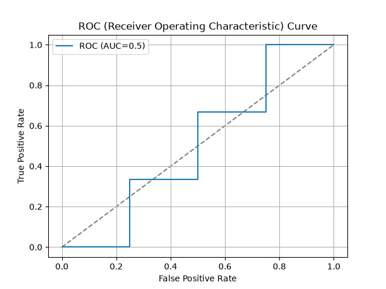
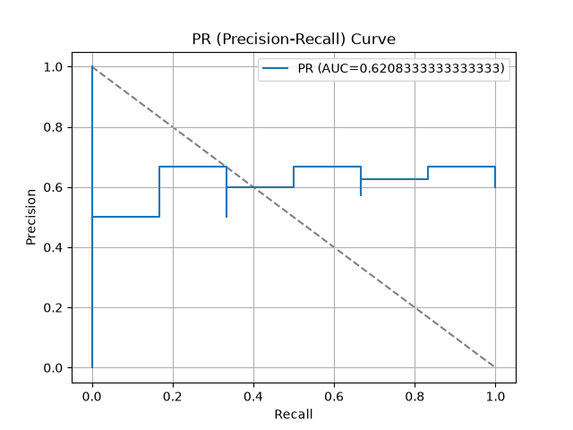
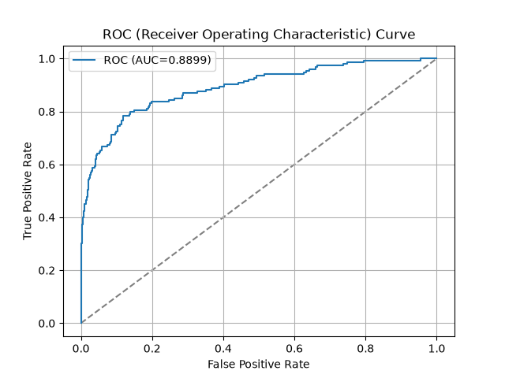
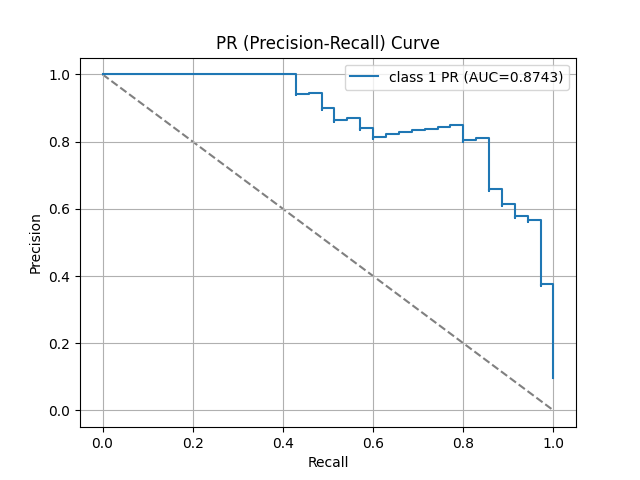
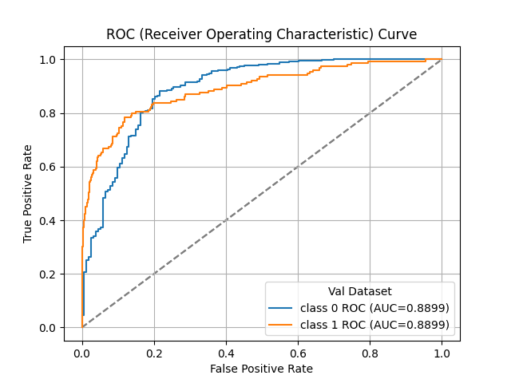
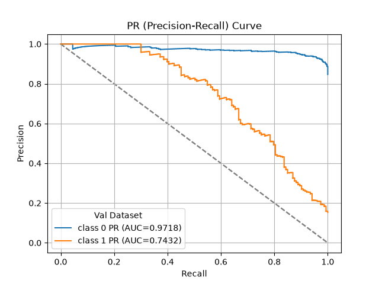

> **Note**
> [Go to the end](#sphx-glr-download-auto-examples-seaborn-plot-aucplot-script-py)
to download the full example code or to run this example in your browser via JupyterLite or Binder.

# plot\_aucplot\_script with examples[#](#plot-aucplot-script-with-examples "Link to this heading")

An example showing the [`aucplot`](../../modules/generated/scikitplot.seaborn.aucplot.html#scikitplot.seaborn.aucplot "scikitplot.seaborn.aucplot") function
with a scikit-learn classifier (e.g., [`LogisticRegression`](https://scikit-learn.org/dev/modules/generated/sklearn.linear_model.LogisticRegression.html#sklearn.linear_model.LogisticRegression "(in scikit-learn v1.9)")) instance.

```
# Authors: The scikit-plots developers
# SPDX-License-Identifier: BSD-3-Clause

```

Import scikit-plot

```
import scikitplot.seaborn as sp

```
```
ax = sp.aucplot(
    x=[0, 1, 1, 0, 1, 1, 0, 1, 1, 0],
    y=[0.1, 0.2, 0.3, 0.4, 0.5, 0.6, 0.7, 0.8, 0.9, 1.0],
    fmt=''
)

```

```
ax = sp.aucplot(
    x=[0, 1, 1, 0, 1, 1, 0, 1, 1, 0],
    y=[0.1, 0.2, 0.3, 0.4, 0.5, 0.6, 0.7, 0.8, 0.9, 1.0],
    kind="pr",
    fmt=''
)

```

```
import matplotlib.pyplot as plt
import numpy as np; np.random.seed(0)  # reproducibility
import pandas as pd

from sklearn.datasets import make_classification
from sklearn.datasets import (
    load_breast_cancer as data_2_classes,
    load_iris as data_3_classes,
    load_digits as data_10_classes,
)
from sklearn.linear_model import LogisticRegression
from sklearn.model_selection import train_test_split

```

Load the data
X, y = data\_3\_classes(return\_X\_y=True, as\_frame=False)
X, y = data\_2\_classes(return\_X\_y=True, as\_frame=False)

```
# Generate a sample dataset
X, y = make_classification(n_samples=5000, n_features=20, n_informative=15,
                          n_redundant=2, n_classes=2, n_repeated=0,
                          class_sep=1.5, flip_y=0.01, weights=[0.85, 0.15],
                          random_state=0)

```
```
X_train, X_val, y_train, y_val = train_test_split(
    X, y, stratify=y, test_size=0.2, random_state=0
)
np.unique(y)

```
```
array([0, 1])

```

Create an instance of the LogisticRegression

```
model = (
    LogisticRegression(
        # max_iter=int(1e5),
        # C=10,
        # penalty='l1',
        # solver='liblinear',
        class_weight='balanced',
        random_state=0
    )
    .fit(X_train, y_train)
)
# Perform predictions
y_val_prob = model.predict_proba(X_val)
# Create a DataFrame with predictions
df = pd.DataFrame({
    "y_true": y_val==1,  # target class (0,1,2)
    "y_score": y_val_prob[:, 1],  # target class (0,1,2)
    # np.argmax
    "y_pred": y_val_prob[:, 1] > 0.5,  # target class (0,1,2)
    # "y_true": np.random.normal(0.5, 0.1, 100).round(),
    # "y_score": np.random.normal(0.5, 0.15, 100),
    # "hue": np.random.normal(0.5, 0.4, 100).round(),
})
df

```

|  | y\_true | y\_score | y\_pred |
| --- | --- | --- | --- |
| 0 | False | 0.033725 | False |
| 1 | True | 0.860583 | True |
| 2 | False | 0.423101 | False |
| 3 | False | 0.137295 | False |
| 4 | False | 0.788645 | True |
| ... | ... | ... | ... |
| 995 | False | 0.228034 | False |
| 996 | False | 0.017187 | False |
| 997 | True | 0.987892 | True |
| 998 | False | 0.931136 | True |
| 999 | False | 0.128248 | False |

1000 rows × 3 columns

  
  
```
ax = sp.aucplot(x=df.y_true, y=df.y_score)

```

```
ax = sp.aucplot(
    df,
    x="y_true",
    y="y_score",
    kind="pr",
    label=f"class 1",
    # fmt=''
)

```

```
for i in range(2):
    ax = sp.aucplot(
        x=y_val==i,
        y=y_val_prob[:, i],
        # kind="roc",
        label=f"class {i}",
        # fmt=''
    )

    # --- Collect unique handles and labels ---
    handles, labels = ax.get_legend_handles_labels()
    by_label = dict(zip(labels, handles))  # deduplicate

    # Override legend
    ax.legend(by_label.values(), by_label.keys(), title="Val Dataset")

```

```
for i in range(2):
    ax = sp.aucplot(
        x=y_val==i,
        y=y_val_prob[:, i],
        kind="pr",
        label=f"class {i}",
        # fmt=''
    )

    # # With raw arrays (no DataFrame)
    # # Works because seaborn normalizes arrays internally
    # np.random.seed(i)  # reproducibility
    # ax = sp.aucplot(
    #     x=np.random.normal(0.5, 0.1, 100).round(),
    #     y=np.random.normal(0.5, 0.1, 100),
    #     kind="pr",
    #     label=f"{i}",
    # )

    # --- Collect unique handles and labels ---
    handles, labels = ax.get_legend_handles_labels()
    by_label = dict(zip(labels, handles))  # deduplicate

    # Override legend
    ax.legend(by_label.values(), by_label.keys(), title="Val Dataset")

```


Tags: [model-type: classification](../../_tags/model-type-classification.html) [model-workflow: model evaluation](../../_tags/model-workflow-model-evaluation.html) [plot-type: line](../../_tags/plot-type-line.html) [plot-type: auc](../../_tags/plot-type-auc.html) [level: beginner](../../_tags/level-beginner.html) [purpose: showcase](../../_tags/purpose-showcase.html)

****Total running time of the script:**** (0 minutes 0.573 seconds)

[](https://mybinder.org/v2/gh/scikit-plots/scikit-plots/main?urlpath=lab/tree/notebooks/auto_examples/seaborn/plot_aucplot_script.ipynb)[](../../lite/lab/index.html?path=auto_examples/seaborn/plot_aucplot_script.ipynb)

[`Download Jupyter notebook: plot_aucplot_script.ipynb`](../../_downloads/2675b4a92af45095ed1ba46bdf8583e4/plot_aucplot_script.ipynb)

[`Download Python source code: plot_aucplot_script.py`](../../_downloads/0f035013bcecf4849e0d8f398905015d/plot_aucplot_script.py)

[`Download zipped: plot_aucplot_script.zip`](../../_downloads/2143622a646dbd845650f928ccebb2dc/plot_aucplot_script.zip)

Related examples


[plot\_decileplot\_script with examples](plot_decileplot_script.html)

plot\_decileplot\_script with examples

[plot\_evalplot\_script with examples](plot_evalplot_script.html)

plot\_evalplot\_script with examples

[plot\_cumulative\_gain with examples](../decile/plot_cumulative_gain_script.html)

plot\_cumulative\_gain with examples

[plot\_report with examples](../decile/plot_report_script.html)

plot\_report with examples

[Gallery generated by Sphinx-Gallery](https://sphinx-gallery.github.io)