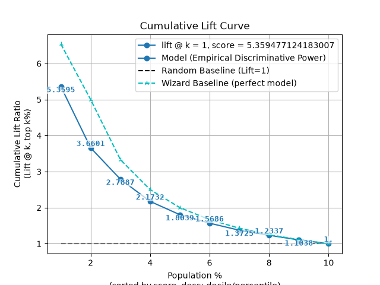
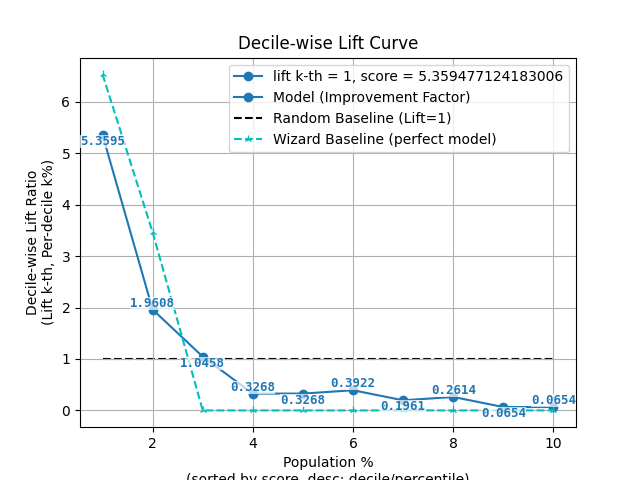
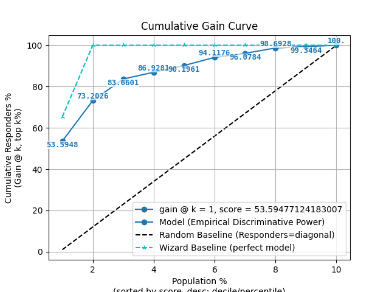
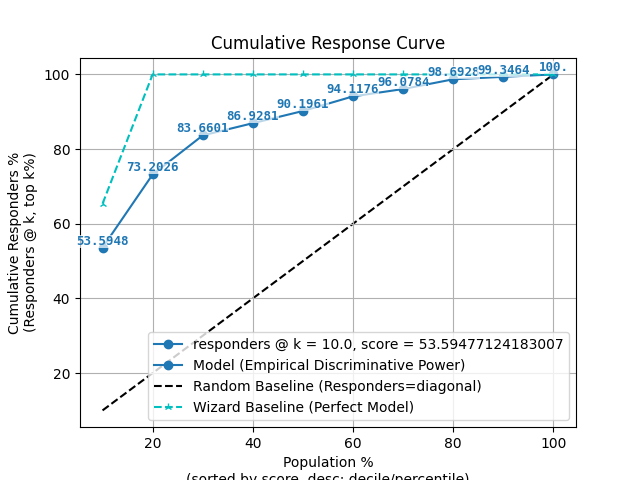
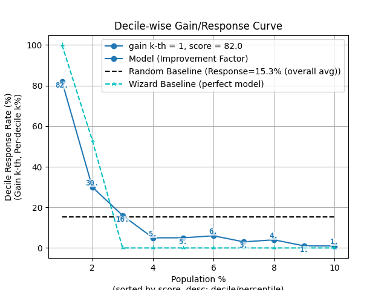
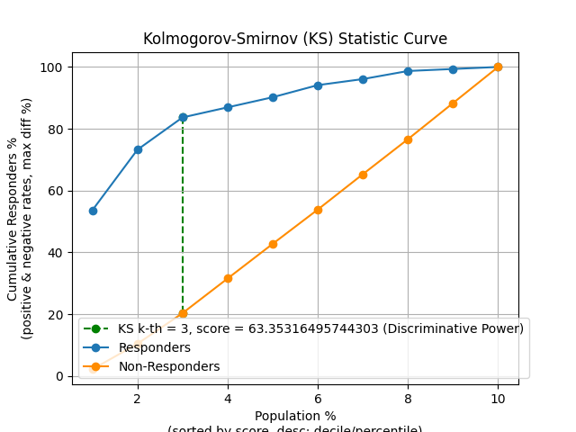
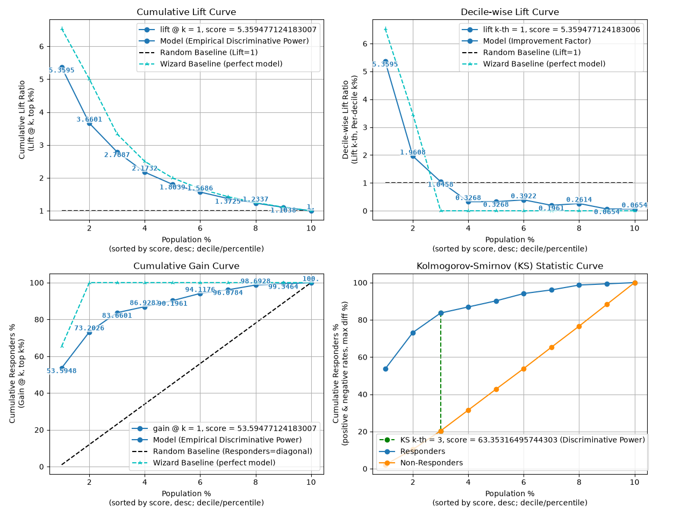
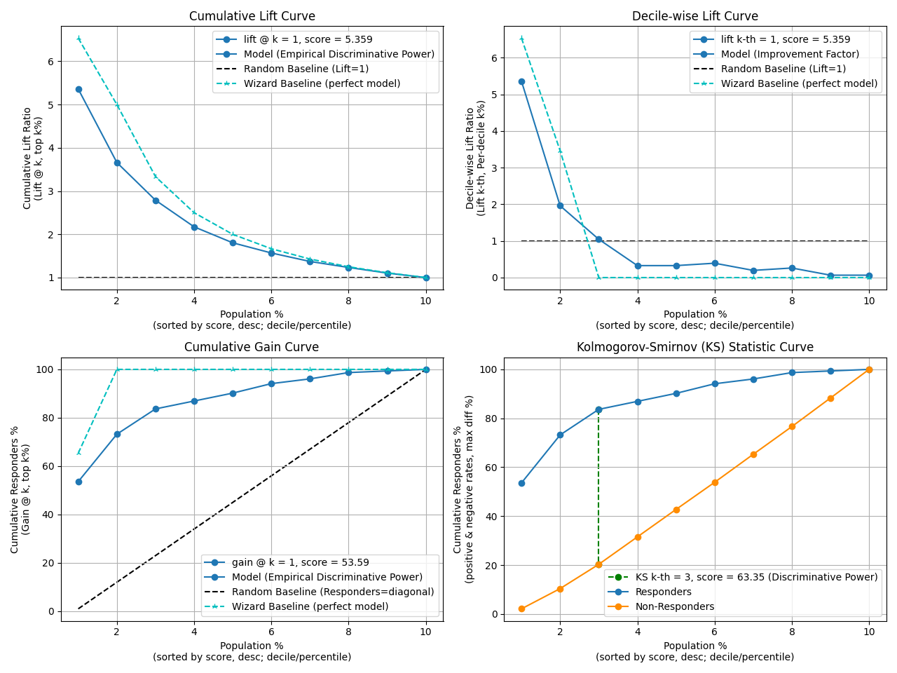

> **Note**
> [Go to the end](#sphx-glr-download-auto-examples-seaborn-plot-decileplot-script-py)
to download the full example code or to run this example in your browser via JupyterLite or Binder.

# plot\_decileplot\_script with examples[#](#plot-decileplot-script-with-examples "Link to this heading")

An example showing the [`decileplot`](../../modules/generated/scikitplot.seaborn.decileplot.html#scikitplot.seaborn.decileplot "scikitplot.seaborn.decileplot") function
with a scikit-learn classifier (e.g., [`LogisticRegression`](https://scikit-learn.org/dev/modules/generated/sklearn.linear_model.LogisticRegression.html#sklearn.linear_model.LogisticRegression "(in scikit-learn v1.10)")) instance.

```
# Authors: The scikit-plots developers
# SPDX-License-Identifier: BSD-3-Clause

```

Import scikit-plot

```
import scikitplot.seaborn as sp

```
```
import matplotlib.pyplot as plt
import numpy as np; np.random.seed(0)  # reproducibility
import pandas as pd

from sklearn.datasets import make_classification
from sklearn.datasets import (
    load_breast_cancer as data_2_classes,
    load_iris as data_3_classes,
    load_digits as data_10_classes,
)
from sklearn.linear_model import LogisticRegression
from sklearn.model_selection import train_test_split

```

Load the data
X, y = data\_3\_classes(return\_X\_y=True, as\_frame=False)
X, y = data\_2\_classes(return\_X\_y=True, as\_frame=False)

```
# Generate a sample dataset
X, y = make_classification(n_samples=5000, n_features=20, n_informative=15,
                          n_redundant=2, n_classes=2, n_repeated=0,
                          class_sep=1.5, flip_y=0.01, weights=[0.85, 0.15],
                          random_state=0)

```
```
X_train, X_val, y_train, y_val = train_test_split(
    X, y, stratify=y, test_size=0.2, random_state=0
)
np.unique(y)

```
```
array([0, 1])

```

Create an instance of the LogisticRegression

```
model = (
    LogisticRegression(
        # max_iter=int(1e5),
        # C=10,
        # penalty='l1',
        # solver='liblinear',
        class_weight='balanced',
        random_state=0
    )
    .fit(X_train, y_train)
)
# Perform predictions
y_val_prob = model.predict_proba(X_val)
# Create a DataFrame with predictions
df = pd.DataFrame({
    "y_true": y_val==1,  # target class (0,1,2)
    "y_score": y_val_prob[:, 1],  # target class (0,1,2)
    # np.argmax
    "y_pred": y_val_prob[:, 1] > 0.5,  # target class (0,1,2)
    # "y_true": np.random.normal(0.5, 0.1, 100).round(),
    # "y_score": np.random.normal(0.5, 0.15, 100),
    # "hue": np.random.normal(0.5, 0.4, 100).round(),
})
df

```

|  | y\_true | y\_score | y\_pred |
| --- | --- | --- | --- |
| 0 | False | 0.033725 | False |
| 1 | True | 0.860583 | True |
| 2 | False | 0.423101 | False |
| 3 | False | 0.137295 | False |
| 4 | False | 0.788645 | True |
| ... | ... | ... | ... |
| 995 | False | 0.228034 | False |
| 996 | False | 0.017187 | False |
| 997 | True | 0.987892 | True |
| 998 | False | 0.931136 | True |
| 999 | False | 0.128248 | False |

1000 rows × 3 columns

  
  
```
p = sp.decileplot(
    df,
    x="y_true",
    y="y_score",
    kind="df",
    n_deciles=10,
    digits=4,
    verbose=True,
)
p.T
# p.columns.tolist()
# p[["decile", "cnt_resp", "cnt_resp_wiz", "cum_resp_pct", "cum_resp_wiz_pct"]]
# p.iloc[:, range(9, 23)]
# p.iloc[:, [11, 12, 12, 14]]

```
```
{
  "decile": "Meaning: Ranked group based on predicted probabilities (1 = highest probability). Critical: Ensure data is sorted descending by model score; top deciles should capture the majority of positives. Formula: Assign samples to k quantiles (e.g., 10 deciles) based on model score.",
  "prob_min": "Meaning: Minimum predicted probability within the decile. Critical: Indicates model calibration; values too close to prob_max suggest poor separation. Formula: min(score in decile).",
  "prob_max": "Meaning: Maximum predicted probability within the decile. Critical: Checks separation; overlap with lower deciles indicates poor discrimination. Formula: max(score in decile).",
  "prob_avg": "Meaning: Average predicted probability within the decile. Critical: Useful for calibration checks; should decrease monotonically across deciles. Formula: mean(score in decile).",
  "cnt_resp_true": "Meaning: Actual positives/responders in the decile. Critical: Should never exceed cnt_resp_wiz_true; flat counts across deciles indicate a weak or non-discriminative model. Formula: sum(y_true = 1 in decile).",
  "cnt_resp_false": "Meaning: Actual negatives/non-responders in the decile. Critical: Used in KS/statistical calculations; too many negatives in top deciles is a warning. Formula: cnt_resp_total - cnt_resp_true.",
  "cnt_resp_total": "Meaning: Total samples in the decile (positives + negatives). Critical: Denominator for rate_resp and cumulative % calculations; decile imbalance can distort lift/gain. Formula: count(samples in decile).",
  "cnt_resp_rndm_true": "Meaning: Expected positives in the decile under a random model. Critical: Baseline for lift/gain comparison; fatal if model barely exceeds random. Formula: total_positives / n_deciles.",
  "cnt_resp_wiz_true": "Meaning: Ideal/maximum possible positives if the model were perfect. Critical: Must always be ≥ cnt_resp_true; NaN or extremely low values indicate data issues. Formula: allocate top positives directly to highest scoring deciles.",
  "rate_resp": "Meaning: Decile-level response rate (alias: decile_wise_response, decile_wise_gain). Critical: Measures decile quality; early deciles should outperform later ones. Formula: rate_resp = cnt_resp_true / cnt_resp_total.",
  "overall_rate": "Meaning: Overall response rate across the dataset; serves as the baseline probability of a positive. Critical: Used as the denominator in decile-wise lift; essential to assess improvement vs random. Formula: overall_rate = sum(cnt_resp_true) / sum(cnt_resp_total) (fraction or %).",
  "cum_resp_true": "Meaning: Cumulative number of positives captured up to the current decile (alias: cumulative_gain). Critical: Should increase monotonically; maximum = total responders. Flat curve indicates weak model. Formula: Σ cnt_resp_true (≤ current decile).",
  "cum_resp_true_pct": "Meaning: Cumulative % of positives captured = cum_resp_true / total_responders * 100. Critical: Used for lift/gain curves; should always be ≥ model baseline. Formula: cum_resp_true / total_responders * 100.",
  "cum_resp_false": "Meaning: Cumulative number of negatives captured up to the current decile. Critical: Used for KS/statistical calculations; dominance in early deciles is undesirable. Formula: Σ cnt_resp_false (≤ current decile).",
  "cum_resp_false_pct": "Meaning: Cumulative % of negatives captured = cum_resp_false / total_nonresponders * 100. Critical: Should differ from cum_resp_true_pct; nearly equal curves indicate model failure. Formula: cum_resp_false / total_nonresponders * 100.",
  "cum_resp_total": "Meaning: Cumulative total samples up to the current decile. Critical: Tracks population coverage for lift/gain charts. Formula: Σ cnt_resp_total (≤ current decile).",
  "cum_resp_total_pct": "Meaning: Cumulative % of total population covered. Critical: X-axis for lift/gain curves; check decile balance. Formula: cum_resp_total / total_samples * 100.",
  "cum_resp_rndm_true": "Meaning: Cumulative expected positives if randomly assigned. Critical: Baseline for cumulative lift; fatal if model ≈ random curve. Formula: Σ cnt_resp_rndm_true (≤ current decile).",
  "cum_resp_rndm_true_pct": "Meaning: Cumulative % of expected positives under random = cum_resp_rndm_true / total_responders * 100. Critical: Baseline curve is linear from (0,0) to (100,100); model curve must exceed this. Formula: cum_resp_rndm_true / total_responders * 100.",
  "cum_resp_wiz_true": "Meaning: Cumulative ideal/maximum possible positives. Critical: Must always be ≥ model values; never NaN. Formula: Σ cnt_resp_wiz_true (≤ current decile).",
  "cum_resp_wiz_true_pct": "Meaning: % cumulative ideal positives = cum_resp_wiz_true / total_responders * 100. Critical: Wizard benchmark for lift/gain curves; gaps indicate model weakness. Formula: cum_resp_wiz_true / total_responders * 100.",
  "cumulative_lift": "Meaning: Empirical discriminative power; shows cumulative improvement vs random. Critical: Always cumulative; should exceed 1 (or ≥2 in top decile). Formula: cumulative_lift = cum_resp_true_pct / cum_resp_total_pct.",
  "decile_wise_lift": "Meaning: Improvement factor for individual deciles; shows how much better each decile performs vs random. Critical: Fatal if <1. Early deciles should show highest lift. Formula: decile_wise_lift = cnt_resp_true / cnt_resp_rndm_true.",
  "KS": "Meaning: Peak discriminative power (scalar) extracted from cumulative gain curves; maximum distance between cumulative distributions of positives and negatives. Range: 0-1 (fraction) or 0-100 (percent). Interpretation: - <0.2 → Poor discrimination - 0.2-0.4 → Fair - 0.4-0.6 → Good - ≥0.6 → Excellent - ≥0.7 → Suspiciously high (possible overfitting or leakage). Critical: Report across train/validation/test; ensure top deciles dominate appropriately. Formula: KS = max(cum_resp_true_pct - cum_resp_false_pct) (sorted descending by model score)."
}

```

|  | 0 | 1 | 2 | 3 | 4 | 5 | 6 | 7 | 8 | 9 |
| --- | --- | --- | --- | --- | --- | --- | --- | --- | --- | --- |
| decile | 1.0000 | 2.0000 | 3.0000 | 4.0000 | 5.0000 | 6.0000 | 7.0000 | 8.0000 | 9.0000 | 10.0000 |
| prob\_min | 0.8478 | 0.5792 | 0.3837 | 0.2739 | 0.2044 | 0.1410 | 0.0984 | 0.0605 | 0.0344 | 0.0014 |
| prob\_max | 0.9998 | 0.8416 | 0.5774 | 0.3827 | 0.2728 | 0.2040 | 0.1409 | 0.0978 | 0.0605 | 0.0343 |
| prob\_avg | 0.9475 | 0.7061 | 0.4757 | 0.3250 | 0.2380 | 0.1702 | 0.1177 | 0.0774 | 0.0472 | 0.0183 |
| cnt\_resp\_true | 82.0000 | 30.0000 | 16.0000 | 5.0000 | 5.0000 | 6.0000 | 3.0000 | 4.0000 | 1.0000 | 1.0000 |
| cnt\_resp\_false | 18.0000 | 70.0000 | 84.0000 | 95.0000 | 95.0000 | 94.0000 | 97.0000 | 96.0000 | 99.0000 | 99.0000 |
| cnt\_resp\_total | 100.0000 | 100.0000 | 100.0000 | 100.0000 | 100.0000 | 100.0000 | 100.0000 | 100.0000 | 100.0000 | 100.0000 |
| cnt\_resp\_rndm\_true | 15.3000 | 15.3000 | 15.3000 | 15.3000 | 15.3000 | 15.3000 | 15.3000 | 15.3000 | 15.3000 | 15.3000 |
| cnt\_resp\_wiz\_true | 100.0000 | 53.0000 | 0.0000 | 0.0000 | 0.0000 | 0.0000 | 0.0000 | 0.0000 | 0.0000 | 0.0000 |
| rate\_resp | 82.0000 | 30.0000 | 16.0000 | 5.0000 | 5.0000 | 6.0000 | 3.0000 | 4.0000 | 1.0000 | 1.0000 |
| rate\_resp\_pct | 82.0000 | 30.0000 | 16.0000 | 5.0000 | 5.0000 | 6.0000 | 3.0000 | 4.0000 | 1.0000 | 1.0000 |
| rate\_resp\_wiz | 100.0000 | 53.0000 | 0.0000 | 0.0000 | 0.0000 | 0.0000 | 0.0000 | 0.0000 | 0.0000 | 0.0000 |
| overall\_rate | 15.3000 | 15.3000 | 15.3000 | 15.3000 | 15.3000 | 15.3000 | 15.3000 | 15.3000 | 15.3000 | 15.3000 |
| cum\_resp\_true | 82.0000 | 112.0000 | 128.0000 | 133.0000 | 138.0000 | 144.0000 | 147.0000 | 151.0000 | 152.0000 | 153.0000 |
| cum\_resp\_true\_pct | 53.5948 | 73.2026 | 83.6601 | 86.9281 | 90.1961 | 94.1176 | 96.0784 | 98.6928 | 99.3464 | 100.0000 |
| cum\_resp\_false | 18.0000 | 88.0000 | 172.0000 | 267.0000 | 362.0000 | 456.0000 | 553.0000 | 649.0000 | 748.0000 | 847.0000 |
| cum\_resp\_false\_pct | 2.1251 | 10.3896 | 20.3070 | 31.5230 | 42.7391 | 53.8371 | 65.2893 | 76.6234 | 88.3117 | 100.0000 |
| cum\_resp\_total | 100.0000 | 200.0000 | 300.0000 | 400.0000 | 500.0000 | 600.0000 | 700.0000 | 800.0000 | 900.0000 | 1000.0000 |
| cum\_resp\_total\_pct | 10.0000 | 20.0000 | 30.0000 | 40.0000 | 50.0000 | 60.0000 | 70.0000 | 80.0000 | 90.0000 | 100.0000 |
| cum\_resp\_rndm\_true | 15.3000 | 30.6000 | 45.9000 | 61.2000 | 76.5000 | 91.8000 | 107.1000 | 122.4000 | 137.7000 | 153.0000 |
| cum\_resp\_rndm\_true\_pct | 10.0000 | 20.0000 | 30.0000 | 40.0000 | 50.0000 | 60.0000 | 70.0000 | 80.0000 | 90.0000 | 100.0000 |
| cum\_resp\_wiz\_true | 100.0000 | 153.0000 | 153.0000 | 153.0000 | 153.0000 | 153.0000 | 153.0000 | 153.0000 | 153.0000 | 153.0000 |
| cum\_resp\_wiz\_true\_pct | 65.3595 | 100.0000 | 100.0000 | 100.0000 | 100.0000 | 100.0000 | 100.0000 | 100.0000 | 100.0000 | 100.0000 |
| cumulative\_lift | 5.3595 | 3.6601 | 2.7887 | 2.1732 | 1.8039 | 1.5686 | 1.3725 | 1.2337 | 1.1038 | 1.0000 |
| cumulative\_lift\_wiz | 6.5359 | 5.0000 | 3.3333 | 2.5000 | 2.0000 | 1.6667 | 1.4286 | 1.2500 | 1.1111 | 1.0000 |
| decile\_wise\_lift | 5.3595 | 1.9608 | 1.0458 | 0.3268 | 0.3268 | 0.3922 | 0.1961 | 0.2614 | 0.0654 | 0.0654 |
| decile\_wise\_lift\_wiz | 6.5359 | 3.4641 | 0.0000 | 0.0000 | 0.0000 | 0.0000 | 0.0000 | 0.0000 | 0.0000 | 0.0000 |
| KS | 51.4696 | 62.8130 | 63.3532 | 55.4051 | 47.4570 | 40.2806 | 30.7892 | 22.0694 | 11.0347 | 0.0000 |

  
  
```
p = sp.decileplot(df, x="y_true", y="y_score", kind="cumulative_lift", n_deciles=10, annot=True)

```

```
p = sp.decileplot(df, x="y_true", y="y_score", kind="decile_wise_lift", n_deciles=10, annot=True)

```

```
p = sp.decileplot(df, x="y_true", y="y_score", kind="cumulative_gain", n_deciles=10, annot=True)

```

```
p = sp.decileplot(df, x="y_true", y="y_score", kind="cumulative_response", n_deciles=10, annot=True)

```

```
p = sp.decileplot(df, x="y_true", y="y_score", kind="decile_wise_gain", n_deciles=10, annot=True)

```

```
p = sp.decileplot(df, x="y_true", y="y_score", kind="ks_statistic", n_deciles=10, annot=True)

```


fig, ax = plt.subplots(figsize=(10, 10))

```
p = sp.decileplot(
    df,
    x="y_true",
    y="y_score",
    kind="report",
    n_deciles=10,
    digits=4,
    annot=True,
    verbose=True,
)

```

```
{
  "decile": "Meaning: Ranked group based on predicted probabilities (1 = highest probability). Critical: Ensure data is sorted descending by model score; top deciles should capture the majority of positives. Formula: Assign samples to k quantiles (e.g., 10 deciles) based on model score.",
  "prob_min": "Meaning: Minimum predicted probability within the decile. Critical: Indicates model calibration; values too close to prob_max suggest poor separation. Formula: min(score in decile).",
  "prob_max": "Meaning: Maximum predicted probability within the decile. Critical: Checks separation; overlap with lower deciles indicates poor discrimination. Formula: max(score in decile).",
  "prob_avg": "Meaning: Average predicted probability within the decile. Critical: Useful for calibration checks; should decrease monotonically across deciles. Formula: mean(score in decile).",
  "cnt_resp_true": "Meaning: Actual positives/responders in the decile. Critical: Should never exceed cnt_resp_wiz_true; flat counts across deciles indicate a weak or non-discriminative model. Formula: sum(y_true = 1 in decile).",
  "cnt_resp_false": "Meaning: Actual negatives/non-responders in the decile. Critical: Used in KS/statistical calculations; too many negatives in top deciles is a warning. Formula: cnt_resp_total - cnt_resp_true.",
  "cnt_resp_total": "Meaning: Total samples in the decile (positives + negatives). Critical: Denominator for rate_resp and cumulative % calculations; decile imbalance can distort lift/gain. Formula: count(samples in decile).",
  "cnt_resp_rndm_true": "Meaning: Expected positives in the decile under a random model. Critical: Baseline for lift/gain comparison; fatal if model barely exceeds random. Formula: total_positives / n_deciles.",
  "cnt_resp_wiz_true": "Meaning: Ideal/maximum possible positives if the model were perfect. Critical: Must always be ≥ cnt_resp_true; NaN or extremely low values indicate data issues. Formula: allocate top positives directly to highest scoring deciles.",
  "rate_resp": "Meaning: Decile-level response rate (alias: decile_wise_response, decile_wise_gain). Critical: Measures decile quality; early deciles should outperform later ones. Formula: rate_resp = cnt_resp_true / cnt_resp_total.",
  "overall_rate": "Meaning: Overall response rate across the dataset; serves as the baseline probability of a positive. Critical: Used as the denominator in decile-wise lift; essential to assess improvement vs random. Formula: overall_rate = sum(cnt_resp_true) / sum(cnt_resp_total) (fraction or %).",
  "cum_resp_true": "Meaning: Cumulative number of positives captured up to the current decile (alias: cumulative_gain). Critical: Should increase monotonically; maximum = total responders. Flat curve indicates weak model. Formula: Σ cnt_resp_true (≤ current decile).",
  "cum_resp_true_pct": "Meaning: Cumulative % of positives captured = cum_resp_true / total_responders * 100. Critical: Used for lift/gain curves; should always be ≥ model baseline. Formula: cum_resp_true / total_responders * 100.",
  "cum_resp_false": "Meaning: Cumulative number of negatives captured up to the current decile. Critical: Used for KS/statistical calculations; dominance in early deciles is undesirable. Formula: Σ cnt_resp_false (≤ current decile).",
  "cum_resp_false_pct": "Meaning: Cumulative % of negatives captured = cum_resp_false / total_nonresponders * 100. Critical: Should differ from cum_resp_true_pct; nearly equal curves indicate model failure. Formula: cum_resp_false / total_nonresponders * 100.",
  "cum_resp_total": "Meaning: Cumulative total samples up to the current decile. Critical: Tracks population coverage for lift/gain charts. Formula: Σ cnt_resp_total (≤ current decile).",
  "cum_resp_total_pct": "Meaning: Cumulative % of total population covered. Critical: X-axis for lift/gain curves; check decile balance. Formula: cum_resp_total / total_samples * 100.",
  "cum_resp_rndm_true": "Meaning: Cumulative expected positives if randomly assigned. Critical: Baseline for cumulative lift; fatal if model ≈ random curve. Formula: Σ cnt_resp_rndm_true (≤ current decile).",
  "cum_resp_rndm_true_pct": "Meaning: Cumulative % of expected positives under random = cum_resp_rndm_true / total_responders * 100. Critical: Baseline curve is linear from (0,0) to (100,100); model curve must exceed this. Formula: cum_resp_rndm_true / total_responders * 100.",
  "cum_resp_wiz_true": "Meaning: Cumulative ideal/maximum possible positives. Critical: Must always be ≥ model values; never NaN. Formula: Σ cnt_resp_wiz_true (≤ current decile).",
  "cum_resp_wiz_true_pct": "Meaning: % cumulative ideal positives = cum_resp_wiz_true / total_responders * 100. Critical: Wizard benchmark for lift/gain curves; gaps indicate model weakness. Formula: cum_resp_wiz_true / total_responders * 100.",
  "cumulative_lift": "Meaning: Empirical discriminative power; shows cumulative improvement vs random. Critical: Always cumulative; should exceed 1 (or ≥2 in top decile). Formula: cumulative_lift = cum_resp_true_pct / cum_resp_total_pct.",
  "decile_wise_lift": "Meaning: Improvement factor for individual deciles; shows how much better each decile performs vs random. Critical: Fatal if <1. Early deciles should show highest lift. Formula: decile_wise_lift = cnt_resp_true / cnt_resp_rndm_true.",
  "KS": "Meaning: Peak discriminative power (scalar) extracted from cumulative gain curves; maximum distance between cumulative distributions of positives and negatives. Range: 0-1 (fraction) or 0-100 (percent). Interpretation: - <0.2 → Poor discrimination - 0.2-0.4 → Fair - 0.4-0.6 → Good - ≥0.6 → Excellent - ≥0.7 → Suspiciously high (possible overfitting or leakage). Critical: Report across train/validation/test; ensure top deciles dominate appropriately. Formula: KS = max(cum_resp_true_pct - cum_resp_false_pct) (sorted descending by model score)."
}
   decile  prob_min  prob_max  ...  decile_wise_lift  decile_wise_lift_wiz       KS
0       1    0.8478    0.9998  ...            5.3595                6.5359  51.4696
1       2    0.5792    0.8416  ...            1.9608                3.4641  62.8130
2       3    0.3837    0.5774  ...            1.0458                0.0000  63.3532
3       4    0.2739    0.3827  ...            0.3268                0.0000  55.4051
4       5    0.2044    0.2728  ...            0.3268                0.0000  47.4570
5       6    0.1410    0.2040  ...            0.3922                0.0000  40.2806
6       7    0.0984    0.1409  ...            0.1961                0.0000  30.7892
7       8    0.0605    0.0978  ...            0.2614                0.0000  22.0694
8       9    0.0344    0.0605  ...            0.0654                0.0000  11.0347
9      10    0.0014    0.0343  ...            0.0654                0.0000   0.0000

[10 rows x 28 columns]

```

fig, ax = plt.subplots(figsize=(10, 10))

```
p = sp.decileplot(
    df,
    x="y_true",
    y="y_score",
    kind="report",
    n_deciles=10,
    digits=6,
    fmt='.4g'
)

```

```
   decile  prob_min  ...  decile_wise_lift_wiz         KS
0       1  0.847810  ...              6.535948  51.469624
1       2  0.579150  ...              3.464052  62.813004
2       3  0.383729  ...              0.000000  63.353165
3       4  0.273915  ...              0.000000  55.405082
4       5  0.204425  ...              0.000000  47.456999
5       6  0.141044  ...              0.000000  40.280575
6       7  0.098419  ...              0.000000  30.789175
7       8  0.060545  ...              0.000000  22.069434
8       9  0.034429  ...              0.000000  11.034717
9      10  0.001371  ...              0.000000   0.000000

[10 rows x 28 columns]

```

Tags: [model-type: classification](../../_tags/model-type-classification.html) [model-workflow: model evaluation](../../_tags/model-workflow-model-evaluation.html) [plot-type: line](../../_tags/plot-type-line.html) [plot-type: decile](../../_tags/plot-type-decile.html) [level: beginner](../../_tags/level-beginner.html) [purpose: showcase](../../_tags/purpose-showcase.html)

****Total running time of the script:**** (0 minutes 2.577 seconds)

[](https://mybinder.org/v2/gh/scikit-plots/scikit-plots/main?urlpath=lab/tree/notebooks/auto_examples/seaborn/plot_decileplot_script.ipynb)[](../../lite/lab/index.html?path=auto_examples/seaborn/plot_decileplot_script.ipynb)

[`Download Jupyter notebook: plot_decileplot_script.ipynb`](../../_downloads/340d1be8e74b90f18131d89680f5492b/plot_decileplot_script.ipynb)

[`Download Python source code: plot_decileplot_script.py`](../../_downloads/bc6460873e016e553bcba1c6657fbfb0/plot_decileplot_script.py)

[`Download zipped: plot_decileplot_script.zip`](../../_downloads/281c4ce783b5e6a9c3377d77c5a606cd/plot_decileplot_script.zip)

Related examples


[plot\_evalplot\_script with examples](plot_evalplot_script.html)

plot\_evalplot\_script with examples

[plot\_aucplot\_script with examples](plot_aucplot_script.html)

plot\_aucplot\_script with examples

[plot\_cumulative\_gain with examples](../decile/plot_cumulative_gain_script.html)

plot\_cumulative\_gain with examples

[plot\_ks\_statistic with examples](../decile/plot_ks_statistic_script.html)

plot\_ks\_statistic with examples

[Gallery generated by Sphinx-Gallery](https://sphinx-gallery.github.io)