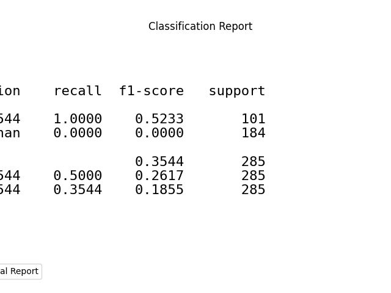
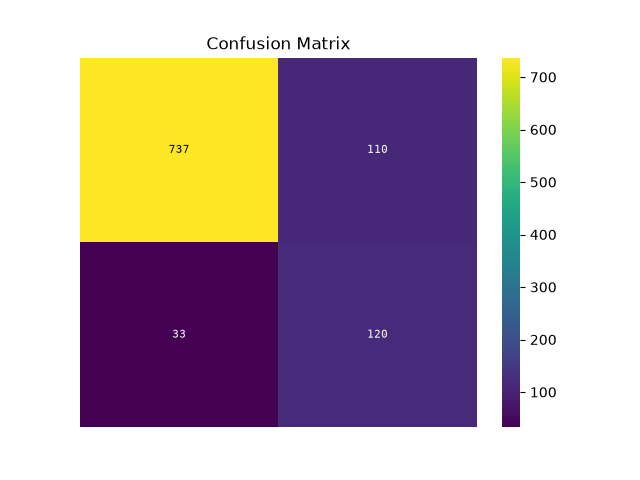
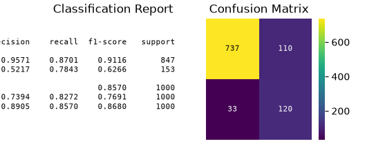
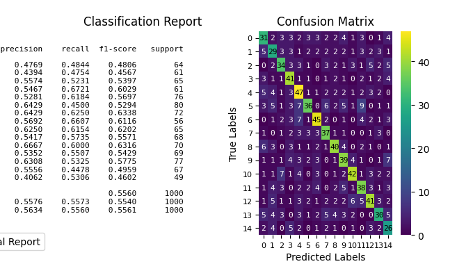
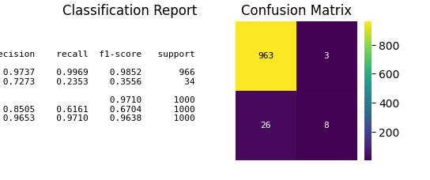

> **Note**
> [Go to the end](#sphx-glr-download-auto-examples-seaborn-plot-evalplot-script-py)
to download the full example code or to run this example in your browser via JupyterLite or Binder.

# plot\_evalplot\_script with examples[#](#plot-evalplot-script-with-examples "Link to this heading")

An example showing the [`evalplot`](../../modules/generated/scikitplot.seaborn.evalplot.html#scikitplot.seaborn.evalplot "scikitplot.seaborn.evalplot") function
with a scikit-learn classifier (e.g., [`LogisticRegression`](https://scikit-learn.org/dev/modules/generated/sklearn.linear_model.LogisticRegression.html#sklearn.linear_model.LogisticRegression "(in scikit-learn v1.9)")) instance.

```
# Authors: The scikit-plots developers
# SPDX-License-Identifier: BSD-3-Clause

```

Import scikit-plot

```
import scikitplot.seaborn as sp

```
```
import matplotlib.pyplot as plt
import numpy as np; np.random.seed(0)  # reproducibility
import pandas as pd

from sklearn.datasets import make_classification
from sklearn.datasets import (
    load_breast_cancer as data_2_classes,
    load_iris as data_3_classes,
    load_digits as data_10_classes,
)
from sklearn.linear_model import LogisticRegression
from sklearn.model_selection import train_test_split

def logistic_scale(scores):
    """Scale decision_function outputs to (0,1) using the logistic (sigmoid) function."""
    scores = np.asarray(scores, dtype=float)
    # Clip to avoid overflow for large |x| before exp
    # scores = np.clip(scores, -500, 500)
    return 1.0 / (1.0 + np.exp(-scores))

def minmax_scale(scores):
    """Linearly scale an array to [0,1]."""
    scores = np.asarray(scores, dtype=float)
    min_, max_ = np.min(scores), np.max(scores)
    if np.isclose(min_, max_):
        # Avoid divide-by-zero when all values identical
        return np.zeros_like(scores)
    return (scores - min_) / (max_ - min_)

```

Load the data
X, y = data\_3\_classes(return\_X\_y=True, as\_frame=False)
X, y = data\_2\_classes(return\_X\_y=True, as\_frame=False)

```
# Generate a sample dataset
X, y = make_classification(n_samples=5000, n_features=20, n_informative=15,
                          n_redundant=2, n_classes=2, n_repeated=0,
                          class_sep=1.5, flip_y=0.01, weights=[0.85, 0.15],
                          random_state=0)

```
```
X_train, X_val, y_train, y_val = train_test_split(
    X, y, stratify=y, test_size=0.2, random_state=0
)
np.unique(y)

```
```
array([0, 1])

```

Create an instance of the LogisticRegression

```
model = (
    LogisticRegression(
        # max_iter=int(1e5),
        # C=10,
        # penalty='l1',
        # solver='liblinear',
        class_weight='balanced',
        random_state=0
    )
    .fit(X_train, y_train)
)
# Perform predictions
y_val_prob = model.predict_proba(X_val)
# Create a DataFrame with predictions
df = pd.DataFrame({
    "y_true": y_val==1,  # target class (0,1,2)
    "y_score": y_val_prob[:, 1],  # target class (0,1,2)
    # np.argmax
    "y_pred": y_val_prob[:, 1] > 0.5,  # target class (0,1,2)
    # "y_true": np.random.normal(0.5, 0.1, 100).round(),
    # "y_score": np.random.normal(0.5, 0.15, 100),
    # "hue": np.random.normal(0.5, 0.4, 100).round(),
})
df

```

|  | y\_true | y\_score | y\_pred |
| --- | --- | --- | --- |
| 0 | False | 0.033725 | False |
| 1 | True | 0.860583 | True |
| 2 | False | 0.423101 | False |
| 3 | False | 0.137295 | False |
| 4 | False | 0.788645 | True |
| ... | ... | ... | ... |
| 995 | False | 0.228034 | False |
| 996 | False | 0.017187 | False |
| 997 | True | 0.987892 | True |
| 998 | False | 0.931136 | True |
| 999 | False | 0.128248 | False |

1000 rows × 3 columns

  
  
```
p = sp.evalplot(
    df,
    x="y_true",
    y="y_pred",
    # y="y_score",
    # allow_probs=True,  # if y_score provided
    # threshold=0.5,
    kind="all",
)

```

```
p = sp.evalplot(
    df,
    x="y_true",
    y="y_pred",
    kind="classification_report",
    text_kws={'fontsize': 16},
)

```

```
p = sp.evalplot(
    df,
    x="y_true",
    y="y_pred",
    kind="confusion_matrix",
)

```


fig, ax = plt.subplots(figsize=(8, 6))

```
p = sp.evalplot(
    df,
    x="y_true",
    # y="y_pred",
    y="y_score",
    allow_probs=True,  # if y_score provided
    threshold=0.5,
    kind="all",
)

```

```
import numpy as np
import matplotlib.pyplot as plt
from sklearn.datasets import make_classification
from sklearn.datasets import (
    load_breast_cancer as data_2_classes,
    load_iris as data_3_classes,
    load_digits as data_10_classes,
)
from sklearn.ensemble import RandomForestClassifier
from sklearn.model_selection import train_test_split
from sklearn.metrics import classification_report, confusion_matrix

```

Load the data
X, y = data\_3\_classes(return\_X\_y=True, as\_frame=False)
X, y = data\_2\_classes(return\_X\_y=True, as\_frame=False)

```
# Generate a sample dataset
X, y = make_classification(n_samples=5000, n_features=50, n_informative=45,
                          n_redundant=2, n_classes=3, n_repeated=0,
                          class_sep=1.5, flip_y=0.01, #weights=[0.97, 0.03],
                          random_state=0)

```
```
X_train, X_val, y_train, y_val = train_test_split(
    X, y, stratify=y, test_size=0.2, random_state=0,
)
np.unique(y)

```
```
array([0, 1, 2])

```

Initialize the Random Forest Classifier

```
rf_model = RandomForestClassifier(
    class_weight='balanced',
    n_estimators=100,
    max_depth=6,
    random_state=0,
)

# Train the model
rf_model.fit(X_train, y_train)

```
```
RandomForestClassifier(class_weight='balanced', max_depth=6, random_state=0)
```
****In a Jupyter environment, please rerun this cell to show the HTML representation or trust the notebook.   
On GitHub, the HTML representation is unable to render, please try loading this page with nbviewer.org.****RandomForestClassifier[?Documentation for RandomForestClassifier](https://scikit-learn.org/1.8/modules/generated/sklearn.ensemble.RandomForestClassifier.html)iFitted
Parameters

|  |  |  |
| --- | --- | --- |
|  | [n\_estimators n\_estimators: int, default=100  The number of trees in the forest.  .. versionchanged:: 0.22  The default value of ``n\_estimators`` changed from 10 to 100  in 0.22.](https://scikit-learn.org/1.8/modules/generated/sklearn.ensemble.RandomForestClassifier.html#:~:text=n_estimators,-int%2C%20default%3D100) | 100 |
|  | [criterion criterion: {"gini", "entropy", "log\_loss"}, default="gini"  The function to measure the quality of a split. Supported criteria are "gini" for the Gini impurity and "log\_loss" and "entropy" both for the Shannon information gain, see :ref:`tree\_mathematical\_formulation`. Note: This parameter is tree-specific.](https://scikit-learn.org/1.8/modules/generated/sklearn.ensemble.RandomForestClassifier.html#:~:text=criterion,-%7B%22gini%22%2C%20%22entropy%22%2C%20%22log_loss%22%7D%2C%20default%3D%22gini%22) | 'gini' |
|  | [max\_depth max\_depth: int, default=None  The maximum depth of the tree. If None, then nodes are expanded until all leaves are pure or until all leaves contain less than min\_samples\_split samples.](https://scikit-learn.org/1.8/modules/generated/sklearn.ensemble.RandomForestClassifier.html#:~:text=max_depth,-int%2C%20default%3DNone) | 6 |
|  | [min\_samples\_split min\_samples\_split: int or float, default=2  The minimum number of samples required to split an internal node:  - If int, then consider `min\_samples\_split` as the minimum number. - If float, then `min\_samples\_split` is a fraction and  `ceil(min\_samples\_split \* n\_samples)` are the minimum  number of samples for each split.  .. versionchanged:: 0.18  Added float values for fractions.](https://scikit-learn.org/1.8/modules/generated/sklearn.ensemble.RandomForestClassifier.html#:~:text=min_samples_split,-int%20or%20float%2C%20default%3D2) | 2 |
|  | [min\_samples\_leaf min\_samples\_leaf: int or float, default=1  The minimum number of samples required to be at a leaf node. A split point at any depth will only be considered if it leaves at least ``min\_samples\_leaf`` training samples in each of the left and right branches. This may have the effect of smoothing the model, especially in regression.  - If int, then consider `min\_samples\_leaf` as the minimum number. - If float, then `min\_samples\_leaf` is a fraction and  `ceil(min\_samples\_leaf \* n\_samples)` are the minimum  number of samples for each node.  .. versionchanged:: 0.18  Added float values for fractions.](https://scikit-learn.org/1.8/modules/generated/sklearn.ensemble.RandomForestClassifier.html#:~:text=min_samples_leaf,-int%20or%20float%2C%20default%3D1) | 1 |
|  | [min\_weight\_fraction\_leaf min\_weight\_fraction\_leaf: float, default=0.0  The minimum weighted fraction of the sum total of weights (of all the input samples) required to be at a leaf node. Samples have equal weight when sample\_weight is not provided.](https://scikit-learn.org/1.8/modules/generated/sklearn.ensemble.RandomForestClassifier.html#:~:text=min_weight_fraction_leaf,-float%2C%20default%3D0.0) | 0.0 |
|  | [max\_features max\_features: {"sqrt", "log2", None}, int or float, default="sqrt"  The number of features to consider when looking for the best split:  - If int, then consider `max\_features` features at each split. - If float, then `max\_features` is a fraction and  `max(1, int(max\_features \* n\_features\_in\_))` features are considered at each  split. - If "sqrt", then `max\_features=sqrt(n\_features)`. - If "log2", then `max\_features=log2(n\_features)`. - If None, then `max\_features=n\_features`.  .. versionchanged:: 1.1  The default of `max\_features` changed from `"auto"` to `"sqrt"`.  Note: the search for a split does not stop until at least one valid partition of the node samples is found, even if it requires to effectively inspect more than ``max\_features`` features.](https://scikit-learn.org/1.8/modules/generated/sklearn.ensemble.RandomForestClassifier.html#:~:text=max_features,-%7B%22sqrt%22%2C%20%22log2%22%2C%20None%7D%2C%20int%20or%20float%2C%20default%3D%22sqrt%22) | 'sqrt' |
|  | [max\_leaf\_nodes max\_leaf\_nodes: int, default=None  Grow trees with ``max\_leaf\_nodes`` in best-first fashion. Best nodes are defined as relative reduction in impurity. If None then unlimited number of leaf nodes.](https://scikit-learn.org/1.8/modules/generated/sklearn.ensemble.RandomForestClassifier.html#:~:text=max_leaf_nodes,-int%2C%20default%3DNone) | None |
|  | [min\_impurity\_decrease min\_impurity\_decrease: float, default=0.0  A node will be split if this split induces a decrease of the impurity greater than or equal to this value.  The weighted impurity decrease equation is the following::   N\_t / N \* (impurity - N\_t\_R / N\_t \* right\_impurity  - N\_t\_L / N\_t \* left\_impurity)  where ``N`` is the total number of samples, ``N\_t`` is the number of samples at the current node, ``N\_t\_L`` is the number of samples in the left child, and ``N\_t\_R`` is the number of samples in the right child.  ``N``, ``N\_t``, ``N\_t\_R`` and ``N\_t\_L`` all refer to the weighted sum, if ``sample\_weight`` is passed.  .. versionadded:: 0.19](https://scikit-learn.org/1.8/modules/generated/sklearn.ensemble.RandomForestClassifier.html#:~:text=min_impurity_decrease,-float%2C%20default%3D0.0) | 0.0 |
|  | [bootstrap bootstrap: bool, default=True  Whether bootstrap samples are used when building trees. If False, the whole dataset is used to build each tree.](https://scikit-learn.org/1.8/modules/generated/sklearn.ensemble.RandomForestClassifier.html#:~:text=bootstrap,-bool%2C%20default%3DTrue) | True |
|  | [oob\_score oob\_score: bool or callable, default=False  Whether to use out-of-bag samples to estimate the generalization score. By default, :func:`~sklearn.metrics.accuracy\_score` is used. Provide a callable with signature `metric(y\_true, y\_pred)` to use a custom metric. Only available if `bootstrap=True`.  For an illustration of out-of-bag (OOB) error estimation, see the example :ref:`sphx\_glr\_auto\_examples\_ensemble\_plot\_ensemble\_oob.py`.](https://scikit-learn.org/1.8/modules/generated/sklearn.ensemble.RandomForestClassifier.html#:~:text=oob_score,-bool%20or%20callable%2C%20default%3DFalse) | False |
|  | [n\_jobs n\_jobs: int, default=None  The number of jobs to run in parallel. :meth:`fit`, :meth:`predict`, :meth:`decision\_path` and :meth:`apply` are all parallelized over the trees. ``None`` means 1 unless in a :obj:`joblib.parallel\_backend` context. ``-1`` means using all processors. See :term:`Glossary ` for more details.](https://scikit-learn.org/1.8/modules/generated/sklearn.ensemble.RandomForestClassifier.html#:~:text=n_jobs,-int%2C%20default%3DNone) | None |
|  | [random\_state random\_state: int, RandomState instance or None, default=None  Controls both the randomness of the bootstrapping of the samples used when building trees (if ``bootstrap=True``) and the sampling of the features to consider when looking for the best split at each node (if ``max\_features < n\_features``). See :term:`Glossary ` for details.](https://scikit-learn.org/1.8/modules/generated/sklearn.ensemble.RandomForestClassifier.html#:~:text=random_state,-int%2C%20RandomState%20instance%20or%20None%2C%20default%3DNone) | 0 |
|  | [verbose verbose: int, default=0  Controls the verbosity when fitting and predicting.](https://scikit-learn.org/1.8/modules/generated/sklearn.ensemble.RandomForestClassifier.html#:~:text=verbose,-int%2C%20default%3D0) | 0 |
|  | [warm\_start warm\_start: bool, default=False  When set to ``True``, reuse the solution of the previous call to fit and add more estimators to the ensemble, otherwise, just fit a whole new forest. See :term:`Glossary ` and :ref:`tree\_ensemble\_warm\_start` for details.](https://scikit-learn.org/1.8/modules/generated/sklearn.ensemble.RandomForestClassifier.html#:~:text=warm_start,-bool%2C%20default%3DFalse) | False |
|  | [class\_weight class\_weight: {"balanced", "balanced\_subsample"}, dict or list of dicts, default=None  Weights associated with classes in the form ``{class\_label: weight}``. If not given, all classes are supposed to have weight one. For multi-output problems, a list of dicts can be provided in the same order as the columns of y.  Note that for multioutput (including multilabel) weights should be defined for each class of every column in its own dict. For example, for four-class multilabel classification weights should be [{0: 1, 1: 1}, {0: 1, 1: 5}, {0: 1, 1: 1}, {0: 1, 1: 1}] instead of [{1:1}, {2:5}, {3:1}, {4:1}].  The "balanced" mode uses the values of y to automatically adjust weights inversely proportional to class frequencies in the input data as ``n\_samples / (n\_classes \* np.bincount(y))``  The "balanced\_subsample" mode is the same as "balanced" except that weights are computed based on the bootstrap sample for every tree grown.  For multi-output, the weights of each column of y will be multiplied.  Note that these weights will be multiplied with sample\_weight (passed through the fit method) if sample\_weight is specified.](https://scikit-learn.org/1.8/modules/generated/sklearn.ensemble.RandomForestClassifier.html#:~:text=class_weight,-%7B%22balanced%22%2C%20%22balanced_subsample%22%7D%2C%20dict%20or%20list%20of%20dicts%2C%20%20%20%20%20%20%20%20%20%20%20%20%20default%3DNone) | 'balanced' |
|  | [ccp\_alpha ccp\_alpha: non-negative float, default=0.0  Complexity parameter used for Minimal Cost-Complexity Pruning. The subtree with the largest cost complexity that is smaller than ``ccp\_alpha`` will be chosen. By default, no pruning is performed. See :ref:`minimal\_cost\_complexity\_pruning` for details. See :ref:`sphx\_glr\_auto\_examples\_tree\_plot\_cost\_complexity\_pruning.py` for an example of such pruning.  .. versionadded:: 0.22](https://scikit-learn.org/1.8/modules/generated/sklearn.ensemble.RandomForestClassifier.html#:~:text=ccp_alpha,-non-negative%20float%2C%20default%3D0.0) | 0.0 |
|  | [max\_samples max\_samples: int or float, default=None  If bootstrap is True, the number of samples to draw from X to train each base estimator.  - If None (default), then draw `X.shape[0]` samples. - If int, then draw `max\_samples` samples. - If float, then draw `max(round(n\_samples \* max\_samples), 1)` samples. Thus,  `max\_samples` should be in the interval `(0.0, 1.0]`.  .. versionadded:: 0.22](https://scikit-learn.org/1.8/modules/generated/sklearn.ensemble.RandomForestClassifier.html#:~:text=max_samples,-int%20or%20float%2C%20default%3DNone) | None |
|  | [monotonic\_cst monotonic\_cst: array-like of int of shape (n\_features), default=None  Indicates the monotonicity constraint to enforce on each feature.  - 1: monotonic increase  - 0: no constraint  - -1: monotonic decrease  If monotonic\_cst is None, no constraints are applied.  Monotonicity constraints are not supported for:  - multiclass classifications (i.e. when `n\_classes > 2`),  - multioutput classifications (i.e. when `n\_outputs\_ > 1`),  - classifications trained on data with missing values.  The constraints hold over the probability of the positive class.  Read more in the :ref:`User Guide `.  .. versionadded:: 1.4](https://scikit-learn.org/1.8/modules/generated/sklearn.ensemble.RandomForestClassifier.html#:~:text=monotonic_cst,-array-like%20of%20int%20of%20shape%20%28n_features%29%2C%20default%3DNone) | None |

  
  

Make predictions on the test set

```
y_val_pred = rf_model.predict(X_val)
y_val_prob = rf_model.predict_proba(X_val)[:, 1]

```

fig, ax = plt.subplots(figsize=(8, 8))

```
p = sp.evalplot(
    x=y_val,
    y=y_val_pred,
    kind="all",
)

```


fig, ax = plt.subplots(figsize=(8, 8))

```
p = sp.evalplot(
    x=y_val==1,
    # y=y_pred,
    y=y_val_prob,
    allow_probs=True,  # if y_score provided
    threshold=0.5,
    kind="all",
)

```


Generate a classification report

```
print(classification_report(y_val, y_val_pred))

# Generate a confusion matrix
conf_matrix = confusion_matrix(y_val, y_val_pred)
print(conf_matrix)

```
```
              precision    recall  f1-score   support

           0       0.89      0.86      0.87       334
           1       0.87      0.89      0.88       333
           2       0.86      0.86      0.86       333

    accuracy                           0.87      1000
   macro avg       0.87      0.87      0.87      1000
weighted avg       0.87      0.87      0.87      1000

[[288  21  25]
 [ 14 296  23]
 [ 23  22 288]]

```

import seaborn as sns

```
# plt.figure(figsize=(12, 7))
# sns.heatmap(conf_matrix, annot=True, fmt='d', cmap='Blues',
#             xticklabels=np.arange(15), yticklabels=np.arange(15))
# plt.ylabel('Actual')
# plt.xlabel('Predicted')
# plt.title('Confusion Matrix')
# plt.show()

```

Tags: [model-type: classification](../../_tags/model-type-classification.html) [model-workflow: model evaluation](../../_tags/model-workflow-model-evaluation.html) [plot-type: line](../../_tags/plot-type-line.html) [plot-type: eval](../../_tags/plot-type-eval.html) [level: beginner](../../_tags/level-beginner.html) [purpose: showcase](../../_tags/purpose-showcase.html)

****Total running time of the script:**** (0 minutes 2.548 seconds)

[](https://mybinder.org/v2/gh/scikit-plots/scikit-plots/main?urlpath=lab/tree/notebooks/auto_examples/seaborn/plot_evalplot_script.ipynb)[](../../lite/lab/index.html?path=auto_examples/seaborn/plot_evalplot_script.ipynb)

[`Download Jupyter notebook: plot_evalplot_script.ipynb`](../../_downloads/cf3db15d9889b75795312d6766bad1c6/plot_evalplot_script.ipynb)

[`Download Python source code: plot_evalplot_script.py`](../../_downloads/4ea65e452412979c0264acfde8db826c/plot_evalplot_script.py)

[`Download zipped: plot_evalplot_script.zip`](../../_downloads/446d1eb9af6ae9aa2cc6a9663ff21e78/plot_evalplot_script.zip)

Related examples


[plot\_decileplot\_script with examples](plot_decileplot_script.html)

plot\_decileplot\_script with examples

[plot\_aucplot\_script with examples](plot_aucplot_script.html)

plot\_aucplot\_script with examples

[plot\_cumulative\_gain with examples](../decile/plot_cumulative_gain_script.html)

plot\_cumulative\_gain with examples

[plot\_ks\_statistic with examples](../decile/plot_ks_statistic_script.html)

plot\_ks\_statistic with examples

[Gallery generated by Sphinx-Gallery](https://sphinx-gallery.github.io)