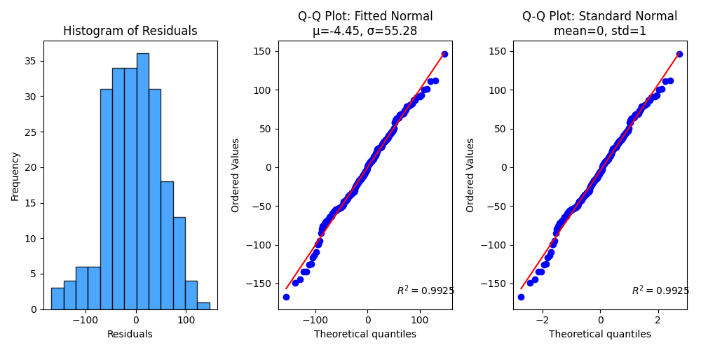
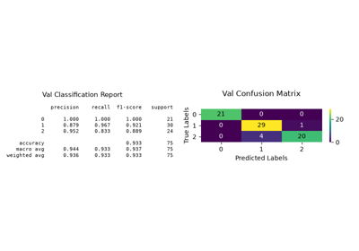

> **Note**
> [Go to the end](#sphx-glr-download-auto-examples-stats-plot-residuals-distribution-script-py)
to download the full example code or to run this example in your browser via JupyterLite or Binder.

# plot\_residuals\_distribution with examples[#](#plot-residuals-distribution-with-examples "Link to this heading")

An example showing the [`plot_residuals_distribution`](../../modules/generated/scikitplot.api.metrics.plot_residuals_distribution.html#scikitplot.api.metrics.plot_residuals_distribution "scikitplot.api.metrics.plot_residuals_distribution") function
used by a scikit-learn regressor.

```
# Authors: The scikit-plots developers
# SPDX-License-Identifier: BSD-3-Clause

```

## Import scikit-plots[#](#import-scikit-plots "Link to this heading")

```
from sklearn.datasets import (
    load_diabetes as load_data,
)
from sklearn.linear_model import LinearRegression
from sklearn.model_selection import train_test_split

import numpy as np

np.random.seed(0)  # reproducibility
# importing pylab or pyplot
import matplotlib.pyplot as plt

# Import scikit-plots
import scikitplot as sp

```

## Loading the dataset[#](#loading-the-dataset "Link to this heading")

```
# Load the data
X, y = load_data(return_X_y=True, as_frame=True)
X_train, X_val, y_train, y_val = train_test_split(X, y, test_size=0.5, random_state=0)

```

## Model Training[#](#model-training "Link to this heading")

```
# Create an instance of the LogisticRegression
model = LinearRegression().fit(X_train, y_train)

# Perform predictions
y_val_pred = model.predict(X_val)

```

## Plot

```
# Plot!
ax = sp.metrics.plot_residuals_distribution(
    y_val,
    y_val_pred,
    dist_type="normal",
    save_fig=True,
    save_fig_filename="",
    # overwrite=True,
    add_timestamp=True,
    verbose=True,
)

```

```
Fitted mean-mu (μ): -4.4509
Fitted std (σ)    : 55.2768
[INFO] Saving path to: /home/circleci/repo/galleries/examples/stats/result_images/plot_residuals_distribution_20260424_205425Z.png
[INFO] Plot saved to: /home/circleci/repo/galleries/examples/stats/result_images/plot_residuals_distribution_20260424_205425Z.png

```
> **References**
> The use of the following functions, methods, classes and modules is shown
in this example:

* <https://www.itl.nist.gov/div898/handbook/pri/section2/pri24.htm>
* <https://online.stat.psu.edu/stat462/node/122/>

Tags: [model-type: regression](../../_tags/model-type-regression.html) [model-workflow: model evaluation](../../_tags/model-workflow-model-evaluation.html) [plot-type: histogram](../../_tags/plot-type-histogram.html) [plot-type: qqplot](../../_tags/plot-type-qqplot.html) [domain: statistics](../../_tags/domain-statistics.html) [level: intermediate](../../_tags/level-intermediate.html) [purpose: showcase](../../_tags/purpose-showcase.html)

****Total running time of the script:**** (0 minutes 0.883 seconds)

[](https://mybinder.org/v2/gh/scikit-plots/scikit-plots/main?urlpath=lab/tree/notebooks/auto_examples/stats/plot_residuals_distribution_script.ipynb)[](../../lite/lab/index.html?path=auto_examples/stats/plot_residuals_distribution_script.ipynb)

[`Download Jupyter notebook: plot_residuals_distribution_script.ipynb`](../../_downloads/fdd94100034412f951831d4d290228c8/plot_residuals_distribution_script.ipynb)

[`Download Python source code: plot_residuals_distribution_script.py`](../../_downloads/67fbbba1b9e0450885e7be86675a7d48/plot_residuals_distribution_script.py)

[`Download zipped: plot_residuals_distribution_script.zip`](../../_downloads/0042a1ec9d9e321c37f3c4198f4aa294/plot_residuals_distribution_script.zip)

Related examples


[plot\_residuals\_distribution with examples](../regression/plot_residuals_distribution_script.html)

plot\_residuals\_distribution with examples

[plot\_confusion\_matrix with examples](../classification/plot_confusion_matrix_script.html)

plot\_confusion\_matrix with examples

[plot\_classifier\_eval with examples](../classification/plot_classifier_eval_script.html)

plot\_classifier\_eval with examples

[plot\_silhouette with examples](../clustering/plot_silhouette_script.html)

plot\_silhouette with examples

[Gallery generated by Sphinx-Gallery](https://sphinx-gallery.github.io)