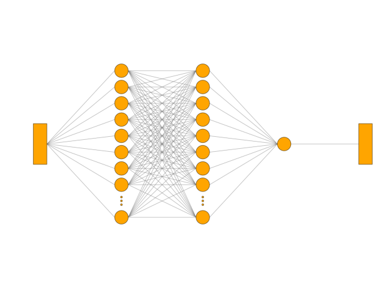
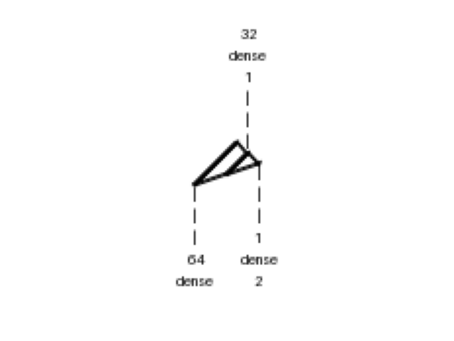
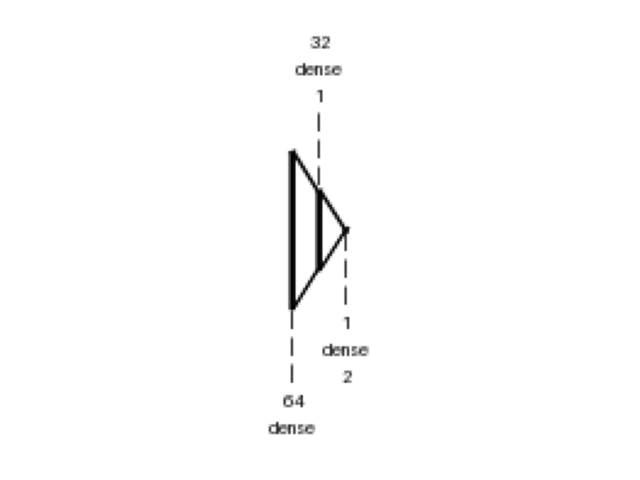
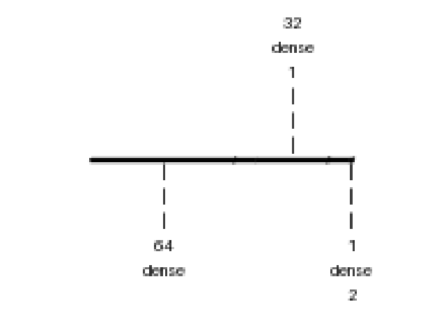
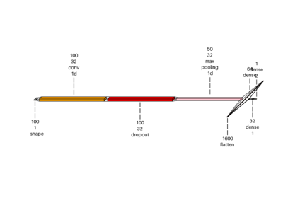
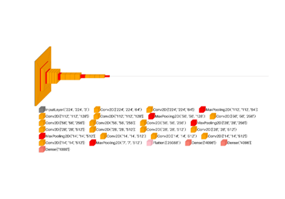
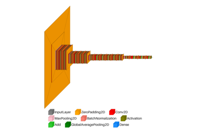
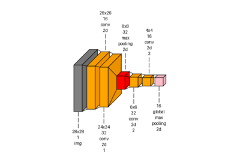

> **Note**
> [Go to the end](#sphx-glr-download-auto-examples-visualkeras-plot-dl-ann-dense-py)
to download the full example code or to run this example in your browser via JupyterLite or Binder.

# visualkeras: Spam Dense example[#](#visualkeras-spam-dense-example "Link to this heading")

An example showing the [`visualkeras`](../../apis/scikitplot.visualkeras.html#module-scikitplot.visualkeras "scikitplot.visualkeras") function
used by a [`tf.keras.Model`](https://www.tensorflow.org/api_docs/python/tf/keras/Model "(in TensorFlow v2.8)") model.

```
# Authors: The scikit-plots developers
# SPDX-License-Identifier: BSD-3-Clause

```
```
# visualkeras Need aggdraw tensorflow
# !pip install scikitplot[core, cpu]
# or
# !pip install aggdraw
# !pip install tensorflow
# python -c "import tensorflow as tf, google.protobuf as pb; print('tf', tf.__version__); print('protobuf', pb.__version__)"
# python -m pip check
# If Needed
# pip install -U "protobuf<6"
# pip install protobuf==5.29.4
import tensorflow as tf

# Clear any session to reset the state of TensorFlow/Keras
tf.keras.backend.clear_session()

import tensorflow.python as tf_python

# Clear any session to reset the state of TensorFlow/Keras
tf_python.keras.backend.clear_session()

```
```
model = tf_python.keras.models.Sequential()
model.add(tf_python.keras.layers.InputLayer(input_shape=(100,)))

# Add Dense layers
model.add(tf_python.keras.layers.Dense(64, activation="relu"))  # input_shape=(100,)
model.add(tf_python.keras.layers.Dense(32, activation="relu"))
model.add(tf_python.keras.layers.Dense(1, activation="sigmoid"))

# Compile the model
model.compile(optimizer="rmsprop", loss="binary_crossentropy", metrics=["accuracy"])
model.summary()

```
```
Model: "sequential"
_________________________________________________________________
Layer (type)                 Output Shape              Param #
=================================================================
dense (Dense)                (None, 64)                6464
_________________________________________________________________
dense_1 (Dense)              (None, 32)                2080
_________________________________________________________________
dense_2 (Dense)              (None, 1)                 33
=================================================================
Total params: 8,577
Trainable params: 8,577
Non-trainable params: 0
_________________________________________________________________

```
```
from scikitplot import visualkeras

```
```
img_spam = visualkeras.graph_view(
    model,
    # to_file="result_images/spam_dense_x.png",
    save_fig=True,
    save_fig_filename="spam_dense_graph.png",
)
img_spam

```

```
<matplotlib.image.AxesImage object at 0x7768ca72a1e0>

```
```
img_spam = visualkeras.layered_view(
    model,
    min_z=1,
    min_xy=1,
    max_z=4096,
    max_xy=4096,
    scale_z=1,
    scale_xy=1,
    font={"font_size": 7},
    text_callable="default",
    one_dim_orientation="x",
    # to_file="result_images/spam_dense_x.png",
    save_fig=True,
    save_fig_filename="spam_dense_x.png",
)
img_spam

```

```
<matplotlib.image.AxesImage object at 0x7768bc7d3920>

```
```
img_spam = visualkeras.layered_view(
    model,
    min_z=1,
    min_xy=1,
    max_z=4096,
    max_xy=4096,
    scale_z=1,
    scale_xy=1,
    font={"font_size": 7},
    text_callable="default",
    one_dim_orientation="y",
    # to_file="result_images/spam_dense_y.png",
    save_fig=True,
    save_fig_filename="spam_dense_y.png",
)
img_spam

```

```
<matplotlib.image.AxesImage object at 0x7768bc7d1670>

```
```
img_spam = visualkeras.layered_view(
    model,
    min_z=1,
    min_xy=1,
    max_z=4096,
    max_xy=4096,
    scale_z=1,
    scale_xy=1,
    font={"font_size": 7},
    text_callable="default",
    one_dim_orientation="z",
    # to_file="result_images/spam_dense_z.png",
    save_fig=True,
    save_fig_filename="spam_dense_z.png",
)
img_spam

```

```
<matplotlib.image.AxesImage object at 0x7768bc66b5f0>

```

Tags: [model-type: classification](../../_tags/model-type-classification.html) [model-workflow: model building](../../_tags/model-workflow-model-building.html) [plot-type: visualkeras](../../_tags/plot-type-visualkeras.html) [domain: neural network](../../_tags/domain-neural-network.html) [level: beginner](../../_tags/level-beginner.html) [purpose: showcase](../../_tags/purpose-showcase.html)

****Total running time of the script:**** (0 minutes 1.507 seconds)

[](https://mybinder.org/v2/gh/scikit-plots/scikit-plots/main?urlpath=lab/tree/notebooks/auto_examples/visualkeras/plot_dl_ann_dense.ipynb)[](../../lite/lab/index.html?path=auto_examples/visualkeras/plot_dl_ann_dense.ipynb)

[`Download Jupyter notebook: plot_dl_ann_dense.ipynb`](../../_downloads/d22c2bc643635d8ee40ce9fec47550ee/plot_dl_ann_dense.ipynb)

[`Download Python source code: plot_dl_ann_dense.py`](../../_downloads/e97ea283232bc463911870c23c1d0b09/plot_dl_ann_dense.py)

[`Download zipped: plot_dl_ann_dense.zip`](../../_downloads/cb773e5a278de24927cd54b22a43713d/plot_dl_ann_dense.zip)

Related examples



[Visualkeras: Spam Classification Conv1D Dense Example](plot_dl_ann_conv_dense.html)

Visualkeras: Spam Classification Conv1D Dense Example

[visualkeras: custom VGG example](plot_dl_cnn_vgg.html)

visualkeras: custom VGG example

[visualkeras: ResNetV2 example](plot_dl_cnn_resnetv2.html)

visualkeras: ResNetV2 example

[visualkeras: autoencoder example](plot_dl_cnn_autoencoder.html)

visualkeras: autoencoder example

[Gallery generated by Sphinx-Gallery](https://sphinx-gallery.github.io)