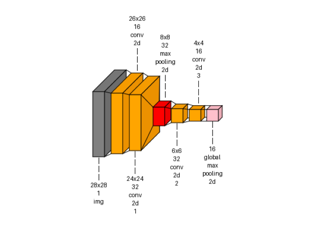
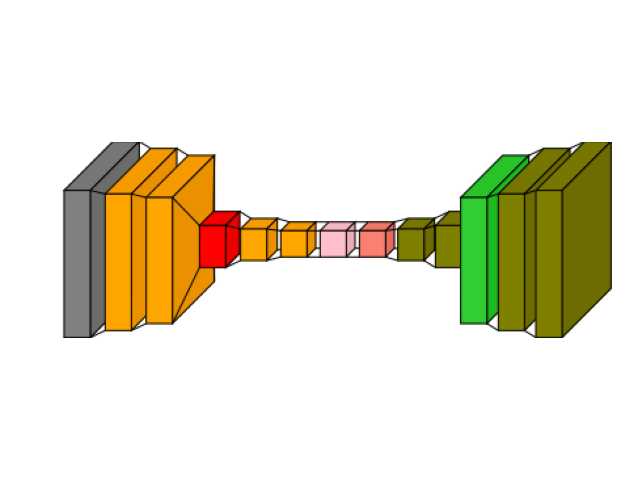
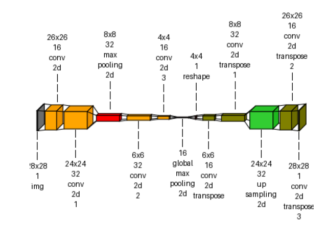

> **Note**
> [Go to the end](#sphx-glr-download-auto-examples-visualkeras-plot-dl-cnn-autoencoder-py)
to download the full example code or to run this example in your browser via JupyterLite or Binder.

# visualkeras: autoencoder example[#](#visualkeras-autoencoder-example "Link to this heading")

An example showing the [`visualkeras`](../../apis/scikitplot.visualkeras.html#module-scikitplot.visualkeras "scikitplot.visualkeras") function
used by a [`tf.keras.Model`](https://www.tensorflow.org/api_docs/python/tf/keras/Model "(in TensorFlow v2.8)") model.

```
# Authors: The scikit-plots developers
# SPDX-License-Identifier: BSD-3-Clause

```
```
# visualkeras Need aggdraw tensorflow
# !pip install scikitplot[core, cpu]
# or
# !pip install aggdraw
# !pip install tensorflow
# python -c "import tensorflow as tf, google.protobuf as pb; print('tf', tf.__version__); print('protobuf', pb.__version__)"
# python -m pip check
# If Needed
# pip install -U "protobuf<6"
# pip install protobuf==5.29.4
import tensorflow as tf

# Clear any session to reset the state of TensorFlow/Keras
tf.keras.backend.clear_session()

```

encoder Model

```
encoder_input = tf.keras.Input(shape=(28, 28, 1), name="img")
x = tf.keras.layers.Conv2D(16, 3, activation="relu")(encoder_input)
x = tf.keras.layers.Conv2D(32, 3, activation="relu")(x)
x = tf.keras.layers.MaxPooling2D(3)(x)
x = tf.keras.layers.Conv2D(32, 3, activation="relu")(x)
x = tf.keras.layers.Conv2D(16, 3, activation="relu")(x)
encoder_output = tf.keras.layers.GlobalMaxPooling2D()(x)
encoder = tf.keras.Model(encoder_input, encoder_output, name="encoder")

# autoencoder Model
x = tf.keras.layers.Reshape((4, 4, 1))(encoder_output)
x = tf.keras.layers.Conv2DTranspose(16, 3, activation="relu")(x)
x = tf.keras.layers.Conv2DTranspose(32, 3, activation="relu")(x)
x = tf.keras.layers.UpSampling2D(3)(x)
x = tf.keras.layers.Conv2DTranspose(16, 3, activation="relu")(x)
decoder_output = tf.keras.layers.Conv2DTranspose(1, 3, activation="relu")(x)
autoencoder = tf.keras.Model(encoder_input, decoder_output, name="autoencoder")
autoencoder.summary()

```
```
Model: "autoencoder"
┏━━━━━━━━━━━━━━━━━━━━━━━━━━━━━━━━━┳━━━━━━━━━━━━━━━━━━━━━━━━┳━━━━━━━━━━━━━━━┓
┃ Layer (type)                    ┃ Output Shape           ┃       Param # ┃
┡━━━━━━━━━━━━━━━━━━━━━━━━━━━━━━━━━╇━━━━━━━━━━━━━━━━━━━━━━━━╇━━━━━━━━━━━━━━━┩
│ img (InputLayer)                │ (None, 28, 28, 1)      │             0 │
├─────────────────────────────────┼────────────────────────┼───────────────┤
│ conv2d (Conv2D)                 │ (None, 26, 26, 16)     │           160 │
├─────────────────────────────────┼────────────────────────┼───────────────┤
│ conv2d_1 (Conv2D)               │ (None, 24, 24, 32)     │         4,640 │
├─────────────────────────────────┼────────────────────────┼───────────────┤
│ max_pooling2d (MaxPooling2D)    │ (None, 8, 8, 32)       │             0 │
├─────────────────────────────────┼────────────────────────┼───────────────┤
│ conv2d_2 (Conv2D)               │ (None, 6, 6, 32)       │         9,248 │
├─────────────────────────────────┼────────────────────────┼───────────────┤
│ conv2d_3 (Conv2D)               │ (None, 4, 4, 16)       │         4,624 │
├─────────────────────────────────┼────────────────────────┼───────────────┤
│ global_max_pooling2d            │ (None, 16)             │             0 │
│ (GlobalMaxPooling2D)            │                        │               │
├─────────────────────────────────┼────────────────────────┼───────────────┤
│ reshape (Reshape)               │ (None, 4, 4, 1)        │             0 │
├─────────────────────────────────┼────────────────────────┼───────────────┤
│ conv2d_transpose                │ (None, 6, 6, 16)       │           160 │
│ (Conv2DTranspose)               │                        │               │
├─────────────────────────────────┼────────────────────────┼───────────────┤
│ conv2d_transpose_1              │ (None, 8, 8, 32)       │         4,640 │
│ (Conv2DTranspose)               │                        │               │
├─────────────────────────────────┼────────────────────────┼───────────────┤
│ up_sampling2d (UpSampling2D)    │ (None, 24, 24, 32)     │             0 │
├─────────────────────────────────┼────────────────────────┼───────────────┤
│ conv2d_transpose_2              │ (None, 26, 26, 16)     │         4,624 │
│ (Conv2DTranspose)               │                        │               │
├─────────────────────────────────┼────────────────────────┼───────────────┤
│ conv2d_transpose_3              │ (None, 28, 28, 1)      │           145 │
│ (Conv2DTranspose)               │                        │               │
└─────────────────────────────────┴────────────────────────┴───────────────┘
 Total params: 28,241 (110.32 KB)
 Trainable params: 28,241 (110.32 KB)
 Non-trainable params: 0 (0.00 B)

```

Build the model with an explicit input shape

```
autoencoder.build(
    input_shape=(None, 28, 28, 1)
)  # Batch size of None, shape (28, 28, 1)

# Create a dummy input tensor with a batch size of 1
dummy_input = tf.random.normal([1, 28, 28, 1])  # Batch size of 1, shape (28, 28, 1)
# Run the dummy input through the model to trigger shape calculation
encoder_output = autoencoder(dummy_input)
# Now check the output shape of the encoder
print("Output shape after running model with dummy input:", encoder_output.shape)

# Check each layer's output shape after building the model
for layer in encoder.layers:
    if hasattr(layer, "output_shape"):
        print(f"{layer.name} output shape: {layer.output_shape}")
    if hasattr(layer, "output"):
        print(f"{layer.name} shape: {layer.output.shape}")

```
```
Output shape after running model with dummy input: (1, 28, 28, 1)
img shape: (None, 28, 28, 1)
conv2d shape: (None, 26, 26, 16)
conv2d_1 shape: (None, 24, 24, 32)
max_pooling2d shape: (None, 8, 8, 32)
conv2d_2 shape: (None, 6, 6, 32)
conv2d_3 shape: (None, 4, 4, 16)
global_max_pooling2d shape: (None, 16)

```
```
from scikitplot import visualkeras

img_encoder = visualkeras.layered_view(
    encoder,
    text_callable="default",
    # to_file="result_images/encoder.png",
    save_fig=True,
    save_fig_filename="encoder.png",
)
img_encoder

```

```
<matplotlib.image.AxesImage object at 0x717520727da0>

```
```
img_autoencoder = visualkeras.layered_view(
    autoencoder,
    # to_file="result_images/autoencoder.png",
    save_fig=True,
    save_fig_filename="autoencoder.png",
)
img_autoencoder

```

```
<matplotlib.image.AxesImage object at 0x7175206f7ef0>

```
```
img_autoencoder_text = visualkeras.layered_view(
    autoencoder,
    min_z=1,
    min_xy=1,
    max_z=4096,
    max_xy=4096,
    scale_z=1,
    scale_xy=1,
    # font={"font_size": 14},
    text_callable="default",
    # to_file="result_images/autoencoder_text.png",
    save_fig=True,
    save_fig_filename="autoencoder_text.png",
    overwrite=False,
    add_timestamp=True,
    verbose=True,
)
img_autoencoder_text

```

```
[INFO] Saving path to: /home/circleci/repo/galleries/examples/visualkeras/result_images/autoencoder_text_20260714_101509Z.png

<matplotlib.image.AxesImage object at 0x71752074db80>

```

Tags: [model-type: classification](../../_tags/model-type-classification.html) [model-workflow: model building](../../_tags/model-workflow-model-building.html) [plot-type: visualkeras](../../_tags/plot-type-visualkeras.html) [domain: neural network](../../_tags/domain-neural-network.html) [level: beginner](../../_tags/level-beginner.html) [purpose: showcase](../../_tags/purpose-showcase.html)

****Total running time of the script:**** (0 minutes 1.710 seconds)

[](https://mybinder.org/v2/gh/scikit-plots/scikit-plots/main?urlpath=lab/tree/notebooks/auto_examples/visualkeras/plot_dl_cnn_autoencoder.ipynb)[](../../lite/lab/index.html?path=auto_examples/visualkeras/plot_dl_cnn_autoencoder.ipynb)

[`Download Jupyter notebook: plot_dl_cnn_autoencoder.ipynb`](../../_downloads/4b39177cebfb444bcef8c65926866a31/plot_dl_cnn_autoencoder.ipynb)

[`Download Python source code: plot_dl_cnn_autoencoder.py`](../../_downloads/356c4f23e37470e1000febda7dac0109/plot_dl_cnn_autoencoder.py)

[`Download zipped: plot_dl_cnn_autoencoder.zip`](../../_downloads/f4553af3684ce5ddd08eb703889cc887/plot_dl_cnn_autoencoder.zip)

Related examples


[Visualkeras: Spam Classification Conv1D Dense Example](plot_dl_ann_conv_dense.html)

Visualkeras: Spam Classification Conv1D Dense Example

[visualkeras: custom vgg16 example](plot_dl_cnn_custom_vgg16.html)

visualkeras: custom vgg16 example

[visualkeras: custom vgg16 show dimension example](plot_dl_cnn_custom_vgg16_show_dimension.html)

visualkeras: custom vgg16 show dimension example

[visualkeras: Spam Dense example](plot_dl_ann_dense.html)

visualkeras: Spam Dense example

[Gallery generated by Sphinx-Gallery](https://sphinx-gallery.github.io)