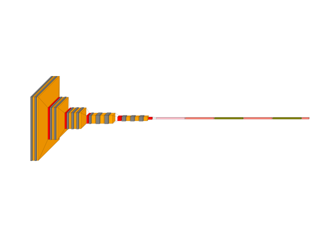
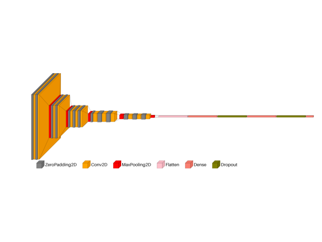
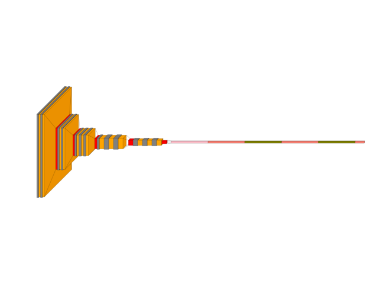
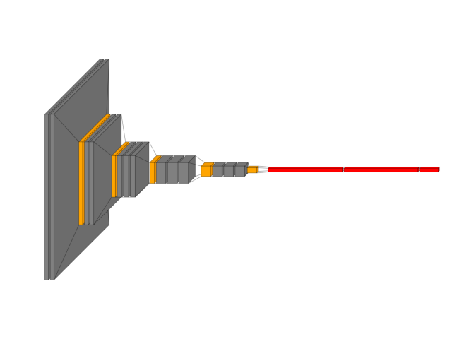
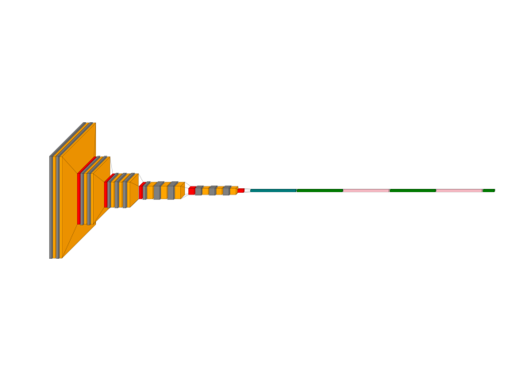
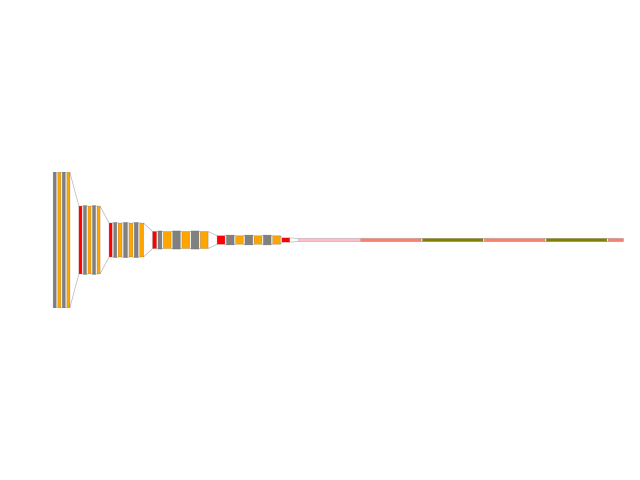

> **Note**
> [Go to the end](#sphx-glr-download-auto-examples-visualkeras-plot-dl-cnn-custom-vgg16-py)
to download the full example code or to run this example in your browser via JupyterLite or Binder.

# visualkeras: custom vgg16 example[#](#visualkeras-custom-vgg16-example "Link to this heading")

An example showing the [`visualkeras`](../../apis/scikitplot.visualkeras.html#module-scikitplot.visualkeras "scikitplot.visualkeras") function
used by a [`tf.keras.Model`](https://www.tensorflow.org/api_docs/python/tf/keras/Model "(in TensorFlow v2.8)") model.

```
# Authors: The scikit-plots developers
# SPDX-License-Identifier: BSD-3-Clause

```
```
# visualkeras Need aggdraw tensorflow
# !pip install scikitplot[core, cpu]
# or
# !pip install aggdraw
# !pip install tensorflow
# python -c "import tensorflow as tf, google.protobuf as pb; print('tf', tf.__version__); print('protobuf', pb.__version__)"
# python -m pip check
# If Needed
# pip install -U "protobuf<6"
# pip install protobuf==5.29.4
import tensorflow as tf

# Clear any session to reset the state of TensorFlow/Keras
tf.keras.backend.clear_session()

from scikitplot import visualkeras

```

create VGG16

```
image_size = 224
model = tf.keras.models.Sequential()
model.add(tf.keras.layers.InputLayer(shape=(image_size, image_size, 3)))

model.add(tf.keras.layers.ZeroPadding2D((1, 1)))
model.add(tf.keras.layers.Conv2D(64, activation="relu", kernel_size=(3, 3)))
model.add(tf.keras.layers.ZeroPadding2D((1, 1)))
model.add(tf.keras.layers.Conv2D(64, activation="relu", kernel_size=(3, 3)))
model.add(visualkeras.SpacingDummyLayer())

model.add(tf.keras.layers.MaxPooling2D((2, 2), strides=(2, 2)))
model.add(tf.keras.layers.ZeroPadding2D((1, 1)))
model.add(tf.keras.layers.Conv2D(128, activation="relu", kernel_size=(3, 3)))
model.add(tf.keras.layers.ZeroPadding2D((1, 1)))
model.add(tf.keras.layers.Conv2D(128, activation="relu", kernel_size=(3, 3)))
model.add(visualkeras.SpacingDummyLayer())

model.add(tf.keras.layers.MaxPooling2D((2, 2), strides=(2, 2)))
model.add(tf.keras.layers.ZeroPadding2D((1, 1)))
model.add(tf.keras.layers.Conv2D(256, activation="relu", kernel_size=(3, 3)))
model.add(tf.keras.layers.ZeroPadding2D((1, 1)))
model.add(tf.keras.layers.Conv2D(256, activation="relu", kernel_size=(3, 3)))
model.add(tf.keras.layers.ZeroPadding2D((1, 1)))
model.add(tf.keras.layers.Conv2D(256, activation="relu", kernel_size=(3, 3)))
model.add(visualkeras.SpacingDummyLayer())

model.add(tf.keras.layers.MaxPooling2D((2, 2), strides=(2, 2)))
model.add(tf.keras.layers.ZeroPadding2D((1, 1)))
model.add(tf.keras.layers.Conv2D(512, activation="relu", kernel_size=(3, 3)))
model.add(tf.keras.layers.ZeroPadding2D((1, 1)))
model.add(tf.keras.layers.Conv2D(512, activation="relu", kernel_size=(3, 3)))
model.add(tf.keras.layers.ZeroPadding2D((1, 1)))
model.add(tf.keras.layers.Conv2D(512, activation="relu", kernel_size=(3, 3)))
model.add(visualkeras.SpacingDummyLayer())

model.add(tf.keras.layers.MaxPooling2D((2, 2), strides=(2, 2)))
model.add(tf.keras.layers.ZeroPadding2D((1, 1)))
model.add(tf.keras.layers.Conv2D(512, activation="relu", kernel_size=(3, 3)))
model.add(tf.keras.layers.ZeroPadding2D((1, 1)))
model.add(tf.keras.layers.Conv2D(512, activation="relu", kernel_size=(3, 3)))
model.add(tf.keras.layers.ZeroPadding2D((1, 1)))
model.add(tf.keras.layers.Conv2D(512, activation="relu", kernel_size=(3, 3)))
model.add(tf.keras.layers.MaxPooling2D())
model.add(visualkeras.SpacingDummyLayer())

model.add(tf.keras.layers.Flatten())

model.add(tf.keras.layers.Dense(4096, activation="relu"))
model.add(tf.keras.layers.Dropout(0.5))
model.add(tf.keras.layers.Dense(4096, activation="relu"))
model.add(tf.keras.layers.Dropout(0.5))
model.add(tf.keras.layers.Dense(1000, activation="softmax"))
# model.summary()

```

Now visualize the model!

```
from collections import defaultdict

color_map = defaultdict(dict)
color_map[tf.keras.layers.Conv2D]["fill"] = "orange"
color_map[tf.keras.layers.ZeroPadding2D]["fill"] = "gray"
color_map[tf.keras.layers.Dropout]["fill"] = "pink"
color_map[tf.keras.layers.MaxPooling2D]["fill"] = "red"
color_map[tf.keras.layers.Dense]["fill"] = "green"
color_map[tf.keras.layers.Flatten]["fill"] = "teal"

```
```
from PIL import ImageFont

ImageFont.load_default()

```
```
<PIL.ImageFont.FreeTypeFont object at 0x7a93bd7c4150>

```
```
img_vgg16 = visualkeras.layered_view(
    model,
    type_ignore=[visualkeras.SpacingDummyLayer],
    # to_file="result_images/vgg16.png",
    save_fig=True,
    save_fig_filename="vgg16.png",
)

```

```
2026-04-09 03:49:55.042708: W scikitplot 134776804916096 _pil.py:204:load_font] Error loading system font: cannot open resource
2026-04-09 03:49:55.042969: W scikitplot 134776804916096 _pil.py:206:load_font] Falling back to PIL default font.
2026-04-09 03:49:55.043202: W scikitplot 134776804916096 _layered.py:216:layered_view] The legend_text_spacing_offset parameter is deprecated andwill be removed in a future release.

```
```
img_vgg16_legend = visualkeras.layered_view(
    model,
    type_ignore=[visualkeras.SpacingDummyLayer],
    legend=True,
    font={
        "font_size": 61,
        # 'use_default_font': False,
        # 'font_path': '/usr/share/fonts/truetype/dejavu/DejaVuSans-Bold.ttf'
    },
    # to_file="result_images/vgg16_legend.png",
    save_fig=True,
    save_fig_filename="vgg16_legend.png",
)
img_vgg16_legend

```

```
2026-04-09 03:49:56.585240: W scikitplot 134776804916096 _pil.py:204:load_font] Error loading system font: cannot open resource
2026-04-09 03:49:56.585386: W scikitplot 134776804916096 _pil.py:206:load_font] Falling back to PIL default font.
2026-04-09 03:49:56.585511: W scikitplot 134776804916096 _layered.py:216:layered_view] The legend_text_spacing_offset parameter is deprecated andwill be removed in a future release.

<matplotlib.image.AxesImage object at 0x7a93b4436650>

```
```
img_vgg16_spacing_layers = visualkeras.layered_view(
    model,
    type_ignore=[],
    spacing=0,
    # to_file="result_images/vgg16_spacing_layers.png",
    save_fig=True,
    save_fig_filename="vgg16_spacing_layers.png",
)
img_vgg16_spacing_layers

```

```
2026-04-09 03:49:57.791192: W scikitplot 134776804916096 _pil.py:204:load_font] Error loading system font: cannot open resource
2026-04-09 03:49:57.791350: W scikitplot 134776804916096 _pil.py:206:load_font] Falling back to PIL default font.
2026-04-09 03:49:57.791471: W scikitplot 134776804916096 _layered.py:216:layered_view] The legend_text_spacing_offset parameter is deprecated andwill be removed in a future release.

<matplotlib.image.AxesImage object at 0x7a93b4260ed0>

```
```
img_vgg16_type_ignore = visualkeras.layered_view(
    model,
    type_ignore=[
        tf.keras.layers.ZeroPadding2D,
        tf.keras.layers.Dropout,
        tf.keras.layers.Flatten,
        visualkeras.SpacingDummyLayer,
    ],
    # to_file="result_images/vgg16_type_ignore.png",
    save_fig=True,
    save_fig_filename="vgg16_type_ignore.png",
)
img_vgg16_type_ignore

```

```
2026-04-09 03:49:58.650046: W scikitplot 134776804916096 _pil.py:204:load_font] Error loading system font: cannot open resource
2026-04-09 03:49:58.650171: W scikitplot 134776804916096 _pil.py:206:load_font] Falling back to PIL default font.
2026-04-09 03:49:58.650272: W scikitplot 134776804916096 _layered.py:216:layered_view] The legend_text_spacing_offset parameter is deprecated andwill be removed in a future release.

<matplotlib.image.AxesImage object at 0x7a93b446a9d0>

```
```
img_vgg16_color_map = visualkeras.layered_view(
    model,
    type_ignore=[visualkeras.SpacingDummyLayer],
    color_map=color_map,
    # to_file="result_images/vgg16_color_map.png",
    save_fig=True,
    save_fig_filename="vgg16_color_map.png",
)
img_vgg16_color_map

```

```
2026-04-09 03:49:59.299880: W scikitplot 134776804916096 _pil.py:204:load_font] Error loading system font: cannot open resource
2026-04-09 03:49:59.299981: W scikitplot 134776804916096 _pil.py:206:load_font] Falling back to PIL default font.
2026-04-09 03:49:59.300102: W scikitplot 134776804916096 _layered.py:216:layered_view] The legend_text_spacing_offset parameter is deprecated andwill be removed in a future release.

<matplotlib.image.AxesImage object at 0x7a93b40f6650>

```
```
img_vgg16_flat = visualkeras.layered_view(
    model,
    type_ignore=[visualkeras.SpacingDummyLayer],
    draw_volume=False,
    # to_file="result_images/vgg16_flat.png",
    save_fig=True,
    save_fig_filename="vgg16_flat.png",
)
img_vgg16_flat

```

```
2026-04-09 03:50:00.187851: W scikitplot 134776804916096 _pil.py:204:load_font] Error loading system font: cannot open resource
2026-04-09 03:50:00.187951: W scikitplot 134776804916096 _pil.py:206:load_font] Falling back to PIL default font.
2026-04-09 03:50:00.188044: W scikitplot 134776804916096 _layered.py:216:layered_view] The legend_text_spacing_offset parameter is deprecated andwill be removed in a future release.

<matplotlib.image.AxesImage object at 0x7a93b41a2a90>

```
```
img_vgg16_scaling = visualkeras.layered_view(
    model,
    type_ignore=[visualkeras.SpacingDummyLayer],
    # legend=True,
    min_z=1,
    min_xy=1,
    max_z=4096,
    max_xy=4096,
    scale_z=0.5,
    scale_xy=11,
    # font={'font_size': 99},
    # to_file="result_images/vgg16_scaling.png",
    save_fig=True,
    save_fig_filename="vgg16_scaling.png",
)
img_vgg16_scaling

```

```
2026-04-09 03:50:00.834537: W scikitplot 134776804916096 _pil.py:204:load_font] Error loading system font: cannot open resource
2026-04-09 03:50:00.834638: W scikitplot 134776804916096 _pil.py:206:load_font] Falling back to PIL default font.
2026-04-09 03:50:00.834730: W scikitplot 134776804916096 _layered.py:216:layered_view] The legend_text_spacing_offset parameter is deprecated andwill be removed in a future release.

<matplotlib.image.AxesImage object at 0x7a939c12dad0>

```

Tags: [model-type: classification](../../_tags/model-type-classification.html) [model-workflow: model building](../../_tags/model-workflow-model-building.html) [plot-type: visualkeras](../../_tags/plot-type-visualkeras.html) [domain: neural network](../../_tags/domain-neural-network.html) [level: intermediate](../../_tags/level-intermediate.html) [purpose: showcase](../../_tags/purpose-showcase.html)

****Total running time of the script:**** (0 minutes 19.645 seconds)

[](https://mybinder.org/v2/gh/scikit-plots/scikit-plots/main?urlpath=lab/tree/notebooks/auto_examples/visualkeras/plot_dl_cnn_custom_vgg16.ipynb)[](../../lite/lab/index.html?path=auto_examples/visualkeras/plot_dl_cnn_custom_vgg16.ipynb)

[`Download Jupyter notebook: plot_dl_cnn_custom_vgg16.ipynb`](../../_downloads/e481ecb67894fdb6a75bbb1312a1c096/plot_dl_cnn_custom_vgg16.ipynb)

[`Download Python source code: plot_dl_cnn_custom_vgg16.py`](../../_downloads/9857bfa7574a3ef43762c6a02c005c07/plot_dl_cnn_custom_vgg16.py)

[`Download zipped: plot_dl_cnn_custom_vgg16.zip`](../../_downloads/98f385db7b0e0cbd4a829aecfe9b683d/plot_dl_cnn_custom_vgg16.zip)

Related examples


[visualkeras: custom vgg16 show dimension example](plot_dl_cnn_custom_vgg16_show_dimension.html)

visualkeras: custom vgg16 show dimension example

[visualkeras: autoencoder example](plot_dl_cnn_autoencoder.html)

visualkeras: autoencoder example

[visualkeras: Spam Dense example](plot_dl_ann_dense.html)

visualkeras: Spam Dense example

[Visualkeras: Spam Classification Conv1D Dense Example](plot_dl_ann_conv_dense.html)

Visualkeras: Spam Classification Conv1D Dense Example

[Gallery generated by Sphinx-Gallery](https://sphinx-gallery.github.io)