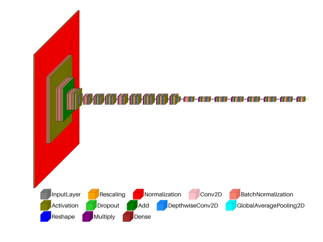

> **Note**
> [Go to the end](#sphx-glr-download-auto-examples-visualkeras-plot-dl-cnn-efficientnetv2-py)
to download the full example code or to run this example in your browser via JupyterLite or Binder.

# visualkeras: EfficientNetV2 example[#](#visualkeras-efficientnetv2-example "Link to this heading")

An example showing the [`visualkeras`](../../apis/scikitplot.visualkeras.html#module-scikitplot.visualkeras "scikitplot.visualkeras") function
used by a [`tf.keras.Model`](https://www.tensorflow.org/api_docs/python/tf/keras/Model "(in TensorFlow v2.8)") model.

```
# Authors: The scikit-plots developers
# SPDX-License-Identifier: BSD-3-Clause

```
```
# visualkeras Need aggdraw tensorflow
# !pip install scikitplot[core, cpu]
# or
# !pip install aggdraw
# !pip install tensorflow
# python -c "import tensorflow as tf, google.protobuf as pb; print('tf', tf.__version__); print('protobuf', pb.__version__)"
# python -m pip check
# If Needed
# pip install -U "protobuf<6"
# pip install protobuf==5.29.4
import tensorflow as tf

# Clear any session to reset the state of TensorFlow/Keras
tf.keras.backend.clear_session()

from scikitplot import visualkeras

```
```
model = tf.keras.applications.EfficientNetV2B0(
    include_top=True,
    weights=None,  # "imagenet" or 'path/'
    input_tensor=None,
    input_shape=None,
    pooling=None,
    classes=1000,
    classifier_activation="softmax",
    name="efficientnetv2-b0",
)
# model.summary()

```
```
img_efficientnetv2 = visualkeras.layered_view(
    model,
    legend=True,
    min_z=1,
    min_xy=1,
    max_z=4096,
    max_xy=4096,
    scale_z=0.01,
    scale_xy=10,
    font={"font_size": 99},
    # to_file="result_images/efficientnetv2-b0.png",
    save_fig=True,
    save_fig_filename="efficientnetv2-b0.png",
)
img_efficientnetv2

```

```
<matplotlib.image.AxesImage object at 0x7fda54195520>

```

Tags: [model-type: classification](../../_tags/model-type-classification.html) [model-workflow: model building](../../_tags/model-workflow-model-building.html) [plot-type: visualkeras](../../_tags/plot-type-visualkeras.html) [domain: neural network](../../_tags/domain-neural-network.html) [level: beginner](../../_tags/level-beginner.html) [purpose: showcase](../../_tags/purpose-showcase.html)

```
# model = tf.keras.applications.EfficientNetV2B1(
#     include_top=True,
#     weights=None,  # "imagenet" or 'path/'
#     input_tensor=None,
#     input_shape=None,
#     pooling=None,
#     classes=1000,
#     classifier_activation="softmax",
#     name="efficientnetv2-b1",
# )
# visualkeras.layered_view(
#   model,
#   legend=True,
#   show_dimension=True,
#   to_file='result_images/efficientnetv2-b1.png',
# )

# model = tf.keras.applications.EfficientNetV2B2(
#     include_top=True,
#     weights=None,  # "imagenet" or 'path/'
#     input_tensor=None,
#     input_shape=None,
#     pooling=None,
#     classes=1000,
#     classifier_activation="softmax",
#     name="efficientnetv2-b2",
# )
# visualkeras.layered_view(
#   model,
#   legend=True,
#   show_dimension=True,
#   to_file='result_images/efficientnetv2-b2.png',
# )

# model = tf.keras.applications.EfficientNetV2B3(
#     include_top=True,
#     weights=None,  # "imagenet" or 'path/'
#     input_tensor=None,
#     input_shape=None,
#     pooling=None,
#     classes=1000,
#     classifier_activation="softmax",
#     name="efficientnetv2-b3",
# )
# visualkeras.layered_view(
#   model,
#   legend=True,
#   show_dimension=True,
#   to_file='result_images/efficientnetv2-b3.png',
# )

# model = tf.keras.applications.EfficientNetV2S(
#     include_top=True,
#     weights=None,  # "imagenet" or 'path/'
#     input_tensor=None,
#     input_shape=None,
#     pooling=None,
#     classes=1000,
#     classifier_activation="softmax",
#     name="efficientnetv2-s",
# )
# visualkeras.layered_view(
#   model,
#   legend=True,
#   show_dimension=True,
#   to_file='result_images/efficientnetv2-s.png',
# )

# model = tf.keras.applications.EfficientNetV2M(
#     include_top=True,
#     weights=None,  # "imagenet" or 'path/'
#     input_tensor=None,
#     input_shape=None,
#     pooling=None,
#     classes=1000,
#     classifier_activation="softmax",
#     name="efficientnetv2-m",
# )
# visualkeras.layered_view(
#   model,
#   legend=True,
#   show_dimension=True,
#   to_file='result_images/efficientnetv2-m.png',
# )

# model = tf.keras.applications.EfficientNetV2L(
#     include_top=True,
#     weights=None,  # "imagenet" or 'path/'
#     input_tensor=None,
#     input_shape=None,
#     pooling=None,
#     classes=1000,
#     classifier_activation="softmax",
#     name="efficientnetv2-l",
# )
# visualkeras.layered_view(
#   model,
#   legend=True,
#   show_dimension=True,
#   to_file='result_images/efficientnetv2-l.png',
# )

```

****Total running time of the script:**** (0 minutes 7.245 seconds)

[](https://mybinder.org/v2/gh/scikit-plots/scikit-plots/main?urlpath=lab/tree/notebooks/auto_examples/visualkeras/plot_dl_cnn_efficientnetv2.ipynb)[](../../lite/lab/index.html?path=auto_examples/visualkeras/plot_dl_cnn_efficientnetv2.ipynb)

[`Download Jupyter notebook: plot_dl_cnn_efficientnetv2.ipynb`](../../_downloads/1d81df3791074e433df1bed7701125b5/plot_dl_cnn_efficientnetv2.ipynb)

[`Download Python source code: plot_dl_cnn_efficientnetv2.py`](../../_downloads/1a5532fb454bff3a9ac7378144f3865d/plot_dl_cnn_efficientnetv2.py)

[`Download zipped: plot_dl_cnn_efficientnetv2.zip`](../../_downloads/ff13489b64f763ff3ec563967395c291/plot_dl_cnn_efficientnetv2.zip)

Related examples


[visualkeras: ResNetV2 example](plot_dl_cnn_resnetv2.html)

visualkeras: ResNetV2 example

[visualkeras: custom VGG example](plot_dl_cnn_vgg.html)

visualkeras: custom VGG example

[visualkeras: Spam Dense example](plot_dl_ann_dense.html)

visualkeras: Spam Dense example

[Visualkeras: Spam Classification Conv1D Dense Example](plot_dl_ann_conv_dense.html)

Visualkeras: Spam Classification Conv1D Dense Example

[Gallery generated by Sphinx-Gallery](https://sphinx-gallery.github.io)