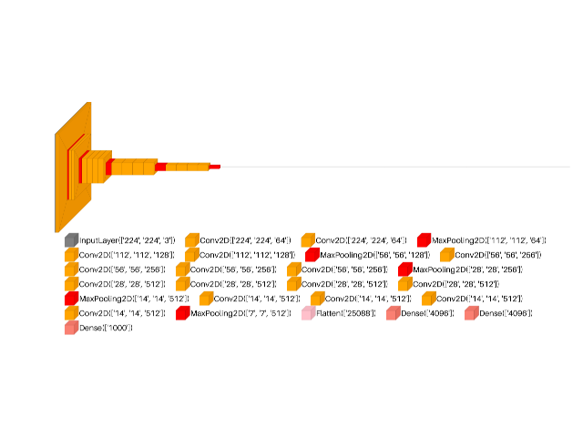

> **Note**
> [Go to the end](#sphx-glr-download-auto-examples-visualkeras-plot-dl-cnn-vgg-py)
to download the full example code or to run this example in your browser via JupyterLite or Binder.

# visualkeras: custom VGG example[#](#visualkeras-custom-vgg-example "Link to this heading")

An example showing the [`visualkeras`](../../apis/scikitplot.visualkeras.html#module-scikitplot.visualkeras "scikitplot.visualkeras") function
used by a [`tf.keras.Model`](https://www.tensorflow.org/api_docs/python/tf/keras/Model "(in TensorFlow v2.8)") model.

```
# Authors: The scikit-plots developers
# SPDX-License-Identifier: BSD-3-Clause

```
```
# visualkeras Need aggdraw tensorflow
# !pip install scikitplot[core, cpu]
# or
# !pip install aggdraw
# !pip install tensorflow
# python -c "import tensorflow as tf, google.protobuf as pb; print('tf', tf.__version__); print('protobuf', pb.__version__)"
# python -m pip check
# If Needed
# pip install -U "protobuf<6"
# pip install protobuf==5.29.4
import tensorflow as tf

# Clear any session to reset the state of TensorFlow/Keras
tf.keras.backend.clear_session()

from scikitplot import visualkeras

```
```
# model = tf.keras.applications.VGG16(
#     include_top=True,
#     weights=None,  # "imagenet" or 'path/'
#     input_tensor=None,
#     input_shape=None,
#     pooling=None,
#     classes=1000,
#     classifier_activation="softmax",
#     name="vgg16",
# )
# model.summary()
# visualkeras.layered_view(
#   model,
#   legend=True,
#   show_dimension=True,
#   to_file='result_images/vgg16.png',
# )

```
```
model = tf.keras.applications.VGG19(
    include_top=True,
    weights=None,  # "imagenet" or 'path/'
    input_tensor=None,
    input_shape=None,
    pooling=None,
    classes=1000,
    classifier_activation="softmax",
    name="vgg19",
)
# model.summary()

```
```
img_vgg19 = visualkeras.layered_view(
    model,
    legend=True,
    show_dimension=True,
    min_z=1,
    min_xy=1,
    max_z=4096,
    max_xy=4096,
    scale_z=0.5,
    scale_xy=11,
    font={"font_size": 199},
    # to_file="result_images/vgg19.png",
    save_fig=True,
    save_fig_filename="vgg19.png",
    overwrite=False,
    add_timestamp=True,
    verbose=True,
)
img_vgg19

```

```
[INFO] Saving path to: /home/circleci/repo/galleries/examples/visualkeras/result_images/vgg19_20260605_124424Z.png

<matplotlib.image.AxesImage object at 0x770bfc2a1e90>

```

Tags: [model-type: classification](../../_tags/model-type-classification.html) [model-workflow: model building](../../_tags/model-workflow-model-building.html) [plot-type: visualkeras](../../_tags/plot-type-visualkeras.html) [domain: neural network](../../_tags/domain-neural-network.html) [level: beginner](../../_tags/level-beginner.html) [purpose: showcase](../../_tags/purpose-showcase.html)

****Total running time of the script:**** (0 minutes 12.305 seconds)

[](https://mybinder.org/v2/gh/scikit-plots/scikit-plots/main?urlpath=lab/tree/notebooks/auto_examples/visualkeras/plot_dl_cnn_vgg.ipynb)[](../../lite/lab/index.html?path=auto_examples/visualkeras/plot_dl_cnn_vgg.ipynb)

[`Download Jupyter notebook: plot_dl_cnn_vgg.ipynb`](../../_downloads/1e3f6b4c17acc609274f8d127b6704e6/plot_dl_cnn_vgg.ipynb)

[`Download Python source code: plot_dl_cnn_vgg.py`](../../_downloads/718001043976eeca602d67a78005b9ef/plot_dl_cnn_vgg.py)

[`Download zipped: plot_dl_cnn_vgg.zip`](../../_downloads/31f727c0041d79c0321971d3906b9756/plot_dl_cnn_vgg.zip)

Related examples


[visualkeras: ResNetV2 example](plot_dl_cnn_resnetv2.html)

visualkeras: ResNetV2 example

[visualkeras: EfficientNetV2 example](plot_dl_cnn_efficientnetv2.html)

visualkeras: EfficientNetV2 example

[visualkeras: Spam Dense example](plot_dl_ann_dense.html)

visualkeras: Spam Dense example

[visualkeras: Vector Index DB](plot_dl_nlp_vector_index_db.html)

visualkeras: Vector Index DB

[Gallery generated by Sphinx-Gallery](https://sphinx-gallery.github.io)