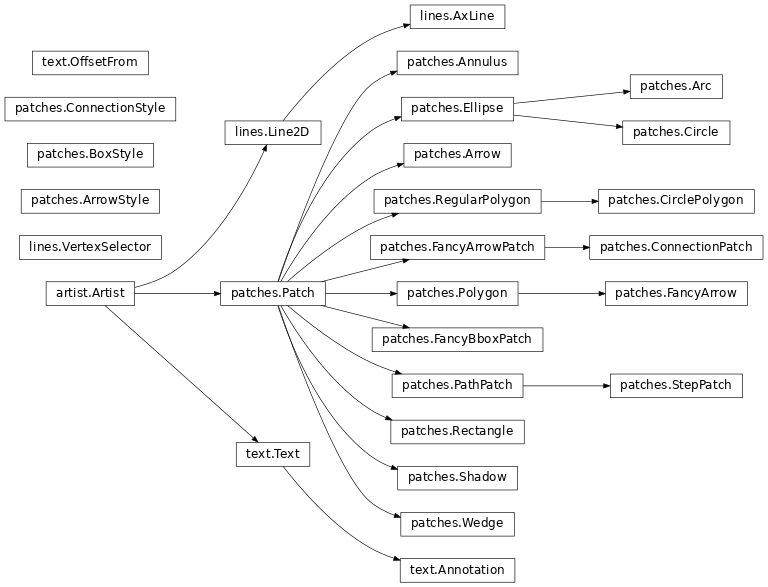

# Documentation Writing Guidelines[#](#documentation-writing-guidelines "Link to this heading")

> **Template**
> Template for further usage, template belong to matplotlib.

restructuredtext References:[#](#restructuredtext-references: "Link to this dropdown")

* <https://www.sphinx-doc.org/en/master/index.html>
* <https://sphinx-tutorial.readthedocs.io/cheatsheet/#rst-cheat-sheet>
* <https://documatt.com/restructuredtext-reference/>
* <https://docs.anaconda.com/restructuredtext/#restructuredtext-cheat-sheet>
* <https://docutils.sourceforge.io/docs/ref/rst/restructuredtext.html#comments>
* <https://bashtage.github.io/sphinx-material/rst-cheatsheet/rst-cheatsheet.html>
* <https://sphinxdocs.ansys.com/version/stable/examples/sphinx-design.html>

## Getting started[#](#getting-started "Link to this heading")

### General file structure[#](#general-file-structure "Link to this heading")

All documentation is built from the `doc/`. The `doc/`
directory contains configuration files for Sphinx and reStructuredText
([docutils](https://docutils.sourceforge.io/rst.html); `.rst`) files that are rendered to documentation pages.

Documentation is created in three ways. First, API documentation
(`doc/api`) is created by [sphinx](https://pypi.org/project/Sphinx/) from
the docstrings of the classes in the Matplotlib library. Except for
`doc/api/api_changes/`, `.rst` files in `doc/api` are created
when the documentation is built. See [Write docstrings](#writing-docstrings) below.

Second, our example pages, tutorials, and some of the narrative documentation
are created by [sphinx-gallery](https://sphinx-gallery.readthedocs.io/en/latest/). Sphinx Gallery converts example Python files
to `*.rst` files with the result of Matplotlib plot calls as embedded images.
See [Write examples and tutorials](#writing-examples-and-tutorials) below.

Third, Matplotlib has narrative docs written in [docutils](https://docutils.sourceforge.io/rst.html) in subdirectories of
`doc/users/`. If you would like to add new documentation that is suited
to an `.rst` file rather than a gallery or tutorial example, choose an
appropriate subdirectory to put it in, and add the file to the table of
contents of `index.rst` of the subdirectory. See
[Write ReST pages](#writing-rest-pages) below.

> **Note**
> Don’t directly edit the `.rst` files in `doc/plot_types`,
`doc/gallery`, `doc/tutorials`, and `doc/api`
(excepting `doc/api/api_changes/`). [sphinx](https://pypi.org/project/Sphinx/) regenerates
files in these directories when building documentation.

### Set up the build[#](#set-up-the-build "Link to this heading")

The documentation for Matplotlib is generated from reStructuredText ([docutils](https://docutils.sourceforge.io/rst.html))
using the [sphinx](https://pypi.org/project/Sphinx/) documentation generation tool.

To build the documentation you will need to
[set up Matplotlib for development](guide_devel_setup.html#installing-for-devs). Note in
particular the [additional dependencies](../install/dependencies.html#doc-dependencies) required to
build the documentation.

### Build the docs[#](#build-the-docs "Link to this heading")

The documentation sources are found in the `doc/` directory.
The configuration file for Sphinx is `doc/conf.py`. It controls which
directories Sphinx parses, how the docs are built, and how the extensions are
used. To build the documentation in html format, cd into `doc/` and run:

```
make html

```
> **Note**
> Since the documentation is very large, the first build may take 10-20 minutes,
depending on your machine. Subsequent builds will be faster.

Other useful invocations include

```
# Build the html documentation, but skip generation of the gallery images to
# save time.
make html-noplot

# Build the html documentation, but skip specific subdirectories.  If a gallery
# directory is skipped, the gallery images are not generated.  The first
# time this is run, it creates ``.mpl_skip_subdirs.yaml`` which can be edited
# to add or remove subdirectories
make html-skip-subdirs

# Delete built files.  May help if you get errors about missing paths or
# broken links.
make clean

# Build pdf docs.
make latexpdf

```

The `SPHINXOPTS` variable is set to `-W --keep-going` by default to build
the complete docs but exit with exit status 1 if there are warnings. To unset
it, use

```
make SPHINXOPTS= html

```

You can use the `O` variable to set additional options:

* `make O=-j4 html` runs a parallel build with 4 processes.
* `make O=-Dplot_formats=png:100 html` saves figures in low resolution.

Multiple options can be combined, e.g. `make O='-j4 -Dplot_formats=png:100'
html`.

On Windows, set the options as environment variables, e.g.:

```
set SPHINXOPTS= & set O=-j4 -Dplot_formats=png:100 & make html

```

### Show locally built docs[#](#show-locally-built-docs "Link to this heading")

The built docs are available in the folder `build/html`. A shortcut
for opening them in your default browser is:

```
make show

```

## Write ReST pages[#](#write-rest-pages "Link to this heading")

Most documentation is either in the docstrings of individual
classes and methods, in explicit `.rst` files, or in examples and tutorials.
All of these use the [docutils](https://docutils.sourceforge.io/rst.html) syntax and are processed by [sphinx](https://pypi.org/project/Sphinx/).

The [Sphinx reStructuredText Primer](https://www.sphinx-doc.org/en/master/usage/restructuredtext/basics.html) is
a good introduction into using ReST. More complete information is available in
the [reStructuredText reference documentation](https://docutils.sourceforge.io/rst.html#reference-documentation).

This section contains additional information and conventions how ReST is used
in the Matplotlib documentation.

### Formatting and style conventions[#](#formatting-and-style-conventions "Link to this heading")

It is useful to strive for consistency in the Matplotlib documentation. Here
are some formatting and style conventions that are used.

```
=================
This is a heading
=================
# with overline, for parts
* with overline, for chapters
= for sections
- for subsections
^ for subsubsections
" for paragraphs

one asterisk: *text* for emphasis (italics),
two asterisks: **text** for strong emphasis (boldface), and
backquotes: ``text`` for code samples.
escape with a backslash \

* This is a bulleted list.
* It has two items, the second
  item uses two lines.

1. This is a numbered list.
2. It has two items too.

. This is a numbered list.
. It has two items too.

```

#### Section formatting[#](#section-formatting "Link to this heading")

Use [sentence case](https://apastyle.apa.org/style-grammar-guidelines/capitalization/sentence-case)
`Upper lower` for section titles, e.g., `Possible hangups` rather than
`Possible Hangups`.

We aim to follow the recommendations from the
[Python documentation](https://devguide.python.org/documenting/#sections)
and the [Sphinx reStructuredText documentation](https://www.sphinx-doc.org/en/master/usage/restructuredtext/basics.html#sections)
for section markup characters, i.e.:

* `#` with overline, for parts. This is reserved for the main title in
  `index.rst`. All other pages should start with “chapter” or lower.
* `*` with overline, for chapters
* `=`, for sections
* `-`, for subsections
* `^`, for subsubsections
* `"`, for paragraphs

This may not yet be applied consistently in existing docs.

#### Table formatting[#](#table-formatting "Link to this heading")

Given the size of the table and length of each entry, use:

|  |  |  |
| --- | --- | --- |
|  | small table | large table |
| short entry | [simple or grid table](https://www.sphinx-doc.org/en/master/usage/restructuredtext/basics.html#tables) | [grid table](https://docutils.sourceforge.io/docs/ref/rst/restructuredtext.html#grid-tables) |
| long entry | [list table](https://docutils.sourceforge.io/docs/ref/rst/directives.html#list-table) | [csv table](https://docutils.sourceforge.io/docs/ref/rst/directives.html#csv-table-1) |

For more information, see [rst tables](https://www.sphinx-doc.org/en/master/usage/restructuredtext/directives.html#tables).

#### Function arguments[#](#function-arguments "Link to this heading")

Function arguments and keywords within docstrings should be referred to using
the `*emphasis*` role. This will keep Matplotlib’s documentation consistent
with Python’s documentation:

```
Here is a description of *argument*

```

Do not use the ``default role``:

```
Do not describe `argument` like this.  As per the next section,
this syntax will (unsuccessfully) attempt to resolve the argument as a
link to a class or method in the library.

```

nor the ```literal``` role:

```
Do not describe ``argument`` like this.

```

### Refer to other documents and sections[#](#refer-to-other-documents-and-sections "Link to this heading")

[sphinx](https://pypi.org/project/Sphinx/) supports internal [`https://www.sphinx-doc.org/en/stable/usage/restructuredtext/roles.html`\_\_](#id3):

| Role | Links target | Representation in rendered HTML |
| --- | --- | --- |
| [`:doc:`](https://www.sphinx-doc.org/en/master/usage/restructuredtext/roles.html#role-doc) | document | link to a page |
| [`:ref:`](https://www.sphinx-doc.org/en/master/usage/restructuredtext/roles.html#role-ref) | reference label | link to an anchor associated with a heading |

Examples:

```
See the :doc:`/install/index`

See the tutorial :ref:`quick_start`

See the example :doc:`/gallery/lines_bars_and_markers/simple_plot`

```

will render as:

> See the [Installation](../install/index.html)
>
> See the tutorial [Quick Start Guide](../introduction/quick_start.html#quick-start)
>
> See the example [Line plot](https://matplotlib.org/devdocs/gallery/lines_bars_and_markers/simple_plot.html "(in Matplotlib v3.11.0.dev2075+ga7fc90270)")

Sections can also be given reference labels. For instance from the
[Installation](../install/index.html) link:

```
.. _clean-install:

How to completely remove Matplotlib
===================================

Occasionally, problems with Matplotlib can be solved with a clean...

```

and refer to it using the standard reference syntax:

```
See :ref:`clean-install`

```

will give the following link: [How to completely remove Matplotlib](../install/index.html#clean-install)

To maximize internal consistency in section labeling and references,
use hyphen separated, descriptive labels for section references.
Keep in mind that contents may be reorganized later, so
avoid top level names in references like `user` or `devel`
or `faq` unless necessary, because for example the FAQ “what is a
backend?” could later become part of the users guide, so the label:

```
.. _what-is-a-backend:

```

is better than:

```
.. _faq-backend:

```

In addition, since underscores are widely used by Sphinx itself, use
hyphens to separate words.

### Refer to other code[#](#refer-to-other-code "Link to this heading")

To link to other methods, classes, or modules in Matplotlib you can use
back ticks, for example:

```
`matplotlib.collections.LineCollection`

```

generates a link like this: `matplotlib.collections.LineCollection`.

**Note:** We use the sphinx setting `default_role = 'obj'` so that you don’t
have to use qualifiers like `:class:`, `:func:`, `:meth:` and the likes.

Often, you don’t want to show the full package and module name. As long as the
target is unambiguous you can simply leave them out:

```
`.LineCollection`

```

and the link still works: `.LineCollection`. Note that you should typically include
the leading dot. It tells Sphinx to look for the given name in the whole project.
See also the explanation at [Sphinx: Cross-referencing Python objects](https://www.sphinx-doc.org/en/master/usage/domains/python.html#cross-referencing-python-objects).

If there are multiple code elements with the same name (e.g. `plot()` is a
method in multiple classes), you’ll have to extend the definition:

```
`.pyplot.plot` or `.Axes.plot`

```

These will show up as `.pyplot.plot` or `.Axes.plot`. To still show only the
last segment you can add a tilde as prefix:

```
`~.pyplot.plot` or `~.Axes.plot`

```

will render as `~.pyplot.plot` or `~.Axes.plot`.

Other packages can also be linked via
[intersphinx](http://www.sphinx-doc.org/en/master/ext/intersphinx.html):

```
`numpy.mean`

```

will return this link: `numpy.mean`. This works for Python, Numpy, Scipy,
and Pandas (full list is in `doc/conf.py`). If external linking fails,
you can check the full list of referenceable objects with the following
commands:

```
python -m sphinx.ext.intersphinx 'https://docs.python.org/3/objects.inv'
python -m sphinx.ext.intersphinx 'https://numpy.org/doc/stable/objects.inv'
python -m sphinx.ext.intersphinx 'https://docs.scipy.org/doc/scipy/objects.inv'
python -m sphinx.ext.intersphinx 'https://pandas.pydata.org/pandas-docs/stable/objects.inv'

```

### Include figures and files[#](#include-figures-and-files "Link to this heading")

Image files can directly included in pages with the `image::` directive.
e.g., `tutorials/intermediate/constrainedlayout_guide.py` displays
a couple of static images:

```
# .. image:: /_static/constrained_layout_1b.png
#    :align: center

```

Files can be included verbatim. For instance the `LICENSE` file is included
at [License agreement](../project/license.html#license-agreement) using

```
.. literalinclude:: ../../../LICENSE

```

The examples directory is copied to `doc/gallery` by sphinx-gallery,
so plots from the examples directory can be included using

```
.. plot:: gallery/lines_bars_and_markers/simple_plot.py

```

Note that the python script that generates the plot is referred to, rather than
any plot that is created. Sphinx-gallery will provide the correct reference
when the documentation is built.

### Tools for writing mathematical expressions[#](#tools-for-writing-mathematical-expressions "Link to this heading")

In most cases, you will likely want to use one of [Sphinx’s builtin Math
extensions](https://www.sphinx-doc.org/en/master/usage/extensions/math.html).
In rare cases we want the rendering of the mathematical text in the
documentation html to exactly match with the rendering of the mathematical
expression in the Matplotlib figure. In these cases, you can use the
`matplotlib.sphinxext.mathmpl` Sphinx extension (See also the
[Writing mathematical expressions](https://matplotlib.org/devdocs/users/explain/text/mathtext.html "(in Matplotlib v3.11.0.dev2075+ga7fc90270)") tutorial.)

## Write docstrings[#](#write-docstrings "Link to this heading")

Most of the API documentation is written in docstrings. These are comment
blocks in source code that explain how the code works.

> **Note**
> Some parts of the documentation do not yet conform to the current
documentation style. If in doubt, follow the rules given here and not what
you may see in the source code. Pull requests updating docstrings to
the current style are very welcome.

All new or edited docstrings should conform to the [numpydoc](https://numpydoc.readthedocs.io/en/latest/).
Much of the [docutils](https://docutils.sourceforge.io/rst.html) syntax discussed above ([Write ReST pages](#writing-rest-pages)) can be
used for links and references. These docstrings eventually populate the
`doc/api` directory and form the reference documentation for the
library.

### Example docstring[#](#example-docstring "Link to this heading")

An example docstring looks like:

```
def hlines(self, y, xmin, xmax, colors=None, linestyles='solid',
           label='', **kwargs):
    """
    Plot horizontal lines at each *y* from *xmin* to *xmax*.

    Parameters
    ----------
    y : float or array-like
        y-indexes where to plot the lines.

    xmin, xmax : float or array-like
        Respective beginning and end of each line. If scalars are
        provided, all lines will have the same length.

    colors : list of colors, default: :rc:`lines.color`

    linestyles : {'solid', 'dashed', 'dashdot', 'dotted'}, optional

    label : str, default: ''

    Returns
    -------
    `~matplotlib.collections.LineCollection`

    Other Parameters
    ----------------
    data : indexable object, optional
        DATA_PARAMETER_PLACEHOLDER
    **kwargs :  `~matplotlib.collections.LineCollection` properties.

    See Also
    --------
    vlines : vertical lines
    axhline : horizontal line across the Axes
    """

```

See the `~.Axes.hlines` documentation for how this renders.

The [sphinx](https://pypi.org/project/Sphinx/) website also contains plenty of [`https://www.sphinx-doc.org/en/master/contents.html`\_\_](#id3) concerning ReST
markup and working with Sphinx in general.

### Formatting conventions[#](#formatting-conventions "Link to this heading")

The basic docstring conventions are covered in the [numpydoc](https://numpydoc.readthedocs.io/en/latest/)
and the [sphinx](https://pypi.org/project/Sphinx/) documentation. Some Matplotlib-specific formatting conventions
to keep in mind:

#### Quote positions[#](#quote-positions "Link to this heading")

The quotes for single line docstrings are on the same line (pydocstyle D200):

```
def get_linewidth(self):
    """Return the line width in points."""

```

The quotes for multi-line docstrings are on separate lines (pydocstyle D213):

```
def set_linestyle(self, ls):
"""
Set the linestyle of the line.

[...]
"""

```

#### Function arguments[#](#id1 "Link to this heading")

Function arguments and keywords within docstrings should be referred to
using the `*emphasis*` role. This will keep Matplotlib’s documentation
consistent with Python’s documentation:

```
If *linestyles* is *None*, the default is 'solid'.

```

Do not use the ``default role`` or the ```literal``` role:

```
Neither `argument` nor ``argument`` should be used.

```

#### Quotes for strings[#](#quotes-for-strings "Link to this heading")

Matplotlib does not have a convention whether to use single-quotes or
double-quotes. There is a mixture of both in the current code.

Use simple single or double quotes when giving string values, e.g.

```
If 'tight', try to figure out the tight bbox of the figure.

No ``'extra'`` literal quotes.

```

The use of extra literal quotes around the text is discouraged. While they
slightly improve the rendered docs, they are cumbersome to type and difficult
to read in plain-text docs.

#### Parameter type descriptions[#](#parameter-type-descriptions "Link to this heading")

The main goal for parameter type descriptions is to be readable and
understandable by humans. If the possible types are too complex use a
simplification for the type description and explain the type more
precisely in the text.

Generally, the [numpydoc](https://numpydoc.readthedocs.io/en/latest/) conventions apply. The following
rules expand on them where the numpydoc conventions are not specific.

Use `float` for a type that can be any number.

Use `(float, float)` to describe a 2D position. The parentheses should be
included to make the tuple-ness more obvious.

Use `array-like` for homogeneous numeric sequences, which could
typically be a numpy.array. Dimensionality may be specified using `2D`,
`3D`, `n-dimensional`. If you need to have variables denoting the
sizes of the dimensions, use capital letters in brackets
(`(M, N) array-like`). When referring to them in the text they are easier
read and no special formatting is needed. Use `array` instead of
`array-like` for return types if the returned object is indeed a numpy array.

`float` is the implicit default dtype for array-likes. For other dtypes
use `array-like of int`.

Some possible uses:

```
2D array-like
(N,) array-like
(M, N) array-like
(M, N, 3) array-like
array-like of int

```

Non-numeric homogeneous sequences are described as lists, e.g.:

```
list of str
list of `.Artist`

```

#### Reference types[#](#reference-types "Link to this heading")

Generally, the rules from [referring-to-other-code](#referring-to-other-code) apply. More specifically:

Use full references ``~matplotlib.colors.Normalize`` with an
abbreviation tilde in parameter types. While the full name helps the
reader of plain text docstrings, the HTML does not need to show the full
name as it links to it. Hence, the `~`-shortening keeps it more readable.

Use abbreviated links ``.Normalize`` in the text.

```
norm : `~matplotlib.colors.Normalize`, optional
     A `.Normalize` instance is used to scale luminance data to 0, 1.

```

#### Default values[#](#default-values "Link to this heading")

As opposed to the numpydoc guide, parameters need not be marked as
**optional** if they have a simple default:

* use `{name} : {type}, default: {val}` when possible.
* use `{name} : {type}, optional` and describe the default in the text if
  it cannot be explained sufficiently in the recommended manner.

The default value should provide semantic information targeted at a human
reader. In simple cases, it restates the value in the function signature.
If applicable, units should be added.

```
Prefer:
    interval : int, default: 1000ms
over:
    interval : int, default: 1000

```

If **None** is only used as a sentinel value for “parameter not specified”, do
not document it as the default. Depending on the context, give the actual
default, or mark the parameter as optional if not specifying has no particular
effect.

```
Prefer:
    dpi : float, default: :rc:`figure.dpi`
over:
    dpi : float, default: None

Prefer:
    textprops : dict, optional
        Dictionary of keyword parameters to be passed to the
        `~matplotlib.text.Text` instance contained inside TextArea.
over:
    textprops : dict, default: None
        Dictionary of keyword parameters to be passed to the
        `~matplotlib.text.Text` instance contained inside TextArea.

```

#### `See also` sections[#](#see-also-sections "Link to this heading")

Sphinx automatically links code elements in the definition blocks of `See
also` sections. No need to use backticks there:

```
See Also
--------
vlines : vertical lines
axhline : horizontal line across the Axes

```

#### Wrap parameter lists[#](#wrap-parameter-lists "Link to this heading")

Long parameter lists should be wrapped using a `\` for continuation and
starting on the new line without any indent (no indent because pydoc will
parse the docstring and strip the line continuation so that indent would
result in a lot of whitespace within the line):

```
def add_axes(self, *args, **kwargs):
    """
    ...

    Parameters
    ----------
    projection : {'aitoff', 'hammer', 'lambert', 'mollweide', 'polar', \
'rectilinear'}, optional
        The projection type of the axes.

    ...
    """

```

Alternatively, you can describe the valid parameter values in a dedicated
section of the docstring.

#### rcParams[#](#rcparams "Link to this heading")

rcParams can be referenced with the custom `:rc:` role:
`:rc:`foo`` yields `rcParams["foo"] = 'default'`, which is a link
to the `matplotlibrc` file description.

### Setters and getters[#](#setters-and-getters "Link to this heading")

Artist properties are implemented using setter and getter methods (because
Matplotlib predates the Python `property` decorator).
By convention, these setters and getters are named `set_PROPERTYNAME` and
`get_PROPERTYNAME`; the list of properties thusly defined on an artist and
their values can be listed by the `~.pyplot.setp` and `~.pyplot.getp` functions.

The Parameters block of property setter methods is parsed to document the
accepted values, e.g. the docstring of `.Line2D.set_linestyle` starts with

```
def set_linestyle(self, ls):
    """
    Set the linestyle of the line.

    Parameters
    ----------
    ls : {'-', '--', '-.', ':', '', (offset, on-off-seq), ...}
        etc.
    """

```

which results in the following line in the output of `plt.setp(line)` or
`plt.setp(line, "linestyle")`:

```
linestyle or ls: {'-', '--', '-.', ':', '', (offset, on-off-seq), ...}

```

In some rare cases (mostly, setters which accept both a single tuple and an
unpacked tuple), the accepted values cannot be documented in such a fashion;
in that case, they can be documented as an `.. ACCEPTS:` block, e.g. for
`.axes.Axes.set_xlim`:

```
def set_xlim(self, left=None, right=None):
    """
    Set the x-axis view limits.

    Parameters
    ----------
    left : float, optional
        The left xlim in data coordinates. Passing *None* leaves the
        limit unchanged.

        The left and right xlims may also be passed as the tuple
        (*left*, *right*) as the first positional argument (or as
        the *left* keyword argument).

        .. ACCEPTS: (bottom: float, top: float)

    right : float, optional
        etc.
    """

```

Note that the leading `..` makes the `.. ACCEPTS:` block a reST comment,
hiding it from the rendered docs.

### Keyword arguments[#](#keyword-arguments "Link to this heading")

> **Note**
> The information in this section is being actively discussed by the
development team, so use the docstring interpolation only if necessary.
This section has been left in place for now because this interpolation
is part of the existing documentation.

Since Matplotlib uses a lot of pass-through `kwargs`, e.g., in every function
that creates a line (`~.pyplot.plot`, `~.pyplot.semilogx`, `~.pyplot.semilogy`,
etc.), it can be difficult for the new user to know which `kwargs` are
supported. Matplotlib uses a docstring interpolation scheme to support
documentation of every function that takes a `**kwargs`. The requirements
are:

1. single point of configuration so changes to the properties don’t
   require multiple docstring edits.
2. as automated as possible so that as properties change, the docs
   are updated automatically.

The `@_docstring.interpd` decorator implements this. Any function accepting
`.Line2D` pass-through `kwargs`, e.g., `matplotlib.axes.Axes.plot`, can list
a summary of the `.Line2D` properties, as follows:

```
# in axes.py
@_docstring.interpd
def plot(self, *args, **kwargs):
    """
    Some stuff omitted

    Other Parameters
    ----------------
    scalex, scaley : bool, default: True
        These parameters determine if the view limits are adapted to the
        data limits. The values are passed on to `autoscale_view`.

    **kwargs : `.Line2D` properties, optional
        *kwargs* are used to specify properties like a line label (for
        auto legends), linewidth, antialiasing, marker face color.
        Example::

        >>> plot([1, 2, 3], [1, 2, 3], 'go-', label='line 1', linewidth=2)
        >>> plot([1, 2, 3], [1, 4, 9], 'rs', label='line 2')

        If you specify multiple lines with one plot call, the kwargs apply
        to all those lines. In case the label object is iterable, each
        element is used as labels for each set of data.

        Here is a list of available `.Line2D` properties:

        %(Line2D:kwdoc)s
    """

```

The `%(Line2D:kwdoc)` syntax makes `interpd` lookup an `.Artist` subclass
named `Line2D`, and call `.artist.kwdoc` on that class. `.artist.kwdoc`
introspects the subclass and summarizes its properties as a substring, which
gets interpolated into the docstring.

Note that this scheme does not work for decorating an Artist’s `__init__`, as
the subclass and its properties are not defined yet at that point. Instead,
`@_docstring.interpd` can be used to decorate the class itself – at that
point, `.kwdoc` can list the properties and interpolate them into
`__init__.__doc__`.

### Inherit docstrings[#](#inherit-docstrings "Link to this heading")

If a subclass overrides a method but does not change the semantics, we can
reuse the parent docstring for the method of the child class. Python does this
automatically, if the subclass method does not have a docstring.

Use a plain comment `# docstring inherited` to denote the intention to reuse
the parent docstring. That way we do not accidentally create a docstring in
the future:

```
class A:
    def foo():
        """The parent docstring."""
        pass

class B(A):
    def foo():
        # docstring inherited
        pass

```

### Add figures[#](#add-figures "Link to this heading")

As above (see [Include figures and files](#rst-figures-and-includes)), figures in the examples gallery
can be referenced with a `.. plot::` directive pointing to the python script
that created the figure. For instance the `~.Axes.legend` docstring references
the file `examples/text_labels_and_annotations/legend.py`:

```
"""
...

Examples
--------

.. plot:: gallery/text_labels_and_annotations/legend.py
"""

```

Note that `examples/text_labels_and_annotations/legend.py` has been mapped to
`gallery/text_labels_and_annotations/legend.py`, a redirection that may be
fixed in future re-organization of the docs.

Plots can also be directly placed inside docstrings. Details are in
[matplotlib.sphinxext.plot\_directive](https://matplotlib.org/devdocs/api/sphinxext_plot_directive_api.html "(in Matplotlib v3.11.0.dev2075+ga7fc90270)"). A short example is:

```
"""
...

Examples
--------
.. plot::

  import matplotlib.image as mpimg
  img = mpimg.imread('_static/stinkbug.png')
  imgplot = plt.imshow(img)
"""

```

An advantage of this style over referencing an example script is that the
code will also appear in interactive docstrings.

## Write examples and tutorials[#](#write-examples-and-tutorials "Link to this heading")

Examples and tutorials are Python scripts that are run by [sphinx-gallery](https://sphinx-gallery.readthedocs.io/en/latest/).
Sphinx Gallery finds `*.py` files in source directories and runs the files to
create images and narrative that are embedded in `*.rst` files in a build
location of the `doc/` directory. Files in the build location should not
be directly edited as they will be overwritten by Sphinx gallery. Currently
Matplotlib has four galleries as follows:

| Source location | Build location |
| --- | --- |
| `galleries/plot_types` | `doc/plot_types` |
| `galleries/examples` | `doc/gallery` |
| `galleries/tutorials` | `doc/tutorials` |
| `galleries/users_explain` | `doc/users/explain` |

The first three are traditional galleries. The last,
`galleries/users_explain`, is a mixed gallery where some of the files are
raw `*.rst` files and some are `*.py` files; Sphinx Gallery just copies
these `*.rst` files from the source location to the build location (see
[Raw restructured text files in the gallery](#raw-restructured-gallery), below).

In the Python files, to exclude an example from having a plot generated, insert
“sgskip” somewhere in the filename.

The format of these files is relatively straightforward. Properly
formatted comment blocks are treated as [docutils](https://docutils.sourceforge.io/rst.html) text, the code is
displayed, and figures are put into the built page. Matplotlib uses the
`# %%` section separator so that IDEs will identify “code cells” to make
it easy to re-run sub-sections of the example.

For instance the example [Line plot](https://matplotlib.org/devdocs/gallery/lines_bars_and_markers/simple_plot.html "(in Matplotlib v3.11.0.dev2075+ga7fc90270)")
example is generated from
`/galleries/examples/lines_bars_and_markers/simple_plot.py`, which looks
like:

```
"""
===========
Simple Plot
===========

Create a simple plot.
"""
import matplotlib.pyplot as plt
import numpy as np

# Data for plotting
t = np.arange(0.0, 2.0, 0.01)
s = 1 + np.sin(2 * np.pi * t)

# Note that using plt.subplots below is equivalent to using
# fig = plt.figure and then ax = fig.add_subplot(111)
fig, ax = plt.subplots()
ax.plot(t, s)

ax.set(xlabel='time (s)', ylabel='voltage (mV)',
       title='About as simple as it gets, folks')
ax.grid()
plt.show()

```

The first comment block is treated as [docutils](https://docutils.sourceforge.io/rst.html) text. The other comment blocks
render as comments in [Line plot](https://matplotlib.org/devdocs/gallery/lines_bars_and_markers/simple_plot.html "(in Matplotlib v3.11.0.dev2075+ga7fc90270)").

Tutorials are made with the exact same mechanism, except they are longer and
typically have more than one comment block (i.e. [Quick Start Guide](../introduction/quick_start.html#quick-start)). The
first comment block can be the same as the example above. Subsequent blocks of
ReST text are delimited by the line `# %%` :

```
"""
===========
Simple Plot
===========

Create a simple plot.
"""
...
ax.grid()
plt.show()

# %%
# Second plot
# ===========
#
# This is a second plot that is very nice

fig, ax = plt.subplots()
ax.plot(np.sin(range(50)))

```

In this way text, code, and figures are output in a “notebook” style.

### Sample data[#](#sample-data "Link to this heading")

When sample data comes from a public dataset, please cite the source of the
data. Sample data should be written out in the code. When this is not
feasible, the data can be loaded using `.cbook.get_sample_data`.

```
import matplotlib.cbook as cbook
fh = cbook.get_sample_data('mydata.dat')

```

If the data is too large to be included in the code, it should be added to
`lib/matplotlib/mpl-data/sample_data/`

### Create mini-gallery[#](#create-mini-gallery "Link to this heading")

The showcased Matplotlib functions should be listed in an admonition at the
bottom as follows

```
# %%
#
# .. admonition:: References
#
#    The use of the following functions, methods, classes and modules is shown
#    in this example:
#
#    - `matplotlib.axes.Axes.fill` / `matplotlib.pyplot.fill`
#    - `matplotlib.axes.Axes.axis` / `matplotlib.pyplot.axis`

```

This allows sphinx-gallery to place an entry to the example in the
mini-gallery of the mentioned functions. Whether or not a function is mentioned
here should be decided depending on if a mini-gallery link prominently helps
to illustrate that function; e.g. mention `matplotlib.pyplot.subplots` only
in examples that are about laying out subplots, not in every example that uses
it.

Functions that exist in `pyplot` as well as in Axes or Figure should mention
both references no matter which one is used in the example code. The `pyplot`
reference should always be the second to mention; see the example above.

### Order examples[#](#order-examples "Link to this heading")

The order of the sections of the [Tutorials](https://matplotlib.org/devdocs/tutorials/index.html#tutorials "(in Matplotlib v3.11.0.dev2075+ga7fc90270)") and the [Examples](https://matplotlib.org/devdocs/gallery/index.html#gallery "(in Matplotlib v3.11.0.dev2075+ga7fc90270)"), as
well as the order of the examples within each section are determined in a
two step process from within the `/doc/sphinxext/gallery_order.py`:

* **Explicit order**: This file contains a list of folders for the section order
  and a list of examples for the subsection order. The order of the items
  shown in the doc pages is the order those items appear in those lists.
* **Implicit order**: If a folder or example is not in those lists, it will be
  appended after the explicitly ordered items and all of those additional
  items will be ordered by pathname (for the sections) or by filename
  (for the subsections).

As a consequence, if you want to let your example appear in a certain
position in the gallery, extend those lists with your example.
In case no explicit order is desired or necessary, still make sure
to name your example consistently, i.e. use the main function or subject
of the example as first word in the filename; e.g. an image example
should ideally be named similar to `imshow_mynewexample.py`.

### Raw restructured text files in the gallery[#](#raw-restructured-text-files-in-the-gallery "Link to this heading")

[sphinx-gallery](https://sphinx-gallery.readthedocs.io/en/latest/) folders usually consist of a `README.txt` and a series of
Python source files that are then translated to an `index.rst` file and a
series of `example_name.rst` files in the `doc/` subdirectories.
However, Sphinx Gallery also allows raw `*.rst` files to be passed through a
gallery (see [`https://sphinx-gallery.github.io/stable/configuration.html#manually-passing-files`\_\_](#id3)
in the Sphinx Gallery documentation). We
use this feature in `galleries/users_explain`, where, for instance,
`galleries/users_explain/colors` is a regular Sphinx Gallery
subdirectory, but `galleries/users_explain/artists` has a mix of
`*.rst` and `*py` files. For mixed subdirectories like this, we must add
any `*.rst` files to a `:toctree:`, either in the `README.txt` or in a
manual `index.rst`.

### Examples guidelines[#](#examples-guidelines "Link to this heading")

The gallery of examples contains visual demonstrations of matplotlib features. Gallery
examples exist so that users can scan through visual examples. Unlike tutorials or user
guides, gallery examples teach by demonstration, rather than by explanation or
instruction.

Gallery examples should contain a very brief description of **what** is being demonstrated
and, when relevant, **how** it is achieved. Explanations should be brief, providing only
the minimal context necessary for understanding the example. Cross-link related
documentation (e.g. tutorials, user guides and API entries) and tag the example with
related concepts.

#### Format[#](#format "Link to this heading")

All [Examples](../auto_examples/index.html#examples-index) should aim to follow these guidelines:

Title:
:   Describe content in a short sentence (approx. 1-6 words). Do not use **demo** as
    this is implied by being an example. Avoid implied verbs such as **create**,
    **make**, etc, e.g. **annotated heatmaps** is preferred to **create annotated
    heatmaps**. Use the simple present tense when a verb is necessary, e.g. **Fill the
    area between two curves**

Description:
:   In a short paragraph (approx 1-3 sentences) describe what visualization
    technique is being demonstrated and how library features are used to
    execute the technique, e.g. **Set bar color and bar label entries using the
    color and label parameters of ~Axes.bar**

Plot:
:   Clearly demonstrate the subject and, when possible, show edge cases and different
    applications. While the plot should be visually appealing, prioritize keeping the
    plot uncluttered.

Code:
:   Write the minimum necessary to showcase the feature that is the focus of the
    example. Avoid custom styling and annotation (titles, legends, colors, etc.)
    when it will not improve the clarity of the example.

    Use short comments sparingly to describe what hard to follow parts of code are
    doing. When more context or explanation is required, add a text paragraph before
    the code example.

[Identify whether artists intersect](https://matplotlib.org/devdocs/gallery/misc/bbox_intersect.html "(in Matplotlib v3.11.0.dev2075+ga7fc90270)") demonstrates the point of visual examples.
This example is “messy” in that it’s hard to categorize, but the gallery is the right
spot for it because it makes sense to find it by visual search

[Interactive adjustment of colormap range](https://matplotlib.org/devdocs/gallery/images_contours_and_fields/colormap_interactive_adjustment.html "(in Matplotlib v3.11.0.dev2075+ga7fc90270)") is an
example of a good descriptive title that briefly summarizes how the showcased
library features are used to implement the demonstrated visualization technique.

[Lines with a ticked patheffect](https://matplotlib.org/devdocs/gallery/lines_bars_and_markers/lines_with_ticks_demo.html "(in Matplotlib v3.11.0.dev2075+ga7fc90270)") is an example of having a
minimal amount of code necessary to showcase the feature. The lack of extraneous code
makes it easier for the reader to map which parts of code correspond to which parts of
the plot.

#### Figure size[#](#figure-size "Link to this heading")

When customizing figure sizes, we aim to avoid downscaling in rendered HTML docs.
The current width limit (induced by **pydata-sphinx-theme**) is 720px, i.e.
`figsize=(7.2, ...)`, or 896px if the page does not have subsections and
thus does not have the “On this page” navigation on the right-hand side.

## Miscellaneous[#](#miscellaneous "Link to this heading")

### Move documentation[#](#move-documentation "Link to this heading")

Sometimes it is desirable to move or consolidate documentation. With no
action this will lead to links either going dead (404) or pointing to old
versions of the documentation. Preferable is to replace the old page
with an html refresh that immediately redirects the viewer to the new
page. So, for example we move `/doc/topic/old_info.rst` to
`/doc/topic/new_info.rst`. We remove `/doc/topic/old_info.rst` and
in `/doc/topic/new_info.rst` we insert a `redirect-from` directive that
tells sphinx to still make the old file with the html refresh/redirect in it
(probably near the top of the file to make it noticeable)

```
.. redirect-from:: /topic/old_info

```

In the built docs this will yield an html file
`/build/html/topic/old_info.html` that has a refresh to `new_info.html`.
If the two files are in different subdirectories:

```
.. redirect-from:: /old_topic/old_info2

```

will yield an html file `/build/html/old_topic/old_info2.html` that has a
(relative) refresh to `../topic/new_info.html`.

Use the full path for this directive, relative to the doc root at
`https://matplotlib.org/stable/`. So `/old_topic/old_info2` would be
found by users at `http://matplotlib.org/stable/old_topic/old_info2`.
For clarity, do not use relative links.

### Generate inheritance diagrams[#](#generate-inheritance-diagrams "Link to this heading")

Class inheritance diagrams can be generated with the Sphinx
[inheritance-diagram](https://www.sphinx-doc.org/en/master/usage/extensions/inheritance.html) directive.

Example:

```
.. inheritance-diagram:: matplotlib.patches matplotlib.lines matplotlib.text
   :parts: 2

```


### Navbar and style[#](#navbar-and-style "Link to this heading")

Matplotlib has a few subprojects that share the same navbar and style, so these
are centralized as a sphinx theme at
[mpl\_sphinx\_theme](https://github.com/matplotlib/mpl-sphinx-theme). Changes to the
style or topbar should be made there to propagate across all subprojects.