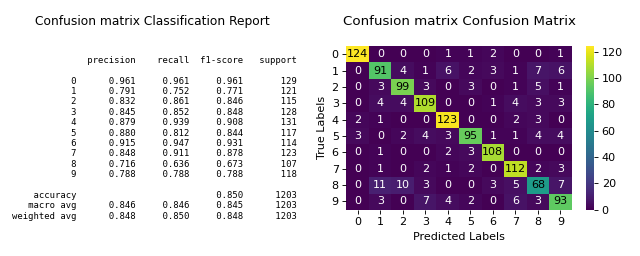
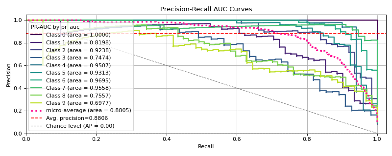

# Quick Start Guide[#](#quick-start-guide "Link to this heading")

This guide provides a quick introduction to plotting with scikit-plots.

1. ****Install Scikit-plots****:

* Use pip to install Scikit-plots:

  ```
  >>> pip install scikit-plots -U
  >>> ## Cause numpy>=2.0.0 but support old numpy
  >>> # pip install numpy==1.26.4

  ```

## A Simple Example[#](#a-simple-example "Link to this heading")

Let’s start with a basic example where we use a Random Forest classifier to evaluate the digits dataset provided by Scikit-learn.

A common way to assess a classifier’s performance is through its confusion matrix. Here’s how we can do it:

1. ****Load the Dataset****:
   We’ll use the digits dataset, which contains features and labels for classification.
2. ****Initialize the Classifier****:
   Create a [`RandomForestClassifier`](https://scikit-learn.org/dev/modules/generated/sklearn.ensemble.RandomForestClassifier.html#sklearn.ensemble.RandomForestClassifier "(in scikit-learn v1.9)") with specified parameters.
3. ****Generate Predictions****:
   Use [`cross_val_predict`](https://scikit-learn.org/dev/modules/generated/sklearn.model_selection.cross_val_predict.html#sklearn.model_selection.cross_val_predict "(in scikit-learn v1.9)") to obtain predicted labels through cross-validation. This function provides cross-validated estimates for each sample point, which helps in evaluating metrics like accuracy, precision, recall, and the confusion matrix.
4. ****Plot the Confusion Matrix****:
   Use [`plot_classifier_eval`](../modules/generated/scikitplot.api.metrics.plot_classifier_eval.html#scikitplot.api.metrics.plot_classifier_eval "scikitplot.api.metrics.plot_classifier_eval") to visualize the confusion matrix.
5. ****Display the Plot****:
   Optionally, use [`show`](https://matplotlib.org/devdocs/api/_as_gen/matplotlib.pyplot.show.html#matplotlib.pyplot.show "(in Matplotlib v3.11.0.dev2354+gea362ab57)") to display the plot.

Here’s the code to illustrate the process:

```
# introduction/quick_start.py
# %run: Python scripts and shows any outputs directly in the notebook.
# %run ../docs/source/introduction/quick_start.py

# Import Libraries
import numpy as np
from sklearn.datasets import load_digits
from sklearn.ensemble import RandomForestClassifier
from sklearn.model_selection import cross_val_predict, train_test_split

# Loading the dataset
X, y = load_digits(return_X_y=True)

# Split the dataset into training and validation sets
X_train, X_val, y_train, y_val = train_test_split(X, y, test_size=0.33, random_state=0)

# Define a simple model
clf = RandomForestClassifier(n_estimators=5, max_depth=5, random_state=0)

# Train the model
y_pred = cross_val_predict(clf, X_train, y_train)

# Plot the data
import scikitplot as sp

# sp.get_logger().setLevel(sp.logging.WARNING)  # sp.logging == sp.logger
sp.logger.setLevel(sp.logger.INFO)  # default WARNING

sp.metrics.plot_classifier_eval(
    y_train,
    y_pred,
    labels=np.unique(y),
    figsize=(8, 3.2),
    title="Confusion Matrix",
    save_fig=True,
    save_fig_filename="",
    # overwrite=True,
    add_timestamp=True,
    verbose=True,
)

```

([`Source code`](../_downloads/e8f85fdb90082fb6ccf11b2fe60fa560/quick_start.py), [`png`](../_downloads/c92f7fcb1c6e6831f056b2dbcb958cb5/quick_start.png))




This shows how to quickly generate a plot using Scikit-plots.[#](#id4 "Link to this image")

The resulting confusion matrix shows how well the classifier performs. In this case, it struggles with digits 1, 8, and 9. Fine-tuning the Random Forest’s hyperparameters might improve performance.

## One More Example[#](#one-more-example "Link to this heading")

****Maximum flexibility. Compatibility with non-scikit-learn objects.****

Although Scikit-plot is loosely based around the scikit-learn interface, you don’t actually need Scikit-learn objects to use the available functions. As long as you provide the functions what they’re asking for, they’ll happily draw the plots for you.

Try Deep Learning Models like [Tensorflow](https://www.tensorflow.org) or [Pytorch](https://pytorch.org) or [🤗 Transformers](https://huggingface.co/docs/transformers/index) etc.

Here’s a quick example to generate the precision-recall curves of a [`tf.keras.Model`](https://www.tensorflow.org/api_docs/python/tf/keras/Model "(in TensorFlow v2.8)") or [`Module`](https://docs.pytorch.org/docs/stable/generated/torch.nn.Module.html#torch.nn.Module "(in PyTorch v2.11)") or `TFPreTrainedModel` model on a sample dataset.

```
# introduction/quick_start_tf.py
# %run: Python scripts and shows any outputs directly in the notebook.
# %run ../docs/source/introduction/quick_start_tf.py

# Import Libraries
import os

# Set TensorFlow's logging level to Fatal
# Before tf {'0':'All', '1':'Warnings+', '2':'Errors+', '3':'Fatal Only'} if any
os.environ["TF_CPP_MIN_LOG_LEVEL"] = "3"
# Disable GPU and force TensorFlow to use CPU
os.environ["CUDA_VISIBLE_DEVICES"] = ""

import matplotlib.pyplot as plt
import scikitplot as sp

# sp.get_logger().setLevel(sp.logging.WARNING)  # sp.logging == sp.logger
sp.logger.setLevel(sp.logger.INFO)  # default WARNING

import tensorflow as tf

# Set TensorFlow's logging level to Fatal
tf.get_logger().setLevel(sp.logger.CRITICAL)

from sklearn.datasets import load_digits
from sklearn.model_selection import train_test_split

# Loading the dataset
X, y = load_digits(return_X_y=True)

# Split the dataset into training and validation sets
X_train, X_val, y_train, y_val = train_test_split(X, y, test_size=0.33, random_state=0)

# Convert labels to one-hot encoding
Y_train = tf.keras.utils.to_categorical(y_train)
Y_val = tf.keras.utils.to_categorical(y_val)

# Define a simple TensorFlow model
tf.keras.backend.clear_session()
model = tf.keras.Sequential(
    [
        # tf.keras.layers.Input(shape=(X_train.shape[1],)),  # Input (Functional API)
        tf.keras.layers.InputLayer(shape=(X_train.shape[1],)),
        tf.keras.layers.Dense(64, activation="relu"),
        tf.keras.layers.Dense(64, activation="relu"),
        tf.keras.layers.Dense(10, activation="softmax"),
    ]
)

# Compile the model
model.compile(optimizer="adam", loss="categorical_crossentropy", metrics=["accuracy"])

# Train the model
model.fit(
    X_train, Y_train, batch_size=32, epochs=2, validation_data=(X_val, Y_val), verbose=0
)

# Predict probabilities on the validation set
y_probas = model.predict(X_val)

# Plot precision-recall curves
sp.metrics.plot_precision_recall(
    y_val,
    y_probas,
    save_fig=True,
    save_fig_filename="",
    # overwrite=True,
    add_timestamp=True,
    verbose=True,
)

```

([`Source code`](../_downloads/4604784ad8c49c7ce2868c866022d3a1/quick_start_tf.py), [`png`](../_downloads/d3b708aa410c68bbca18a85abea1a5c3/quick_start_tf.png))




This shows how to quickly generate a plot using Scikit-plots with TensorFlow.[#](#id6 "Link to this image")

Just pass the ground truth labels and predicted probabilities to
[`plot_precision_recall`](../modules/generated/scikitplot.api.metrics.plot_precision_recall.html#scikitplot.api.metrics.plot_precision_recall "scikitplot.api.metrics.plot_precision_recall") to generate the precision-recall curves.
This method is flexible and works with any classifier that produces predicted probabilities,
from Keras classifiers to NLTK Naive Bayes to XGBoost as long as you pass in the predicted probabilities
in the correct format.

## Now what?[#](#now-what "Link to this heading")

The recommended way to start using Scikit-plot is to just go through the documentation for the various modules and choose which plots you think would be useful for your work.

Happy plotting!