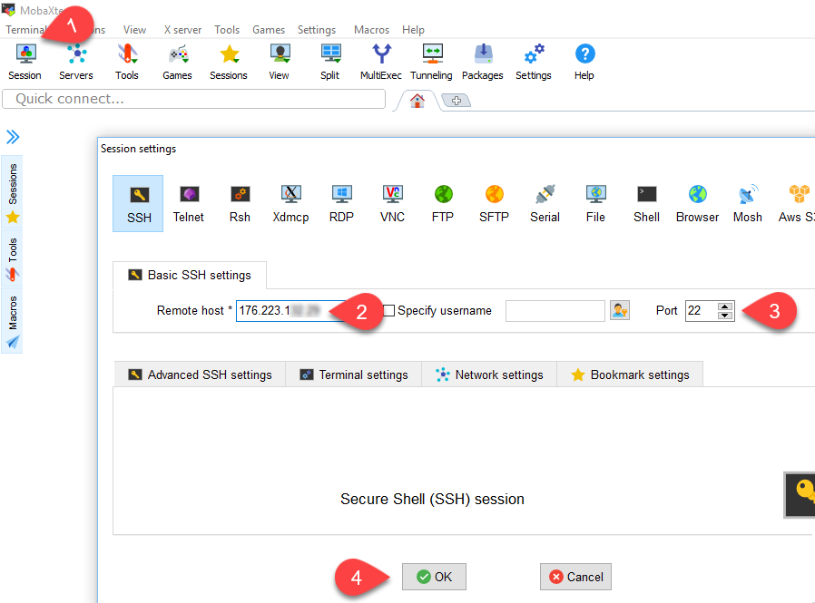
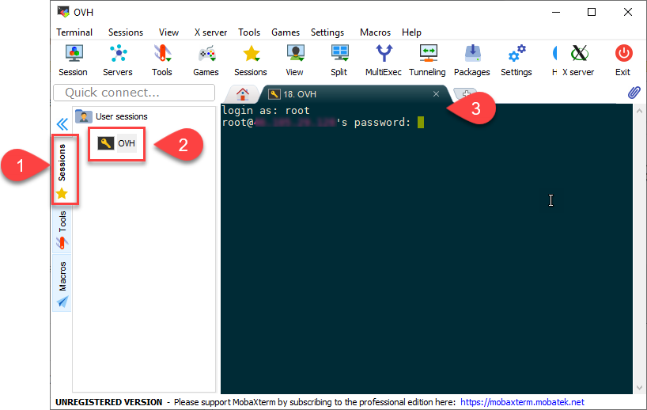

# [Step 1: Interacting with your VPS](#id1)[#](#step-1-interacting-with-your-vps "Link to this heading")

## [Interacting with Your VPS](#id2)[#](#interacting-with-your-vps "Link to this heading")

Most Linux VPSs use the command line only. There are practical reasons for
this, such as using less memory and automating the commands. Many
configurations operate from settings files to allow for a non-interactive
setup. We can install a web-based GUI to help with some aspects, but the
Linux distributions that we will use do not come configured with a GUI.
You can become proficient using the command line once you learn the basics
of they operate.

We will use a terminal emulator that uses SSH (Secure Shell) to interact
with our VPS.

There are two ways that you will enter commands using your terminal.

1. By ****typing****: You can type the commands. You can press the ****tab****
   key to auto-complete some commands.
2. By ****right-clicking****: Clicking right on the terminal windows will
   automatically paste the contents of your clipboards into the window
   directly.

   * Sometimes, this method will save you time or prevent errors.
   * You should become comfortable typing in commands so that you remember
     them.

### [Install a Terminal Editor](#id3)[#](#install-a-terminal-editor "Link to this heading")

The portable and desktop versions work the same. You can use a portable
version of MobaXterm or PuTTY on a flash drive.

1. ****Easier****: [MobaXterm](https://mobaxterm.mobatek.net/download-home-edition.html)

   * Allows you to edit files using a Windows text editor
2. ****Advanced****: [PuTTY](https://www.chiark.greenend.org.uk/~sgtatham/putty/latest.html)

   * ****Installer file****: putty-64bit-0.70-installer.msi
   * ****Portable version****: 64-bit: putty.zip

### [Connect to your VPS](#id4)[#](#connect-to-your-vps "Link to this heading")

Run MobaXterm after you have extracted the zip file or installed it.

1. Click on the ****Sessions**** button and then on the ****SSH**** tab
2. Enter the configuration values

   * ****Remote host****: IP address of the VPS
   * ****Port****: 22 (default for the first time)
3. Click on the ****Sessions**** tab and then double click the name of your VPS.

   * ****login as****: root
   * ****password****:

     1. check your email for the password to the VPS.
     2. Copy it, and then click right in the terminal to paste the value.
     3. Then, press Enter.

> **Source & license**
> Reproduced ****verbatim, without modification**** from
[© 2022, BilimEdtech Labs](https://labs.bilimedtech.com/index.html),
licensed under
[Creative Commons Attribution 4.0 International (CC BY 4.0)](https://creativecommons.org/licenses/by/4.0/deed.en).

Source page:
<https://labs.bilimedtech.com/cloud-computing/1/1.1.html>

See [LICENSE](../../LICENSE_edtech.html) for the full license text.