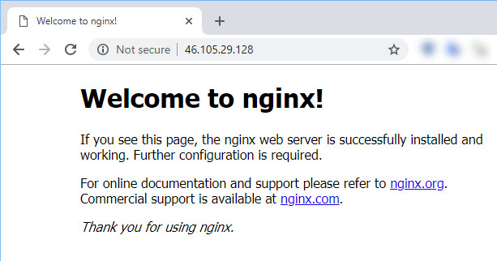

# [Step 6: Install Nginx](#id1)[#](#step-6-install-nginx "Link to this heading")

## [Nginx](#id2)[#](#nginx "Link to this heading")

We’ll use Nginx to serve local files and as a reverse proxy for Docker.
See the guide on Digital Ocean on [how to install Nginx](https://www.digitalocean.com/community/tutorials/how-to-install-linux-nginx-mysql-php-lemp-stack-ubuntu-18-04) for more details.
We will talk more about how to use a reverse proxy in a later lab.

1. Update the repository and then install Nginx

   ```
   sudo apt update
   sudo apt install -y nginx

   ```
   ```
    1root@vps298933:~# sudo apt install nginx
    2Reading package lists... Done
    3Building dependency tree
    4Reading state information... Done
    5The following additional packages will be installed:
    6fontconfig-config fonts-dejavu-core libfontconfig1 libgd3 libjbig0 libjpeg-turbo8 libjpeg8 libnginx-mod-http-geoip libnginx-mod-http-image-filter
    7libnginx-mod-http-xslt-filter libnginx-mod-mail libnginx-mod-stream libtiff5 libwebp6 libxpm4 nginx-common nginx-core
    8Suggested packages:
    9libgd-tools fcgiwrap nginx-doc ssl-cert
   10The following NEW packages will be installed:
   11fontconfig-config fonts-dejavu-core libfontconfig1 libgd3 libjbig0 libjpeg-turbo8 libjpeg8 libnginx-mod-http-geoip libnginx-mod-http-image-filter
   12libnginx-mod-http-xslt-filter libnginx-mod-mail libnginx-mod-stream libtiff5 libwebp6 libxpm4 nginx nginx-common nginx-core
   130 upgraded, 18 newly installed, 0 to remove and 0 not upgraded.
   14Need to get 2,460 kB of archives.
   15After this operation, 8,194 kB of additional disk space will be used.
   16Do you want to continue? [Y/n] y
   17.
   18.
   19.

   ```
2. Verify that Nginx is running.

   * ****Running correctly****: You should see a line that says:
     `Active: active (running)`
   * ****Problem****: An inactive command means that it did not
     start: `Active: inactive (dead)`
   ```
   sudo systemctl status nginx

   ```
   ```
    1 root@vps298933:~# sudo systemctl status nginx
    2 ● nginx.service - A high performance web server and a reverse proxy server
    3 Loaded: loaded (/lib/systemd/system/nginx.service; enabled; vendor preset: enabled)
    4     **Active: active (running)** since Sun 2019-01-20 15:06:30 +06; 34s ago
    5     Docs: man:nginx(8)
    6 Process: 12544 ExecStart=/usr/sbin/nginx -g daemon on; master_process on; (code=exited, status=0/SUCCESS)
    7 Process: 12531 ExecStartPre=/usr/sbin/nginx -t -q -g daemon on; master_process on; (code=exited, status=0/SUCCESS)
    8 Main PID: 12548 (nginx)
    9     Tasks: 2 (limit: 4588)
   10 CGroup: /system.slice/nginx.service
   11         +-12548 nginx: master process /usr/sbin/nginx -g daemon on; master_process on;
   12         +-12550 nginx: worker process
   13
   14 Jan 20 15:06:30 vps298933 systemd[1]: Starting A high performance web server and a reverse proxy server...
   15 Jan 20 15:06:30 vps298933 systemd[1]: nginx.service: Failed to parse PID from file /run/nginx.pid: Invalid argument
   16 Jan 20 15:06:30 vps298933 systemd[1]: Started A high performance web server and a reverse proxy server.
   17 root@vps298933:~#

   ```
3. Now, we need to get our server IP address if we don’t know it.
   We can look at the terminal configuration settings or use ifconfig.
4. Use `ifconfig` to find the address (look for the real address,
   not a private address)

   * Private addresses use these address ranges:

     > * 192.168.0.0 - 192.168.255.255
     > * 172.16.0.0 - 172.31.255.255
     > * 10.0.0.0 - 10.255.255.255
   * Here is an example that shows the real address in interface `ens3`
   ```
   ifconfig

   ```
   ```
    1 root@vps298933:~# ifconfig
    2 docker0: flags=4099<UP,BROADCAST,MULTICAST>  mtu 1500
    3         inet 172.17.0.1  netmask 255.255.0.0  broadcast 172.17.255.255
    4         inet6 fe80::42:5cff:fec9:f7b6  prefixlen 64  scopeid 0x20<link>
    5         ether 02:42:5c:c9:f7:b6  txqueuelen 0  (Ethernet)
    6         RX packets 0  bytes 0 (0.0 B)
    7         RX errors 0  dropped 0  overruns 0  frame 0
    8         TX packets 3  bytes 266 (266.0 B)
    9         TX errors 0  dropped 0 overruns 0  carrier 0  collisions 0
   10
   11 ens3: flags=4163<UP,BROADCAST,RUNNING,MULTICAST>  mtu 1500
   12         inet 46.105.29.128  netmask 255.255.255.255  broadcast 0.0.0.0
   13         inet6 fe80::f816:3eff:fe66:6755  prefixlen 64  scopeid 0x20<link>
   14         ether fa:16:3e:66:67:55  txqueuelen 1000  (Ethernet)
   15         RX packets 111212  bytes 51808541 (51.8 MB)
   16         RX errors 0  dropped 0  overruns 0  frame 0
   17         TX packets 137277  bytes 13619148 (13.6 MB)
   18         TX errors 0  dropped 0 overruns 0  carrier 0  collisions 0
   19
   20 lo: flags=73<UP,LOOPBACK,RUNNING>  mtu 65536
   21         inet 127.0.0.1  netmask 255.0.0.0
   22         inet6 ::1  prefixlen 128  scopeid 0x10<host>
   23         loop  txqueuelen 1000  (Local Loopback)
   24         RX packets 219  bytes 21354 (21.3 KB)
   25         RX errors 0  dropped 0  overruns 0  frame 0
   26         TX packets 219  bytes 21354 (21.3 KB)
   27         TX errors 0  dropped 0 overruns 0  carrier 0  collisions 0

   ```
5. Verify that Nginx will serve a web page to determine if it is working.
   You should see similar output.

   * `curl` is a command-line tool and library for transferring data
     with URL syntax, supporting HTTP, HTTPS, FTP, FTPS, GOPHER, TFTP,
     SCP, SFTP, SMB, TELNET, DICT, LDAPS, FILE, IMAP, SMTP, POP3, RTSP and RTMP.
   * We will use `curl` to test our application.
   ```
   curl your-ip-address

   ```
   ```
    1 root@vps298933:~# curl 192.168.1.8
    2 <!DOCTYPE html>
    3 <html>
    4 <head>
    5 <title>Welcome to nginx!</title>
    6 <style>
    7     body {
    8         width: 35em;
    9         margin: 0 auto;
   10         font-family: Tahoma, Verdana, Arial, sans-serif;
   11     }
   12 </style>
   13 </head>
   14 <body>
   15 <h1>Welcome to nginx!</h1>
   16 <p>If you see this page, the nginx web server is successfully installed and
   17 working. Further configuration is required.</p>
   18
   19 <p>For online documentation and support please refer to
   20 <a href="http://nginx.org/">nginx.org</a>.<br/>
   21 Commercial support is available at
   22 <a href="http://nginx.com/">nginx.com</a>.</p>
   23
   24 <p><em>Thank you for using nginx.</em></p>
   25 </body>
   26 </html>

   ```
6. Now, access the webpage from your browser. You should see the
   default Nginx page. Here is the expected result.

   

> **Source & license**
> Reproduced ****verbatim, without modification**** from
[© 2022, BilimEdtech Labs](https://labs.bilimedtech.com/index.html),
licensed under
[Creative Commons Attribution 4.0 International (CC BY 4.0)](https://creativecommons.org/licenses/by/4.0/deed.en).

Source page:
<https://labs.bilimedtech.com/cloud-computing/1/1.6.html>

See [LICENSE](../../LICENSE_edtech.html) for the full license text.