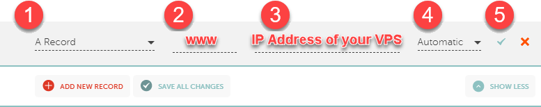
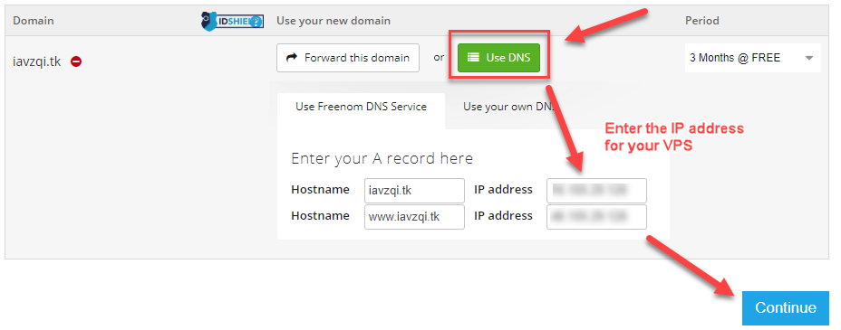

# [Step 8: Create a Name-based Site](#id3)[#](#step-8-create-a-name-based-site "Link to this heading")

The goal of this part is to create a site that is accessible using a
domain name it. It is different from the default site at
`/var/www/html`.

## [Domain Names](#id4)[#](#domain-names "Link to this heading")

There are reasons that you will use a domain name.

First, the web standard uses domain names to access web sites
instead of using an IP address.

Next, you can access different services on your VPS using
different domain names. Using the IP address to access a web
service lets you access a single site. You will learn how to
create sub-domain names for your projects and web apps.

Using a domain name gives you access to free SSL technology that is
easy to use. Otherwise, you’ll have to use a self-signed certificate
if you want to use SSL to protect web traffic on your box.

There are many domain name registrars. We recommend purchasing one so that
you don’t lose access to it. However, you can use a free one for temporary
use or testing.

### [Namecheap](#id5)[#](#namecheap "Link to this heading")

We used [Namecheap](https://www.namecheap.com/) to register `jj8i.com`. They offer a solid service
have competitive prices.

You should be able to access your site using the base domain
(example.com) and the www subdomain (www.example.com).

See the [knowledgebase article from Namecheap](https://www.namecheap.com/support/knowledgebase/article.aspx/9776/2237/how-to-create-a-subdomain-for-my-domain) for additional
information.

1. Log into your domain name registrar
2. Set the redirect domain to your IP address

   * Domain List -> Manage -> Domain Tab -> REDIRECT DOMAIN ->
     Source URL -> `http://IP-ADDRESS`
3. Go to the domain manage page and click on “Advanced DNS”
4. Add a new record for the **base domain**

   * ****Type****: `A` Record
   * ****Host****: `@`
   * ****Address****: <your IP address>
   * ****TTL****: Automatic (default value)
5. Add a new record for the **www** subdomain

   * ****Type****: `A` Record
   * ****Host****: `www`
   * ****Address****: <your IP address>
   * ****TTL****: Automatic (default value)
6. Click the green checkmark or press the **Save all changes** button
7. Wait several minutes before trying to ping the new sub-domain name.

   * You might have to wait several hours if you’re unlucky



### [Freenom](#id6)[#](#freenom "Link to this heading")

[Freenom.com](https://www.freenom.com) is a source for free domains names from TLDs
.tk, .ml, ga, .cf, and .gq.

1. Navigate to [Freenom.com](https://www.freenom.com).
2. Search for a domain name, select it, then checkout
3. Select the number of free months that you want (1-12)
4. Click ****Use DNS**** and enter the IP address of your VPS
5. Verify your email address and then fill in your account information



## [Create a new Nginx Site](#id7)[#](#create-a-new-nginx-site "Link to this heading")

1. Log into your domain name registrar and point the **root domain** name
   (example.com) and the **www subdomain name** (www.domain.com)
   to the IP address of your VPS

   * Wait 2-3 minutes for the changes to take effect.
   * Don’t try it immediately.
2. Ping the domain name from a terminal (MobaXterm or Window’s CMD)
   to verify if it is active. Sometimes, it takes many hours for
   DNS entries to update.

   ```
   C:\Users\user>ping example.com

   Pinging example.com [46.105.29.128] with 32 bytes of data:
   Reply from 46.105.29.128: bytes=32 time=133ms TTL=48
   Reply from 46.105.29.128: bytes=32 time=137ms TTL=48
   Reply from 46.105.29.128: bytes=32 time=134ms TTL=48
   Reply from 46.105.29.128: bytes=32 time=134ms TTL=48

   Ping statistics for 46.105.29.128:
       Packets: Sent = 4, Received = 4, Lost = 0 (0% loss),
   Approximate round trip times in milli-seconds:
       Minimum = 133ms, Maximum = 137ms, Average = 134ms

   C:\Users\user>

   ```
3. Now, we need to create the directory for the web files and the
   Nginx virtual host for our domain name

   * We should verify the config after we modify to detect errors.
4. First, we need to create a directory for the web files and
   create a basic HTML page.

   `mkdir -p`
   :   Creates the directory structure.

   Flag `-p`
   :   Informs the system to create deep directories (html) if the
       shallow ones do not exist (example.com).

   `chown -R`
   :   Changes the directory owner from `root` to `www-data`.
       This is important for (1) security and (2) Nginx might not be
       able to access the files if they are owned by root.

   ```
   sudo mkdir -p /var/www/example.com/html
   sudo chown -R www-data:www-data /var/www/example.com/html
   sudo nano /var/www/example.com/html/index.html

   ```
5. Add some simple HTML to the `index.html` file.

   index.html[#](#id1 "Link to this code")
   ```
   <html>
       <head>
           <title>Welcome!</title>
       </head>
       <body>
           <h1>Hello world!</h1>
       </body>
   </html>

   ```
6. Create the Nginx vhost file for the ****base domain****
   and the ****www**** subdomain

   * The `server_name` directive in the Nginx site should have
     references to both, which identifies `example.com` and
     `www.example.com` as the same.
   * `server_name example.com www.example.com;`
   ```
   sudo nano /etc/nginx/sites-available/example.com

   ```
   /etc/nginx/sites-available/example.com[#](#id2 "Link to this code")
   ```
    1server {
    2    listen 80;
    3    listen [::]:80;
    4
    5    root /var/www/example.com/html;
    6    index index.html index.htm index.nginx-debian.html index.php;
    7
    8    server_name example.com www.example.com;
    9
   10    location / {
   11            try_files $uri $uri/ =404;
   12    }
   13
   14    # pass PHP scripts to FastCGI server
   15    #
   16    location ~ \.php$ {
   17        include snippets/fastcgi-php.conf;
   18        fastcgi_pass unix:/var/run/php/php7.4-fpm.sock;
   19    }
   20}

   ```
7. Verify the config using `nginx -t`

   * We should verify the config after we modify to detect errors.
   * If we don’t, then Nginx will not restart.
   ```
   sudo nginx -t

   ```
8. Next, we need to enable the config, which tells Nginx to load the
   configuration file

   * To do, so, we’ll use the `ln` command to create a symbolic link
     from the file to the directory that contains all of the active configs
   ```
   sudo ln -s /etc/nginx/sites-available/example.com /etc/nginx/sites-enabled/

   ```
   ```
   1root@vps298933:~# sudo nano /etc/nginx/sites-available/example.com
   2root@vps298933:~# sudo nginx -t
   3nginx: the configuration file /etc/nginx/nginx.conf syntax is ok
   4nginx: configuration file /etc/nginx/nginx.conf test is successful
   5root@vps298933:~#
   6root@vps298933:~# sudo ln -s /etc/nginx/sites-available/example.com /etc/nginx/sites-enabled/

   ```
9. Then, verify the link by viewing the contents of the
   `/etc/nginx/sites-enabled/`

   * `ls` lists the files and folders in the specified directory.
   * Flag `-lh` provides the files in a detailed list with
     human-readable file sizes.
   * You can use whichever format you find easiest to read.
   ```
   ls -lh /etc/nginx/sites-enabled/

   ```
   ```
   1root@vps298933:~# ls -lh /etc/nginx/sites-enabled/
   2total 0
   3lrwxrwxrwx 1 root root 44 Mar 14 23:13 example.com -> /etc/nginx/sites-available/example.com

   ```
10. Next, restart Nginx and verify it is running

    * `sudo systemctl restart nginx`
    * `sudo systemctl status nginx`
11. Test your web page

    * Using curl: `curl example.com`
    * Using your web browser: <http://example.com>
    * If it works, you should see your `hello world` page.
      Now, you are ready to install an SSL cert!

## [Add an SSL Cert to your site](#id8)[#](#add-an-ssl-cert-to-your-site "Link to this heading")

1. Install Certbot to create SSL certs using Let’s Encrypt

   Certbot is a third-party application [maintained by EFF](https://certbot.eff.org/)
   (Electronic Frontier Foundation) to provide free SSL certificates.
   EFF releases Certbot as a snap application on Ubuntu to simplify
   using the tool. You will learn more about snaps during the next lab.
   These steps are taken from EFF’s [Certbot installation instructions](https://certbot.eff.org/lets-encrypt/ubuntubionic-nginx.html) page.

   * Install snapd and update

     ```
     sudo snap install core; sudo snap refresh core

     ```
   * Install Certbot

     ```
     sudo snap install --classic certbot

     ```
   * Prepare the Certbot command to execute outside of the snap folder

     ```
     sudo ln -s /snap/bin/certbot /usr/bin/certbot

     ```
2. Now, we can use Certbot to encrypt HTTP traffic on our `domain name`
   and the `www` subdomain name.

   * Run the `certbot` command and select the site to encrypt
   ```
   sudo certbot --nginx

   ```
   ```
    1 root@vps298933:~# certbot --nginx
    2 Saving debug log to /var/log/letsencrypt/letsencrypt.log
    3 Plugins selected: Authenticator nginx, Installer nginx
    4 Enter email address (used for urgent renewal and security notices)
    5  (Enter 'c' to cancel): user@example.com
    6
    7 - - - - - - - - - - - - - - - - - - - - - - - - - - - - - - - - - - - - - - - -
    8 Please read the Terms of Service at
    9 https://letsencrypt.org/documents/LE-SA-v1.2-November-15-2017.pdf. You must
   10 agree in order to register with the ACME server at
   11 https://acme-v02.api.letsencrypt.org/directory
   12 - - - - - - - - - - - - - - - - - - - - - - - - - - - - - - - - - - - - - - - -
   13 (A)gree/(C)ancel: a
   14
   15 - - - - - - - - - - - - - - - - - - - - - - - - - - - - - - - - - - - - - - - -
   16 Would you be willing, once your first certificate is successfully issued, to
   17 share your email address with the Electronic Frontier Foundation, a founding
   18 partner of the Let's Encrypt project and the non-profit organization that
   19 develops Certbot? We'd like to send you email about our work encrypting the web,
   20 EFF news, campaigns, and ways to support digital freedom.
   21 - - - - - - - - - - - - - - - - - - - - - - - - - - - - - - - - - - - - - - - -
   22 (Y)es/(N)o: y
   23
   24 Which names would you like to activate HTTPS for?
   25 - - - - - - - - - - - - - - - - - - - - - - - - - - - - - - - - - - - - - - - -
   26 1: y.jj8i.com
   27 2: www.y.jj8i.com
   28 - - - - - - - - - - - - - - - - - - - - - - - - - - - - - - - - - - - - - - - -
   29 Select the appropriate numbers separated by commas and/or spaces, or leave input
   30 blank to select all options shown (Enter 'c' to cancel): 1,2
   31 Obtaining a new certificate
   32 Performing the following challenges:
   33 http-01 challenge for www.y.jj8i.com
   34 http-01 challenge for y.jj8i.com
   35 Waiting for verification...
   36 Cleaning up challenges
   37 Deploying Certificate to VirtualHost /etc/nginx/sites-enabled/y.jj8i.com
   38 Deploying Certificate to VirtualHost /etc/nginx/sites-enabled/y.jj8i.com
   39 Redirecting all traffic on port 80 to ssl in /etc/nginx/sites-enabled/y.jj8i.com
   40 Redirecting all traffic on port 80 to ssl in /etc/nginx/sites-enabled/y.jj8i.com
   41
   42 - - - - - - - - - - - - - - - - - - - - - - - - - - - - - - - - - - - - - - - -
   43 Congratulations! You have successfully enabled https://y.jj8i.com and
   44 https://www.y.jj8i.com
   45 - - - - - - - - - - - - - - - - - - - - - - - - - - - - - - - - - - - - - - - -
   46 Subscribe to the EFF mailing list (email: tony.hetrick@live.com).
   47
   48 IMPORTANT NOTES:
   49  - Congratulations! Your certificate and chain have been saved at:
   50    /etc/letsencrypt/live/y.jj8i.com/fullchain.pem
   51    Your key file has been saved at:
   52    /etc/letsencrypt/live/y.jj8i.com/privkey.pem
   53    Your cert will expire on 2021-02-09. To obtain a new or tweaked
   54    version of this certificate in the future, simply run certbot again
   55    with the "certonly" option. To non-interactively renew *all* of
   56    your certificates, run "certbot renew"
   57  - Your account credentials have been saved in your Certbot
   58    configuration directory at /etc/letsencrypt. You should make a
   59    secure backup of this folder now. This configuration directory will
   60    also contain certificates and private keys obtained by Certbot so
   61    making regular backups of this folder is ideal.
   62  - If you like Certbot, please consider supporting our work by:
   63
   64    Donating to ISRG / Let's Encrypt:   https://letsencrypt.org/donate
   65    Donating to EFF:                    https://eff.org/donate-le
   66
   67 root@vps298933:~#

   ```
3. Finally, refresh your page by pressing Ctrl+F5.
   You should see your new cert.

> **Source & license**
> Reproduced ****verbatim, without modification**** from
[© 2022, BilimEdtech Labs](https://labs.bilimedtech.com/index.html),
licensed under
[Creative Commons Attribution 4.0 International (CC BY 4.0)](https://creativecommons.org/licenses/by/4.0/deed.en).

Source page:
<https://labs.bilimedtech.com/cloud-computing/1/1.8.html>

See [LICENSE](../../LICENSE_edtech.html) for the full license text.