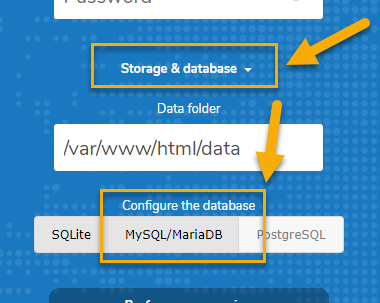
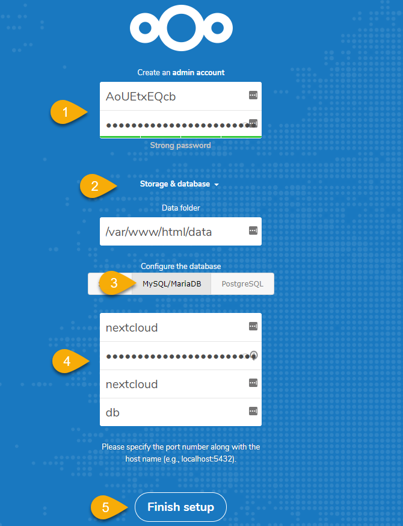

# [Step 6: Configure Nextcloud using Docker Compose](#id1)[#](#step-6-configure-nextcloud-using-docker-compose "Link to this heading")

Previously, we configured Nextcloud without any containers. This is bad news.
****All**** of our data will be deleted if we remove the container.
Also, how do we back up our GBs worth of stored media files? There is no
easy way to get this data out of the container.

****Task****: Your task is to apply what you learned about docker-compose.

> **Note**
> Stop and remove the current Nextcloud container before continuing

## [Initial Configuration](#id2)[#](#initial-configuration "Link to this heading")

Use the instructions from [Nextcloud docker-compose](https://github.com/nextcloud/docker) git page.

1. Choose a base version: Apache or FPM
2. Choose strong keys from [randomkeygen.com](https://randomkeygen.com) for

   * MYSQL\_ROOT\_PASSWORD=
   * MYSQL\_PASSWORD=
3. Use ports `20850:80`
4. Configure the volumes

   1. Configure all volume data so that they reside in the project directory.
      Use `./`
   2. You do not need to configure `named volumes`
   ```
   root@vps298933:~/nextcloud-docker# docker ps
   CONTAINER ID        IMAGE                COMMAND                  CREATED             STATUS              PORTS                     NAMES
   76cbf38e5975        nextcloud            "/entrypoint.sh apac…"   5 minutes ago       Up 5 minutes        0.0.0.0:20850->80/tcp     nextclouddocker_app_1
   2906aaa944f5        mariadb              "docker-entrypoint.s…"   5 minutes ago       Up 5 minutes        3306/tcp                  nextclouddocker_db_1
   c60b6e70e4a9        wordpress:latest     "docker-entrypoint.s…"   2 hours ago         Up 2 hours          0.0.0.0:20851->80/tcp     wordpressdocker_wordpress_1
   386e4587b991        mariadb              "docker-entrypoint.s…"   2 hours ago         Up 2 hours          3306/tcp                  wordpressdocker_db_1
   913ff74dd94c        redis                "docker-entrypoint.s…"   2 hours ago         Up 2 hours          6379/tcp                  wordpressdocker_redis_1
   root@vps298933:~/nextcloud-docker#
   root@vps298933:~/nextcloud-docker# ls -lh
   total 12K
   drwxr-xr-x  5      999 root 4.0K Mar 30 15:14 db
   -rw-r--r--  1 root     root  657 Mar 30 15:13 docker-compose.yml
   drwxr-xr-x 15 www-data root 4.0K Mar 30 14:55 nextcloud
   root@vps298933:~/nextcloud-docker# ls -lh nextcloud/
   total 148K
   drwxr-xr-x 32 www-data root 4.0K Mar 30 14:54 3rdparty
   drwxr-xr-x 38 www-data root 4.0K Mar 30 14:55 apps
   -rw-r--r--  1 www-data root  12K Mar 30 14:54 AUTHORS
   drwxr-xr-x  2 www-data root 4.0K Mar 30 14:59 config
   -rw-r--r--  1 www-data root 3.6K Mar 30 14:54 console.php
   -rw-r--r--  1 www-data root  34K Mar 30 14:54 COPYING
   drwxr-xr-x 18 www-data root 4.0K Mar 30 14:55 core
   -rw-r--r--  1 www-data root 4.9K Mar 30 14:54 cron.php
   drwxr-xr-x  2 www-data root 4.0K Mar 30 14:55 custom_apps
   drwxrwx---  5 www-data root 4.0K Mar 30 15:01 data
   -rw-r--r--  1 www-data root  156 Mar 30 14:54 index.html

   ```
5. Test the connection using `curl --head http://localhost:20850`
6. Verify that you can access the site using the web browser
   (don’t log in yet)

## [Using the Nextcloud Web Configuration](#id3)[#](#using-the-nextcloud-web-configuration "Link to this heading")

> **Caution**
> Nextcloud will break if you enable SSL. Use without SSL for now.

1. Navigate to your Nextcloud instance: cloud.example.com
2. Enter an admin ****username**** and ****strong password****
3. Click on ****Storage & database****
4. Select ****MySQL/MariaDB****

   
5. Enter the information from your `docker-compose.yml` file

   * ****Database user****: Value from `MYSQL_USER`
   * ****Database password****: Value from `MYSQL_PASSWORD`
   * ****Database name****: Value from `MYSQL_DATABASE`
   * ****Database host****: The name of the database service in
     `docker-compose.yml`.

     * The default value is `db`
6. Wait 2-3 minutes while your server configures Nextcloud

   
   > **Note**
   > Nginx might timeout waiting for the web service to start.
   Refresh the page after a minute or two.

## [Optional Nextcloud Configuration](#id4)[#](#optional-nextcloud-configuration "Link to this heading")

Nextcloud has options to use Redis. You now know how to configure it!

> **Note**
> A recent change to Nextcloud requires that you use a password
for redis. These changes are not specified on the Nextcloud docker page.
They are highlighted in yellow for your reference.

1. You need to create a new Redis service in `docker-compose.yml`

   ```
   1redis:
   2  image: redis:latest
   3  command: redis-server --requirepass somePassword
   4  restart: always

   ```
2. Add the `environment` variables to the `app` section and their
   values.

   ```
   1environment:
   2  - REDIS_HOST=
   3  - REDIS_HOST_PASSWORD=

   ```
3. Verify the service is active using
   `redis-cli -a somePassword -h IPAddress MONITOR`

   * Access Nextcloud while running the cli monitor command. You will
     see the cached data in the terminal windows.
   * See the previous page on
     [how to access a Redis container without a public port](3.4.html#access-redis-container)
   ```
   root@vps298933:~/nextcloud-docker# docker ps
   CONTAINER ID        IMAGE                COMMAND                  CREATED             STATUS              PORTS                       NAMES
   76cbf38e5975        nextcloud            "/entrypoint.sh apac…"   5 minutes ago       Up 5 minutes        0.0.0.0:20850->80/tcp       nextclouddocker_app_1
   2906aaa944f5        mariadb              "docker-entrypoint.s…"   5 minutes ago       Up 5 minutes        3306/tcp                    nextclouddocker_db_1
   8f5b05b6c627        redis                "docker-entrypoint.s…"   5 minutes ago       Up 5 minutes        6379/tcp                    nextclouddocker_redis_1
   c60b6e70e4a9        wordpress:latest     "docker-entrypoint.s…"   2 hours ago         Up 2 hours          0.0.0.0:20851->80/tcp       wordpressdocker_wordpress_1
   386e4587b991        mariadb              "docker-entrypoint.s…"   2 hours ago         Up 2 hours          3306/tcp                    wordpressdocker_db_1
   913ff74dd94c        redis                "docker-entrypoint.s…"   2 hours ago         Up 2 hours          6379/tcp                    wordpressdocker_redis_1

   ```
   ```
   root@vps298933:~/nextcloud-docker# redis-cli MONITOR
   Could not connect to Redis at 127.0.0.1:6379: Connection refused
   root@vps298933:~/nextcloud-docker# redis-cli -h 192.168.32.3 ping
   PONG
   root@vps298933:~/nextcloud-docker# redis-cli -h 192.168.32.3 monitor
   (error) NOAUTH Authentication required.
   ^C
   root@vps298933:~/nextcloud-docker# redis-cli -h 192.168.32.3 -a 'secret'  monitor
   OK
   1605236869.679418 [0 192.168.32.4:60956] "GET" "PHPREDIS_SESSION:69d3544f291cd0a35fc0fa4ab882f603"
   1605236870.226376 [0 192.168.32.4:60956] "SETEX" "PHPREDIS_SESSION:69d3544f291cd0a35fc0fa4ab882f603" "1440" "encrypted_session_data|s:964:\"876139951389ba...729d9|2\";"
   1605236870.388935 [0 192.168.32.4:60966] "GET" "PHPREDIS_SESSION:69d3544f291cd0a35fc0fa4ab882f603"
   1605236870.424470 [0 192.168.32.4:60966] "SETEX" "PHPREDIS_SESSION:69d3544f291cd0a35fc0fa4ab882f603" "1440" "encrypted_session_data|s:964:\"eb7e91b6a4349fd3...2d2b1164|2\";"
   1605236870.447444 [0 192.168.32.4:60964] "GET" "9ece47f92230924d7cd50f9eb027646e/imagePath-81f894826c43a4eb083f0aee7745f179-settings-help.svg"
   1605236870.447700 [0 192.168.32.4:60964] "EXISTS" "9ece47f92230924d7cd50f9eb027646e/imagePath-81f894826c43a4eb083f0aee7745f179-settings-help.svg"
   1605236870.449152 [0 192.168.32.4:60964] "SET" "9ece47f92230924d7cd50f9eb027646e/imagePath-81f894826c43a4eb083f0aee7745f179-settings-help.svg" "\"\\/apps\\/settings\\/img\\/help.svg\""
   1605236870.449596 [0 192.168.32.4:60964] "GET" "9ece47f92230924d7cd50f9eb027646e/imagePath-81f894826c43a4eb083f0aee7745f179-settings-apps.svg"
   1605236870.449718 [0 192.168.32.4:60964] "EXISTS" "9ece47f92230924d7cd50f9eb027646e/imagePath-81f894826c43a4eb083f0aee7745f179-settings-apps.svg"
   .
   .
   .

   ```

****Congratulations****! You just installed Nextcloud using three
containers with minimal help. You know how the knowledge and
experience to install many applications that are available
through Docker Compose.

> **Source & license**
> Reproduced ****verbatim, without modification**** from
[© 2022, BilimEdtech Labs](https://labs.bilimedtech.com/index.html),
licensed under
[Creative Commons Attribution 4.0 International (CC BY 4.0)](https://creativecommons.org/licenses/by/4.0/deed.en).

Source page:
<https://labs.bilimedtech.com/cloud-computing/3/3.6.html>

See [LICENSE](../../LICENSE_edtech.html) for the full license text.